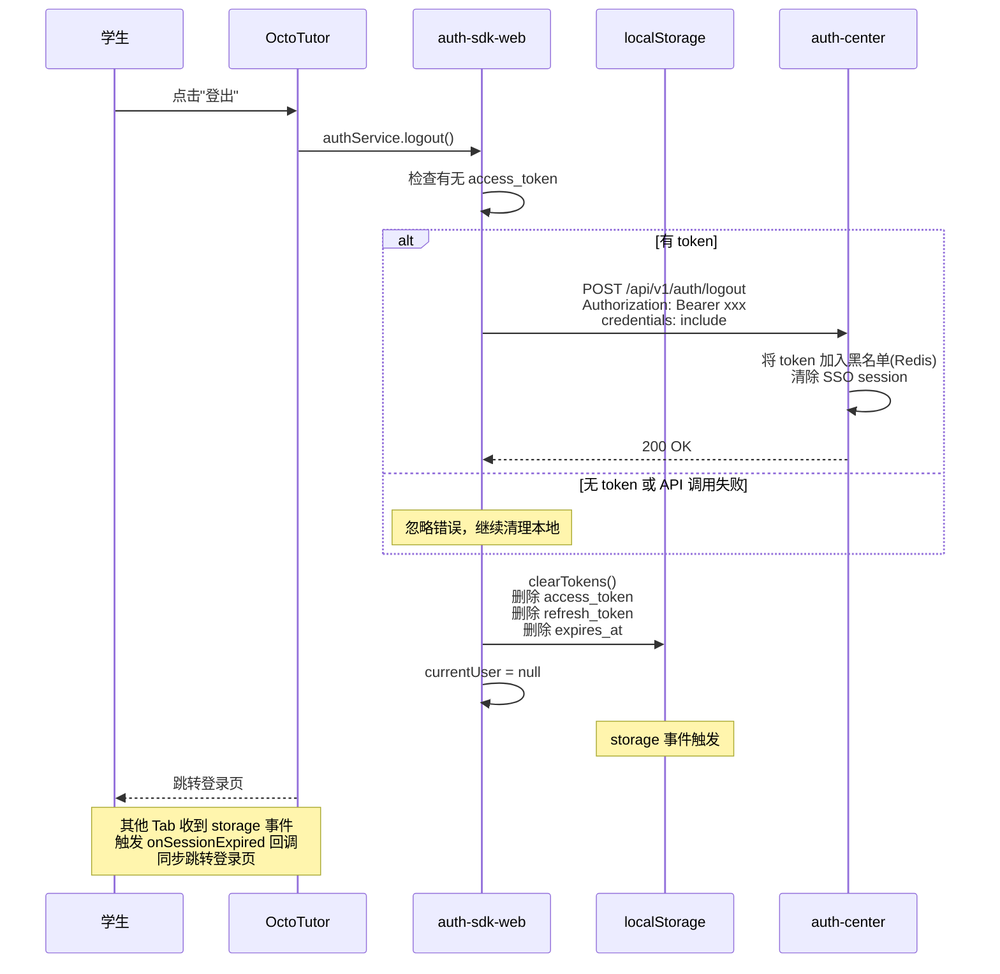
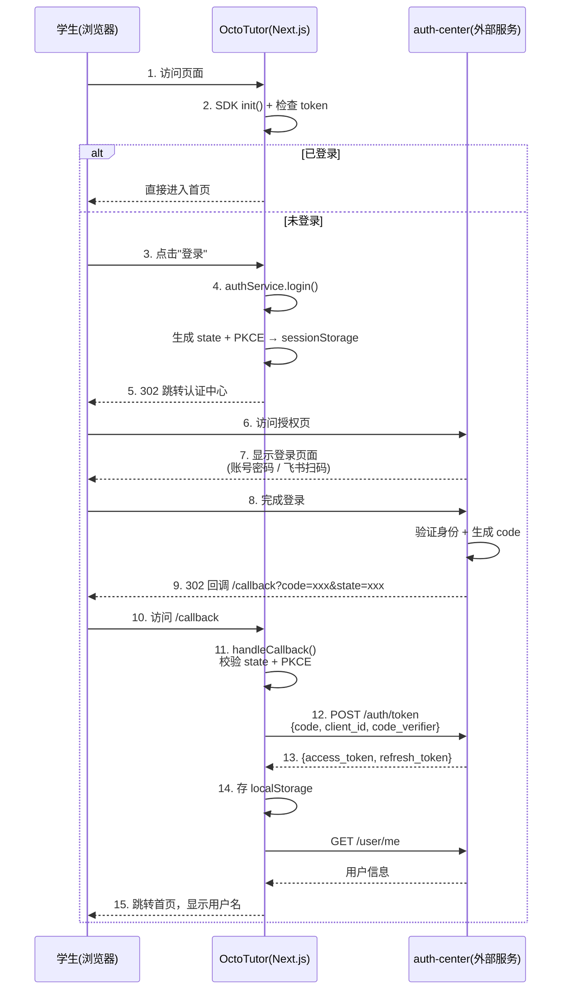
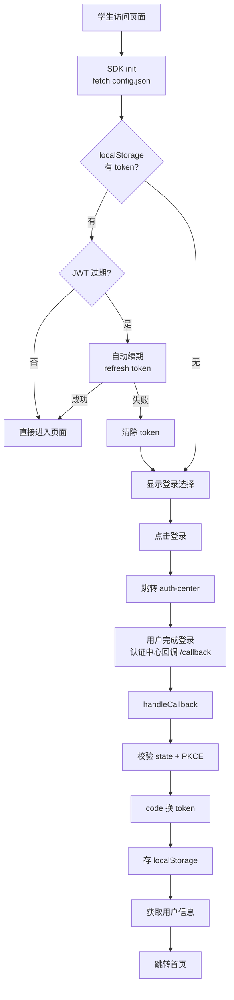
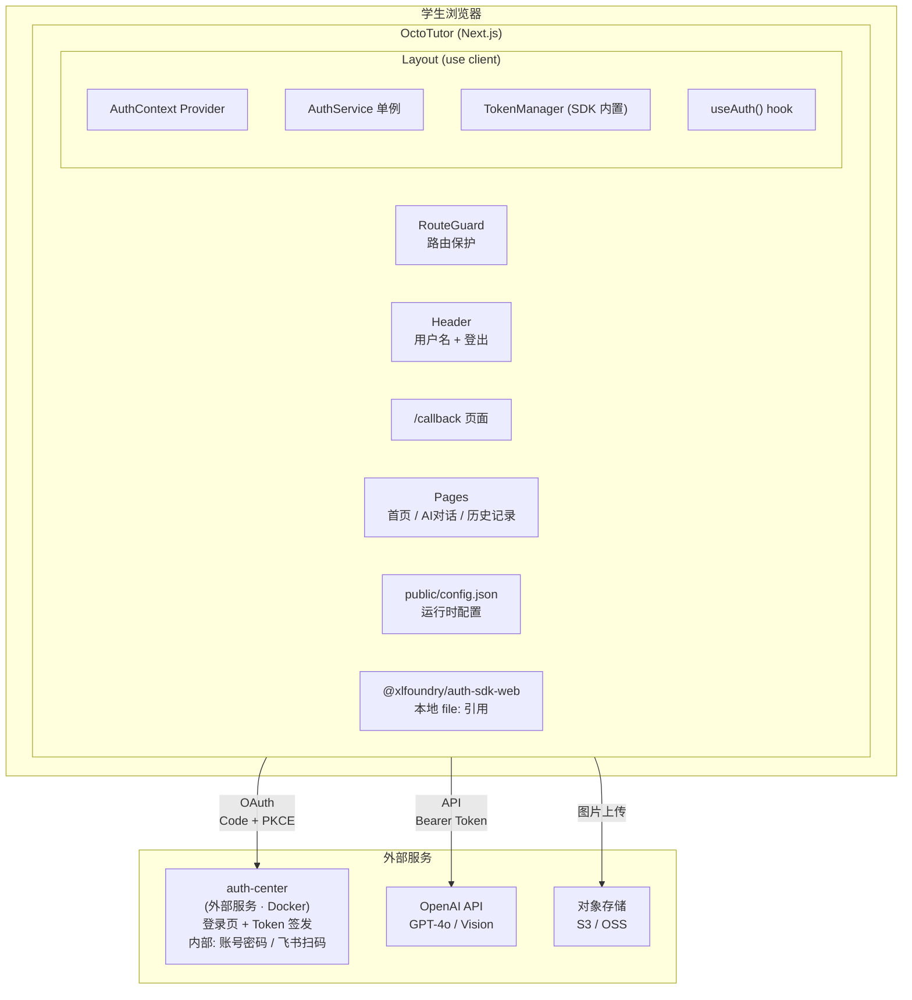

# 接入自有登录 SDK 需求分析与方案设计

## 分析边界

- 分析类型：new_requirement（新项目接入已有 SDK）
- 输入来源：auth-sdk-web 源码 + playground-web 集成示例 + architecture.md
- 已读取代码：auth-sdk-web 全部源码（6个核心文件）、playground-web 关键集成文件（App.tsx 等）
- 已读取文档：architecture.md、SDK README
- 未读取/缺失上下文：OctoTutor 项目尚无代码（空项目）
- 明确不分析：后端 auth-center（外部服务，已在 Docker 部署，不属于 OctoTutor 项目）

## SDK 概要

### 基本信息

- **包名**: `@xlfoundry/auth-sdk-web`
- **版本**: 1.0.0
- **协议**: OAuth 2.0 Authorization Code + PKCE
- **零运行时依赖**，纯浏览器原生 API
- **构建产物**: ESM + UMD

### 核心 API

| 导出 | 类型 | 用途 |
|------|------|------|
| `AuthService` | 类 | 核心认证服务：init/login/logout/handleCallback/getAuthState/getUser |
| `TokenManager` | 类 | Token 存储与自动续期 |
| `AuthHttpClient` | 类 | 自动带 Bearer token 的 HTTP 客户端，401 自动续期重试 |
| `AuthSDKConfig` | 类型 | `{ clientId, authCenterBaseURL, redirectUri, onSessionExpired? }` |
| `AuthState` | 类型 | `{ isAuthenticated, user }` |
| `UserInfo` | 类型 | 用户信息结构 |

### 认证流程

```
login() → 跳转认证中心 → 用户登录（账号密码/飞书扫码） → 302 回调 /callback?code=xxx
  → handleCallback() → 校验 state + PKCE → code 换 token → 存 localStorage
```

> 飞书扫码是 auth-center 内部提供的能力，OctoTutor 只需跳转到 auth-center，不感知具体登录方式。

### Token 管理

- 存储：localStorage（`xlfoundry_access_token` / `xlfoundry_refresh_token` / `xlfoundry_expires_at`）
- 自动续期：JWT 过期前 60 秒自动 refresh
- 跨 Tab 同步：通过 storage 事件监听

## 功能目标

- 用户：高中生
- 目标：在 OctoTutor（Next.js）中接入 auth-sdk-web，实现登录/登出/会话管理
- 成功标准：
  1. 学生可以通过认证中心完成登录
  2. 登录后自动获取用户信息，页面显示登录状态
  3. Token 过期自动续期，会话过期自动跳转登录
  4. 登出后清除本地状态，跳转登录页
- 非目标：不自建认证体系，不修改 SDK 代码

## 本次任务范围

### 做的（OctoTutor 项目内）

1. 安装 `@xlfoundry/auth-sdk-web` 依赖
2. 创建 `public/config.json`（clientId + authCenterBaseURL）
3. 实现 AuthContext Provider + `useAuth()` hook
4. 实现 `/callback` 页面（接收 code，调 handleCallback）
5. 实现路由保护（未登录 → 跳转认证中心）
6. Header 显示用户名 + 登出按钮
7. 端到端验证（连本地 Docker auth-center 跑通）

### 不做的

| 不做 | 原因 |
|------|------|
| auth-center 后端 | 外部服务，已部署在 Docker，不属于 OctoTutor 项目 |
| 飞书 OAuth | auth-center 内部能力，OctoTutor 不感知 |
| 自建认证体系 | 直接用 SDK |
| 修改 SDK 代码 | SDK 是独立包，不动 |
| 后端 Token 校验 | 第一期纯前端，后端 API 还没建 |
| 自定义登录 UI | 用认证中心默认登录页 |

## 用户交互链

| Step | User Action | System Response | Success State | Failure/Empty State |
|------|-------------|-----------------|---------------|---------------------|
| 1 | 访问 OctoTutor | 检查登录状态 | 已登录 → 进入首页 | 未登录 → 显示登录页 |
| 2 | 点击登录 | 跳转认证中心（认证中心内部提供账号密码/飞书扫码） | 携带 code 回调 | 认证失败 → 提示错误 |
| 3 | 回调到 OctoTutor /callback | SDK 自动处理 code 换 token | 跳转首页，显示用户名 | code 无效 → 提示登录失败 |
| 4 | 使用过程中 Token 即将过期 | SDK 自动续期 | 用户无感知 | 续期失败 → 跳转登录 |
| 5 | 点击登出 | 调用认证中心登出 API + 清除本地 | 跳转登录页 | 网络失败仍清除本地 |

## 系统逻辑树

```text
访问页面
├─ 前端
│  ├─ SDK init（从 config.json 读取 clientId 和 authCenterBaseURL）
│  ├─ 检查 localStorage 中是否有有效 token
│  │  ├─ 有 → fetchUserInfo() → 进入首页
│  │  └─ 无 → 跳转登录
│  └─ 路由保护
│     ├─ 公开页面：首页介绍、帮助
│     └─ 需登录页面：对话、学习记录 → 未登录重定向
├─ 登录流程
│  ├─ authService.login()
│  │  ├─ 生成 state + PKCE pair → sessionStorage
│  │  └─ window.location.href → 认证中心授权页
│  └─ /callback 路由
│     ├─ authService.handleCallback()
│     │  ├─ 校验 state（防 CSRF）
│     │  ├─ code + code_verifier → POST /api/v1/auth/token
│     │  ├─ 保存 token 到 localStorage
│     │  └─ fetchUserInfo()
│     └─ redirect → 首页
├─ 会话管理
│  ├─ TokenManager 自动续期（JWT exp 前 60s）
│  ├─ AuthHttpClient 401 自动重试
│  ├─ 跨 Tab 同步（storage 事件）
│  └─ onSessionExpired 回调 → 跳转登录
└─ 登出
   ├─ POST /api/v1/auth/logout（Bearer token）
   ├─ 清除 localStorage
   └─ currentUser = null → 跳转登录
```

## 功能网络

### 依赖的已有模块

| Module | Dependency Type | Reason | Evidence |
|--------|-----------------|--------|----------|
| auth-sdk-web | npm 包 | 提供全部认证能力 | @xlfoundry/auth-sdk-web |
| auth-center (Docker) | 外部服务 | 认证中心 API | auth.xiaolutang.top |

### 影响的已有模块

| Module | Impact | Required Change | Risk |
|--------|--------|-----------------|------|
| 无（新项目） | — | — | — |

### 新增或变更能力

| Capability ID | Name | Journey Type | Risk Tags | Must Plan | Required Evidence |
|---------------|------|--------------|-----------|-----------|-------------------|
| CAP-auth-001 | OAuth 登录回调 | auth/oauth | auth,network | yes | entry_action,actual_authorize_or_endpoint,callback_or_completion,state_or_identity_check,user_visible_success,failure_path_result |
| CAP-auth-002 | Token 自动续期 | auth | auth | yes | user_visible_success,failure_path_result |
| CAP-auth-003 | 登出 | auth | auth | no | user_visible_success |
| CAP-auth-004 | 路由保护 | standard | ux | no | user_visible_success,failure_path_result |

## 方案设计

### 方案目标

- 设计目标：在 Next.js App Router 项目中正确接入 auth-sdk-web
- 不解决的问题：不修改 SDK、不自建认证、不处理后端
- 成功判定：登录 → 使用 → 登出 完整链路通畅

### 方案选择

| Option | Summary | Pros | Cons | Decision |
|--------|---------|------|------|----------|
| A | **SDK 初始化在 Client Layout**，Context 向下传递，/callback 独立页面处理 | 参考 playground-web 已验证模式，与 Next.js App Router 兼容 | 需要 'use client' 包裹 | **selected** |
| B | Next.js Middleware 做路由保护 + SDK 在中间件初始化 | 利用 Next.js 内置能力 | SDK 依赖 localStorage/window，中间件运行在 Edge Runtime，不兼容 | rejected |

**选择理由**：auth-sdk-web 依赖 `localStorage`、`window.location`、`sessionStorage` 等浏览器 API，只能在客户端运行。Next.js App Router 的 `'use client'` 组件完全兼容。

### 模块与边界

| Module | Responsibility | Change Type | Boundary / Invariant |
|--------|----------------|-------------|----------------------|
| **AuthContext Provider** | 初始化 SDK，提供 authService 给全局 | new | 'use client' 组件，仅客户端运行 |
| **useAuth Hook** | 封装 Context 读取，提供 login/logout/user/isAuthenticated | new | 返回 SDK 实例的便捷方法 |
| **/callback Page** | OAuth 回调处理页，调用 handleCallback | new | 纯客户端页面，处理完立即 redirect |
| **RouteGuard** | 需登录页面的路由保护组件 | new | 未登录 → authService.login() |
| **config.json** | 运行时配置（clientId, authCenterBaseURL） | new | 放在 public/ 下，不硬编码 |
| **AuthHttpClient 实例** | 带 token 的 API 客户端 | new | 用于调用后端 API 时自动附加认证 |

### 数据 / API / 配置 / 第三方集成

| Area | Design | Existing Contract | New Contract Needed | Risk |
|------|--------|-------------------|---------------------|------|
| **SDK 引入** | 本地 file: 引用（同 playground-web） | @xlfoundry/auth-sdk-web | 无 | 低 |
| **运行时配置** | public/config.json，先复用 playground 的 clientId | iTbZUrPe3CcKSIsL / https://auth.localhost | config.json | 低 |
| **认证中心** | auth-center Docker（外部服务，已部署） | auth.xiaolutang.top API | 无 | 低 |
| **Token 存储** | SDK 内部管理 localStorage | SDK 内置 | 无 | 低 |

### 状态与错误处理

| Scenario | State Change | Error Handling | User Feedback |
|----------|--------------|----------------|---------------|
| SDK 初始化失败 | isInitialized=false | 控制台报错，显示"系统初始化失败" | 提示刷新页面 |
| OAuth 回调 code 无效 | 不保存 token | 清除 sessionStorage 中的 state/PKCE | "登录失败，请重试" |
| state 校验失败 | 不保存 token | 清除 state，阻止 CSRF | "登录失败，请重试" |
| Token 续期失败 | 清除本地 token | 触发 onSessionExpired | 跳转登录页 |
| 登出 API 失败 | 仍清除本地 token | 忽略网络错误 | 正常跳转登录页 |

### 测试与发布策略

- 单元测试：useAuth hook 的 login/logout/redirect 逻辑
- 集成测试：完整 OAuth 流程（需本地 auth-center Docker 运行）
- 本地开发：Vite dev server + Docker auth-center
- 真实第三方：必须连接真实 auth-center 验证
- 回滚：纯前端变更，Vercel 自动回滚

### Next.js 特殊注意点

1. **SDK 只能在客户端运行**：所有使用 SDK 的组件必须标记 `'use client'`
2. **SSR 不触达 localStorage**：AuthContext Provider 在 `useEffect` 中初始化 SDK，避免 SSR 报错
3. **/callback 页面**：使用 `useSearchParams()` 获取 OAuth code 参数，必须在 `Suspense` 边界内
4. **中间件不能使用 SDK**：如需路由保护，在客户端组件中实现

## 图表

### 时序图 — 登出流程



### 时序图 — 登录完整流程



### 流程图 — 访问页面决策



### 架构图 — OctoTutor 系统整体



## Decision Items

| ID | Summary | Type | Must Plan | Source |
|----|---------|------|-----------|--------|
| DEC-auth-001 | SDK 引入方式：本地 file: vs npm registry | tech_choice | no | solution_design |
| DEC-auth-002 | 运行时配置：config.json vs 环境变量 | tech_choice | no | solution_design |
| DEC-auth-003 | 路由保护粒度：Layout 级 vs 页面级 vs 组件级 | user_behavior | yes | interaction_chain |

## 风险与缺口

| ID | Gap/Risk | Evidence | Impact | Suggested Handling |
|----|----------|----------|--------|--------------------|
| RSK-auth-001 | Next.js SSR 与 SDK 浏览器 API 冲突 | SDK 依赖 localStorage/window | 中 | 确保 'use client' + useEffect 初始化 |
| RSK-auth-002 | auth-center Docker 未启动导致登录失败 | 本地开发依赖 | 低 | 开发文档说明 Docker 启动步骤 |

## 集成测试要求

- 是否需要真实集成测试：是，必须连接真实 auth-center
- 推荐运行方式：本地 Docker auth-center + dev server
- Docker / docker compose 支持：复用 xlfoundryTest 的 docker-compose.yml
- mock 允许范围：不允许 mock 认证流程
- 必须验证的链路：
  1. 访问需登录页面 → 跳转认证中心 → 登录 → 回调 → 进入页面
  2. Token 过期 → 自动续期 → 用户无感知
  3. 登出 → 清除状态 → 跳转登录
  4. 跨 Tab 登出同步

## 对 plan 的建议

- 应拆出的任务：
  1. 安装 SDK 依赖 + 配置 Vite/TS 路径别名
  2. 创建 public/config.json 配置文件
  3. 实现 AuthContext Provider + useAuth hook
  4. 实现 /callback 回调页面
  5. 实现路由保护组件
  6. 登录状态 UI（Header 用户名 + 登出按钮）
  7. 端到端验证（连接 auth-center Docker）

- 应优先验证的链路：
  1. 完整 OAuth 登录回调流程

- 必须进入 open_issues 的阻塞项：
  - 无（复用 xlfoundryTest playground 的 clientId 和配置）

- 应明确 out_of_scope 的内容：
  - 自定义登录 UI（使用认证中心默认登录页）
  - 后端 Token 校验（第一期纯前端）
