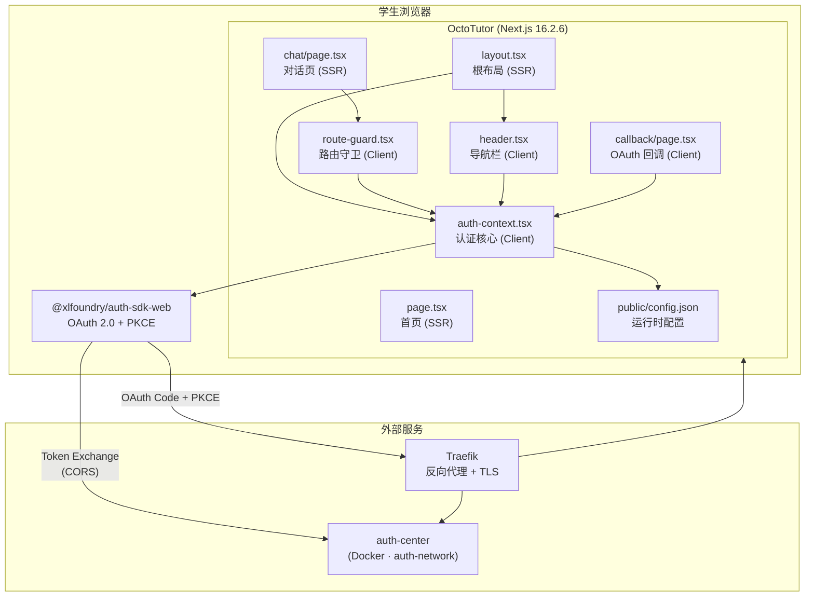
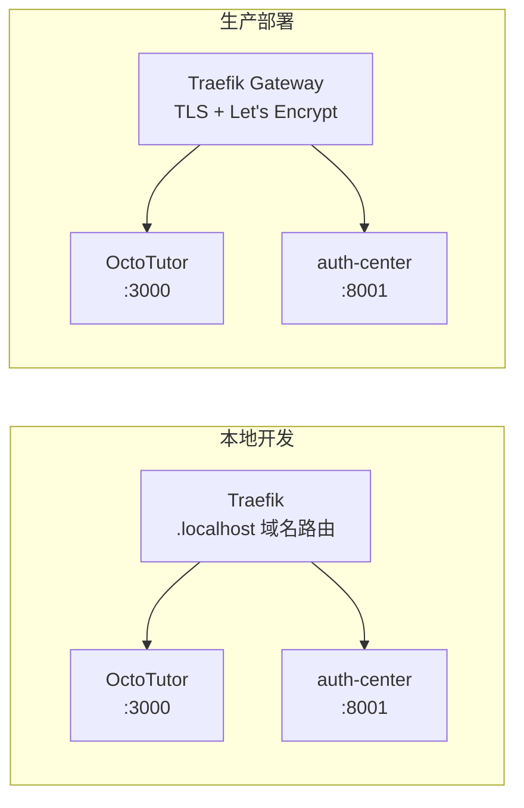

# OctoTutor 架构基线分析

## 分析边界

- 分析类型：existing_code（基于当前代码的架构基线梳理）
- 输入来源：全部 12 个源码/配置文件 + 3 个部署文件
- 已读取代码：全部项目源码
- 已读取文档：xlfoundryTest/architecture.md（认证生态约束、测试要求第9节）
- 未读取/缺失上下文：OctoTutor 项目无已有 architecture.md
- 明确不分析：auth-center 后端实现、auth-sdk-web 内部实现、AI 对话引擎（未实现）

## 功能目标

- 用户：高中生
- 目标：梳理 OctoTutor R001 已实现模块的架构基线，为后续需求包提供架构约束参考
- 成功标准：产出完整、准确的架构文档，覆盖模块边界、不变量、禁止模式、部署拓扑
- 非目标：不设计新功能，不修改现有代码

## 用户交互链

| Step | User Action | System Response | Success State | Failure/Empty State |
|------|-------------|-----------------|---------------|---------------------|
| 1 | 访问 OctoTutor | 加载首页 + SDK 初始化 | 首页显示"登录"按钮 | 初始化失败→"系统初始化失败" |
| 2 | 点击"开始解题"或"/chat" | RouteGuard 检查认证 | 已登录→进入页面 | 未登录→跳转 auth-center |
| 3 | 在 auth-center 完成登录 | 302 回调 /callback?code=xxx | 跳转首页，显示用户名 | code 无效→"登录失败" |
| 4 | Token 即将过期 | SDK 自动续期 | 用户无感知 | 续期失败→跳转登录 |
| 5 | 点击"退出" | 调 auth-center 登出 + 清本地 | 跳转登录页 | API 失败仍清本地 |

## 系统逻辑树

```text
访问页面
├─ 前端
│  ├─ SDK init（从 config.json 读取 clientId 和 authCenterBaseURL）
│  ├─ 检查 localStorage 中是否有有效 token
│  │  ├─ 有 → fetchUserInfo() → 进入页面
│  │  └─ 无 → 显示登录按钮
│  └─ 路由保护
│     ├─ 公开页面：首页
│     └─ 需登录页面：/chat → RouteGuard → 未登录重定向
├─ 登录流程
│  ├─ authService.login()
│  │  ├─ 生成 state + PKCE → sessionStorage
│  │  └─ window.location.href → auth-center
│  └─ /callback 路由
│     ├─ processedRef 防重入
│     ├─ handleCallback() 校验 state + PKCE
│     ├─ code 换 token → POST auth-center/api/v1/auth/token
│     ├─ 存 localStorage
│     └─ redirect → 首页
├─ 会话管理
│  ├─ TokenManager 自动续期（SDK 内置）
│  ├─ 跨 Tab 同步（storage 事件）
│  └─ onSessionExpired → 重置状态
└─ 登出
   ├─ POST auth-center/api/v1/auth/logout
   ├─ clearTokens()
   └─ 跳转首页
```

## 功能网络



### 依赖的已有模块

| Module | Dependency Type | Reason | Evidence |
|--------|-----------------|--------|----------|
| @xlfoundry/auth-sdk-web | npm 包 (本地 file:) | OAuth 认证全部能力 | package.json |
| auth-center (Docker) | 外部服务 | OAuth 授权 + Token 签发 + 用户信息 | config.json authCenterBaseURL |
| Traefik | 基础设施 | 域名路由 + TLS 终结 | docker-compose Traefik labels |
| auth-network-local | Docker 网络 | 与 auth-center 通信 | docker-compose.local.yml |

### 影响的已有模块

| Module | Impact | Required Change | Risk |
|--------|--------|-----------------|------|
| 无（基线梳理） | — | — | — |

### 新增或变更能力

无（本次为架构基线梳理，不引入新能力）。

## 方案设计

### 方案目标

- 设计目标：梳理并记录 OctoTutor 已实现的架构基线
- 不解决的问题：不设计新功能、不修改代码
- 成功判定：产出 architecture.md，覆盖模块边界、不变量、禁止模式、部署拓扑

### 模块与边界

| 模块 | 职责 | 运行环境 | 边界约束 |
|------|------|---------|---------|
| layout.tsx | 根 Shell：字体/CSS/AuthProvider/Header | SSR | 不含业务逻辑 |
| auth-context.tsx | 认证核心：SDK 单例 + Context | Client ('use client') | 所有 SDK 调用在 useEffect 内 |
| header.tsx | 导航栏：登录状态 + 用户名 + 登录/退出 | Client ('use client') | 只读 auth 状态 + 调 login/logout |
| route-guard.tsx | 路由守卫：未登录跳转认证中心 | Client ('use client') | 不渲染子组件直到认证完成 |
| callback/page.tsx | OAuth 回调处理 | Client ('use client') | processedRef 防重入 |
| page.tsx | 首页落地页 | SSR | 无认证需求 |
| chat/page.tsx | 解题对话页 | SSR | 需 RouteGuard 包裹 |
| config.json | 运行时认证配置 | 静态文件 | 不硬编码在源码中 |

### 数据 / API / 配置 / 第三方集成

| Area | Design | Existing Contract | Risk |
|------|--------|-------------------|------|
| 运行时配置 | public/config.json，浏览器 fetch 加载 | clientId + authCenterBaseURL | 低 |
| OAuth 流程 | Authorization Code + PKCE，auth-sdk-web 封装 | auth-center API | 中（CORS 配置） |
| Token 存储 | localStorage（SDK 内置管理） | SDK 内置 | 低 |
| CORS | auth-center 白名单需包含 octotutor 域名 | auth-center config.py CORS_ORIGINS | 中（外部配置依赖） |

### 不变量

1. AuthService 全局单例（模块级变量）
2. SDK 初始化幂等（initRef 防重入）
3. 回调处理幂等（processedRef 防重入）
4. 认证先于渲染（RouteGuard 门卫模式）
5. 配置与构建解耦（config.json 运行时加载）
6. Docker standalone 部署（output: "standalone"）

### 禁止模式

1. 禁止在 SSR 组件中使用 useAuth()（Context 仅在客户端子树可用）
2. 禁止在 SSR 阶段调用 auth-sdk（依赖 window/localStorage/sessionStorage）
3. 禁止绕过 RouteGuard 直接暴露受保护页面内容
4. 禁止硬编码 clientId/authCenterBaseURL 在源码中
5. 禁止在 Next.js Middleware 中使用 auth-sdk（Edge Runtime 不兼容）
6. 禁止修改 auth-sdk-web 代码（外部包，不动）

### 测试与发布策略

- 集成测试：Playwright E2E，连接本地 Docker auth-center
- 本地部署：docker-compose.local.yml，复用 xlfoundryTest 的 Traefik + auth-center
- 生产部署：docker-compose.yml，独立 Traefik 网关 + TLS
- CORS 前置条件：auth-center 白名单需包含 octotutor 域名

## 部署架构



| 维度 | 本地 | 生产 |
|------|------|------|
| 域名 | octotutor.localhost | octotutor.xiaolutang.top |
| 协议 | HTTP | HTTPS (Let's Encrypt) |
| 网络 | auth-network-local | gateway + auth-network |
| config.json | http://auth.localhost | https://auth.xiaolutang.top |
| clientId | MlP4hO8DKk-BOByD | MlP4hO8DKk-BOByD |

## 对 plan 的建议

- 应拆出的任务：无（本次为架构基线梳理，不引入实现任务）
- 应优先验证的链路：无
- 必须进入 open_issues 的阻塞项：无
- 应明确 out_of_scope 的内容：AI 对话引擎、后端 API、教材知识库

## 集成测试要求

- 已确认：Playwright E2E + Docker auth-center
- 测试账号：环境变量 E2E_USERNAME / E2E_PASSWORD
- 必须验证的链路：登录→回调→页面访问→退出
