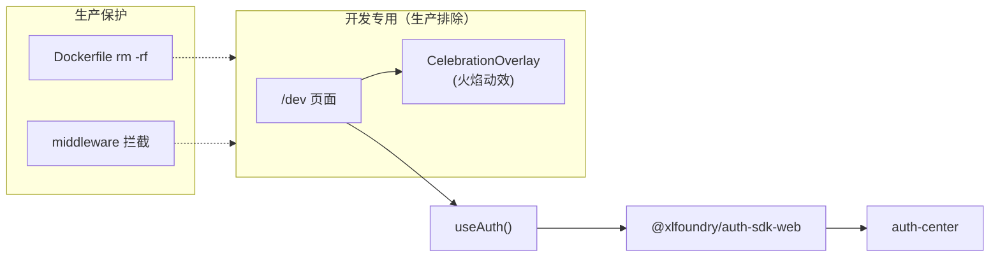

# dev-sandbox-celebration 需求分析与方案设计

## 分析边界

- 分析类型：new_requirement（在已有 dev sandbox 页面上扩展功能）
- 输入来源：用户需求描述 + 已有 dev sandbox / auth / Dockerfile 代码
- 已读取代码：`src/app/dev/page.tsx`、`src/middleware.ts`、`deploy/Dockerfile`、`src/contexts/auth-context.tsx`、`src/components/header.tsx`、`src/app/page.tsx`
- 已读取文档：`architecture.md`
- 未读取/缺失上下文：无
- 明确不分析：auth-center 后端、auth-sdk-web 内部实现、生产环境行为

## 功能目标

- 用户：开发者（仅开发环境）
- 目标：在 dev sandbox 页面添加两个快捷功能——登录状态查看/操作 + 庆祝里程碑动效
- 成功标准：
  1. 在 /dev 页面可以看到当前登录状态，直接执行登录/退出
  2. 庆祝入口打开全屏火焰粒子动效 + 项目主题文案
  3. 火焰动效代码不出现在生产构建产物中
- 非目标：不影响任何生产页面和组件

## 用户交互链

| Step | User Action | System Response | Success State | Failure/Empty State |
|------|-------------|-----------------|---------------|---------------------|
| 1 | 访问 /dev | 加载 sandbox 页面 | 显示完整沙箱内容 | 404（生产环境） |
| 2 | 查看登录状态区 | 显示当前认证状态 | 已登录显示用户名 + 退出按钮 | 未登录显示登录按钮 |
| 3 | 点击登录/退出 | 调用 useAuth().login/logout | 跳转认证中心 / 清除会话 | SDK 未初始化→"加载中" |
| 4 | 点击庆祝入口 | 打开全屏火焰动效覆盖层 | 火焰粒子动画 + 庆祝文案 | — |
| 5 | 点击关闭 / ESC | 关闭覆盖层，回到 sandbox | 动效消失 | — |

## 系统逻辑树

```text
访问 /dev
├─ 登录状态区
│  ├─ 读取 useAuth() 状态
│  │  ├─ isInitialized=false → 显示"加载中"
│  │  ├─ isAuthenticated=true → 显示用户名 + 退出按钮
│  │  └─ isAuthenticated=false → 显示登录按钮
│  └─ 操作
│     ├─ login() → 跳转 auth-center OAuth 授权页
│     └─ logout() → 清除 token + 重置状态
├─ 庆祝入口
│  ├─ 点击 → 渲染 CelebrationOverlay 组件
│  │  ├─ CSS 火焰粒子动效（canvas 或 CSS animation）
│  │  ├─ 庆祝文案："章鱼哥解题 基础架构搭建完成 🎉"
│  │  └─ 关闭按钮 + ESC 键监听
│  └─ 关闭 → 卸载 overlay 组件
└─ 生产环境保护
   ├─ Dockerfile: rm -rf src/app/dev（构建时排除）
   └─ middleware: production 拦截 /dev/*（运行时兜底）
```

## 功能网络



### 依赖的已有模块

| Module | Dependency Type | Reason | Evidence |
|--------|-----------------|--------|----------|
| useAuth() | React Context | 获取登录状态和 login/logout 方法 | header.tsx 使用相同模式 |
| AuthProvider | Context Provider | 根布局已注入，/dev 页面在 Provider 子树内 | layout.tsx:35 |

### 影响的已有模块

| Module | Impact | Required Change | Risk |
|--------|--------|-----------------|------|
| src/app/dev/page.tsx | 扩展内容 | 添加登录状态区 + 庆祝入口按钮 | 无（完全隔离的 dev 页面） |

### 新增或变更能力

| Capability ID | Name | Journey Type | Risk Tags | Must Plan | Required Evidence |
|---------------|------|--------------|-----------|-----------|-------------------|
| CAP-dev-001 | 登录状态快捷操作 | auth | auth | yes | entry_action,user_visible_success |
| CAP-dev-002 | 庆祝里程碑动效 | internal | none | no | entry_action,user_visible_success |

## 方案设计

### 方案目标

- 设计目标：在 dev sandbox 添加登录快捷操作和庆祝动效
- 不解决的问题：不修改生产代码、不引入外部动画库
- 成功判定：/dev 页面可登录/退出 + 庆祝动效可正常展示 + 生产构建不含相关代码

### 方案选择

| Option | Summary | Pros | Cons | Decision |
|--------|---------|------|------|----------|
| A | CSS animation 火焰粒子 | 零依赖、轻量 | 效果不够炫酷 | rejected |
| B | Canvas 2D 粒子火焰系统 | 炫酷、新颖、粒子可控 | 需要额外 JS 逻辑 | selected |
| C | 三方动画库（lottie 等） | 效果最好 | 引入额外依赖 | rejected |

选择 B 的理由：用户明确要求炫酷、新颖的火焰动效。Canvas 粒子系统可实现逼真火焰效果（渐变粒子、上升运动、随机抖动、多层叠加），且仍是零外部依赖。

### 模块与边界

| Module | Responsibility | Change Type | Boundary / Invariant |
|--------|----------------|-------------|----------------------|
| `src/app/dev/page.tsx` | sandbox 主页面 | 修改 | 添加登录状态区 + 庆祝按钮 |
| `src/app/dev/celebration.tsx` | Canvas 2D 火焰粒子动效 overlay 组件 | 新增 | 仅被 dev/page.tsx import，dev-only |
| `src/app/dev/page.tsx` 中 LINKS | 快捷入口列表 | 修改 | 新增"庆祝"入口 + 登录按钮直接跳转认证中心 |

所有新代码都在 `src/app/dev/` 目录下，确保 Dockerfile `rm -rf src/app/dev` 一并排除。

### 数据 / API / 配置 / 第三方集成

| Area | Design | Existing Contract | New Contract Needed | Risk |
|------|--------|-------------------|---------------------|------|
| 登录操作 | 复用 useAuth().login/logout | auth-context.tsx 已有 | 无 | 无 |
| 动效资源 | 纯 CSS animation，无外部资源 | — | 无 | 无 |

### 测试与发布策略

- 单元测试：middleware 环境守卫（已有 4/4 通过）
- 集成测试：Playwright 验证 /dev 生产返回 404（已有 2/2 通过）
- 新增单元测试：celebration 组件渲染（可选）
- 新增集成测试：dev 模式下 /dev 页面功能验证（需 next dev 运行）
- 回滚或降级：直接删除 `src/app/dev/` 目录即可

## Decision Items

| ID | Summary | Type | Must Plan | Source |
|----|---------|------|-----------|--------|
| DEC-dev-001 | 登录状态区复用 useAuth() 模式（与 Header 一致） | user_behavior | yes | interaction_chain |
| DEC-dev-002 | 火焰动效使用 Canvas 2D 粒子系统，不引入外部库 | boundary | yes | solution_design |
| DEC-dev-003 | 庆祝文案包含项目主题（章鱼哥、八臂、基础架构里程碑） | user_behavior | no | interaction_chain |
| DEC-dev-004 | 所有新代码放在 src/app/dev/ 目录下，确保生产排除 | architecture_impact | yes | solution_design |

## 风险与缺口

| ID | Gap/Risk | Evidence | Impact | Suggested Handling |
|----|----------|----------|--------|--------------------|
| RISK-dev-001 | CSS 火焰效果在不同浏览器表现可能不一致 | 纯 CSS animation 兼容性 | 低（dev-only） | 使用标准 CSS 属性，避免实验性特性 |

## 集成测试要求

- 是否需要真实集成测试：是（已有 Playwright 基础）
- 推荐运行方式：Playwright 对 Docker 生产部署验证 /dev 返回 404
- Docker / docker compose 支持：已有
- mock 允许范围：不需要 mock
- 必须验证的链路：生产环境 /dev 不可访问

## 对 plan 的建议

- 应拆出的任务：
  1. 修改 dev/page.tsx：添加登录状态区（import useAuth + 条件渲染）
  2. 新建 dev/celebration.tsx：火焰动效 overlay 组件
  3. 修改 dev/page.tsx：添加庆祝入口按钮，引入 celebration 组件
- 应优先验证的链路：dev 模式下 /dev 页面功能完整性
- 必须进入 open_issues 的阻塞项：无
- 应明确 out_of_scope 的内容：生产页面不受任何影响
