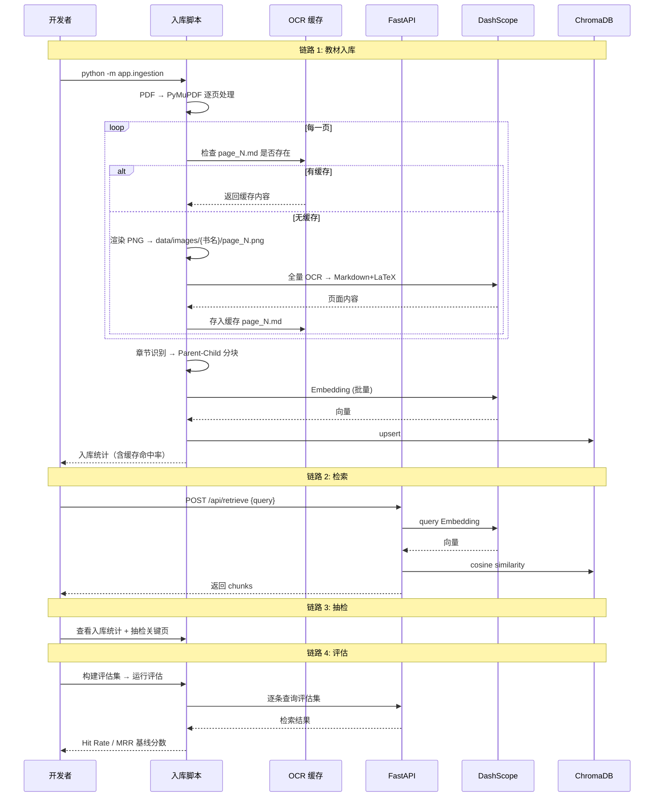
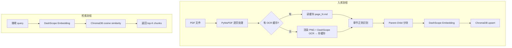
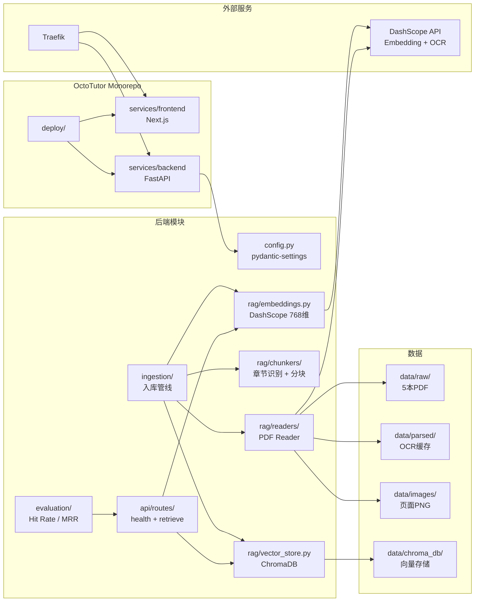

# R003 教材知识库 需求分析与方案设计

## 分析边界

- 分析类型：new_requirement（新需求功能分析）
- 输入来源：需求文档 + brainstorm 决策记录 + ragDemo 参考实现 + OctoTutor 现有代码
- 已读取代码：OctoTutor 前端核心文件 + ragDemo RAG 全链路代码
- 已读取文档：architecture.md + 1期需求汇总 + brainstorm 决策记录
- 未读取/缺失上下文：无（已充分覆盖）
- 明确不分析：
  - 检索优化（BM25 / Hybrid / RRF / Reranker / Parent Promote）→ 后续迭代
  - AI 对话 / 生成质量 → R004
  - 前端 Chat UI → R004
  - 用户认证打通 → R004

## 功能目标

- 用户：开发者（R003 阶段）
- 目标：**数据录入 + 基础检索 + 检索质量基线**
- 成功标准：
  1. 5 本高中数学 PDF 教材成功入库
  2. 检索 API 可用，返回相关教材 chunks
  3. 基于实际入库结果构建评估集，跑出 Hit Rate / MRR 基线分数
  4. Monorepo 结构建立，前后端 Docker 编排通过
- 非目标：
  - 检索优化（BM25/Hybrid/Reranker → 有基线后迭代）
  - AI 对话（R004）
  - 前端 Chat UI（R004）
  - 认证打通（R004）

## 用户交互链

### 链路 1：教材入库

| Step | User Action | System Response | Success State | Failure/Empty State |
|------|-------------|-----------------|---------------|---------------------|
| 1 | 将 PDF 放入 `services/backend/data/raw/` | 检测文件 | PDF 就绪 | 目录为空则跳过 |
| 2 | 运行 `python -m app.ingestion` | 逐本逐页处理：先查 OCR 缓存 → 未缓存则渲染 PNG + 全量 OCR → 分块 → Embedding → ChromaDB | 输出统计（含缓存命中数） | 单本失败记录日志，继续 |

### 链路 2：检索 API

| Step | User Action | System Response | Success State | Failure/Empty State |
|------|-------------|-----------------|---------------|---------------------|
| 1 | `POST /api/retrieve {"query": "..."}` | Embedding → cosine → 返回 chunks | 返回教材内容 | 空列表 |

### 链路 3：入库抽检

| Step | User Action | System Response | Success State | Failure/Empty State |
|------|-------------|-----------------|---------------|---------------------|
| 1 | 查看入库统计（每本书 chunk 数、页码覆盖范围） | 输出统计 | 覆盖完整 | 有空页或异常 |
| 2 | 抽检关键页面（对比 PDF 原文 vs chunk 内容） | 展示对比 | 内容一致、页码正确 | OCR 错误或页码偏移 |

### 链路 4：检索质量评估

| Step | User Action | System Response | Success State | Failure/Empty State |
|------|-------------|-----------------|---------------|---------------------|
| 1 | 基于实际入库结果构建评估集 | 写入 evals/retrieval_eval_core.json | 覆盖 5 本教材 | — |
| 2 | 运行 `python -m app.evaluation` | 加载评估集 → 逐条检索 → 计算 Hit Rate / MRR | 输出基线分数 | 评估集为空 |



## 系统逻辑树

```text
R003 系统
├─ Monorepo 结构
│  ├─ services/frontend/ (现有代码迁移)
│  └─ services/backend/ (新建 Python)
├─ 后端服务
│  ├─ config.py (pydantic-settings)
│  ├─ FastAPI 入口 + 路由
│  └─ Dockerfile
├─ 教材入库
│  ├─ 1. PDF 读取 (PyMuPDF)
│  │  └─ 逐页处理
│  ├─ 2. 页面处理（全量 OCR，缓存优先）
│  │  ├─ 检查缓存: data/parsed/{书名}/page_{N}.md 是否存在
│  │  │  ├─ 有缓存 → 直接用缓存内容，跳过 OCR 和 PNG 渲染
│  │  │  └─ 无缓存 → 渲染 PNG → 调 DashScope OCR → 存缓存
│  │  ├─ 原因: 数学教材图文混排多，PyMuPDF 只能提取嵌入文本，无法识别图表/公式图片
│  │  └─ 规则: 每页都 OCR 保证内容完整，缓存避免重复花钱
│  ├─ 3. 章节识别 (StructureParser)
│  │  └─ 正则匹配: 第X章 → level=1, X.X → level=2, 习题X.X → level=3, X.X.X → level=4
│  │  └─ 输出 SectionBoundary 列表 (title, level, start_pos, end_pos)
│  ├─ 4. 分块 (Chunker)
│  │  ├─ Parent = level=2 小节的全部内容
│  │  ├─ Child = 512 token, 50 token overlap, 按句子边界切分
│  │  └─ 每条 chunk 带元数据 (book, chapter, section, page, chunk_type, has_formula, parent_id, child_index)
│  ├─ 5. Embedding (DashScope)
│  │  ├─ 模型: tongyi-embedding-vision-flash (768 维)
│  │  ├─ 批量: 6 条/次
│  │  └─ 重试: 指数退避 3 次
│  └─ 6. 存储 (ChromaDB)
│     ├─ upsert 批量 100 条
│     └─ 幂等: 入库前删除该书旧数据
├─ 检索 API
│  ├─ Query → DashScope Embedding → 768 维向量
│  └─ ChromaDB cosine similarity → top-K 结果
└─ 评估
   ├─ 基于实际入库结果构建评估集（入库后才能构建，不能先于入库）
   │  ├─ 参考 ragDemo 的数据结构思路（ANY/ALL、book+page范围）
   │  └─ 基于我们的实际 chunks 的 book + page 构建评估数据
   ├─ 逐条检索
   └─ 计算 Hit Rate (top-K 有无命中) / MRR (命中排名倒数)
```



## 数据设计

### 存储布局

```
services/backend/data/
├── raw/                    ← 源头: PDF 文件 (5 本教材)
│   ├── 必修第一册.pdf
│   ├── 必修第二册.pdf
│   ├── 选择性必修第一册.pdf
│   ├── 选择性必修第二册.pdf
│   └── 选择性必修第三册.pdf
│
├── parsed/                 ← OCR 缓存: 避免重复调用 DashScope API
│   └── {书名}/
│       ├── page_1.md       ← 全量 OCR 后的 Markdown+LaTeX
│       ├── page_2.md
│       └── ...
│
├── images/                 ← 页面图片: OCR 输入 + 前端展示引用来源
│   └── {书名}/
│       ├── page_1.png      ← PyMuPDF 渲染, DPI 150 (仅无缓存时渲染)
│       └── ...
│
└── chroma_db/              ← ChromaDB 向量存储 (PersistentClient)
    └── (ChromaDB 自动管理)
```

### ChromaDB 数据模型

每条 chunk 记录：

```python
{
    # 唯一标识 (确定性生成，同一教材跑两次 ID 相同)
    "id": "必修第一册::1.1集合::p12_s0::child::2",

    # 实际内容
    "text": "集合的表示方法有列举法和描述法。列举法是把集合的元素...",

    # 768 维向量 (DashScope tongyi-embedding-vision-flash)
    "embedding": [0.023, -0.015, 0.087, ...],

    # 结构化元数据 (每个字段有明确用途)
    "metadata": {
        "book":        "必修第一册",           # string - 过滤/展示
        "chapter":     "第一章 集合与函数概念",  # string - 展示来源
        "section":     "1.1 集合",             # string - 展示来源
        "page":        12,                     # int    - 过滤/展示/图片对应
        "chunk_type":  "child",               # string - 过滤: parent/child
        "has_formula": True,                  # bool   - 过滤: 含公式
        "parent_id":   "必修第一册::1.1集合::p12_s0::parent",  # string - 关联 parent
        "child_index": 2                      # int    - 排序: parent 内位置
    }
}
```

### Chunk ID 生成规则

```
格式: {书名}::{章节标识}::{定位}::{类型}

章节标识: 章节标题去空格和标点 (如 "1.1 集合" → "1.1集合")
定位:     p{页码}_s{该页第几个章节}
类型:     parent | child::{序号}

示例:
  Parent: 必修第一册::1.1集合::p12_s0::parent
  Child:  必修第一册::1.1集合::p12_s0::child::0
  Child:  必修第一册::1.1集合::p12_s0::child::1
```

### Metadata 字段设计

| 字段 | 类型 | 用途 | ChromaDB where 查询 |
|------|------|------|---------------------|
| `book` | string | 按书名过滤 | `where={"book": "必修第一册"}` |
| `chapter` | string | 展示引用来源 | 不做过滤 |
| `section` | string | 展示引用来源 | 不做过滤 |
| `page` | int | 展示页码 + 对应图片 | `where={"page": 12}` |
| `chunk_type` | string | 过滤 parent/child | `where={"chunk_type": "child"}` |
| `has_formula` | bool | 过滤含公式 chunk | `where={"has_formula": True}` |
| `parent_id` | string | Child 关联 Parent | 后续优化用 |
| `child_index` | int | Parent 内排序 | 不做过滤 |

### 图片与 chunk 的对应关系

```
chunk.metadata.book + chunk.metadata.page
        ↓
图片路径 = data/images/{book}/page_{page}.png
        ↓
前端展示: "来源：必修第一册 第12页" + 显示该页截图

规则:
- 每个 Child 记录自己实际所在的 page
- 跨页时按页面边界拆分，不同页句子分到不同 chunk
- 通过 book + page 即可定位图片，无需额外字段
```

### Parent-Child 关系

```
StructureParser 识别章节 → level=2 小节为切割边界

┌─ Parent: "1.1 集合" (整个小节) ──────────────────────┐
│                                                      │
│  集合的概念：一般地，把研究对象称为元素...              │
│  通常用大写拉丁字母 A，B，C，... 表示集合。             │
│  如果 $a$ 是集合 A 的元素，就说 $a$ 属于集合 A...     │
│  集合的表示方法有列举法和描述法。                      │
│  列举法是把集合的元素一一列举出来...                   │
│  例如：$A = \{1, 2, 3, 4, 5\}$。                    │
│  ...                                                 │
│                                                      │
│  ┌─ Child 0 (~512 token) ─────────┐                  │
│  │ 一般地，把研究对象称为元素...     │                  │
│  │ 通常用大写拉丁字母表示集合。      │                  │
│  │ 如果 $a$ 是集合 A 的元素...      │                  │
│  └──────── 50 token overlap ───────┘                  │
│  ┌─ Child 1 (~512 token) ─────────┐                  │
│  │ 如果 $a$ 是集合 A 的元素...      │                  │
│  │ 集合的表示方法有列举法和描述法。  │                  │
│  │ 列举法是把集合的元素一一列举...   │                  │
│  └─────────────────────────────────┘                  │
│  ┌─ Child 2 ...                    ┘                  │
└──────────────────────────────────────────────────────┘

切割规则:
- 目标: 512 token (~1024 中文字符)
- 重叠: 50 token (~100 字符)
- 边界: 句号/问号/感叹号/换行，不在句子中间硬切
- 单句超 512 token: 整个保留
```

## 功能网络



### 依赖的已有模块

| Module | Dependency Type | Reason | Evidence |
|--------|-----------------|--------|----------|
| Traefik | infrastructure | 路由到前后端容器 | deploy/docker-compose.yml |
| Docker 网络 | infrastructure | 容器间通信 | deploy/docker-compose.yml |

### 影响的已有模块

| Module | Impact | Required Change | Risk |
|--------|--------|-----------------|------|
| 项目根目录 | 结构重组为 Monorepo | src/ → services/frontend/src/ | 中：需调整部署脚本 |
| deploy/Dockerfile | 拆分 | 单 Dockerfile → 前后端各一个 | 低 |
| deploy/docker-compose.yml | 增加后端容器 | 新增 backend service | 低 |
| architecture.md | 更新 | 反映新结构 | 低 |

### 新增或变更能力

| Capability ID | Name | Journey Type | Risk Tags | Must Plan | Required Evidence |
|---------------|------|--------------|-----------|-----------|-------------------|
| CAP-kb-001 | PDF 教材入库 | third_party | network | yes | entry_action, completion, user_visible_success |
| CAP-kb-002 | 基础向量检索 API | internal | none | no | entry_action, user_visible_success |
| CAP-kb-003 | 检索质量评估 | internal | none | no | entry_action, user_visible_success |
| CAP-kb-004 | Monorepo 结构迁移 | architecture_impact | none | yes | entry_action, completion |
| CAP-kb-005 | 后端服务 Docker 部署 | infrastructure | network | yes | entry_action, completion |

## 方案设计

### 方案目标

- 设计目标：数据能录进去 + 能查出来 + 有量化基线分数
- 不解决：检索优化、AI 对话、前端 Chat UI、认证打通
- 成功判定：
  1. 5 本教材入库成功
  2. 检索 API 返回相关内容
  3. 入库抽检通过（页码、内容、分块质量正确）
  4. 基于实际入库结果自建评估集，跑出 Hit Rate / MRR 基线
  5. docker-compose 前后端同时可访问

### 模块与边界

| Module | Responsibility | Change Type | Boundary / Invariant |
|--------|----------------|-------------|----------------------|
| `services/frontend/` | 现有 Next.js | 迁移 | 功能不变 |
| `services/backend/app/config.py` | pydantic-settings 统一配置 | 新增 | 环境变量/.env 驱动 |
| `services/backend/app/main.py` | FastAPI 入口 | 新增 | health + retrieve 路由 |
| `services/backend/app/rag/readers/` | PDF 读取 + 缓存优先 + 全量 OCR | 新增 | 数学教材图文混排多，每页都 OCR 保证内容完整；有缓存跳过，无缓存渲染 PNG + OCR + 存缓存 |
| `services/backend/app/rag/chunkers/` | 章节正则识别 + Parent-Child 分块 | 新增 | level=2 为 Parent 边界 |
| `services/backend/app/rag/embeddings.py` | DashScope Embedding 封装 | 新增 | 批量6 + 重试3 + 768维 |
| `services/backend/app/rag/vector_store.py` | ChromaDB 封装 | 新增 | Protocol 接口，upsert/query/delete |
| `services/backend/app/ingestion/` | 入库编排 | 新增 | 幂等：先删旧数据再入库 |
| `services/backend/app/evaluation/` | 检索质量评估 | 新增 | 自建评估集，入库后基于实际数据构建 |
| `services/backend/app/api/routes/` | health + retrieve | 新增 | 两个端点 |

### 第三方集成

| 服务 | 用途 | 调用时机 | API |
|------|------|---------|-----|
| DashScope OCR | 每页全量 OCR → Markdown+LaTeX（数学教材图文混排多） | 入库时（无缓存才调） | 多模态 qwen 系列 |
| DashScope Embedding | 文本 → 768维向量 | 入库 + 检索时 | tongyi-embedding-vision-flash |

### API 契约

#### POST /api/retrieve

```json
// Request
{
  "query": "二次函数的顶点公式",
  "top_k": 5
}

// Response 200
{
  "chunks": [
    {
      "chunk_id": "必修第一册::1.3二次函数::p45_s0::child::2",
      "text": "二次函数 $f(x)=ax^2+bx+c$ 的顶点坐标为...",
      "score": 0.89,
      "metadata": {
        "book": "必修第一册",
        "chapter": "第一章 集合与函数概念",
        "section": "1.3 二次函数",
        "page": 45,
        "chunk_type": "child",
        "has_formula": true,
        "parent_id": "必修第一册::1.3二次函数::p45_s0::parent",
        "child_index": 2
      }
    }
  ],
  "total": 5
}
```

#### GET /api/health

```json
{
  "status": "healthy",
  "chromadb": { "connected": true, "document_count": 3420 },
  "embedding": { "available": true }
}
```

### 错误处理

| Scenario | Error Handling | User Feedback |
|----------|----------------|---------------|
| OCR 失败 | 重试 2 次，失败跳过该页并记录 | 日志记录失败页码，不影响其他页 |
| Embedding 失败 | 指数退避重试 3 次 | 日志记录失败 chunk |
| ChromaDB 写入失败 | 重新 upsert | 日志记录 |
| 检索无结果 | 正常返回空列表 | `chunks: [], total: 0` |

### 测试与发布策略

- **单元测试** (pytest)：
  - 章节识别：给定文本 → 验证 SectionBoundary 正确
  - 分块逻辑：给定小节 → 验证 chunk 数量/大小/元数据/child_index
  - VectorStore：upsert → query → delete 基本操作
  - Embedding：mock DashScope → 验证批量/重试逻辑
- **集成测试**：
  - 入库端到端：小 PDF → ChromaDB 有数据
  - 检索端到端：已入库 → 查询 → 返回相关结果
  - 评估端到端：评估集 → Hit Rate / MRR
  - Docker Compose：前后端同时可访问
- **前端迁移验证**：现有 Playwright 测试仍通过
- **第三方依赖**：DashScope API 需要真实 API Key
- **回滚**：后端独立容器，不影响前端

## Decision Items

| ID | Summary | Type | Must Plan | Source |
|----|---------|------|-----------|--------|
| DEC-kb-001 | 全量 OCR（非三通道判断）：数学教材图文混排多，PyMuPDF 无法识别图表公式图片，每页都 OCR 保证内容完整；缓存优先避免重复花钱 | tech_choice | yes | solution_design |
| DEC-kb-002 | Parent-Child 双层分块：Parent=level=2小节, Child=512token/50overlap | tech_choice | yes | solution_design |
| DEC-kb-003 | 检索仅用 cosine similarity，不做 Hybrid/Reranker | boundary | yes | solution_design |
| DEC-kb-004 | 评估集基于实际入库结果自建，参考 ragDemo 的数据结构思路（ANY/ALL、book+page范围），不直接复用 ragDemo 数据 | boundary | no | solution_design |
| DEC-kb-005 | Monorepo 结构迁移，前端功能不变 | architecture_impact | yes | interaction_chain |
| DEC-kb-006 | 图片通过 book+page 定位，不存额外 image_path 字段 | tech_choice | no | data_design |

## 风险与缺口

| ID | Gap/Risk | Evidence | Impact | Suggested Handling |
|----|----------|----------|--------|--------------------|
| RSK-001 | Monorepo 迁移破坏部署 | Dockerfile 路径硬编码 | 高 | 迁移后立即验证构建+部署 |
| RSK-002 | DashScope OCR 公式识别误差 | 未覆盖所有页面 | 中 | 入库后抽检关键页面 |
| RSK-003 | 基础 cosine 检索质量可能不高 | 无优化层 | 低 | 先出基线分数，后续迭代 |

## 评估集设计

### 构建流程

评估集必须在入库完成后基于实际数据构建，不能先于入库。

| 步骤 | 做什么 | 依赖 |
|------|--------|------|
| 1 | 跑完入库，ChromaDB 里有实际 chunks | 入库管线完成 |
| 2 | 抽检入库结果（页码、内容、分块质量） | — |
| 3 | 基于实际 chunks 的 book + page 构建评估集 | 抽检通过 |
| 4 | 跑评估 → Hit Rate / MRR 基线 | 评估集构建完成 |

### 参考 ragDemo 的数据结构思路

不直接复用 ragDemo 的评估数据，但参考其结构设计：

| 设计要素 | ragDemo 的做法 | 我们的做法 |
|---------|---------------|-----------|
| 数据结构 | id + question + retrieval_truth(mode + sources) | 同 |
| 匹配方式 | book + page_start/page_end 范围匹配 | 同 |
| mode | ANY(任一命中) / ALL(全部命中) | 同 |
| 数据来源 | ragDemo 自己的入库结果 | **我们自己的入库结果** |
| 页码 | ragDemo 的页码映射 | **我们自己的页码映射** |

### 评估集数据结构

```json
{
  "id": "q001",
  "question": "什么是函数？函数的定义是什么？",
  "retrieval_truth": {
    "mode": "ANY",
    "sources": [
      {
        "book": "必修第一册",
        "page_start": 67,
        "page_end": 75
      }
    ]
  }
}
```

### 评估指标

| 指标 | 计算方式 | 目的 |
|------|---------|------|
| Hit Rate@K | top-K 中包含期望页面 (book + page 范围) → 命中数 / 总条数 | 核心检索准确率 |
| MRR | 命中排名倒数均值 (排第1=1.0, 排第2=0.5, 未命中=0) | 排序质量 |

### 判定逻辑

| mode | 判定方式 |
|------|---------|
| `ANY` | top-K 中任一 source 的 book + page 范围命中 → Hit |
| `ALL` | top-K 中全部 source 都有至少一条命中 → Hit |

## 集成测试要求

- 是否需要真实集成测试：是（DashScope 无法 mock）
- 推荐运行方式：本地 Python venv + DashScope API Key
- Docker：迁移验证需 docker compose up
- mock 允许范围：单元测试可 mock DashScope；集成测试用真实 API
- 必须验证的链路：
  1. 入库端到端：PDF → ChromaDB 有数据
  2. 检索端到端：query → 返回 chunks
  3. 评估端到端：评估集 → Hit Rate / MRR
  4. Docker Compose：前后端同时可访问
  5. 前端迁移：Playwright 测试通过

## 对 plan 的建议

- 应拆出的任务：
  1. Monorepo 结构重组 + 前端迁移
  2. 后端脚手架（config + FastAPI + Dockerfile）
  3. PDF Reader（全量 OCR + 缓存优先 + PNG 渲染）
  4. Chunker（章节正则识别 + Parent-Child 分块）
  5. Embedding 封装（DashScope + 批量 + 重试）
  6. ChromaDB VectorStore
  7. 检索 API（health + retrieve）
  8. 入库脚本编排
  9. 入库抽检（验证页码、内容、分块质量）
  10. 基于实际入库结果构建评估集
  11. 检索质量评估（跑出基线分数）
  12. Docker Compose 集成 + 迁移验证
- 应优先验证：DashScope API 连通性 → 入库端到端
- 阻塞项：DashScope API Key
- out_of_scope：BM25/Hybrid/Reranker/Parent Promote/AI 对话/Chat UI/认证打通
