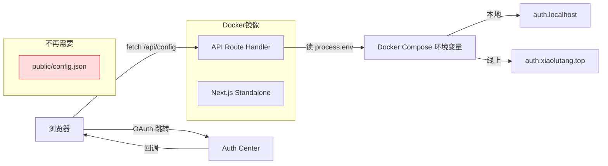

# 运行时配置注入 需求分析与方案设计

## 分析边界

- 分析类型：existing_code（现有功能改造）
- 输入来源：用户需求 + 代码阅读 + 对话上下文
- 已读取代码：auth-context.tsx、Dockerfile、docker-compose.local.yml、docker-compose.yml、auth-service.ts（SDK）、next.config.ts、.remote.env.example
- 已读取文档：architecture-foundation.md
- 未读取/缺失上下文：auth-center 的 CORS 配置（需线上确认）
- 明确不分析：auth-center 服务端配置（不属于本项目）

## 功能目标

- 用户：开发者/运维
- 目标：本地 Docker 和线上 Docker 使用不同的 auth SDK 配置，发布时不需要修改任何代码或配置文件
- 成功标准：
  1. 同一个 Docker 镜像在本地和线上自动使用正确的 auth-center 地址和 clientId
  2. 本地登录走 `auth.localhost`，线上登录走 `auth.xiaolutang.top`
  3. `deploy/` 下的配置文件配一次就行，后续发布全自动
- 非目标：
  - 不改 auth-center 服务端代码
  - 不改 auth-sdk-web SDK 代码
  - 不引入新的基础设施（如配置中心）

## 用户交互链

| Step | User Action | System Response | Success State | Failure/Empty State |
|------|-------------|-----------------|---------------|---------------------|
| 1 | 开发者执行 `./deploy/build.sh` 构建镜像 | 构建成功，镜像不含环境特定配置 | 镜像可用于任何环境 | 构建失败 |
| 2 | 开发者执行本地部署 | 容器从 docker-compose.local.yml 读取 AUTH_CLIENT_ID + AUTH_BASE_URL | 使用本地 auth-center | 容器启动但 /api/config 返回 500 |
| 3 | 开发者执行线上部署 | 容器从远端 .env 读取 AUTH_CLIENT_ID + AUTH_BASE_URL | 使用线上 auth-center | 同上 |
| 4 | 用户访问任意页面触发 SDK 初始化 | AuthProvider fetch /api/config 获取运行时配置 | SDK 初始化成功，登录功能正常 | 页面显示"认证初始化失败" |

## 系统逻辑树

```text
浏览器加载页面
├─ AuthProvider useEffect 触发
│  ├─ fetch('/api/config')                    ← 新增：API Route
│  │  └─ Next.js 服务端读取 process.env
│  │     ├─ AUTH_CLIENT_ID
│  │     └─ AUTH_BASE_URL
│  ├─ 返回 { clientId, authCenterBaseURL }
│  └─ AuthService.init() 初始化 SDK
│     ├─ redirectUri = window.location.origin + "/callback"  ← 已动态，无需改
│     └─ onSessionExpired 回调
└─ 用户点击登录
   ├─ login() → 跳转 authCenterBaseURL/api/v1/auth/authorize
   ├─ auth-center 回调到 redirectUri（= 当前域名/callback）
   └─ callback 页面 → handleCallback() → consumeReturnUrl()
```

## 功能网络



### 依赖的已有模块

| Module | Dependency Type | Reason | Evidence |
|--------|-----------------|--------|----------|
| auth-context.tsx | 配置消费方 | fetch 配置并初始化 SDK | 第 84 行 fetch("/config.json") |
| auth-sdk-web | 运行时依赖 | 需要 clientId + authCenterBaseURL 初始化 | AuthService.init(config) |
| middleware.ts | 先例 | 已在 standalone 中使用 process.env | ENABLE_DEV_SANDBOX |
| docker-compose.local.yml | 环境注入 | 本地环境变量 | environment 段 |
| docker-compose.yml | 环境注入 | 线上环境变量 | environment 段 |

### 影响的已有模块

| Module | Impact | Required Change | Risk |
|--------|--------|-----------------|------|
| auth-context.tsx | fetch URL 变更 | `/config.json` → `/api/config` | 低，仅改 URL |
| public/config.json | 删除 | 不再需要 | 低，无其他引用 |
| docker-compose.local.yml | 新增环境变量 | 加 AUTH_CLIENT_ID + AUTH_BASE_URL | 低 |
| docker-compose.yml | 新增环境变量 | 加 AUTH_CLIENT_ID + AUTH_BASE_URL | 低 |
| .remote.env.example | 新增模板 | 加线上 SDK 配置项 | 无 |

### 新增或变更能力

无新增用户可感知能力。这是基础设施改造，用户无感知。

## 方案设计

### 方案目标

- 设计目标：同一 Docker 镜像通过环境变量在不同环境使用不同 auth 配置
- 不解决的问题：auth-center 的 CORS 配置、回调地址注册（属于 auth-center 侧操作）
- 成功判定：本地/线上部署后登录流程完整可用

### 方案选择

| Option | Summary | Pros | Cons | Decision |
|--------|---------|------|------|----------|
| A: API Route Handler | 新增 `/api/config` 路由，读 env 返回 JSON | standalone 兼容、改动最小、运行时生效 | 新增 1 个文件 | **selected** |
| B: publicRuntimeConfig | next.config.ts 配置 | 不用新增文件 | standalone 模式不兼容 | rejected |
| C: NEXT_PUBLIC_* 环境变量 | 构建时嵌入 | 简单 | 运行时无法更改，违反"同镜像多环境"需求 | rejected |
| D: entrypoint.sh 动态写 config.json | 容器启动时写入文件 | 不改前端代码 | 不够优雅，需处理路径 | rejected |

**选择 A 的理由**：
1. middleware.ts 已在使用 `process.env`（ENABLE_DEV_SANDBOX），证明 standalone 模式下环境变量读取可行
2. Next.js App Router 的 Route Handler 是原生功能，standalone 模式完整支持
3. 改动最小（新增 1 文件 + 改 1 行 fetch URL + 删 1 文件）

### 模块与边界

| Module | Responsibility | Change Type | Boundary / Invariant |
|--------|----------------|-------------|----------------------|
| `src/app/api/config/route.ts` | 读取环境变量，返回 auth SDK 配置 | 新增 | 只暴露 AUTH_CLIENT_ID + AUTH_BASE_URL，不泄漏其他 env |
| `src/contexts/auth-context.tsx` | 消费配置，初始化 SDK | 修改 | fetch URL 从 `/config.json` 改为 `/api/config` |
| `deploy/docker-compose.local.yml` | 注入本地环境变量 | 修改 | 硬编码本地 dev 值 |
| `deploy/docker-compose.yml` | 注入线上环境变量 | 修改 | 使用 `${VAR}` 语法，从远端 .env 读取 |
| `deploy/.remote.env.example` | 线上配置模板 | 修改 | 新增 AUTH_CLIENT_ID + AUTH_BASE_URL |
| `public/config.json` | 静态配置 | 删除 | 不再需要 |

### 数据 / API / 配置 / 第三方集成

| Area | Design | Existing Contract | New Contract Needed | Risk |
|------|--------|-------------------|---------------------|------|
| 配置获取 | API Route `GET /api/config` | 无 | `GET /api/config → { clientId, authCenterBaseURL }` | 低 |
| 环境变量 | Docker Compose environment | ENABLE_DEV_SANDBOX 已有先例 | AUTH_CLIENT_ID, AUTH_BASE_URL | 低 |
| redirectUri | `window.location.origin + "/callback"` | 已动态生成，无需改 | 无 | 无 |
| CORS（auth-center） | 浏览器端直接 fetch auth-center API | auth.localhost 本地已工作 | auth.xiaolutang.top 需要允许 octotutor.xiaolutang.top 跨域 | **中** |

### 状态与错误处理

| Scenario | State Change | Error Handling | User Feedback |
|----------|--------------|----------------|---------------|
| 环境变量缺失 | API 返回 500 | auth-context catch → setInitError | 页面显示"认证初始化失败" |
| auth-center 不可达 | SDK init 成功但登录失败 | login → auth-center 返回错误 | 浏览器显示 auth-center 错误页 |
| CORS 拦截 | token 交换失败 | handleCallback catch → setError | callback 页面显示"登录失败" + "重新登录"按钮 |

### 测试与发布策略

- 单元测试：API Route 返回正确 JSON（环境变量存在/缺失两种场景）
- 集成测试：本地 Docker 部署后完整登录流程
- 本地 Docker / docker compose：验证 `AUTH_CLIENT_ID=MlP4hO8DKk-BOByD` + `AUTH_BASE_URL=http://auth.localhost` 工作正常
- 真实第三方 / 网络依赖：线上部署后验证 `https://auth.xiaolutang.top` 的 CORS 和回调
- 回滚或降级：恢复 `public/config.json` 即可回退

## Decision Items

| ID | Summary | Type | Must Plan | Source |
|----|---------|------|-----------|--------|
| DEC-config-001 | 用 API Route 替代静态 config.json | architecture_impact | yes | solution_design |
| DEC-config-002 | redirectUri 保持动态（window.location.origin） | boundary | no | existing_code |
| DEC-config-003 | 线上 auth-center 需要配置 CORS 和注册回调地址 | contract_impact | yes | function_network |

## 风险与缺口

| ID | Gap/Risk | Evidence | Impact | Suggested Handling |
|----|----------|----------|--------|--------------------|
| RISK-001 | 线上 auth-center 可能未配置 CORS 允许 octotutor.xiaolutang.top | SDK 的 exchangeCodeForToken 和 fetchUserInfo 是浏览器端直接 fetch auth-center API | 登录回调后 token 交换失败 | 部署前确认 auth-center CORS 配置 |
| RISK-002 | 线上 auth-center 可能未注册 `https://octotutor.xiaolutang.top/callback` 回调地址 | auth-center 需要预注册 redirect_uri | OAuth 授权被拒绝 | 部署前在 auth-center 后台注册回调地址 |
| RISK-003 | API Route 响应格式变化时 auth-context 需同步 | RuntimeConfig 接口只有 2 个字段 | 低，接口稳定 | 无 |

## 集成测试要求

- 是否需要真实集成测试：是
- 推荐运行方式：本地 Docker 部署后手动验证登录全流程
- Docker / docker compose 支持：已有
- mock 允许范围：API Route 可用 vitest 测试，不需要 mock
- 必须验证的链路：
  1. `/api/config` 返回正确的环境变量
  2. 环境变量缺失时返回 500
  3. 本地完整登录流程（登录 → auth-center → 回调 → 回到原页面）
  4. 线上完整登录流程（部署后验证）

## 线上部署前 Checklist

在代码改动之外，线上首次部署前还需要在 auth-center 侧完成：

1. **注册回调地址**：`https://octotutor.xiaolutang.top/callback`
   - 对应 clientId: `bM-IuROa8huhe8Ih`
2. **配置 CORS**：允许 `https://octotutor.xiaolutang.top` 跨域
   - 涉及 API：`/api/v1/auth/token`（POST）、`/api/v1/user/me`（GET）
3. **配置远端 .env**：
   ```
   AUTH_CLIENT_ID=bM-IuROa8huhe8Ih
   AUTH_BASE_URL=https://auth.xiaolutang.top
   ```

## 对 plan 的建议

- 应拆出的任务：
  1. 新增 API Route `/api/config` + 修改 auth-context fetch URL + 删除 public/config.json
  2. 更新 Docker Compose 环境变量 + 更新 .remote.env.example
  3. 添加 API Route 单元测试
- 应优先验证的链路：本地 Docker 部署后完整登录流程
- 必须进入 open_issues 的阻塞项：线上 auth-center CORS 和回调地址注册
- 应明确 out_of_scope 的内容：auth-center 服务端配置
