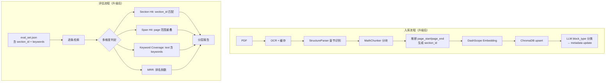
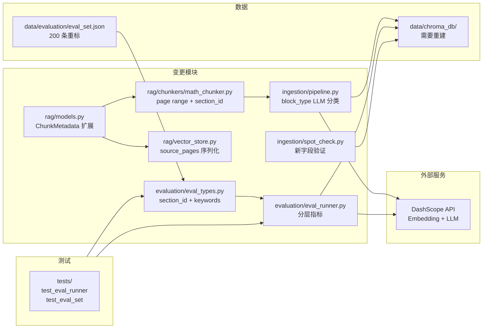

# RAG Metadata + 评估体系升级 需求分析与方案设计

## 1. 分析边界

- 分析类型：existing_code（现有功能分析 + 改进方案）
- 输入来源：全部 RAG 模块代码 + 评估模块代码 + eval_set.json 200 条数据 + 用户 4 层升级方案
- 已读取代码：
  - `app/rag/models.py` — ChunkMetadata 数据模型
  - `app/rag/chunkers/math_chunker.py` — StructureParser + MathChunker
  - `app/rag/vector_store.py` — ChromaDBStore
  - `app/ingestion/pipeline.py` — IngestionPipeline
  - `app/evaluation/eval_types.py` — EvalSource, RetrievalTruth, EvalItem
  - `app/evaluation/eval_runner.py` — EvalRunner
  - `data/evaluation/eval_set.json` — 200 条评估集
- 已读取文档：
  - `.dev-flow/analysis/2026-05-20--R003-knowledge-base.md`（R003 原始分析）
  - `.dev-flow/architecture.md`（架构宪法 v2.0）
  - `.dev-flow/feature_list.json`（R003 已完成 12/12 任务）
- 未读取/缺失上下文：无
- 明确不分析：
  - AI 对话 / 生成质量 → R004
  - 前端 Chat UI → R004
  - 用户认证 → R004
  - BM25 / Hybrid / RRF / Reranker → 后续迭代
  - LangGraph Agent / Mem0 → 远期

## 2. 功能目标

- 用户：开发者（评估 RAG 检索质量，迭代优化）
- 目标：**RAG 能稳定检索到教材中足以回答问题的最小有效内容单元，并能给出可信来源**
- 成功标准：
  1. 每个 chunk 有 page_start/page_end/source_pages，知道完整覆盖范围
  2. 每个 chunk 有 section_id，可按节匹配
  3. 每个 chunk 有 block_type（LLM 分类），区分定义/性质/例题/练习/解释
  4. 评估 truth 有 section_id + required_keywords，判定不再纯靠页码
  5. 评估报告同时输出 Section Hit / Span Hit / Keyword Coverage / MRR / Negative Pass Rate
- 非目标：
  - 不做 Reranker / Hybrid / BM25
  - 不做 Chunk Sufficiency（LLM judge）→ 下一轮
  - 不改 Parent-Child 切分策略本身（仍是 section parent + 512 token child）

## 3. 用户故事

| ID | Role | Action | Benefit | Acceptance |
|----|------|--------|---------|------------|
| US-eval-001 | 开发者 | 查看评估报告 Section Hit@K | 知道检索是否命中了正确小节，而不仅是正确页码范围 | 报告包含 Section Hit@5/10 指标 |
| US-eval-002 | 开发者 | 查看 Keyword Coverage@K | 知道返回的 chunk 是否包含回答问题所需的关键概念 | 报告包含每个问题的关键词覆盖率 |
| US-eval-003 | 开发者 | 查看 chunk 的 block_type | 知道检索到的是定义、性质还是例题 | 入库后 chunk metadata 含 block_type |
| US-eval-004 | 开发者 | 用 section_id 过滤/分组评估结果 | 按小节定位检索薄弱点 | eval_set.json 含 section_id 字段 |
| US-eval-005 | 开发者 | 查看 chunk 的 page_start/page_end | 知道 chunk 覆盖了哪些页，不必猜测 | ChromaDB metadata 含完整页码范围 |

## 4. 用户交互链

### 链路 1：入库（metadata 升级后）

| Step | User Action | System Response | Success State | Failure/Empty State |
|------|-------------|-----------------|---------------|---------------------|
| 1 | 运行 `python -m ingestion` | 逐本处理：OCR → 分块 → **推断 page_start/page_end** → **生成 section_id** → Embedding → ChromaDB | 每个 chunk 含完整 metadata | 单本失败记录日志 |
| 2 | 入库完成后 | **自动对每个 child chunk 调 LLM 分类 block_type** → 更新 ChromaDB metadata | 所有 chunk 有 block_type | 分类失败的标 "unknown" |

### 链路 2：评估（分层指标）

| Step | User Action | System Response | Success State | Failure/Empty State |
|------|-------------|-----------------|---------------|---------------------|
| 1 | 准备 eval_set.json（含 section_id + required_keywords） | 加载并验证 | 格式校验通过 | 缺 section_id 报 warning |
| 2 | 运行评估脚本 | 逐条检索 → 多维度判定 | 输出分层报告 | 空评估集 |

### 链路 3：抽检验证

| Step | User Action | System Response | Success State | Failure/Empty State |
|------|-------------|-----------------|---------------|---------------------|
| 1 | 运行抽检 | 验证 page_start/page_end 与实际 PDF 页码对应 | 页码范围正确 | 有偏差需排查 |

## 5. 系统逻辑树

```text
RAG Metadata + Eval 升级
├─ Layer 1: 落库结构重做
│  ├─ ChunkMetadata 扩展
│  │  ├─ page → 保留（向后兼容，section 起始页）
│  │  ├─ +page_start: 内容覆盖起始页
│  │  ├─ +page_end: 内容覆盖结束页
│  │  ├─ +source_pages: 覆盖的所有页码列表
│  │  ├─ +section_id: "{book}::{section_numbered}"
│  │  └─ +block_type: definition|property|example|exercise|explanation|unknown
│  ├─ MathChunker 改造
│  │  ├─ 推断 page_start/page_end（基于 page_offsets 和 next boundary）
│  │  └─ 生成 section_id（从 boundary.title 提取编号部分）
│  ├─ ChromaDBStore 改造
│  │  └─ source_pages 存为逗号分隔字符串（ChromaDB metadata 不支持 list）
│  └─ 入库管线改造
│     └─ Embedding → upsert → block_type LLM 分类 → metadata update
├─ Layer 2: Chunk 策略（不变）
│  └─ section parent + 512 token child，仅加 block_type 标注
├─ Layer 3: Truth 数据集改造
│  ├─ EvalSource 扩展
│  │  ├─ +section_id: 可选
│  │  └─ +required_keywords: list[str]
│  ├─ 判定逻辑升级
│  │  ├─ Section Hit: section_id 匹配
│  │  ├─ Span Hit: page 范围重叠
│  │  └─ Keyword Coverage: chunk text 包含 required_keywords
│  └─ eval_set.json 200 条手动重标
├─ Layer 4: 评估指标分层
   ├─ Section Hit@K
   ├─ Span Hit@K
   ├─ Keyword Coverage@K
   ├─ Source Recall@K（多 source 题）
   ├─ MRR
   └─ Negative Pass Rate
```



## 6. 功能网络



### 依赖的已有模块

| Module | Dependency Type | Reason | Evidence |
|--------|-----------------|--------|----------|
| DashScope API | third_party | Embedding + OCR + block_type LLM 分类 | embeddings.py, pdf_reader.py |
| ChromaDB | storage | 向量存储 | vector_store.py |
| StructureParser | internal | 章节识别，提供 section 标题和边界 | math_chunker.py:81-156 |
| page_offsets | internal | 字符偏移到页码的映射 | pipeline.py:191-198 |

### 影响的已有模块

| Module | Impact | Required Change | Risk |
|--------|--------|-----------------|------|
| `rag/models.py` ChunkMetadata | 新增 5 个字段 | page_start/page_end/source_pages/section_id/block_type | 低：新增字段有默认值 |
| `rag/vector_store.py` ChromaDBStore | query 反序列化需读新字段 | from_dict 增加 page_start/page_end/section_id/block_type 解析 | 低 |
| `rag/chunkers/math_chunker.py` MathChunker | chunk() 输出 ChunkMetadata 含新字段 | 推断 page_start/page_end，生成 section_id | 中：page_end 推断依赖下一 boundary |
| `ingestion/pipeline.py` IngestionPipeline | 新增 block_type LLM 分类步骤 | upsert 后调 LLM 分类 → metadata update | 中：新增 DashScope LLM API 调用 |
| `evaluation/eval_types.py` EvalSource | 新增 section_id + required_keywords | 字段可选，向后兼容 | 低 |
| `evaluation/eval_runner.py` EvalRunner | 新增分层指标计算 | Section Hit / Keyword Coverage / Negative Pass Rate | 中：改动量大 |
| `ingestion/spot_check.py` SpotChecker | 验证新字段 | page_start/page_end/section_id/block_type 完整性检查 | 低 |
| `data/evaluation/eval_set.json` | 200 条重标 | 加 section_id + required_keywords | 低：用户手动完成 |
| `data/chroma_db/` | 需重建 | metadata 结构变更，旧数据不兼容 | 高：需全量重入库 |
| `tests/test_eval_runner.py` | 测试签名和断言更新 | 适配新指标和签名变更 | 低 |

## 7. 能力模型

| Capability ID | Name | Source Analysis | Source Decisions | Journey Type | Risk Tags | Must Plan | Required Evidence |
|---------------|------|-----------------|------------------|--------------|-----------|-----------|-------------------|
| CAP-eval-001 | Chunk page range 推断 | 2026-05-21--rag-metadata-eval-upgrade | DEC-eval-001 | internal | none | yes | entry_action, completion, user_visible_success |
| CAP-eval-002 | section_id 稳定标识 | 2026-05-21--rag-metadata-eval-upgrade | DEC-eval-002 | internal | none | yes | entry_action, completion, user_visible_success |
| CAP-eval-003 | block_type LLM 分类 | 2026-05-21--rag-metadata-eval-upgrade | DEC-eval-003 | third_party | network | yes | entry_action, completion, user_visible_success, failure_path_result |
| CAP-eval-004 | 分层评估指标 | 2026-05-21--rag-metadata-eval-upgrade | DEC-eval-004 | internal | none | yes | entry_action, completion, user_visible_success |
| CAP-eval-005 | eval_set.json 重标 | 2026-05-21--rag-metadata-eval-upgrade | DEC-eval-005 | manual | none | no | entry_action, completion |

## 8. 方案设计

### 方案目标

- 设计目标：section 必须对、chunk 必须够回答、页码必须能解释来源
- 不解决的问题：Chunk Sufficiency（LLM judge 判断 top-k 是否足够回答）、Hybrid/Reranker
- 成功判定：
  1. 入库后每个 chunk 有 page_start/page_end/source_pages/section_id/block_type
  2. 评估报告包含 Section Hit / Span Hit / Keyword Coverage / MRR / Negative Pass Rate
  3. 200 条 eval_set 重标完成，含 section_id + required_keywords
  4. 全量重入库 + 新评估基线建立

### 模块与边界

| Module | Responsibility | Change Type | Boundary / Invariant |
|--------|----------------|-------------|----------------------|
| `ChunkMetadata` | chunk 元数据 | 变更：新增 5 个字段 | page 保留为 section 起始页（向后兼容）；新字段有默认值 |
| `MathChunker` | 分块 | 变更：输出含新字段的 metadata | 分块策略不变（512 token child）；page_end 推断基于 next boundary 或 page_offsets |
| `ChromaDBStore` | 向量存储 | 变更：source_pages 序列化/反序列化 | source_pages 存为逗号分隔字符串（ChromaDB 限制） |
| `IngestionPipeline` | 入库编排 | 变更：新增 block_type LLM 分类步骤 | LLM 分类在 upsert 后、入库完成前；分类失败标 "unknown" |
| `EvalSource` | 评估 truth | 变更：新增 section_id + required_keywords | 新字段可选，旧格式向后兼容 |
| `EvalRunner` | 评估运行器 | 变更：新增分层指标计算 | 现有 Hit Rate / MRR 保留为 Span Hit / MRR |
| `EvalReport` | 评估报告 | 变更：新增 Section Hit / Keyword Coverage / Negative Pass Rate | 报告格式向前兼容（新字段追加） |

### 数据模型变更

#### ChunkMetadata（models.py）

```python
# 当前
@dataclass
class ChunkMetadata:
    book: str
    chapter: str
    section: str
    page: int                    # section 起始页
    chunk_type: str
    has_formula: bool
    parent_id: str
    child_index: int

# 升级后
@dataclass
class ChunkMetadata:
    book: str
    chapter: str
    section: str
    section_id: str              # NEW: "{book}::{numbered_section}"
    page: int                    # 保留: section 起始页
    page_start: int              # NEW: 内容覆盖起始页
    page_end: int                # NEW: 内容覆盖结束页
    source_pages: list[int]      # NEW: 覆盖的所有页码
    chunk_type: str
    block_type: str              # NEW: definition|property|example|exercise|explanation|unknown
    has_formula: bool
    parent_id: str
    child_index: int
```

#### EvalSource（eval_types.py）

```python
# 当前
@dataclass
class EvalSource:
    book: str
    page_start: int
    page_end: int

# 升级后
@dataclass
class EvalSource:
    book: str
    page_start: int
    page_end: int
    section_id: str | None = None       # NEW: 可选
    required_keywords: list[str] = field(default_factory=list)  # NEW
```

### section_id 生成规则

```text
格式: "{book}::{numbered_section}"

从 boundary.title 提取编号部分:
  "2.1 等式性质与不等式性质" → "2.1"
  "6.2 平面向量的运算" → "6.2"
  "7.1 复数的概念" → "7.1"

section_id 示例:
  "必修第一册::2.1"
  "必修第二册::6.2"
  "选择性必修第三册::7.1"

提取正则: ^(\d+\.\d+(?:\.\d+)?)\s+
```

### page_start/page_end 推断算法

```text
输入: boundary (level=2 section), page_offsets[], next_boundary (同级或更高级)

对于 Parent chunk:
  page_start = _lookup_page(boundary.start_pos, page_offsets)
  page_end = _lookup_page(next_boundary.start_pos, page_offsets) - 1  (如有 next)
             或 book 最后一页 (如无 next)

对于 Child chunk:
  page_start = _lookup_page(child_text_start_in_full_text, page_offsets)
  page_end = _lookup_page(child_text_end_in_full_text, page_offsets)

source_pages = range(page_start, page_end + 1)
```

**关键约束**：Child chunk 的 page_start/page_end 需要知道 child text 在 full_text 中的字符位置。当前 `_split_into_children` 只输出子字符串，不记录位置。需要改造为输出 (text, start_pos, end_pos) 元组。

### block_type LLM 分类

```text
时机: 入库后、embedding 前（或 upsert 后更新 metadata）

方案: 对每个 child chunk 调 DashScope LLM（qwen-plus 或 qwen-turbo）

Prompt:
  "请判断以下数学教材片段的内容类型，只返回一个词：
   definition（定义）| property（性质/定理/公式）| example（例题）|
   exercise（练习/习题）| explanation（解释/说明/背景）
   片段：{chunk.text[:500]}"

批量: 每 10 条一组，减少 API 调用
失败处理: 标 "unknown"，不阻塞入库
费用估算: ~1250 个 child × ~300 token = ~375K token ≈ ¥1-2
```

### 评估指标分层设计

| 指标 | 计算方式 | 判定依据 | 优先级 |
|------|---------|---------|--------|
| **Section Hit@K** | section_id 匹配 → 命中数 / 总条数 | EvalSource.section_id vs ChunkMetadata.section_id | 核心 |
| **Span Hit@K** | page 范围重叠 → 命中数 / 总条数 | 现有 check_hit_ranges 逻辑 | 辅助 |
| **Keyword Coverage@K** | required_keywords 在 top-K chunk text 中出现 → 覆盖数 / 总关键词数 | EvalSource.required_keywords vs chunk.text | 辅助 |
| **Source Recall@K** | 多 source 题召回了几个必要 source | ALL mode 的 source 级别命中统计 | 可选 |
| **MRR** | 第一个 Section Hit 的排名倒数均值 | 基于 Section Hit 而非 Span Hit | 核心 |
| **Negative Pass Rate** | NEGATIVE 题中未误召回强相关教材的比例 | NEGATIVE 模式判定 | 核心 |

#### 判定逻辑优先级

```text
1. Section Hit（首要）: section_id 匹配 → 说明检索到了正确小节
2. Span Hit（辅助）: page 范围重叠 → 说明检索到了正确页段
3. Keyword Coverage（辅助）: 关键词覆盖 → 说明内容与问题相关
4. 最终 Hit = Section Hit AND Keyword Coverage > 阈值（如 50%）
```

### 测试与发布策略

- **单元测试** (pytest)：
  - ChunkMetadata: 新字段序列化/反序列化（to_dict / from_dict）
  - MathChunker: page_start/page_end 推断正确性
  - section_id: 从标题提取编号的边界情况
  - EvalSource: section_id + required_keywords 解析
  - EvalRunner: Section Hit / Keyword Coverage 计算
- **集成测试**：
  - 单本书重入库 → ChromaDB metadata 含新字段
  - 评估端到端：新格式 eval_set → 分层报告
  - block_type LLM 分类：mock LLM → 验证 metadata update
- **数据迁移**：
  - 删除旧 ChromaDB 数据（data/chroma_db/）
  - 全量重入库（利用 OCR 缓存，约 5 分钟）
- **回滚**：旧代码 + 旧 eval_set 可恢复，但 ChromaDB 数据不兼容

## 9. Decision Items

| ID | Summary | Type | Must Plan | Source |
|----|---------|------|-----------|--------|
| DEC-eval-001 | page_start/page_end 推断基于 page_offsets 和 next boundary，不依赖 section 内部文本分析 | tech_choice | yes | solution_design |
| DEC-eval-002 | section_id 从 boundary.title 正则提取编号部分（如 "2.1"），格式为 "{book}::{numbered}" | boundary | yes | solution_design |
| DEC-eval-003 | block_type 用 LLM 分类（DashScope qwen-plus），不用规则。规则覆盖率 60-70% 不够，LLM 准确率更高 | tech_choice | yes | interaction_chain |
| DEC-eval-004 | 评估指标以 Section Hit 为核心，Span Hit 和 Keyword Coverage 为辅助。最终 Hit = Section Hit AND Keyword Coverage > 50% | boundary | yes | solution_design |
| DEC-eval-005 | eval_set.json 200 条由用户手动重标（加 section_id + required_keywords），不用脚本自动生成 | boundary | no | interaction_chain |
| DEC-eval-006 | source_pages 存为逗号分隔字符串（ChromaDB metadata 不支持 list 类型） | tech_choice | no | solution_design |
| DEC-eval-007 | ChromaDB 需要全量重建，旧 metadata 结构不兼容 | architecture_impact | yes | solution_design |
| DEC-eval-008 | block_type LLM 分类在 upsert 之后做 metadata update，不在 embedding 之前阻塞入库 | boundary | no | solution_design |

## 10. 风险与缺口

| ID | Gap/Risk | Evidence | Impact | Suggested Handling |
|----|----------|----------|--------|--------------------|
| RSK-eval-001 | page_end 推断误差 | section 末尾可能跨页但 next boundary 起始页还未确定 | 中 | 对比实际 PDF 抽检 |
| RSK-eval-002 | block_type LLM 分类 API 费用 | ~1250 child × 300 token | 低 | 用 qwen-turbo（最便宜），预算 ¥1-2 |
| RSK-eval-003 | section_id 提取正则不覆盖所有格式 | level=2 标题可能有变体 | 低 | 抽检覆盖率，加 fallback |
| RSK-eval-004 | ChromaDB 全量重建需 5+ 分钟 | 5 本教材 ~1250 chunks | 低 | OCR 缓存命中率高，主要是 embedding 调用 |
| RSK-eval-005 | eval_set.json 200 条手动重标工作量大 | 需要 section_id + required_keywords | 高 | 用户确认手动完成；可以先改代码框架，用户标完后再跑评估 |

## 11. 集成测试要求

- 是否需要真实集成测试：是
- 推荐运行方式：本地 Python venv + DashScope API Key
- Docker：不涉及 Docker 变更
- mock 允许范围：单元测试可 mock DashScope；block_type LLM 分类可 mock
- 必须验证的链路：
  1. 重入库 → ChromaDB metadata 含 page_start/page_end/section_id/block_type
  2. 抽检 → page_start/page_end 与实际 PDF 对应
  3. 评估 → 新格式 eval_set → 分层报告（Section Hit / Span Hit / Keyword Coverage / MRR）
  4. 向后兼容 → 旧格式 eval_set（无 section_id/keywords）仍可运行评估

## 对 plan 的建议

- 推荐落地顺序：
  1. **先改 ingestion metadata**：ChunkMetadata + MathChunker + ChromaDBStore
  2. **重建 ChromaDB**：全量重入库
  3. **加 block_type LLM 分类**：入库管线新增步骤
  4. **升级 eval schema**：EvalSource + eval_runner
  5. **修改 eval_runner**：新增 Section Hit / Keyword Coverage / Negative Pass Rate
  6. **eval_set.json 重标**：用户手动完成
  7. **跑新评估**：建立新基线

- 应拆出的任务（预估 6-8 个）：
  1. ChunkMetadata 扩展 + MathChunker page range 推断 + section_id 生成
  2. ChromaDBStore 序列化/反序列化适配 + 单本书入库验证
  3. block_type LLM 分类模块 + 入库管线集成
  4. 全量重入库 + 抽检验证新字段
  5. EvalSource 扩展 + eval_runner 分层指标
  6. eval_set.json 重标（用户完成）
  7. 新评估基线建立
