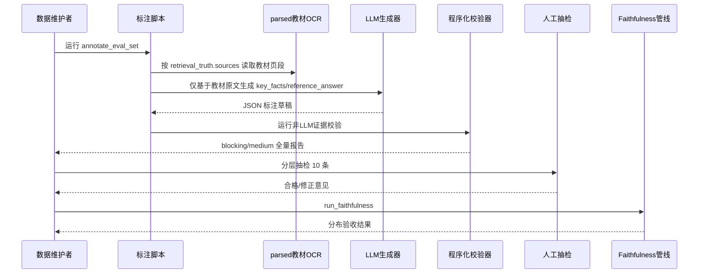
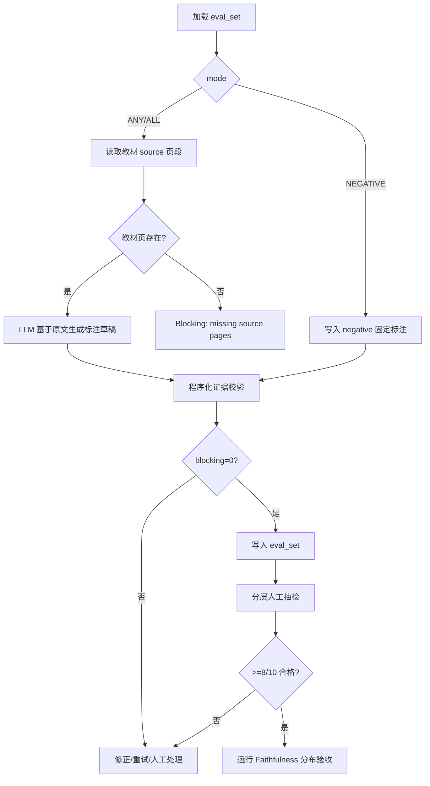
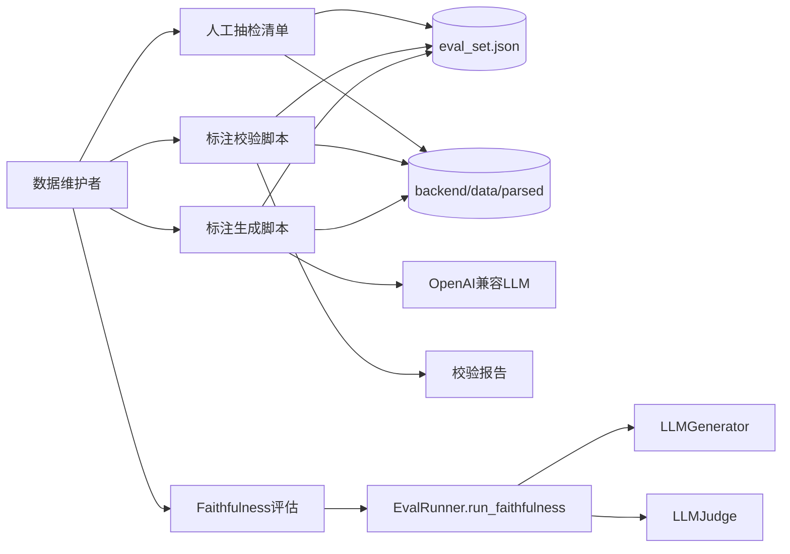
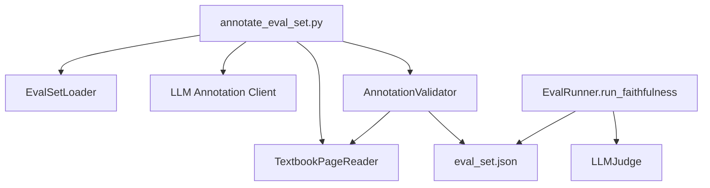
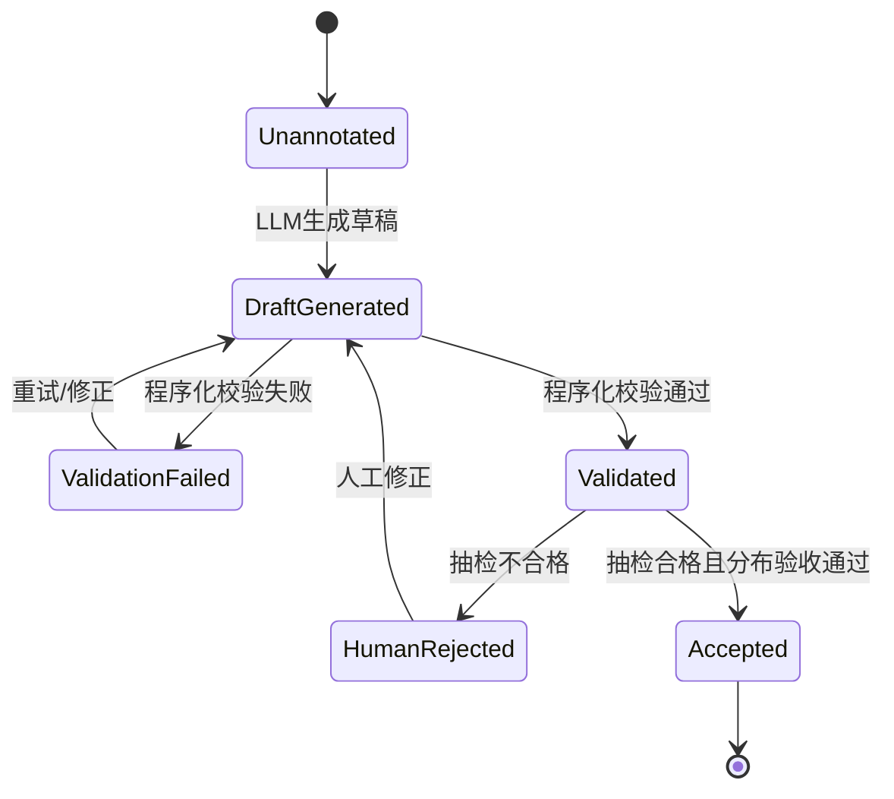
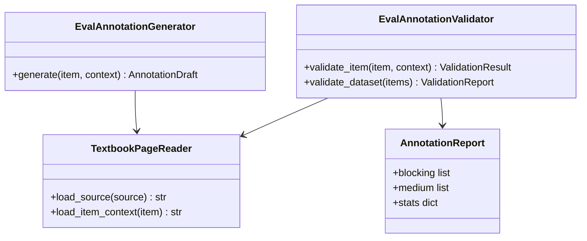

# R004 可信评估数据集标注 需求分析与方案设计

## 1. 分析边界

- 分析类型：new_requirement（修订 R004 评估数据集标注方案）
- 输入来源：用户指出的循环验证风险 + R004 已有评估代码 + 当前 200 条 eval_set + parsed 教材 OCR。
- 已读取代码：`eval_types.py`, `eval_set_loader.py`, `deterministic.py`, `llm_judge.py`, `eval_runner.py`, `infra/llm.py`。
- 已读取文档：R004 RAG 对话分析、R004 eval dataset annotation、R004 feature_list、architecture、project_spec、R004 brainstorm。
- 当前数据事实：`eval_set.json` 有 200 条；`key_facts/reference_answer/suite` 尚未写入；retrieval_truth 分布为 ANY=163、ALL=26、NEGATIVE=11；source 总数 217。
- 明确不分析：不重新设计 RAG 检索算法；不修改题目数量；不引入前端 UI；不要求答案最小页段作为本轮主标准。

## 2. 功能目标

- 用户：后端开发者 / 评估数据维护者。
- 目标：生成 200 条可用于 Faithfulness/Coverage 评估的最新数据集标注，并让标注数据本身可被非 LLM 证据校验，降低同源 LLM 循环验证导致的虚高风险。
- 成功标准：
  1. 200 条 `eval_set.json` 均有明确 `suite`；非 NEGATIVE 条目有 `key_facts` 和 `reference_answer`。
  2. 每个非 NEGATIVE `key_fact` 至少能回溯到对应教材 source 页段中的文本证据。
  3. `reference_answer` 只允许基于教材 source 页段生成，且通过关键词覆盖、长度、引用和证据密度校验。
  4. NEGATIVE 条目不伪造教材知识点，明确标记超纲/不应检索。
  5. 抽样人工复核 10 条，合格阈值 >= 8/10；不合格条目必须修正后再进入评估。
  6. 跑一次真实 Faithfulness 管线，分布不过度异常：不是全部接近 1.0，也不是大面积 0；Unknown 比例需可解释。
- 非目标：
  - 不用 LLM Judge 作为标注真值的唯一验收。
  - 不要求 `reference_answer` 与 ChatService 回答风格一致。
  - 不把页码范围宽窄本身作为阻断问题；主标准是教材章节和 source 内容真实匹配。

## 3. 用户故事

| ID | Role | Action | Benefit | Acceptance |
|----|------|--------|---------|------------|
| US-001 | 数据维护者 | 运行标注生成脚本 | 一次性为 200 条 eval_set 补齐 key_facts/reference_answer/suite | 输出 JSON 可加载，200 条字段完整 |
| US-002 | 数据维护者 | 运行程序化标注校验 | 在不依赖 LLM 的情况下发现虚构事实、缺关键词和异常答案 | 输出 blocking/medium 问题清单，blocking 为 0 |
| US-003 | 数据维护者 | 按 easy/medium/hard 分层抽检 10 条 | 快速校准 LLM 标注质量 | 10 条中至少 8 条人工判定合格 |
| US-004 | 后端开发者 | 运行 run_faithfulness | 验证真实评估分布是否合理 | 输出 Faithfulness/Coverage/Unknown 分布并给出异常判断 |
| US-005 | 后端开发者 | 修正不合格条目后重跑校验 | 保证数据集可持续迭代 | 修正后所有程序化检查通过 |

## 4. 用户交互链

| Step | User Action | System Response | Success State | Failure/Empty State |
|------|-------------|-----------------|---------------|---------------------|
| 1 | 运行标注生成命令 | 读取 eval_set 和教材 OCR | 找到 200 条数据和对应教材 source | 缺失教材页或 JSON 无法加载时报错 |
| 2 | 系统处理非 NEGATIVE 条目 | 基于 source 页段生成 key_facts/reference_answer | 每条有 3-7 个 key_facts 和参考答案 | LLM 失败则记录待重试，不写入不完整字段 |
| 3 | 系统处理 NEGATIVE 条目 | 写入 `suite=negative`、空 key_facts、超纲参考说明 | NEGATIVE 不污染教材事实 | NEGATIVE 误填教材事实则校验失败 |
| 4 | 运行程序化校验 | 文本搜索、关键词覆盖、长度、证据密度校验 | blocking=0，medium 可解释 | 输出全部问题，一次性修复 |
| 5 | 人工抽检 10 条 | 对照教材原文确认准确性 | 合格 >= 8/10 | 小于阈值则扩大抽检并修正 |
| 6 | 运行真实 Faithfulness | 生成回答并 LLM Judge | 分布合理，Unknown 可解释 | 全部过高/过低时回到标注和检索检查 |



## 5. 系统逻辑树

```text
可信标注生成
├─ 输入加载
│  ├─ 读取 backend/data/evaluation/eval_set.json
│  ├─ 校验 JSON/list/id/retrieval_truth 基础结构
│  └─ 按 source 读取 backend/data/parsed/{book}/page_{n}.md
├─ 标注生成
│  ├─ NEGATIVE：固定 suite=negative, key_facts=[], reference_answer=超纲说明
│  └─ 非 NEGATIVE：LLM 只基于教材 source 页段生成 JSON
├─ 程序化校验
│  ├─ key_facts 数量、长度、去重
│  ├─ key_facts 与教材页段关键词/证据片段匹配
│  ├─ reference_answer 长度、关键词覆盖、引用来源、禁用外部编造表述
│  ├─ suite 分配规则
│  └─ 输出 blocking/medium 全量问题
├─ 人工抽检
│  ├─ easy 3 + medium 4 + hard 3
│  ├─ 对照教材原文审查准确完整性
│  └─ 合格阈值 >= 8/10
└─ 运行验证
   ├─ run_faithfulness
   ├─ 观察 Faithfulness/Coverage/Unknown 分布
   └─ 异常分布回退到标注/检索/Prompt 诊断
```



## 6. 功能网络



### 依赖的已有模块

| Module | Dependency Type | Reason | Evidence |
|--------|-----------------|--------|----------|
| `EvalItem` / `EvalSource` | 数据模型 | 已支持 key_facts/reference_answer/suite 字段 | `eval_types.py` |
| `EvalSetLoader` | 加载 | 当前可加载旧/新字段，但校验不覆盖标注质量 | `eval_set_loader.py` |
| `LLMGenerator` | 模式参考 | 复用 OpenAI 兼容调用配置和 prompt 组织经验 | `infra/llm.py` |
| `LLMJudge` | 运行评估 | Faithfulness/Coverage 评估最终仍走该模块 | `graders/llm_judge.py` |
| `DeterministicGrader` | 概念参考 | 当前检查回答引用，不覆盖标注数据可信度 | `graders/deterministic.py` |
| `backend/data/parsed` | 权威数据源 | key_facts/reference_answer 必须从这里取证 | parsed markdown |

### 影响的已有模块

| Module | Impact | Required Change | Risk |
|--------|--------|-----------------|------|
| `backend/data/evaluation/eval_set.json` | 数据变更 | 补齐 200 条 key_facts/reference_answer/suite | 中：错误标注会污染 Faithfulness |
| `backend/scripts/annotate_eval_set.py` | 新增 | 生成标注草稿，支持幂等与重试 | 中：依赖 LLM 输出 JSON 稳定性 |
| `backend/scripts/validate_eval_annotations.py` | 新增 | 非 LLM 校验 key_facts/reference_answer/suite | 低：纯本地文本校验 |
| `backend/tests/` | 新增测试 | 覆盖标注校验规则和数据完整性 | 低 |
| `EvalSetLoader.validate` | 可选增强 | 可增加 annotation 校验入口，但不强制混入基础 loader | 低 |

### 模块依赖关系图



## 7. 能力模型

| Capability ID | Name | Source Analysis | Source Decisions | Journey Type | Risk Tags | Must Plan | Required Evidence |
|---------------|------|-----------------|------------------|--------------|-----------|-----------|-------------------|
| CAP-annotation-001 | 200 条标注生成 | 2026-05-21--R004-eval-dataset-trustworthy-annotation | DEC-annotation-001 | data_generation | quality,llm | yes | command, input_eval_set, output_eval_set, generated_count, failure_count, retry_log |
| CAP-annotation-002 | 教材证据校验 | 2026-05-21--R004-eval-dataset-trustworthy-annotation | DEC-annotation-002 | validation | quality | yes | command, source_pages_checked, key_fact_match_rate, keyword_coverage, blocking_report |
| CAP-annotation-003 | NEGATIVE 确定性处理 | 2026-05-21--R004-eval-dataset-trustworthy-annotation | DEC-annotation-003 | data_rule | quality | yes | negative_count, empty_key_facts, negative_suite_count, no_textbook_fact_check |
| CAP-annotation-004 | 分层人工抽检出口 | 2026-05-21--R004-eval-dataset-trustworthy-annotation | DEC-annotation-004 | review | quality | yes | sampled_ids, difficulty_distribution, pass_count, correction_log |
| CAP-annotation-005 | Faithfulness 分布验收 | 2026-05-21--R004-eval-dataset-trustworthy-annotation | DEC-annotation-005 | eval | quality,third_party | yes | run_command, faithfulness_distribution, coverage_distribution, unknown_ratio, anomaly_decision |

## 8. 方案设计

### 方案目标

- 设计目标：在保留 LLM 辅助生成效率的同时，用教材 OCR 原文和确定性规则约束标注质量。
- 不解决的问题：不消除 LLM Judge 的全部主观性；不做答案最小页段重标；不改变 RAG 检索策略。
- 成功判定：数据集字段完整、程序化校验通过、人工抽检达标、真实评估分布不过度异常。

### 方案选择

| Option | Summary | Pros | Cons | Decision |
|--------|---------|------|------|----------|
| A | 直接 LLM 生成 200 条并写入 | 快 | 循环验证风险高，错误难发现 | rejected |
| B | LLM 生成 + 程序化校验 + 10 条人工抽检 + 分布验收 | 成本可控，能发现虚构和异常分布 | 需要新增脚本和校验规则 | selected |
| C | 全人工标注 200 条 | 质量最高 | 时间成本过高，不适合当前迭代 | rejected |

### 后端方案

- 模块与边界：
  - 新增 `backend/scripts/annotate_eval_set.py`：只负责读取数据、调用 LLM、写入草稿和统计。
  - 新增 `backend/scripts/validate_eval_annotations.py`：只负责本地 deterministic 校验，不调用 LLM。
  - 可新增 `backend/app/evaluation/annotation_validator.py` 承载可测试规则，脚本只做 CLI 编排。
- 数据模型变更：
  - 不改 `EvalItem` 字段，复用已有 `key_facts/reference_answer/suite`。
  - 建议每条非 NEGATIVE 写入 3-7 个 `key_facts`，`reference_answer` 控制在 120-600 中文字。
  - NEGATIVE：`key_facts=[]`, `suite="negative"`, `reference_answer` 为超纲拒识说明。
- API 设计要点：
  - 无 HTTP API；本需求是离线数据和评估工具。
- 配置与第三方集成：
  - LLM 生成复用 `NEWAPI_API_KEY/NEWAPI_BASE_URL/LLM_MODEL`。
  - 校验脚本不需要任何外部服务。
- 状态与错误处理：
  - LLM JSON 解析失败：重试一次；仍失败记录 blocking，不写坏数据。
  - 教材页缺失：blocking。
  - key_fact 找不到证据：blocking 或 medium，按缺失比例判断。
  - reference_answer 不包含任何 required_keywords：blocking。
- 测试策略：
  - 单元测试覆盖 annotation validator：字段完整、关键词命中、NEGATIVE 规则、长度边界、缺页。
  - 数据测试覆盖真实 `eval_set.json`：200 条完整、关键词证据校验、suite 分布。

### 客户端方案

- 无客户端改动。
- UI/UX、状态管理、前端配置均不涉及。

### 模块与边界总览

| Module | Responsibility | Change Type | Boundary / Invariant |
|--------|----------------|-------------|----------------------|
| `annotate_eval_set.py` | 生成标注草稿 | add | 可以调用 LLM；不得作为唯一验收 |
| `validate_eval_annotations.py` | 本地校验标注质量 | add | 不调用 LLM；必须输出全部问题 |
| `annotation_validator.py` | 可测试校验规则 | add optional | 纯函数/本地文件读取 |
| `eval_set.json` | 存储 200 条最终标注 | modify in implementation | 不改变 id/question/retrieval_truth |
| `tests/test_eval_annotation_validator.py` | 校验规则测试 | add | mock 小样本 + 真实数据轻量检查 |

### 数据 / API / 配置 / 第三方集成

| Area | Design | Existing Contract | New Contract Needed | Risk |
|------|--------|-------------------|---------------------|------|
| Data | 为 200 条补齐 `key_facts/reference_answer/suite` | EvalItem 已兼容 | 数据内容必须可证据校验 | 中 |
| Parsed OCR | 作为唯一教材证据源 | `backend/data/parsed/{book}/page_n.md` | 缺页时报 blocking | 低 |
| LLM | 只生成草稿 | OpenAI 兼容协议已有 | prompt 必须要求 JSON 和只基于原文 | 中 |
| Validation | 本地 deterministic | 当前 loader 不覆盖 | 新增 annotation validator | 低 |
| Human Review | 10 条分层抽样 | 无 | 输出抽检清单/记录 | 低 |

### 状态与错误处理



| Scenario | State Change | Error Handling | User Feedback |
|----------|--------------|----------------|---------------|
| LLM 输出非 JSON | Unannotated -> ValidationFailed | 重试一次，仍失败列入 blocking | 报 item id 和原始响应摘要 |
| key_fact 无教材证据 | DraftGenerated -> ValidationFailed | 要求重生或人工修正 | 输出 fact、source 页段 |
| reference_answer 过短/过长 | DraftGenerated -> ValidationFailed | 调整 prompt 重试 | 输出长度与阈值 |
| 人工抽检不达标 | Validated -> HumanRejected | 扩大抽检并修正 | 输出 failed ids 和原因 |
| Faithfulness 全部过高 | Validated -> HumanRejected | 检查答案是否过度贴合生成风格或 judge 同源偏差 | 输出分布异常说明 |

### 核心类图



### 测试与发布策略

- 单元测试：
  - `EvalAnnotationValidator`：key_facts 证据命中、required_keywords 覆盖、reference_answer 长度、NEGATIVE 规则、suite 规则。
  - `TextbookPageReader`：多 source 拼接、缺页报错。
- 集成测试：
  - 对真实 `backend/data/evaluation/eval_set.json` 运行只读校验。
  - 标注生成脚本的 LLM 调用可用 mock 覆盖；真实 LLM 作为手动运行验收。
- 本地 Docker / docker compose：不要求。
- 真实第三方 / 网络依赖：
  - 生成标注需要 OpenAI 兼容 LLM。
  - 校验和人工抽检不需要网络。
- 回滚或降级：
  - 写入前备份 `eval_set.json`。
  - 支持 `--dry-run` 输出报告，不写文件。

## 9. Decision Items

| ID | Summary | Type | Must Plan | Source | Blast Radius |
|----|---------|------|-----------|--------|--------------|
| DEC-annotation-001 | LLM 只能生成标注草稿，不能作为标注可信度唯一来源 | boundary | yes | solution_design | annotate script, validation workflow |
| DEC-annotation-002 | key_facts 必须能在 retrieval_truth source 页段中找到文本证据 | business_rule | yes | system_logic_tree | annotation validator, eval_set data |
| DEC-annotation-003 | reference_answer 必须通过关键词覆盖、长度和教材来源约束 | business_rule | yes | system_logic_tree | annotation validator, eval_set data |
| DEC-annotation-004 | NEGATIVE 条目使用确定性规则，不生成教材 key_facts | business_rule | yes | solution_design | eval_set data, validation rules |
| DEC-annotation-005 | 数据集发布前必须有 10 条分层人工抽检记录 | test_strategy | yes | interaction_chain | review checklist, evidence |
| DEC-annotation-006 | Faithfulness 分布验收用于发现异常，不作为标注真值校验的唯一依据 | test_strategy | yes | risk_analysis | eval runner, report interpretation |
| DEC-annotation-007 | 不以答案最小页段作为本轮阻断标准，主标准是章节/source 内容真实匹配 | scope_boundary | yes | user_requirement | eval_set interpretation, validator severity |

## 10. 风险与缺口

| ID | Gap/Risk | Evidence | Impact | Suggested Handling |
|----|----------|----------|--------|--------------------|
| RISK-001 | LLM 生成 reference_answer 与 ChatService 回答风格同源，Faithfulness 虚高 | 用户指出三段均使用 LLM | 评估失真 | 引入非 LLM 程序化校验和人工抽检 |
| RISK-002 | 当前 `eval_set.json` 尚无 key_facts/reference_answer/suite | 统计显示三字段覆盖 0/200 | run_faithfulness coverage 失真 | 新增标注生成任务 |
| RISK-003 | 当前 DeterministicGrader 检查的是回答 sources，不检查标注数据 | `deterministic.py` 只检查 answer/sources/context | 无法发现 reference_answer 编造 | 新增 annotation validator |
| RISK-004 | OCR 文本格式包含 LaTeX、空格和断行，简单字符串匹配可能误报 | parsed 教材中公式大量 LaTeX 表达 | 校验过严会误判 | 做归一化匹配，并允许 required_keywords 辅助 |
| RISK-005 | 10 条人工抽检样本太少 | 200 条全量数据 | 仍可能漏错 | 低于 8/10 时扩大抽检；后续可按失败类型定向抽样 |
| RISK-006 | LLM 生成脚本可能覆盖人工修正 | 数据文件是单一 JSON | 人工劳动丢失 | 支持幂等跳过、备份、dry-run、只重生指定 ids |

## 11. 集成测试要求

- 是否需要真实集成测试：需要，但分两层。
- 推荐运行方式：
  - 本地确定性校验：`python backend/scripts/validate_eval_annotations.py --file backend/data/evaluation/eval_set.json`
  - 标注生成 dry-run：`python backend/scripts/annotate_eval_set.py --dry-run`
  - 真实生成：`python backend/scripts/annotate_eval_set.py --write --backup`
  - 真实评估：现有 R004 eval 入口运行 `run_faithfulness`。
- Docker / docker compose 支持：非必须。
- mock 允许范围：
  - 单元测试允许 mock LLM。
  - 最终生成 200 条数据不能用 mock。
- 必须验证的链路：
  1. 200 条数据字段完整。
  2. 非 NEGATIVE key_facts 均有教材 source 证据或可解释的归一化命中。
  3. reference_answer 覆盖 required_keywords 中的核心关键词。
  4. NEGATIVE 条目不含教材 key_facts。
  5. 人工抽检 10 条合格 >= 8。
  6. Faithfulness/Coverage/Unknown 分布没有明显异常。
