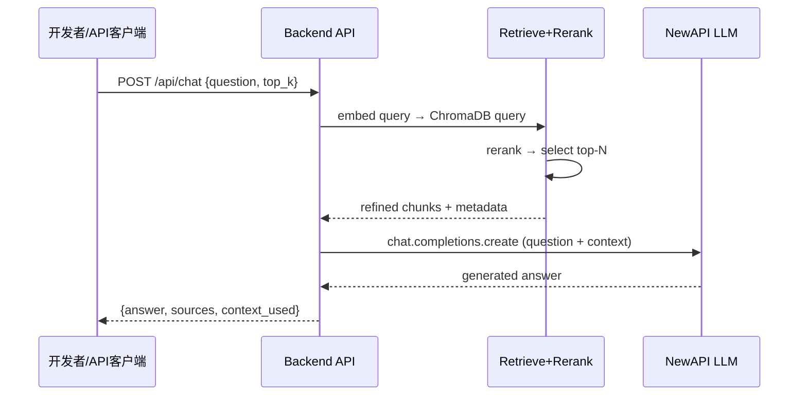
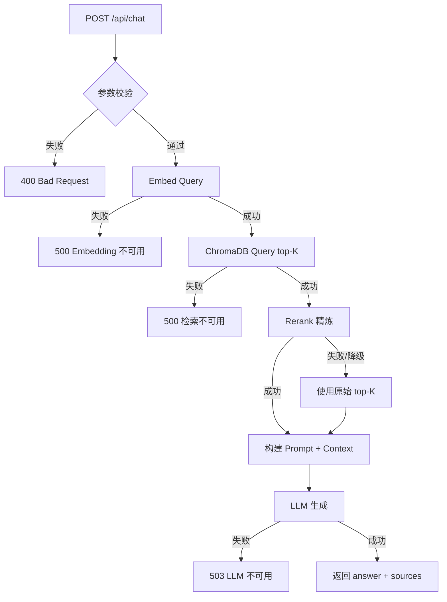
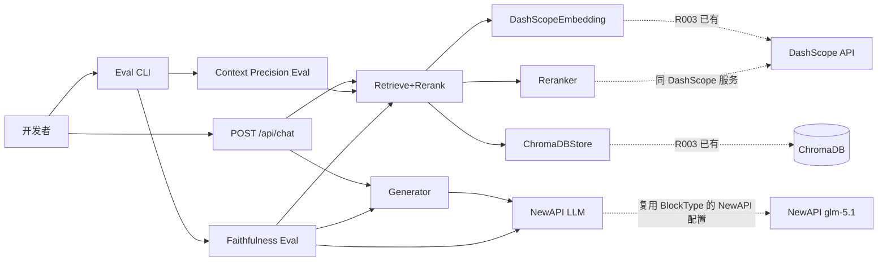
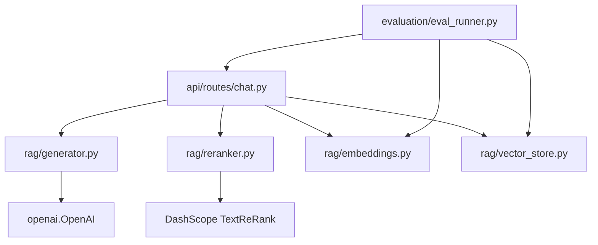
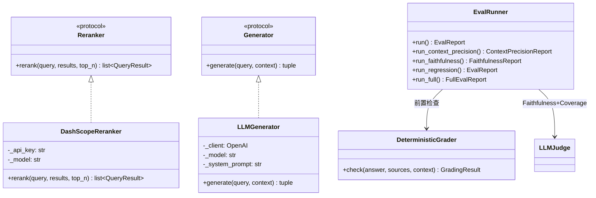

# R004 检索优化 + AI 对话 需求分析与方案设计

## 1. 分析边界

- 分析类型：new_requirement（新需求功能分析）
- 输入来源：brainstorm 结论 + R003 现有代码 + R003 评估基线 + architecture.md
- 已读取代码：retrieve.py, vector_store.py, models.py, embeddings.py, block_type_classifier.py, config.py, main.py, eval_runner.py, eval_types.py, eval_set_loader.py
- 已读取文档：architecture.md, project_spec.md, brainstorm 结论, R003 分析文档
- 未读取/缺失上下文：无（已充分覆盖）
- 明确不分析：
  - 前端 Chat UI（R005）
  - SSE 流式输出（跟 UI 一起做）
  - 完整 BM25/Hybrid 检索重构（如 Reranker 够用不做）
  - 多轮对话状态管理（R005 跟 UI 一起做）
  - 用户认证打通（R005+）

## 2. 功能目标

- 用户：开发者（R004 阶段，通过 API 调试工具使用）
- 目标：**检索结果精炼 + LLM 对话生成 + 生成质量评估**
- 成功标准：
  1. Context Precision 评估指标落地，量化当前检索噪声比
  2. 检索→精炼→LLM 生成管线端到端可用（POST /api/chat）
  3. 回答附带教材引用来源（书名 + 章节 + 页码）
  4. Faithfulness 评估指标落地，可量化回答忠实度
  5. 不降低现有检索基线（Span Hit@5 ≥ 97%）
- 非目标：
  - 前端 UI（R005）
  - 流式输出（R005）
  - 多轮对话上下文（R005）
  - 用户认证（R005+）

## 3. 用户故事

| ID | Role | Action | Benefit | Acceptance |
|----|------|--------|---------|------------|
| US-001 | 开发者 | 调用 POST /api/chat 发送数学问题 | 获得 AI 生成的助教式回答 | 回答基于教材内容，附带引用来源 |
| US-002 | 开发者 | 运行 Context Precision 评估 | 了解检索结果中噪声占比 | 输出 Precision@K 数值 |
| US-003 | 开发者 | 运行 Faithfulness 评估 | 了解 LLM 回答是否忠实于教材 | 输出 Faithfulness 分数 |
| US-004 | 开发者 | 调用 POST /api/chat 并传入 top_k 参数 | 控制检索上下文大小 | 回答质量随 top_k 合理变化 |

## 4. 用户交互链

### 链路 1：对话 API 调用

| Step | User Action | System Response | Success State | Failure/Empty State |
|------|-------------|-----------------|---------------|---------------------|
| 1 | POST /api/chat {question, top_k} | 接收请求 | 参数校验通过 | 400 参数不合法 |
| 2 | — | 检索 top-K chunks | 返回相关教材段落 | ChromaDB 异常 → 500 |
| 3 | — | Rerank 精炼 | 保留最相关 N 条 | Rerank 失败 → 退回原始 top-K |
| 4 | — | LLM 生成回答 | 返回助教式回答 + 引用 | LLM 调用失败 → 503 |
| 5 | — | 返回 JSON 响应 | answer + sources + context_used | — |



### 链路 2：Context Precision 评估

| Step | User Action | System Response | Success State | Failure/Empty State |
|------|-------------|-----------------|---------------|---------------------|
| 1 | 运行 eval --mode context_precision | 加载 eval_set | 200 条加载成功 | 文件不存在 → 错误提示 |
| 2 | — | 逐条检索 + 计算 Precision@K | 输出每条和汇总指标 | — |

### 链路 3：Faithfulness 评估

| Step | User Action | System Response | Success State | Failure/Empty State |
|------|-------------|-----------------|---------------|---------------------|
| 1 | 运行 eval --mode faithfulness | 加载 eval_set | 加载成功 | — |
| 2 | — | 逐条生成回答 | LLM 回答成功 | LLM 调用失败 → 跳过 |
| 3 | — | LLM-as-judge 评判忠实度 | 输出 Faithfulness 分数 | — |

## 5. 系统逻辑树

```text
POST /api/chat
├─ 请求校验
│  ├─ question 非空
│  └─ top_k 范围 [1, 20]
├─ 检索阶段
│  ├─ embed_query(query) → DashScope Embedding
│  ├─ store.query(embedding, top_k) → ChromaDB
│  └─ reranker.rerank(query, results) → 精炼结果
├─ 生成阶段
│  ├─ 构建 system prompt（数学助教人设 + 教材引用规则）
│  ├─ 拼接 context（精炼后的 chunks 文本 + 元数据）
│  ├─ chat.completions.create → NewAPI LLM (glm-5.1)
│  └─ 解析回答 + 提取引用
└─ 返回响应
   ├─ answer: str（LLM 生成的回答）
   ├─ sources: list[{chunk_id, book, section, page}]
   └─ context_used: int（实际使用的 chunk 数）
```



## 6. 功能网络



### 依赖的已有模块

| Module | Dependency Type | Reason | Evidence |
|--------|-----------------|--------|----------|
| DashScopeEmbedding | 调用 | 查询向量化 | `retrieve.py:85` embed_query |
| ChromaDBStore | 调用 | 向量检索 | `retrieve.py:91` store.query |
| config.Settings | 配置 | NewAPI 配置复用 | `config.py:22-27` newapi_* 字段 |
| block_type_classifier | 模式参考 | OpenAI 客户端创建模式 | `block_type_classifier.py:38` OpenAI(api_key, base_url) |
| eval_runner | 扩展 | 新增 Context Precision 指标 | `eval_runner.py` EvalRunner |
| eval_set_loader | 调用 | 评估集加载 | `eval_set_loader.py` |
| models.QueryResult | 数据 | 检索结果结构 | `models.py:104` QueryResult |
| models.ChunkMetadata | 数据 | 元数据结构（引用来源） | `models.py:34` ChunkMetadata |

### 影响的已有模块

| Module | Impact | Required Change | Risk |
|--------|--------|-----------------|------|
| main.py | 新增路由注册 | include chat_router | 低 |
| config.py | 新增配置字段 | rerank_top_n, rerank_model, chat 相关配置 | 低 |
| eval_runner.py | 扩展评估模式 | 新增 context_precision 计算 | 低，不改现有逻辑 |
| architecture.md | 架构更新 | 新增模块、更新拓扑 | 无代码风险 |

### 模块依赖关系图



## 7. 能力模型

| Capability ID | Name | Source Analysis | Source Decisions | Journey Type | Risk Tags | Must Plan | Required Evidence |
|---------------|------|-----------------|------------------|--------------|-----------|-----------|-------------------|
| CAP-dialogue-001 | Context Precision 评估 | 本文档 §4 链路2 | DEC-rag-002 | evaluation | quality | yes | entry_action, actual_authorize_or_endpoint, callback_or_completion, state_or_identity_check |
| CAP-dialogue-002 | Reranker 精炼 | 本文档 §5 | DEC-rag-001 | backend_service | dependency | yes | entry_action, actual_authorize_or_endpoint, callback_or_completion, failure_path_result |
| CAP-dialogue-003 | LLM 对话生成 | 本文档 §4 链路1 | DEC-rag-003 | backend_service | dependency,quality | yes | entry_action, actual_authorize_or_endpoint, callback_or_completion, failure_path_result |
| CAP-dialogue-004 | Faithfulness 评估 | 本文档 §4 链路3 | DEC-rag-004 | evaluation | quality,dependency | yes | entry_action, actual_authorize_or_endpoint, callback_or_completion |
| CAP-dialogue-005 | Coverage 覆盖度检查 | 本文档 §8 评估最佳实践 | DEC-rag-008 | evaluation | quality | yes | entry_action, actual_authorize_or_endpoint, callback_or_completion |
| CAP-dialogue-006 | 确定性评分器兜底 | 本文档 §8 评估最佳实践 | DEC-rag-009 | evaluation | quality | yes | entry_action, actual_authorize_or_endpoint |
| CAP-dialogue-007 | 回归套件正式化 | 本文档 §8 回归套件 | DEC-rag-010 | evaluation | regression | yes | entry_action, actual_authorize_or_endpoint |

## 8. 方案设计

### 方案目标

- 设计目标：在现有检索管线和评估体系之上，新增 Reranker 精炼层 + LLM 对话生成层 + 生成质量评估
- 不解决的问题：流式输出、多轮对话、前端 UI
- 成功判定：POST /api/chat 端到端可用，回答附带引用，Faithfulness 可量化

### 方案选择

#### 已确认：Reranker 选型调研

**选择结论：DashScope gte-rerank**

**调研过程记录：**

1. **Cross-Encoder 原理**：Reranker 使用 Cross-Encoder 架构，将 query + document 作为联合输入，输出 relevance_score（0-1）。比 Bi-Encoder（Embedding）更准确，因为同时看到两段文本能捕捉更深层的语义关联，但无法预计算，每次需实时推理。

2. **分数解读**：relevance_score 绝对值不可跨模型/跨厂商对比，关键看相对排序和相关/无关结果的信噪比（信号 gap）。

3. **厂商对比：**

| Provider | Model | 架构 | 特点 | 上下文 | 适用场景 |
|----------|-------|------|------|--------|----------|
| DashScope | gte-rerank | Pointwise | gte 系列，中文训练优化，实测延迟 ~230ms | 8K | 中文主场，信噪比适中（噪声 ~0.22） |
| DashScope | gte-rerank-v2 | Pointwise | v2 信噪比更锐利（噪声 ~0.06） | 8K | 需要更严格过滤时切换 |
| Jina AI | jina-reranker-v2 | Listwise | 全文档一次打分，SOTA 水平 | 131K | 超长文档场景 |
| Cohere | rerank-v3.5 | Pointwise | 英文优化，多语言支持 | 4K | 英文为主 |
| BGE | bge-reranker | — | 开源，需自建 GPU 推理 | — | 有 GPU 资源时 |

4. **选择理由**：
   - gte 系列针对中文场景训练，高中数学教材是主场
   - v1/v2 可按信噪比需求灵活切换（v1 适中，v2 更锐利）
   - 实测 ~230ms 延迟，满足实时对话要求
   - 中文数学内容实测排序正确

5. **API 调用方式**（已验证）：
   ```python
   from dashscope import TextReRank
   resp = TextReRank.call(
       model="gte-rerank",  # 或 "gte-rerank-v2"
       query="数学问题",
       documents=["文档1", "文档2", ...],
       return_documents=True,
       top_n=3,
   )
   # resp.output.results → [{index, relevance_score, document}, ...]
   ```

#### 已确认：LLM 选型方法论

**当前选择：glm-5.1（通过 NewAPI 本地代理调用）**

**选择依据：项目已有 glm-5.1 的 token 额度**

**选型方法论（适用于未来模型切换评估）：**

RAG 对话生成场景的 LLM 选型，按以下维度评估：

| 维度 | 评估方法 | 权重说明 |
|------|----------|----------|
| 中文数学能力 | 用 eval_set 子集（10-20 条）端到端测试，人工评分回答质量 | 高 — 核心场景决定性因素 |
| 指令遵循度 | 测试是否遵守 System Prompt 规则（引用来源、不编造、引导式回答） | 高 — 直接影响 Faithfulness |
| 上下文窗口 | 检索 chunks + prompt 是否能完整输入 | 中 — 本项目 context ~3000 token，主流模型都够 |
| 延迟 | 端到端测量 retrieve→rerank→generate 总耗时 | 中 — 非流式场景容忍度较高 |
| 成本 | 每 1000 token 单价 × 预估调用量 | 中 — 项目阶段调用量低，成本不敏感 |
| 可用性 | API 稳定性、是否有本地代理、是否需要翻墙 | 高 — 直接影响开发效率和部署复杂度 |

**评估流程：**

```text
1. 候选模型筛选
   ├─ 从已有 token 额度的模型中优先选（降低接入成本）
   ├─ 支持中文 + 数学推理能力
   └─ 通过 NewAPI 可代理（本地统一入口）

2. 小规模端到端测试（10-20 条 eval_set）
   ├─ 用相同 Prompt + 相同检索结果
   ├─ 对比不同模型的回答质量
   └─ 关注：是否忠实于 context、是否正确引用来源、是否编造内容

3. 指令遵循度测试
   ├─ 故意给不完整的 context，测试模型是否说"内容不足以回答"
   ├─ 测试引用格式是否遵守
   └─ 测试引导式回答（不直接给答案）

4. 综合评分 → 选择
   └─ 如果多模型差距不大，优先选成本最低 / 延迟最低的
```

**当前决策记录：**

| 项目 | 内容 |
|------|------|
| 选择模型 | glm-5.1 |
| 调用方式 | NewAPI 本地代理（http://localhost:13000/v1），OpenAI 兼容接口 |
| 选择理由 | 项目已有 token 额度，中文数学能力满足需求，BlockType 分类已验证稳定性 |
| 待验证 | 长文本生成质量（BlockType 是短文本分类，对话场景是长文本生成，需额外验证） |
| 切换条件 | 如果 Faithfulness 评估 < 0.7 或回答质量人工评分 < 3/5，需按上述方法论重新评估其他模型 |

#### 已确认：RAG 评估指标方法论

**框架选择：RAGAS（Retrieval Augmented Generation Assessment）**
- 业界标准 RAG 评估框架，GitHub 14k+ stars，当前 v0.4.3
- 核心设计：LLM-as-Judge，用 LLM 完成指标计算中的子任务（拆解 claim、判断相关性、验证忠实度等）

**指标优先级：**

| 优先级 | 指标 | 评估什么 | 原理 | 本项目价值 |
|--------|------|----------|------|-----------|
| P0 | Context Precision | 检索结果中相关 chunk 是否排在前面 | 让 LLM 判断每个 retrieved chunk 是否与问题相关，按位置加权算 precision@k | R003 只有 Hit@5，没看排序质量；直接衡量 Reranker 效果 |
| P0 | Faithfulness | LLM 回答是否忠实于教材（不编造） | 把 response 拆成 claim，逐一验证是否被 context 支持，算 supported/total | R004 核心指标：回答有没有"幻觉" |
| P1 | Context Recall | 教材知识点是否被检索覆盖 | 拆 reference 的 claim，逐一判断是否在 context 中 | R003 的 Span Hit 是简化版 |
| P1 | Response Relevancy | 回答是否切题 | 从 response 反推 question，算与原问题的语义相似度 | 防止答非所问 |
| 暂缓 | Noise Sensitivity | 管线对噪声的敏感度 | 在有噪声 context 下测量错误信息对回答的影响 | 偏研究场景 |

**Judge 模型选择：**

| 项目 | 内容 |
|------|------|
| 选择模型 | glm-5.1（与生成模型同一） |
| 业界标准做法 | 使用比生成模型更强的模型作为 judge（如用 GPT-4 评估 glm-5.1 的输出），避免自评偏差 |
| 本项目选择理由 | 基于成本考虑，使用同一模型（glm-5.1）作为 judge |
| 已知风险 | 同一模型自评存在偏差倾向（模型倾向于给自己的回答打高分） |
| 缓解措施 | 抽样人工复核，建立 judge 可信度基线；若 Faithfulness 评估结果与人工复核偏差过大，需重新评估 judge 模型选择 |
| 切换条件 | 如果评估结果可信度不足（人工复核偏差 > 20%），应引入更强模型做 judge |

**评估数据需求：**

RAGAS 指标需要三类输入数据：

| 数据 | 来源 | 工作量 |
|------|------|--------|
| question（学生问题） | 人工构造 | 中 |
| retrieved_contexts（检索结果） | 系统自动产生 | 无 |
| reference（标准参考答案） | 人工标注 | 高 — 最大工作量 |
| response（LLM 生成回答） | 系统自动产生 | 无 |

R003 已有的 eval_set（含 EvalSource、required_keywords、RetrievalTruth）可作为基础，但需补充完整的参考答案文本。

**评估执行方式：离线脚本**
- 不做实时评估 API
- 评估作为独立 CLI 命令运行，输出报告
- 每次评估有 LLM 调用成本（如 Faithfulness 一个样本 = 1 次拆 claim + N 次验证），离线跑成本可控

**评估最佳实践（参考 Anthropic "Demystifying Evals for AI Agents"）：**

参考来源：https://www.anthropic.com/engineering/demystifying-evals-for-ai-agents

1. **确定性评分器兜底**（R004 采纳）

   在调用 LLM-as-Judge 之前，先用代码检查基本条件，0 成本、完全确定性：

   | 检查项 | 实现方式 | 通过条件 |
   |--------|---------|---------|
   | answer 非空 | `len(answer.strip()) > 0` | 回答不为空 |
   | sources 非空 | `len(sources) > 0` | 至少有一个引用来源 |
   | 引用页码在 context 范围内 | 遍历 sources，检查 page 是否在 retrieved chunks 的 page 范围内 | 引用的页码确实来自检索结果 |
   | 无重复引用 | 去重检查 | 无重复 chunk_id |

   这些作为 Faithfulness 评估的前置门禁，不通过则直接标记失败，不浪费 LLM 调用。

2. **覆盖度检查（Coverage）**（R004 采纳）

   - 在 eval_set 中为每条数据增加 `key_facts` 字段（关键知识点列表）
   - LLM judge 在评估 Faithfulness 的同时，检查回答是否覆盖了所有 key_facts
   - 与 Faithfulness 合并评估，不额外增加 LLM 调用次数
   - 输出 Coverage 分数 = covered_key_facts / total_key_facts

3. **LLM Judge "Unknown" 选项**（R004 采纳）

   - LLM judge 的 prompt 中明确加入："如果无法从 context 中判断某个 claim 是否被支持，返回 Unknown"
   - 目的：减少 LLM 硬判（强行判定 Yes/No）带来的噪声
   - Unknown 的 claim 不计入 Faithfulness 分数的分子分母，而是单独统计比例
   - 如果 Unknown 比例 > 30%，说明 eval_set 的 context 质量有问题，需要排查

**暂不采纳的实践（记录原因）：**

| 实践 | 原因 |
|------|------|
| pass@k 多次试验 | R004 调用量低，单次评估够用；接入真实用户后补 |
| 平衡问题集（该检索/不该检索场景） | 等对话功能上线后有真实用户反馈再构建 |
| 转录审查（Transcript inspection） | 离线评估已有日志输出，暂不额外建设审查工具 |
| 每个维度独立 LLM 评委 | 成本考虑，先用同一个 judge 评所有维度 |

#### 已确认：回归套件正式化

**目标：确保 R004 变更不降低 R003 检索基线**

R003 的 Span Hit@5 = 97.9% 已达回归级别（接近 100%）。R004 新增 Reranker 层，必须验证不破坏现有检索管线。

**具体做法：**

| 项目 | 设计 |
|------|------|
| eval_runner 新增 `--mode regression` | 只跑 R003 检索基线（Span Hit@5），使用现有 eval_set |
| eval_runner 新增 `--mode full` | 同时跑 regression（R003 基线）+ R004 新指标（Context Precision、Faithfulness、Coverage） |
| eval_set 标记 | 在 eval_types.py 中为 EvalItem 增加 `suite` 字段（`regression` / `capability`），标记用例归属 |
| 回归通过条件 | Span Hit@5 ≥ 97%（与 R003 基线一致） |
| 使用时机 | 每次修改 Reranker/检索逻辑后，跑 `--mode regression` 确认基线不掉 |

**与 Anthropic 评估理念的对齐：**
- R003 的检索评估 → **回归套件**（Regression）：通过率应接近 100%，确保不退化
- R004 的新指标 → **能力评估**（Capability）：初始通过率可能较低，给团队改进目标
- 当 R004 能力评估通过率稳定在高水平后，可"毕业"为回归套件

#### 方案选项（已全部决策）

| Option | Summary | Pros | Cons | Decision |
|--------|---------|------|------|----------|
| A: DashScope gte-rerank | 用 DashScope 专用 Reranker API（gte-rerank）重排 | gte 系列中文训练优化，~200ms 延迟低，v1/v2 可按信噪比切换 | 每次调用消耗 DashScope token | **selected** |
| B: 相似度阈值过滤 | 按 cosine score 阈值截断 | 零成本 | 不考虑语义相关性，可能误过滤 | rejected |
| C: LLM-as-Reranker | 用 glm-5.1 对 top-K 结果打分重排 | 复用现有 LLM 配置 | 延迟增加 ~1s，成本高 | rejected |

### 后端方案（v1）

#### 模块与边界

| Module | Responsibility | Change Type | Boundary / Invariant |
|--------|----------------|-------------|----------------------|
| rag/reranker.py | Reranker 协议 + DashScope 实现 | 新增 | 输入 QueryResult 列表，输出排序后子集；降级返回原始 |
| rag/generator.py | Generator 协议 + LLMGenerator 实现 | 新增 | 输入 query + context chunks，输出 answer + sources |
| api/routes/chat.py | POST /api/chat 路由 | 新增 | 组合 retrieve → rerank → generate 流程 |
| config.py | 新增配置字段 | 修改 | rerank_top_n, rerank_model, chat_max_context_tokens |
| main.py | 注册 chat_router + 初始化 Reranker/Generator 单例 | 修改 | lifespan 新增初始化，include_router |
| evaluation/eval_runner.py | 新增 Context Precision + Faithfulness + Coverage + 回归模式 | 扩展 | 新增方法，不改现有 run() 逻辑 |
| evaluation/eval_types.py | EvalItem 扩展 key_facts + suite 字段 | 修改 | 向后兼容（新增字段有默认值） |

#### 数据模型

**新增（定义在 api/routes/chat.py）：**

```python
class ChatRequest(BaseModel):
    question: str = Field(..., min_length=1, description="学生问题")
    top_k: int = Field(default=10, ge=1, le=20, description="检索数量")

class SourceReference(BaseModel):
    chunk_id: str
    book: str
    section: str
    page_start: int
    page_end: int

class ChatResponse(BaseModel):
    answer: str
    sources: list[SourceReference]
    context_used: int
```

**扩展（evaluation/eval_types.py）：**

```python
@dataclass
class EvalItem:
    id: str
    question: str
    retrieval_truth: RetrievalTruth
    # --- R004 新增，向后兼容 ---
    key_facts: list[str] = field(default_factory=list)  # Coverage 检查用
    reference_answer: str = ""                            # 标准参考答案
    suite: str = "regression"                             # "regression" | "capability"
```

#### API 设计

```
POST /api/chat
Request:  { question: str, top_k?: int = 10 }
Response: { answer: str, sources: [{chunk_id, book, section, page_start, page_end}], context_used: int }
```

- top_k 默认 10（检索多，rerank 后取 3-5 条喂 LLM）
- Rerank 失败时降级：直接取原始 top-K 的前 3 条
- LLM 调用失败返回 503 + 明确错误信息
- 与现有 POST /api/retrieve 无冲突，独立端点

#### 配置变更（config.py）

复用现有 `newapi_api_key`、`newapi_base_url`、`llm_model`、`dashscope_api_key`。新增：

```python
# R004: Reranker 配置
rerank_top_n: int = 3                          # Rerank 后保留条数
rerank_model: str = "gte-rerank"               # DashScope Reranker 模型，可切换 gte-rerank-v2
chat_max_context_tokens: int = 3000            # 给 LLM 的最大 context token 数
```

#### 依赖注入模式

遵循 R003 已有模式（单例挂载 app.state，路由通过 Depends 获取）：

```python
# main.py lifespan 新增
reranker = DashScopeReranker(
    api_key=settings.dashscope_api_key,
    model=settings.rerank_model,
)
application.state.reranker = reranker

generator = LLMGenerator(
    api_key=settings.newapi_api_key,
    base_url=settings.newapi_base_url,
    model=settings.llm_model,
)
application.state.generator = generator

# chat.py 依赖注入
def get_reranker() -> DashScopeReranker:
    from app.main import app
    return app.state.reranker

def get_generator() -> LLMGenerator:
    from app.main import app
    return app.state.generator
```

#### Reranker 模块设计（rag/reranker.py）

```python
class Reranker(Protocol):
    def rerank(self, query: str, results: list[QueryResult], top_n: int) -> list[QueryResult]: ...

class DashScopeReranker:
    def __init__(self, api_key: str, model: str = "gte-rerank"): ...
    def rerank(self, query: str, results: list[QueryResult], top_n: int) -> list[QueryResult]:
        """调用 DashScope TextReRank API 重排序
        失败时降级：返回原始 results 的前 top_n 条
        """
```

#### Generator 模块设计（rag/generator.py）

```python
class Generator(Protocol):
    def generate(self, query: str, context_chunks: list[QueryResult]) -> tuple[str, list[SourceReference]]: ...

class LLMGenerator:
    def __init__(self, api_key: str, base_url: str, model: str): ...
    def generate(self, query: str, context_chunks: list[QueryResult]) -> tuple[str, list[SourceReference]]:
        """构建 prompt + context → 调用 LLM → 返回 (answer, sources)
        """
```

- OpenAI client 创建方式复用 block_type_classifier.py 的模式：`OpenAI(api_key=..., base_url=...)`
- System prompt 内置在 LLMGenerator 中

#### Prompt 设计

System prompt（数学助教人设）：
```
你是章鱼哥，一个高中数学助教。基于给定的教材内容回答学生的问题。
规则：
1. 只使用提供的教材内容回答，不要编造内容
2. 引用回答依据时要标注出处（书名、章节、页码）
3. 如果提供的内容不足以回答问题，明确说明
4. 不要直接给出完整答案，引导学生理解解题思路
```

#### 评估模块扩展设计（evaluation/eval_runner.py）

在现有 EvalRunner 基础上扩展，**不改现有 run() 方法**：

```python
class EvalRunner:
    # 现有方法不变
    def run(self, eval_filename, top_k_values) -> EvalReport: ...

    # R004 新增
    def run_context_precision(self, eval_filename) -> ContextPrecisionReport: ...
    def run_faithfulness(self, eval_filename) -> FaithfulnessReport: ...
    def run_regression(self, eval_filename) -> EvalReport:
        """回归模式：只跑 R003 检索基线"""
    def run_full(self, eval_filename) -> FullEvalReport:
        """完整模式：regression + context_precision + faithfulness + coverage"""
```

**评估管线设计：**

```text
run_faithfulness()
├─ 1. 检索阶段：embed_query → vector_store.query → reranker.rerank
├─ 2. 生成阶段：generator.generate → 得到 answer + sources
├─ 3. 确定性评分器（0 成本前置检查）
│  ├─ answer 非空？
│  ├─ sources 非空？
│  ├─ 引用页码在 context 范围内？
│  └─ 无重复 chunk_id？
│  → 任一不通过 → 标记 FAIL，跳过 LLM judge
├─ 4. LLM-as-Judge（glm-5.1）
│  ├─ 拆 response 为 claims
│  ├─ 逐一判断每个 claim 是否被 context 支持（Yes/No/Unknown）
│  ├─ 计算 Faithfulness = supported / (supported + unsupported)
│  └─ 计算 Unknown 比例，>30% 时告警
├─ 5. Coverage 检查（与 Faithfulness 合并）
│  ├─ 检查 answer 是否覆盖 eval_item.key_facts
│  └─ 计算 Coverage = covered_facts / total_facts
└─ 输出 FaithfulnessReport
```

**LLM Judge Prompt 设计（Faithfulness + Coverage 合并）：**

```
你是评估助手。给定学生的回答和参考教材内容，完成以下两个任务：

任务一：忠实度评估
将学生的回答拆分为独立的事实声明，对每个声明判断：
- Yes：该声明可从教材内容中直接找到支持
- No：该声明与教材内容矛盾或无法从教材内容中找到依据
- Unknown：无法从提供的教材内容中判断

任务二：覆盖度检查
检查学生的回答是否覆盖了以下关键知识点：
{key_facts}
对每个知识点判断：covered / not_covered / partially_covered

输出 JSON 格式：
{
  "claims": [{"claim": "...", "verdict": "Yes|No|Unknown"}],
  "coverage": [{"fact": "...", "status": "covered|not_covered|partially_covered"}]
}
```

#### 状态与错误处理

| Scenario | State Change | Error Handling | User Feedback |
|----------|--------------|----------------|---------------|
| Embedding 失败 | 请求中断 | 500 + 日志 | "Embedding 服务暂时不可用" |
| ChromaDB 失败 | 请求中断 | 500 + 日志 | "检索服务暂时不可用" |
| Rerank 失败 | 降级 | 日志 warning，用原始 top-K | 无感知 |
| LLM 超时 | 请求中断 | 503 + 日志 | "AI 服务暂时不可用" |
| LLM 返回空 | 请求中断 | 503 + 日志 | "AI 生成失败" |

#### 核心类图



#### 数据 / API / 配置 / 第三方集成

| Area | Design | Existing Contract | New Contract Needed | Risk |
|------|--------|-------------------|---------------------|------|
| Reranker | DashScopeReranker，DashScope TextReRank API | 无 | Reranker Protocol | 低 |
| Generator | LLMGenerator，复用 OpenAI client | 无 | Generator Protocol | 低 |
| Chat API | POST /api/chat | POST /api/retrieve 不变 | 新增 chat 端点 | 无冲突 |
| Config | 新增 3 个字段 | 现有字段不变 | 向后兼容 | 无 |
| LLM 调用 | NewAPI glm-5.1 | BlockType 已验证 | 同一 client 配置 | 低 |
| Context Precision | eval_runner 新增方法 | 现有 eval 不变 | 扩展 EvalReport | 低 |
| Faithfulness + Coverage | LLM-as-judge + 确定性前置 | 无 | 新增评估模式 | 中（judge 稳定性） |
| 回归套件 | eval_runner 新增 mode | 现有 run() 不变 | 新增 run_regression() | 低 |
| EvalItem 扩展 | key_facts + reference_answer + suite | 现有字段不变 | 向后兼容（默认值） | 低 |

#### 测试与发布策略

- 单元测试：
  - DashScopeReranker: mock DashScope TextReRank response，验证排序逻辑 + 降级逻辑
  - LLMGenerator: mock OpenAI response，验证 prompt 构建 + 返回解析
  - Chat 路由: mock 全链路，验证请求/响应格式 + 错误码
  - DeterministicGrader: 纯逻辑测试，无 mock 需求
- 集成测试：
  - 用 eval_set 子集（10 条）跑端到端 chat，验证 answer 非空 + sources 非空
  - Context Precision 评估与现有 eval_set 联动
  - 回归模式验证 Span Hit@5 ≥ 97%
- 本地 Docker / docker compose：不需要改部署配置，后端服务本身不变
- 真实第三方 / 网络依赖：依赖 NewAPI（本地 Docker）和 DashScope（Embedding + Reranker）
- 回滚或降级：Rerank 失败降级到原始 top-K，LLM 失败返回 503

## 9. Decision Items

| ID | Summary | Type | Must Plan | Source |
|----|---------|------|-----------|--------|
| DEC-rag-001 | Reranker 选型：DashScope gte-rerank（专用 Reranker 模型，~200ms），gte 系列中文训练优化，v1/v2 可按信噪比切换 | architecture_impact | yes | solution_design |
| DEC-rag-002 | Context Precision 定义：基于 eval_set 的 section_id 匹配计算 Precision@K | business_rule | yes | interaction_chain |
| DEC-rag-003 | LLM 对话为单轮，System Prompt 为数学助教人设，要求引用来源 | user_behavior | yes | interaction_chain |
| DEC-rag-004 | Faithfulness 评估用 LLM-as-judge；业界标准是用更强模型做 judge，本项目基于成本考虑选择与生成模型同一的 glm-5.1，辅以人工抽样复核 | test_strategy | yes | solution_design |
| DEC-rag-005 | Rerank 失败降级：使用原始 top-K 前 N 条 | failure_path | yes | logic_tree |
| DEC-rag-006 | 不做 SSE 流式输出，等 R005 前端 UI 时再加 | scope_boundary | no | brainstorm |
| DEC-rag-007 | 不做多轮对话上下文，等 R005 跟 UI 一起做 | scope_boundary | no | brainstorm |
| DEC-rag-008 | Coverage 覆盖度检查：eval_set 增加 key_facts，LLM judge 在评估 Faithfulness 同时检查覆盖度，输出 Coverage 分数 | test_strategy | yes | solution_design |
| DEC-rag-009 | 确定性评分器兜底：Faithfulness 之前先用代码检查 answer 非空、sources 非空、引用页码在 context 范围内，不通过不调用 LLM | test_strategy | yes | solution_design |
| DEC-rag-010 | LLM Judge 加 Unknown 选项：prompt 中加入"无法判断时返回 Unknown"，Unknown 不计入分子分母，比例 >30% 时排查 context 质量 | test_strategy | yes | solution_design |
| DEC-rag-011 | 回归套件正式化：R003 Span Hit@5 作为回归基线，eval_runner 增加 --mode regression/full，eval_set 增加 suite 标记 | test_strategy | yes | solution_design |

## 10. 风险与缺口

| ID | Gap/Risk | Evidence | Impact | Suggested Handling |
|----|----------|----------|--------|--------------------|
| RSK-001 | DashScope Reranker 服务可用性依赖 DashScope API | DashScope 为外部服务 | Rerank 失败需降级 | 已设计降级路径：Rerank 失败用原始 top-K |
| RSK-002 | Faithfulness LLM-as-judge 自评偏差（glm-5.1 自生成自评估） | 业界标准用更强模型做 judge，本项目基于成本用同一模型 | 评估指标可能偏高，不够客观 | 抽样人工复核建立可信度基线；若偏差 > 20% 需引入更强 judge 模型 |
| RSK-003 | Context Precision 无标注数据 | eval_set 只有 section_id，没有 chunk 级相关标注 | 无法精确计算 chunk 级 Precision | 基于 section_id 匹配做粗粒度估算 |
| RSK-004 | glm-5.1 数学能力未在对话场景验证 | BlockType 分类用 glm-5.1 效果好，但长文本生成未知 | 回答质量可能不够好 | 先跑小规模测试，必要时换模型 |

## 11. 集成测试要求

- 是否需要真实集成测试：是（LLM 调用需要真实 NewAPI）
- 推荐运行方式：本地 `python -m backend.app.main` + curl 测试 / pytest 集成测试
- Docker / docker compose 支持：不需要改部署，后端容器本身不变
- mock 允许范围：单元测试中 mock OpenAI client 和 DashScope Embedding；集成测试使用真实 NewAPI
- 必须验证的链路：
  1. POST /api/chat → answer 非空 + sources 包含 chunk_id/book/section/page
  2. Rerank 降级路径：mock Rerank 异常 → 回答仍正常
  3. Context Precision 评估 → 输出 0-1 之间的数值
  4. Faithfulness 评估 → 输出 0-1 之间的数值
