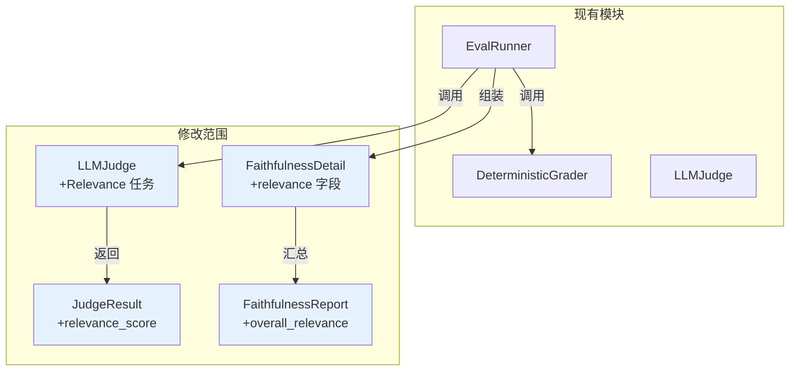

# R004 评估指标补充：Relevance 相关性评估

> **补充说明**：本文档是对 `2026-05-21--R004-rag-dialogue.md` §8「评估最佳实践」的遗漏补齐。原始分析文档 P1 优先级标注了 Response Relevancy 指标（"回答是否切题"），但在方案设计和任务拆解阶段未纳入实现范围。R004 全部 11 个任务（BB001-BB009）已完成，评估管线已跑通，现补齐此指标。

## 1. 分析边界

- 分析类型：new_requirement（遗漏补齐）
- 输入来源：R004 已完成的评估管线代码 + 真实评估结果（Faithfulness=0.847, Coverage=0.637）
- 已读取代码：llm_judge.py, eval_runner.py, deterministic.py, 相关测试文件
- 遗漏根源：原始分析文档 §8 指标优先级表中，P1 指标 Response Relevancy 标注了"防止答非所问"但未进入方案设计和任务拆解
- 明确不分析：
  - 不改变现有 Faithfulness + Coverage 评估逻辑
  - 不新增评估数据集字段（Relevance 只需要 question + answer，无需标注数据）
  - 不改变 EvalItem 数据结构

## 2. 功能目标

为 R004 评估管线新增 Relevance（相关性）指标，评估 LLM 生成回答是否正面回应了学生的问题。

| 维度 | 内容 |
|------|------|
| 问题 | 当前只测"回答对不对"（Faithfulness）和"讲得全不全"（Coverage），没测"有没有回答学生的问题"（Relevance） |
| 目标 | 新增 Relevance 指标，补齐 Faithfulness × Relevance × Coverage 三角评估体系 |
| 依赖 | 只需 question + answer，无需额外标注数据 |

### 三角评估体系（补齐后）

| 指标 | 测什么 | 输入 | 防止什么 |
|------|--------|------|---------|
| **Faithfulness** | 回答是否忠于教材原文 | answer + context | 编造（hallucination） |
| **Relevance** | 回答是否切题 | question + answer | 答非所问 |
| **Coverage** | 知识点覆盖广度 | answer + key_facts | 遗漏要点 |

## 3. 用户故事

| ID | Role | Action | Benefit | Acceptance |
|----|------|--------|---------|------------|
| US-rel-001 | 开发者 | 运行评估得到 Relevance 分数 | 判断系统是否答非所问 | Relevance 分数在 0-1 之间 |
| US-rel-002 | 开发者 | 在 FaithfulnessReport 中同时看到 Relevance | 一次评估得到完整三角指标 | FaithfulnessDetail 包含 relevance 字段 |

## 4. 用户交互链

无前端交互。Relevance 作为 `run_faithfulness()` / `run_full()` 的扩展指标，在评估报告中输出。

| 步骤 | 用户操作 | 系统响应 | 异常 |
|------|---------|---------|------|
| 1 | 运行 faithfulness 评估 | 除 Faithfulness+Coverage 外，同时输出 Relevance | — |
| 2 | 查看报告 | FaithfulnessDetail 新增 relevance 字段 | — |

## 5. 系统逻辑树

```
run_faithfulness() / run_full()
└── _evaluate_faithfulness_item()
    ├── embed → query → threshold → rerank → generate（现有）
    ├── DeterministicGrader.check()（现有）
    └── LLMJudge.judge()（扩展）
        ├── 任务一：Faithfulness — answer vs context（现有）
        ├── 任务二：Coverage — answer vs key_facts（现有）
        └── 任务三：Relevance — question vs answer（新增）
            └── 输出 relevant / partially_relevant / not_relevant
```

## 6. 功能网络



**影响模块**：

| 模块 | 变更类型 | 说明 |
|------|---------|------|
| `graders/llm_judge.py` | 修改 | Prompt 新增任务三（Relevance），JudgeResult 新增字段，解析逻辑扩展 |
| `eval_runner.py` | 修改 | FaithfulnessDetail 新增 relevance 字段，FaithfulnessReport 新增 overall_relevance |
| 测试文件 | 修改 | 补充 Relevance 相关测试用例 |

**不受影响**：
- `eval_types.py`：EvalItem 数据结构不变
- `eval_set_loader.py`：加载逻辑不变
- `deterministic.py`：规则检查不变
- 评估数据集：无需新增字段

## 7. 能力模型

| ID | Name | Source | Decision Ref | Module | Tags | Must Plan |
|----|------|--------|-------------|--------|------|-----------|
| CAP-eval-001 | Relevance 相关性评估 | 本文档 §4 | DEC-rel-001 | evaluation | quality | yes |

## 8. 方案设计

### 8.1 Relevance 判定规则

| 判定 | 含义 | 分值 |
|------|------|------|
| `relevant` | 回答正面回应了问题的核心 | 1.0 |
| `partially_relevant` | 回答与问题相关但未直接回答核心问题 | 0.5 |
| `not_relevant` | 回答与问题无关或完全偏离 | 0.0 |

### 8.2 LLM Judge Prompt 扩展

在现有 Prompt 模板中追加任务三：

```
任务三：相关性评估
判断学生的回答是否切题，即是否正面回应了原始问题。
- relevant：回答直接回应了问题的核心
- partially_relevant：回答与问题相关但未直接回答核心问题，或只回答了部分
- not_relevant：回答与问题无关或完全偏离主题

输出 JSON 格式扩展：
{
  "claims": [...],
  "coverage": [...],
  "relevance": "relevant|partially_relevant|not_relevant"
}
```

**设计理由**：
- Relevance 是单值判定（不需要像 Faithfulness 那样拆 claim），因为"是否切题"是一个整体判断
- 三档（relevant/partially/not）比二档更精细，能区分"偏了一点"和"完全跑题"
- 合并在同一次 LLM 调用中，不增加 API 成本

### 8.3 数据模型变更

**JudgeResult 扩展**（`graders/llm_judge.py`）：

```python
@dataclass
class JudgeResult:
    claims: list[ClaimVerdict]
    coverage: list[CoverageResult]
    faithfulness: float
    coverage_score: float
    unknown_ratio: float
    relevance: float          # 新增：0.0 / 0.5 / 1.0
    relevance_label: str      # 新增："relevant" / "partially_relevant" / "not_relevant"
```

**FaithfulnessDetail 扩展**（`eval_runner.py`）：

```python
@dataclass
class FaithfulnessDetail:
    # ... 现有字段 ...
    relevance: float           # 新增
    relevance_label: str       # 新增
```

**FaithfulnessReport 扩展**（`eval_runner.py`）：

```python
@dataclass
class FaithfulnessReport:
    overall_faithfulness: float
    overall_coverage: float
    avg_unknown_ratio: float
    overall_relevance: float   # 新增
    details: list[FaithfulnessDetail]
```

### 8.4 解析逻辑

在 `_parse_response()` 中追加：

```python
# 解析 relevance
relevance_str = data.get("relevance", "not_relevant")
relevance_map = {
    "relevant": 1.0,
    "partially_relevant": 0.5,
    "not_relevant": 0.0,
}
relevance_score = relevance_map.get(relevance_str, 0.0)
```

### 8.5 向后兼容

- `JudgeResult` 新字段有默认值（`relevance=0.0`, `relevance_label="not_relevant"`）
- LLM 返回不含 `relevance` 字段时，fallback 到 `"not_relevant"`
- `FaithfulnessDetail.to_dict()` 新增字段，旧报告无此字段不影响解析
- 现有测试用例中 mock 的 LLM 响应不含 `relevance` 字段，会被 fallback 为 0.0，不影响现有测试通过

### 8.6 NEGATIVE 条目处理

NEGATIVE 条目（11 条）无检索结果、无生成回答，Relevance 设为 0.0（不参与 overall_relevance 均值计算）。

### 8.7 成本

**零额外成本**。Relevance 判定合并到现有 LLM Judge 调用中，不增加 API 调用次数。

## 9. Decision Items

| ID | Summary | Type | Must Plan | Source |
|----|---------|------|-----------|--------|
| DEC-rel-001 | Relevance 采用三档判定（relevant / partially_relevant / not_relevant），合并到现有 LLM Judge 调用中，不增加 API 成本 | test_strategy | yes | solution_design |
| DEC-rel-002 | Relevance 作为单值判定（不拆 claim），因为"是否切题"是整体判断 | test_strategy | no | solution_design |
| DEC-rel-003 | JudgeResult / FaithfulnessDetail / FaithfulnessReport 新增字段均有默认值，向后兼容 | process | no | solution_design |

## 10. 风险与缺口

| ID | Gap/Risk | Impact | Suggested Handling |
|----|----------|--------|--------------------|
| RSK-rel-001 | LLM Judge 三任务合并后 Prompt 变长，可能影响 Faithfulness/Coverage 原有判定质量 | 现有指标波动 | 运行补充评估后对比 Faithfulness+Coverage 值，偏差 >5% 需拆分为独立调用 |
| RSK-rel-002 | Relevance 三档判定的区分度可能不足（LLM 倾向于给 relevant） | 指标区分度低 | 抽样 20 条人工复核，校准三档阈值 |

## 11. 集成测试要求

- 单元测试：LLMJudge._parse_response 正确解析 relevance 字段，含 fallback
- 单元测试：FaithfulnessDetail.to_dict 包含 relevance 和 relevance_label
- 集成测试：run_faithfulness 输出 FaithfulnessReport 包含 overall_relevance
- 向后兼容：现有测试全部通过（不含 relevance 字段的 mock 响应 fallback 为 0.0）
