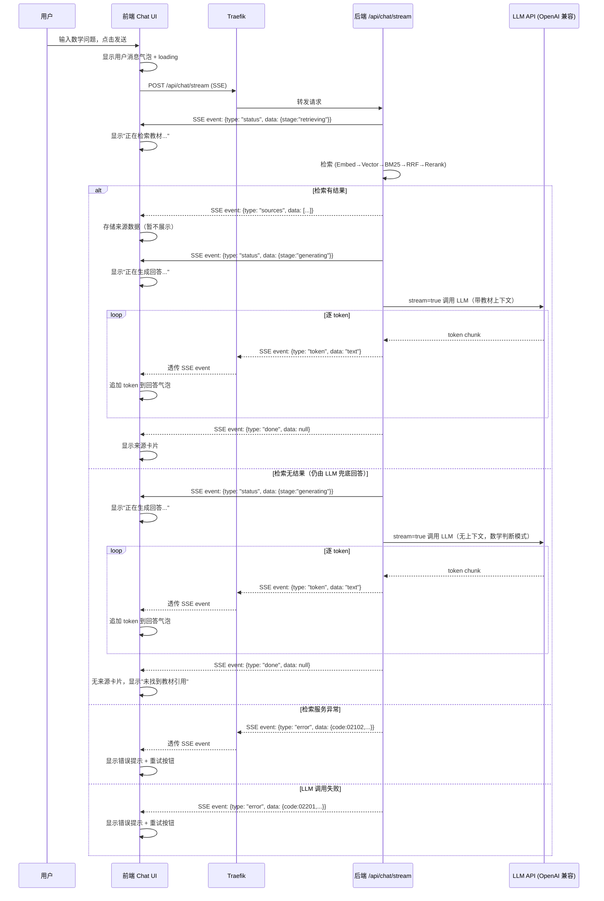
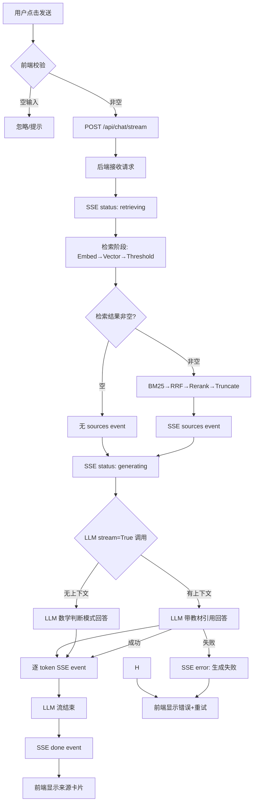
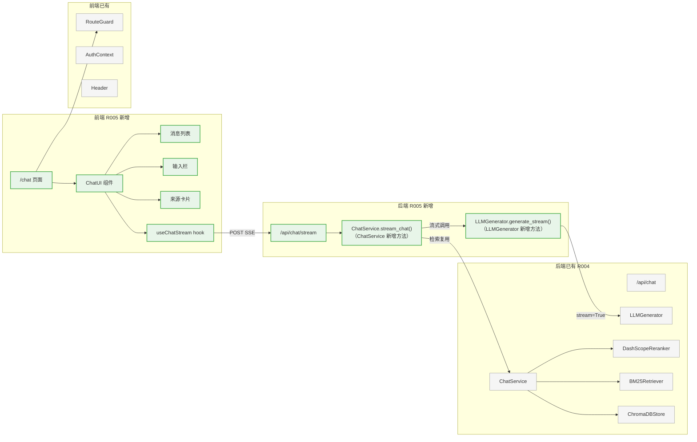
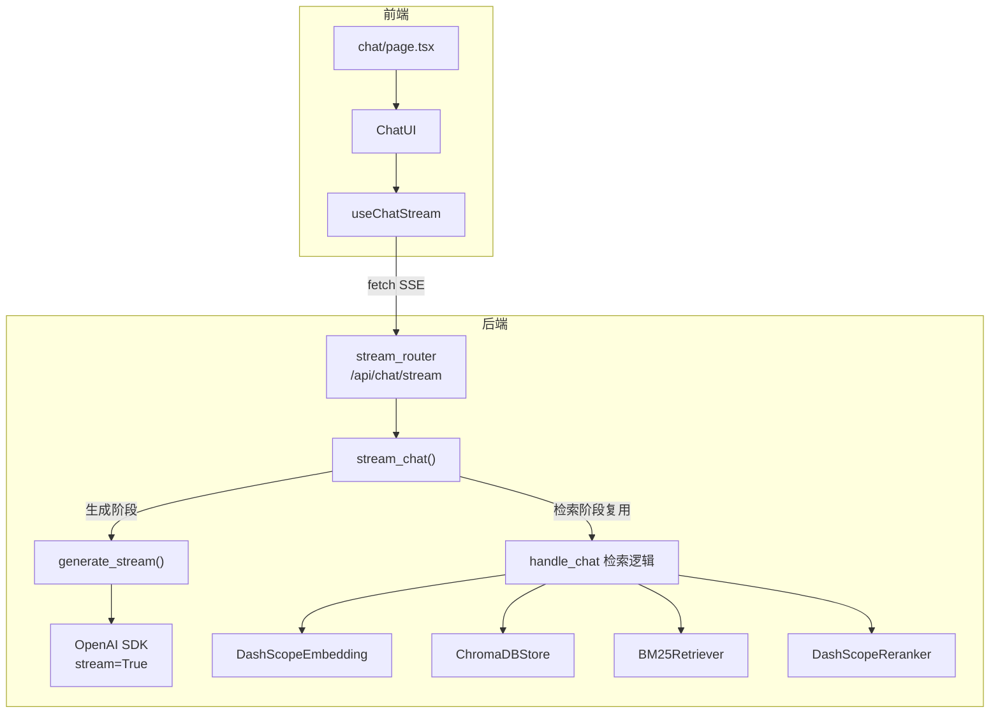
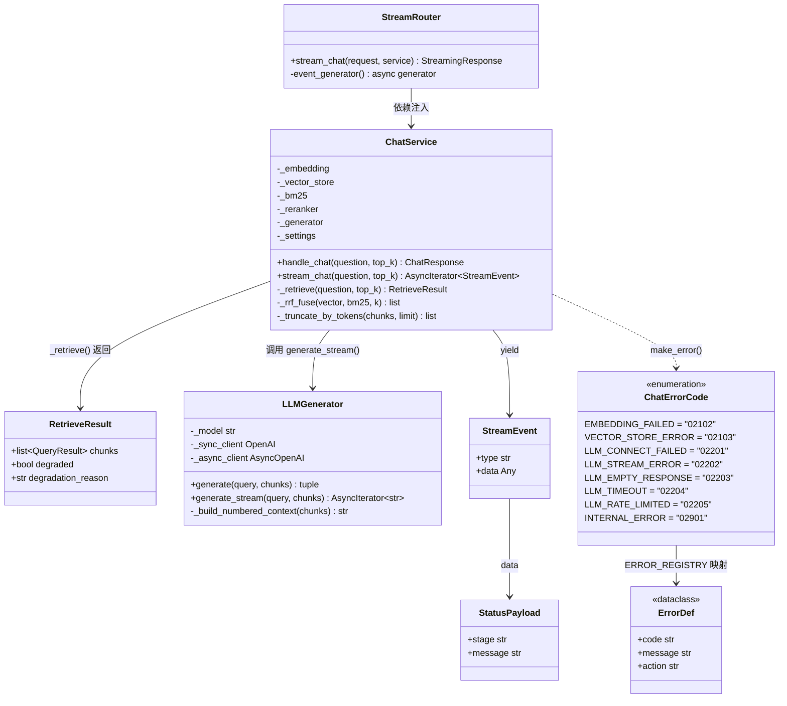
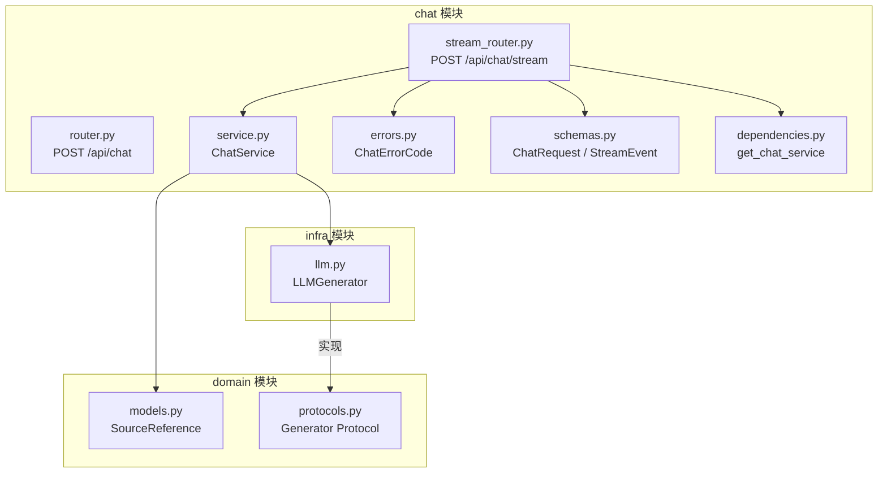
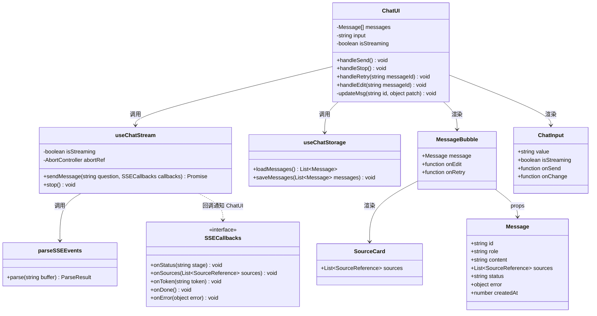
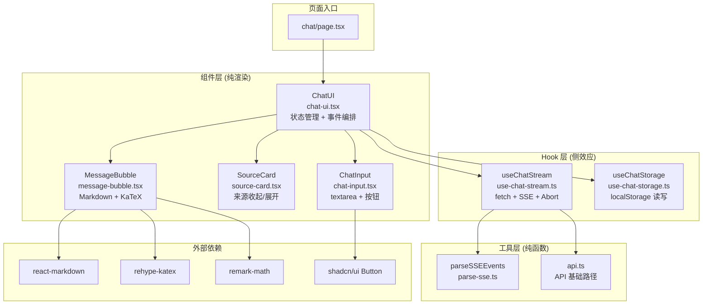
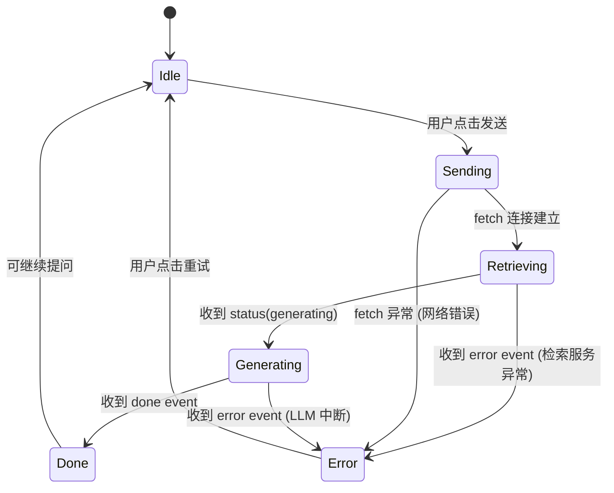

# R005 前端对话 UI + SSE 流式输出 需求分析与方案设计

## 1. 分析边界

- 分析类型：new_requirement（新需求功能分析）
- 输入来源：用户请求 + R004 已实现后端代码 + R004 分析文档 + architecture.md + 前端现有代码
- 已读取代码：
  - 前端：chat/page.tsx（占位页）、layout.tsx、page.tsx（首页）、header.tsx、route-guard.tsx、auth-context.tsx、globals.css、utils.ts、package.json、components.json
  - 后端：chat/service.py、chat/router.py、chat/schemas.py、chat/dependencies.py、infra/llm.py、config.py、main.py、domain/models.py、domain/protocols.py、rag/models.py
  - 部署：docker-compose.local.yml
- 已读取文档：architecture.md、project_spec.md、R004 分析文档
- 未读取/缺失上下文：无（前后端关键文件均已覆盖）
- 明确不分析：
  - 多轮对话上下文管理（R006+）
  - 用户认证打通（R006+，当前 RouteGuard 已完成登录拦截）
  - WebSocket 双向通信
  - 图片上传/OCR 题目识别
  - 前端 LLM 回答缓存（即不缓存 LLM 回答用于后续相同问题复用；消息历史 localStorage 持久化属于 UI 状态恢复，在方案内）
  - 教材页面图片查看（需新增图片服务接口，R005 先预留引用位置，图片弹出留给后续）
  - 服务端消息持久化（R006+）

## 2. 功能目标

- 用户：用户（通过浏览器访问 octotutor.xiaolutang.top）
- 目标：**在浏览器中输入数学问题，实时看到 AI 回答逐字流出，并查看引用的教材来源**
- 成功标准：
  1. 用户在 /chat 页面输入数学问题，点击发送或按回车
  2. 页面分阶段显示 AI 状态（"正在检索教材..." → "找到 N 条相关内容，正在生成回答..."）
  3. AI 回答逐 token 流式显示，可点击停止按钮中断
  4. 回答完成后，引用来源默认收起可展开（书名 + 章节 + 页码）
  5. 发送失败时消息撤回输入框（类 Gemini 交互），流式中断时保留已有内容
  6. 支持连续发送多个问题（每次独立，无上下文关联）
  7. 消息记录通过 localStorage 持久化，刷新页面可恢复
- 非目标：
  - 多轮对话（上下文不传递给后端）
  - 后端消息持久化（R006+，R005 使用 localStorage 过渡）
  - 移动端适配（桌面端优先，响应式次之）

## 3. 用户故事


| ID     | Role | Action                                   | Benefit                                | Acceptance                                         |
| ------ | ---- | ---------------------------------------- | -------------------------------------- | -------------------------------------------------- |
| US-001 | 用户 | 在输入框输入数学问题并点击发送           | 获得教材依据的解题引导                 | 输入非空文本后可发送，发送后输入框清空             |
| US-002 | 用户 | 看到分阶段状态提示 + AI 回答实时逐字出现 | 感知到 AI 在做什么，不需要对着空白等待 | 发送后看到"正在检索..."等状态，然后 token 逐字流出 |
| US-003 | 用户 | 查看回答的引用来源                       | 知道回答出自哪本教材哪一页             | 回答下方显示收起的来源列表，点击展开查看详情       |
| US-004 | 用户 | 发送失败时消息回到输入框                 | 网络波动时不需要重新输入问题           | 失败后消息撤回输入框，可直接重新发送               |
| US-005 | 用户 | 点击停止按钮中断生成                     | 回答方向不对时可以提前停止             | 停止后已有内容保留，标记"已停止"，可继续输入新问题 |
| US-006 | 用户 | 刷新页面后看到之前的对话                 | 不担心误操作丢失对话                   | 刷新后从 localStorage 恢复消息列表                 |
| US-007 | 用户 | 点击重新生成按钮获取新回答               | 对当前回答不满意时换一个               | AI 回答下方显示重新生成按钮，点击后旧回答被替换    |
| US-008 | 用户 | 编辑已发送的问题并重新发送               | 发现问题描述不准时可以修改             | 用户消息旁显示编辑按钮，编辑后重新发送替换旧 Q&A   |

## 4. 用户交互链


| Step | User Action          | System Response                               | Success State                | Failure/Empty State                    |
| ---- | -------------------- | --------------------------------------------- | ---------------------------- | -------------------------------------- |
| 1    | 访问 /chat           | RouteGuard 检查登录状态                       | 已登录 → 渲染 Chat UI       | 未登录 → 跳转认证中心                 |
| 2    | 在输入框输入数学问题 | 输入框实时显示文本，发送按钮激活              | 文本非空时可发送             | 输入为空时发送按钮禁用                 |
| 3    | 点击发送 / 按 Enter  | 消息气泡显示用户问题，新气泡显示 loading 动画 | loading 动画开始旋转         | —                                     |
| 4    | 等待回答             | loading → AI 回答逐字流出                    | token 逐个追加到回答气泡     | 检索无结果 → LLM 兜底回答，无来源引用 |
| 5    | 查看来源             | 回答完成后，来源卡片默认收起可展开            | 来源卡片：书名 + 章节 + 页码 | 无来源时显示"未找到教材引用"文字提示   |
| 6    | 继续提问             | 输入框重新聚焦，可输入新问题                  | 新问题追加到消息列表         | 流式进行中（isStreaming=true）时发送按钮禁用；停止后可立即发送新问题 |



## 5. 系统逻辑树

```text
用户发送问题
├─ 前端行为
│  ├─ 状态变化：input → sending → retrieving → generating → done/stopped/error
│  ├─ 校验：输入非空（前端 trim）
│  ├─ UI：用户消息气泡、AI loading 动画、流式文本追加、来源卡片、错误提示
│  └─ API：fetch EventSource / POST SSE
├─ 后端行为
│  ├─ 路由层：/api/chat/stream
│  ├─ 服务层：ChatService.stream_chat()
│  │  ├─ 检索阶段（同步，不流式）
│  │  │  ├─ Embed → Vector → Threshold → BM25 → RRF → Rerank → Truncate
│  │  │  ├─ 检索服务异常 → SSE error event → 结束
│  │  │  └─ 检索无结果 → 不报错，空 chunks 进入 LLM（数学判断模式）
│  │  └─ 生成阶段（异步，流式）
│  │     ├─ 构建 prompt
│  │     ├─ sources event 发送
│  │     ├─ LLM stream=True 调用
│  │     ├─ 逐 token → SSE token event
│  │     └─ done event
│  └─ 响应格式：text/event-stream
├─ 外部依赖
│  ├─ DashScope Embedding API（检索阶段）
│  ├─ DashScope Reranker API（检索阶段）
│  └─ OpenAI 兼容 LLM API（生成阶段，stream=True）
└─ 返回/完成态
   ├─ 成功：sources + tokens + done
   ├─ 检索无结果：无 sources + tokens（LLM 兜底回答） + done
   ├─ 检索服务异常：error event
   └─ 生成失败：error event（可能已部分输出 token）
```



## 6. 功能网络



### 依赖的已有模块


| Module                                  | Dependency Type | Reason                                                             | Evidence                                      |
| --------------------------------------- | --------------- | ------------------------------------------------------------------ | --------------------------------------------- |
| backend/app/chat/service.py             | 复用            | 检索编排逻辑（Embed→Vector→BM25→RRF→Rerank→Truncate）完全复用 | ChatService._rrf_fuse, _truncate_by_tokens    |
| backend/app/infra/llm.py                | 扩展            | 新增 generate_stream() 方法，调用 OpenAI stream=True               | LLMGenerator 使用 OpenAI SDK，原生支持 stream |
| backend/app/chat/schemas.py             | 复用+扩展       | ChatRequest 完全复用（question + top_k），新增 StreamEvent/StatusPayload | ChatRequest 字段不变，新增 SSE 事件模型       |
| backend/app/chat/dependencies.py        | 复用            | DI providers 不变，从 app.state 获取组件                           | get_chat_service 模式                         |
| backend/app/main.py                     | 修改            | 注册 stream_router                                                 | 需新增 include_router                         |
| backend/app/config.py                   | 复用            | 所有配置项已齐备（R004 已扩展）                                    | Settings 无需新增字段                         |
| frontend/src/components/route-guard.tsx | 复用            | /chat 页面登录拦截已就绪                                           | RouteGuard 包裹 chat/page.tsx                 |
| frontend/src/lib/utils.ts               | 复用            | cn() 工具函数                                                      | Tailwind 类名合并                             |
| frontend/components.json                | 复用            | shadcn/ui 配置已就绪                                               | base-nova 风格                                |
| frontend/src/app/globals.css            | 复用            | CSS 变量主题系统                                                   | oklch 色彩体系                                |

### 影响的已有模块


| Module                         | Impact   | Required Change                                                        | Risk                              |
| ------------------------------ | -------- | ---------------------------------------------------------------------- | --------------------------------- |
| backend/app/infra/llm.py       | 新增方法 | 新增 generate_stream() 返回 AsyncIterator                              | 低：新增方法不影响现有 generate() |
| backend/app/chat/router.py     | 新增路由 | 新增 /api/chat/stream SSE 端点                                         | 低：新路由不影响现有 /api/chat    |
| backend/app/main.py            | 注册路由 | include_router(stream_router)                                          | 低：一行代码                      |
| frontend/src/app/chat/page.tsx | 完全重写 | 从占位页改为 Chat UI                                                   | 低：当前为占位，无现有功能        |
| frontend/package.json          | 新增依赖 | react-markdown, remark-math, rehype-katex, katex（KaTeX 数学公式渲染） | 低：仅新增前端依赖                |

### 模块依赖关系图



## 7. 能力模型


| Capability ID  | Name               | Source Analysis              | Source Decisions | Journey Type    | Risk Tags           | Must Plan | Required Evidence                                                                                                                                                                                                                                            |
| -------------- | ------------------ | ---------------------------- | ---------------- | --------------- | ------------------- | --------- | ------------------------------------------------------------------------------------------------------------------------------------------------------------------------------------------------------------------------------------------------------------ |
| CAP-chatui-001 | SSE 流式回答       | 2026-05-21--R005-chat-ui-sse | DEC-chatui-001   | network         | network,third_party | yes       | entry_action:用户输入问题点击发送, actual_endpoint:POST /api/chat/stream, streaming_token_received:前端接收到 token event, sources_displayed:来源卡片展示, user_visible_success:回答完整显示, failure_path_result:error event + 重试按钮                     |
| CAP-chatui-002 | 检索无结果兜底回答 | 2026-05-21--R005-chat-ui-sse | DEC-chatui-039   | failure_path    | quality             | yes       | entry_action:用户输入无匹配的问题, actual_endpoint:POST /api/chat/stream, streaming_token_received:LLM 兜底回答 token, sources_displayed:无来源（显示"未找到教材引用"）, user_visible_success:LLM 正常回答, failure_path_result:仅检索服务异常才 error event |
| CAP-chatui-003 | 流式错误恢复       | 2026-05-21--R005-chat-ui-sse | DEC-chatui-004   | failure_path    | network             | yes       | entry_action:网络中断或 LLM 失败, actual_endpoint:POST /api/chat/stream, streaming_token_received:可能已部分接收, sources_displayed:N/A, user_visible_success:显示错误提示+重试按钮, failure_path_result:error event 或连接断开                              |
| CAP-chatui-004 | 非流式 API 兼容    | 2026-05-21--R005-chat-ui-sse | DEC-chatui-002   | contract_impact | quality             | no        | entry_action:N/A, actual_endpoint:POST /api/chat (原有), streaming_token_received:N/A, sources_displayed:原有 ChatResponse, user_visible_success:原有功能不变, failure_path_result:原有错误码不变                                                            |

## 8. 方案设计

### 方案目标

- 设计目标：前端 Chat UI 对接后端 SSE 流式接口，用户输入问题后实时看到 AI 回答逐字流出
- 不解决的问题：多轮对话、后端消息持久化、图片上传、移动端适配
- 成功判定：用户发送问题 → loading → 逐 token 流式显示 → 来源卡片展示 → 可继续提问

### 方案选择


| Option                           | Summary                                    | Pros                                    | Cons                           | Decision     |
| -------------------------------- | ------------------------------------------ | --------------------------------------- | ------------------------------ | ------------ |
| A: fetch + ReadableStream        | 用 fetch POST + reader.read() 逐块读取 SSE | 原生 API、无额外依赖、POST 请求体支持好 | 需手动解析 SSE 文本格式        | **selected** |
| B: EventSource                   | 浏览器原生 SSE API                         | 自动解析 SSE、自动重连                  | 只支持 GET，不支持 POST 请求体 | rejected     |
| C: 第三方库 (eventsource-parser) | 成熟的 SSE 解析库                          | 解析逻辑完善                            | 增加依赖、原生可覆盖           | rejected     |

选择理由：前端需要 POST 请求体发送 question，EventSource 只支持 GET，因此选用 fetch + ReadableStream 手动解析 SSE。

### 后端方案

#### 目录结构（R005 变更后）

```
backend/
  app/
    chat/
      __init__.py
      router.py            # [不修改] 原 POST /api/chat
      stream_router.py     # [新增] SSE 端点 POST /api/chat/stream
      service.py           # [修改] 新增 _retrieve() + stream_chat()
      schemas.py           # [修改] 复用 ChatRequest，新增 StreamEvent/StatusPayload
      dependencies.py      # [不修改] 复用 DI providers
      errors.py            # [新增] ChatErrorCode + ErrorDef + ERROR_REGISTRY
    infra/
      llm.py               # [修改] 新增 AsyncOpenAI + generate_stream()
    main.py                # [修改] 注册 stream_router
    domain/
      models.py            # [不修改] 复用 SourceReference
      protocols.py         # [不修改] 复用 Generator Protocol
    config.py              # [不修改] 复用 Settings
```

#### 后端类图



#### 后端模块依赖关系



#### 模块与边界

**新增文件：**

- `backend/app/chat/stream_router.py`：SSE 端点路由，`POST /api/chat/stream`
- `backend/app/chat/errors.py`：错误码枚举 + 注册表（MMPPN 编码体系）

**修改文件：**

- `backend/app/infra/llm.py`：新增 `generate_stream()` 方法
- `backend/app/main.py`：注册 stream_router

**修改（代码结构重构）：**

- `backend/app/chat/service.py`：新增 _retrieve() 私有方法 + stream_chat() 异步方法，检索逻辑功能不变但结构重构

**修改（新增数据模型）：**

- `backend/app/chat/schemas.py`：ChatRequest 复用，新增 StreamEvent + StatusPayload

**不修改：**

- `backend/app/chat/router.py`：原 /api/chat 不变

#### 代码架构设计（后端）

**1. LLMGenerator 双客户端模式：**

```python
class LLMGenerator:
    def __init__(self, api_key, base_url, model):
        self._model = model
        self._sync_client = OpenAI(api_key=api_key, base_url=base_url)      # 原有同步
        self._async_client = AsyncOpenAI(api_key=api_key, base_url=base_url) # 新增异步

    # 原有方法不动
    def generate(self, query, chunks) -> tuple[str, list[SourceReference]]: ...

    # 新增异步流式方法（具体 API 语法以 OpenAI SDK 版本为准，此处为伪代码示意）
    # 资源清理策略（DEC-chatui-015）：使用 async with 上下文管理器确保 Stream 资源释放。
    # 正常结束时 async with 退出即关闭；断线场景下 Router 的 is_disconnected() 检测到后
    # break 退出循环，generator 被回收，async with __aexit__ 确保连接关闭，资源不泄漏。
    async def generate_stream(self, query, chunks) -> AsyncIterator[str]:
        if chunks:
            context_text = self._build_numbered_context(chunks)
            messages = [...]  # 带教材上下文的 system prompt
        else:
            messages = [...]  # 数学判断模式 system prompt：
            # "你是高中数学辅导助手。用户的问题没有找到相关教材内容。
            #  如果是数学问题，用你的知识解答；如果不是数学问题，
            #  礼貌告知你只能解答数学相关问题。"

        stream = await self._async_client.chat.completions.create(
            model=self._model, messages=messages, stream=True
        )
        async with stream:  # 上下文管理器确保资源释放（DEC-chatui-015）
            async for chunk in stream:
                token = chunk.choices[0].delta.content or ""
                if token:
                    yield token

    # 共享工具方法
    def _build_numbered_context(self, chunks) -> str: ...
```

**2. ChatService 检索逻辑重构 + stream_chat 完整实现：**

```python
@dataclass
class RetrieveResult:
    """_retrieve() 返回类型：携带检索结果 + 降级状态"""
    chunks: list[QueryResult]
    degraded: bool = False
    degradation_reason: str | None = None

class ChatService:
    # 新增私有方法：抽取检索阶段（Embed→Vector→Threshold→BM25→RRF→Rerank→Truncate）
    # 返回 RetrieveResult 而非 list[QueryResult]，携带 degraded/degradation_reason 字段
    # 以满足 architecture.md 不变量：Reranker 失败降级（degraded=true + degradation_reason）
    def _retrieve(self, question: str, top_k: int) -> RetrieveResult:
        embedding = self._embedding.embed_query(question)
        vector_results = self._vector_store.query(embedding, self._settings.retrieval_top_k)
        vector_results = [r for r in vector_results if r.score >= self._settings.similarity_threshold]
        if self._settings.bm25_enabled:
            bm25_results = self._bm25.query(question, self._settings.retrieval_top_k)
            fused = self._rrf_fuse(vector_results, bm25_results, self._settings.rrf_k)
        else:
            fused = vector_results
        if not fused:
            return RetrieveResult(chunks=[])  # 不报错，返回空列表，由调用方决定行为
        # Rerank：保持架构不变量——Reranker 失败降级（degraded=true），不抛异常
        try:
            context_chunks = self._reranker.rerank(question, fused)
        except Exception:
            # 降级：跳过 Rerank，使用 RRF 融合结果，标记 degraded
            return RetrieveResult(chunks=fused, degraded=True, degradation_reason="Reranker 服务不可用，跳过重排序")
        # Truncate ...
        return RetrieveResult(chunks=context_chunks)

    # 原有方法改为调用 _retrieve，保持 R004 契约：空检索 → 404
    def handle_chat(self, question, top_k):
        result = self._retrieve(question, top_k)
        if not result.chunks:
            raise HTTPException(status_code=404, detail="未找到相关教材内容")
        answer, sources = self._generator.generate(question, result.chunks)
        return ChatResponse(answer=answer, sources=sources,
                            degraded=result.degraded, degradation_reason=result.degradation_reason)

    # 新增异步流式方法（含 status 事件 + to_thread + 异常处理）
    # stream_chat 与 handle_chat 的空检索行为不同：
    #   handle_chat：空检索 → 404（R004 契约）
    #   stream_chat：空检索 → LLM 兜底回答（R005 需求）
    async def stream_chat(self, question: str, top_k: int) -> AsyncIterator[StreamEvent]:
        # ── 阶段 1：检索 ──
        yield StreamEvent(type="status", data=StatusPayload(
            stage="retrieving", message="正在检索教材..."))

        try:
            result = await asyncio.to_thread(self._retrieve, question, top_k)
        except Exception as e:
            # 仅 Embedding / VectorStore 失败走 error path
            # Reranker 失败已被 _retrieve() 内部降级，不触发此处
            if "embedding" in str(e).lower() or "dashscope" in str(e).lower():
                yield StreamEvent(type="error", data=make_error(ChatErrorCode.EMBEDDING_FAILED))
            else:
                yield StreamEvent(type="error", data=make_error(ChatErrorCode.VECTOR_STORE_ERROR))
            return

        context_chunks = result.chunks  # 可能为空，stream_chat 使用 LLM 兜底

        # ── 检索结果处理 ──
        if context_chunks:
            sources = [SourceReference(...) for chunk in context_chunks]
            yield StreamEvent(type="sources", data=sources)
        # 无结果：不发 sources event，LLM 使用数学判断模式兜底

        # ── 阶段 2：生成 ──
        yield StreamEvent(type="status", data=StatusPayload(
            stage="generating", message="正在生成回答..."))

        try:
            has_token = False
            async for token in self._generator.generate_stream(question, context_chunks):
                has_token = True
                yield StreamEvent(type="token", data=token)

            if not has_token:
                yield StreamEvent(type="error", data=make_error(ChatErrorCode.LLM_EMPTY_RESPONSE))
                return

            yield StreamEvent(type="done", data=None)

        except ConnectionError:
            yield StreamEvent(type="error", data=make_error(ChatErrorCode.LLM_CONNECT_FAILED))
        except TimeoutError:
            yield StreamEvent(type="error", data=make_error(ChatErrorCode.LLM_TIMEOUT))
        except RateLimitError:
            yield StreamEvent(type="error", data=make_error(ChatErrorCode.LLM_RATE_LIMITED))
        except Exception:
            yield StreamEvent(type="error", data=make_error(ChatErrorCode.LLM_STREAM_ERROR))
```

**3. SSE 消息协议（5 种事件类型）：**

```
完整正常流程（有检索结果，3 + N 条消息）：
#1  event: status   data: {"stage":"retrieving","message":"正在检索教材..."}
#2  event: sources  data: [{"chunk_id":"...","book":"...","section":"...","page_start":1,"page_end":3}]
#3  event: status   data: {"stage":"generating","message":"正在生成回答..."}
#4~ event: token    data: "你" / "好" / "，" / ...   （通常 50-200 条）
#N+4 event: done    data: null

检索无结果（LLM 兜底，2 + N 条消息）：
#1  event: status   data: {"stage":"retrieving","message":"正在检索教材..."}
#2  event: status   data: {"stage":"generating","message":"正在生成回答..."}
#3~ event: token    data: ...（LLM 数学判断模式回答）
#N+3 event: done    data: null
注：无 sources event，前端显示"未找到教材引用"

错误场景：
- 检索服务异常：status → error (02102)
- LLM 连接失败：status → sources? → status → error (02201)
- LLM 流式中断：status → sources? → status → token×K → error (02202)
- LLM 空响应：status → sources? → status → error (02203)
- LLM 超时：status → sources? → status → error (02204)
- LLM 限流：status → sources? → status → error (02205)
- 用户停止：TCP 连接关闭，无 error 事件
注：sources? 表示有检索结果时才有，无结果时跳过
```

**4. 错误码体系（MMPPN 五位数字编码）：**

```
结构：MMPPN
       MM = 模块（00=系统, 01=知识库, 02=对话, 03=认证, 04=评估）
       PP = 阶段（1=检索, 2=生成, 3=输入校验, 9=兜底）
       N  = 序号（01-99）

示例：02205 = 对话模块(02) + 生成阶段(2) + 第05号错误(LLM限流)
```


| 错误码 | 含义               | 用户提示                   | action |
| ------ | ------------------ | -------------------------- | ------ |
| 02102  | Embedding 服务异常 | "检索服务异常，请重试"     | retry  |
| 02103  | 向量库查询异常     | "检索服务异常，请重试"     | retry  |
| 02201  | LLM 连接失败       | "AI 服务连接失败，请重试"  | retry  |
| 02202  | LLM 流式中断       | "生成中断，已保留部分内容" | retry  |
| 02203  | LLM 空响应         | "AI 未能生成回答，请重试"  | retry  |
| 02204  | LLM 超时           | "AI 响应超时，请重试"      | retry  |
| 02205  | LLM 限流           | "请求太频繁，请稍后再试"   | wait   |
| 02901  | 未知内部错误       | "服务异常，请重试"         | retry  |

**5. 错误码注册表（单一数据源）：**

```python
# backend/app/chat/errors.py
from dataclasses import dataclass
from enum import Enum

class ChatErrorCode(Enum):
    """对话模块错误码 — 遵循 MMPPN 编码规则，值使用字符串避免前导零问题"""
    EMBEDDING_FAILED = "02102"
    VECTOR_STORE_ERROR = "02103"
    LLM_CONNECT_FAILED = "02201"
    LLM_STREAM_ERROR = "02202"
    LLM_EMPTY_RESPONSE = "02203"
    LLM_TIMEOUT = "02204"
    LLM_RATE_LIMITED = "02205"
    INTERNAL_ERROR = "02901"

@dataclass(frozen=True)
class ErrorDef:
    code: str
    message: str
    action: str  # "retry" | "edit" | "wait"

ERROR_REGISTRY: dict[ChatErrorCode, ErrorDef] = {
    ChatErrorCode.EMBEDDING_FAILED: ErrorDef("02102", "检索服务异常，请重试", "retry"),
    ChatErrorCode.VECTOR_STORE_ERROR: ErrorDef("02103", "检索服务异常，请重试", "retry"),
    ChatErrorCode.LLM_CONNECT_FAILED: ErrorDef("02201", "AI 服务连接失败，请重试", "retry"),
    ChatErrorCode.LLM_STREAM_ERROR: ErrorDef("02202", "生成中断，已保留部分内容", "retry"),
    ChatErrorCode.LLM_EMPTY_RESPONSE: ErrorDef("02203", "AI 未能生成回答，请重试", "retry"),
    ChatErrorCode.LLM_TIMEOUT: ErrorDef("02204", "AI 响应超时，请重试", "retry"),
    ChatErrorCode.LLM_RATE_LIMITED: ErrorDef("02205", "请求太频繁，请稍后再试", "wait"),
    ChatErrorCode.INTERNAL_ERROR: ErrorDef("02901", "服务异常，请重试", "retry"),
}

def make_error(code: ChatErrorCode) -> dict:
    defn = ERROR_REGISTRY[code]
    return {"code": defn.code, "message": defn.message, "action": defn.action}
```

**6. StreamEvent 结构化事件模型：**

```python
from dataclasses import dataclass
from typing import Any, Literal

@dataclass
class StreamEvent:
    type: Literal["status", "sources", "token", "done", "error"]
    data: Any

@dataclass
class StatusPayload:
    stage: Literal["retrieving", "generating"]
    message: str
```

**7. Router 层 SSE 格式化 + 断线检测：**

```python
# stream_router.py
from dataclasses import asdict
@router.post("/chat/stream")
async def stream_chat(
    body: ChatRequest,
    http_request: Request,
    service: ChatService = Depends(get_chat_service),
):
    async def event_generator():
        try:
            async for event in service.stream_chat(body.question, body.top_k):
                if await http_request.is_disconnected():
                    break
                payload = event.data
                if hasattr(payload, 'model_dump'):
                    serialized = payload.model_dump()
                elif hasattr(payload, '__dataclass_fields__'):
                    serialized = asdict(payload)
                elif isinstance(payload, list):
                    serialized = [item.model_dump() if hasattr(item, 'model_dump') else asdict(item) if hasattr(item, '__dataclass_fields__') else item for item in payload]
                else:
                    serialized = payload
                yield f"event: {event.type}\ndata: {json.dumps(serialized, ensure_ascii=False)}\n\n"
                await asyncio.sleep(0)
        except Exception:
            yield f"event: error\ndata: {json.dumps(make_error(ChatErrorCode.INTERNAL_ERROR), ensure_ascii=False)}\n\n"

    return StreamingResponse(event_generator(), media_type="text/event-stream")
```

**8. 断线检测机制（async generator 惰性 + to_thread）：**

- `async for` 是惰性的 — Router 不调用 `__anext__()`，Generator 就不会往下跑
- `asyncio.to_thread(_retrieve)` 让检索不阻塞事件循环，其他用户不受影响
- 检索阶段不可取消（1-3 秒），但 Router 在检索完成后检查 `is_disconnected()`，断线则 LLM 不启动
- LLM 流式阶段逐 token 检查 `is_disconnected()`，断线则 break → `async with` 自动清理连接
- 停止用 AbortController 关闭 TCP 连接而非独立请求，TCP 保证关闭不早于建立，无乱序问题
- 不做自动重试：不能续接断掉的流，自动重试花钱且用户无感知，由用户决定是否重试
- 错误后用户可继续对话：R005 单轮独立，错误只影响当前消息，输入框始终可用

#### 数据模型变更

新增数据模型：


| 模型            | 文件                        | 说明                                |
| --------------- | --------------------------- | ----------------------------------- |
| `StreamEvent`   | backend/app/chat/schemas.py | SSE 结构化事件（type + data）       |
| `StatusPayload` | backend/app/chat/schemas.py | status 事件数据（stage + message）  |
| `RetrieveResult`| backend/app/chat/service.py | 检索结果（chunks + degraded + degradation_reason） |
| `ChatErrorCode` | backend/app/chat/errors.py  | 错误码枚举（MMPPN 编码）            |
| `ErrorDef`      | backend/app/chat/errors.py  | 错误定义（code + message + action） |

复用已有模型：`ChatRequest`、`SourceReference`。

#### API 设计要点

```
POST /api/chat/stream
Content-Type: application/json
Accept: text/event-stream

Request Body: {"question": "二次函数怎么求顶点", "top_k": 10}

Response:
  Content-Type: text/event-stream
  Cache-Control: no-cache
  Connection: keep-alive

  event: status
  data: {"stage":"retrieving","message":"正在检索教材..."}

  event: sources
  data: [{"chunk_id":"...","book":"...","section":"...","page_start":1,"page_end":3}]

  event: status
  data: {"stage":"generating","message":"正在生成回答..."}

  event: token
  data: "根据二次函数"

  event: token
  data: "的标准形式"

  ...

  event: done
  data: null

  -- 或错误（检索服务异常） --
  event: error
  data: {"code":"02102","message":"检索服务异常，请重试","action":"retry"}

  -- 或错误（LLM 限流） --
  event: error
  data: {"code":"02205","message":"请求太频繁，请稍后再试","action":"wait"}
```

#### 配置与第三方集成

- 无新配置项（R004 配置已覆盖）
- OpenAI SDK `stream=True` 参数已原生支持，无需额外配置
- SSE 响应通过 Traefik 透传（Traefik 默认支持 HTTP/1.1 长连接 + SSE）

#### 状态与错误处理


| Scenario                          | State Change                                                      | Error Handling                 | User Feedback                                  |
| --------------------------------- | ----------------------------------------------------------------- | ------------------------------ | ---------------------------------------------- |
| 检索有结果                        | 发送 status(retrieving) → sources → status(generating)          | —                             | 分阶段提示："正在检索..." → "正在生成回答..." |
| 检索无结果                        | 发送 status(retrieving) → status(generating)（无 sources event） | —                             | LLM 兜底回答，显示"未找到教材引用"             |
| 检索服务异常                      | 发送 error event                                                  | error event "检索服务异常"     | "检索服务异常，请重试"                         |
| 发送前失败（fetch 异常 / 非 200） | 未收到第一个 SSE 事件，error.code='00000'                       | fetch 抛异常 / response 非 200 | 消息撤回输入框（类 Gemini 交互，DEC-chatui-008） |
| LLM 连接失败                      | 已有 SSE 事件 → error event                                      | 异常捕获 → error event        | 保留已有内容 + "生成失败"                      |
| LLM 流式中断                      | 已发 token + error event                                          | 异常捕获 → error event        | 保留已输出部分 + "生成中断"                    |
| 用户点击停止                      | abort() 关闭连接                                                  | 前端主动中断                   | 保留已有内容 + 标记"已停止"                    |
| 前端网络断开                      | ReadableStream 异常                                               | try/catch → 错误状态          | 保留已有内容 + "网络断开"                      |

#### 测试策略

- 单元测试（L2）：
  - LLMGenerator.generate_stream() mock 测试：验证 AsyncIterator 产出
  - stream_chat() mock 测试：验证 sources/token/done/error 事件顺序
  - SSE 事件格式验证
- 集成测试（L3）：
  - 真实 POST /api/chat/stream 调用，验证 SSE 事件流格式正确
  - 检索失败路径验证
- 端到端测试（L4）：
  - Playwright：在浏览器中发送问题 → 验证流式文本出现 → 验证来源卡片

### 客户端方案

#### 前端架构

**架构风格：状态驱动 + Hook 侧效应隔离**

```
┌─────────────────────────────────────────────────────┐
│                    ChatUI（唯一状态源）               │
│  ┌───────────┐  ┌──────────┐  ┌──────────────────┐ │
│  │ messages[]│  │  input   │  │ isStreaming       │ │
│  └─────┬─────┘  └────┬─────┘  └────────┬─────────┘ │
│        │              │                  │           │
│  onStatus/onSources/onToken/onDone/onError          │
│        │              │                  │           │
│  ┌─────▼──────────────▼──────────────────▼─────────┐│
│  │              useChatStream Hook                  ││
│  │  ┌──────────────┐  ┌──────────────────────────┐ ││
│  │  │AbortController│  │ fetch + ReadableStream   │ ││
│  │  └──────────────┘  │     + parseSSEEvents      │ ││
│  │                    └──────────────────────────┘ ││
│  └──────────────────────┬───────────────────────────┘│
│                         │ POST /api/chat/stream      │
└─────────────────────────┼────────────────────────────┘
                          │
              ┌───────────▼────────────┐
              │  后端 SSE Endpoint     │
              └────────────────────────┘

渲染层（纯展示组件，只接收 props）：
┌──────────────┐  ┌──────────────┐  ┌──────────────┐
│MessageBubble │  │  SourceCard  │  │  ChatInput   │
│ props:       │  │  props:      │  │  props:      │
│  message     │  │   sources    │  │   value      │
│              │  │              │  │   isStreaming │
│  内含：       │  │              │  │   onSend     │
│  ReactMarkdown│  │              │  │              │
│  + KaTeX     │  │              │  │              │
└──────────────┘  └──────────────┘  └──────────────┘
```

**设计原则：**
- **单一状态源**：所有消息状态在 ChatUI 的 `useState` 中管理，子组件不持有副本状态
- **侧效应隔离**：useChatStream 封装所有网络细节（fetch/SSE/AbortController），useChatStorage 封装持久化细节（localStorage），通过回调/返回值通知 ChatUI，自身不知道 UI 怎么渲染
- **纯渲染组件**：MessageBubble/SourceCard/ChatInput 只接收 props 渲染，不含业务逻辑
- **单向数据流**：ChatUI → props → 子组件；子组件事件 → callbacks → ChatUI 更新状态
- **无全局状态管理**：单页单功能，useState 足够，不需要 Redux/Zustand

#### 目录结构（R005 变更后）

```
frontend/
  src/
    app/
      chat/
        page.tsx                # [重写] 从占位页 → 渲染 ChatUI
      layout.tsx               # [不修改]
      page.tsx                 # [不修改] 首页
      globals.css              # [不修改]
    components/
      chat/                    # [新增目录]
        chat-ui.tsx            # [新增] Chat 主组件（"use client"，状态管理 + 事件编排）
        message-bubble.tsx     # [新增] 消息气泡（"use client"，用户/AI + Markdown + KaTeX）
        source-card.tsx        # [新增] 来源引用卡片（"use client"，收起/展开）
        chat-input.tsx         # [新增] 输入栏（"use client"，textarea + 发送/停止按钮）
      header.tsx               # [不修改]
      route-guard.tsx          # [不修改]
      ui/
        button.tsx             # [新增] shadcn/ui button 组件
    hooks/
      use-chat-stream.ts       # [新增] SSE 通信 hook（回调模式）
      use-chat-storage.ts      # [新增] 消息持久化 hook（localStorage，R006 改为后端 API）
    contexts/
      auth-context.tsx         # [不修改]
    lib/
      utils.ts                 # [不修改]
      parse-sse.ts             # [新增] SSE 文本解析纯函数
      api.ts                   # [新增] API 基础路径配置
  package.json                 # [修改] 新增 react-markdown, remark-math, rehype-katex, katex
  components.json              # [不修改]
```

#### 前端类图



#### 前端模块依赖图



#### 模块与边界

**新增文件：**

- `frontend/src/components/chat/chat-ui.tsx`：Chat 主组件（消息列表 + 输入栏 + 发送逻辑）
- `frontend/src/components/chat/message-bubble.tsx`：消息气泡组件（用户/AI 两种样式）
- `frontend/src/components/chat/source-card.tsx`：来源引用卡片组件
- `frontend/src/components/chat/chat-input.tsx`：输入栏组件（textarea + 发送按钮）
- `frontend/src/hooks/use-chat-stream.ts`：SSE 流式通信 hook（回调模式）
- `frontend/src/hooks/use-chat-storage.ts`：消息持久化 hook（localStorage 读写，R006 改为后端 API）
- `frontend/src/lib/parse-sse.ts`：SSE 文本解析函数（独立纯函数）
- `frontend/src/lib/api.ts`：API 基础配置（后端地址）

**修改文件：**

- `frontend/src/app/chat/page.tsx`：从占位页替换为 ChatUI 组件

**不修改：**

- layout.tsx、header.tsx、route-guard.tsx、auth-context.tsx、globals.css

**shadcn/ui 组件安装：**

- 只安装 `button`：发送/停止按钮
- 其他用原生 HTML + Tailwind CSS（card 用 div、textarea 用原生、scroll 用 div overflow-auto）

**KaTeX 数学公式渲染依赖：**

- `react-markdown`：Markdown 渲染（标题、列表、代码块等）
- `remark-math`：识别 `$...$`（行内公式）和 `$$...$$`（独立公式）
- `rehype-katex`：调用 KaTeX 渲染数学公式
- `katex`：渲染引擎 + CSS（约 200KB）
- 流式场景：`throwOnError: false`，未闭合公式显示原始文本，闭合后自动渲染
- CSS 引入方式：`katex/dist/katex.min.css` 在 `chat-ui.tsx` 组件顶层 import（Next.js App Router 支持客户端组件内引入全局 CSS），不修改 `layout.tsx` 或 `globals.css`

#### 代码架构设计（前端）

**1. 组件层级与数据流：**

```
chat/page.tsx
  └── ChatUI（主控）
        ├── 状态：messages[], input
        ├── 调用 useChatStorage hook（持久化）
        ├── 调用 useChatStream hook（网络）
        │
        ├── MessageBubble（×N，每条消息一个）
        │     ├── 用户消息：右对齐 + hover 显示编辑按钮
        │     └── AI 消息：左对齐 + react-markdown + KaTeX + 来源卡片 + 操作按钮
        │           └── SourceCard（收起/展开）
        │
        └── ChatInput
              └── textarea + Button（发送/停止）
```

**2. 组件职责划分：**


| 模块           | 知道什么                                             | 不知道什么                 |
| -------------- | ---------------------------------------------------- | -------------------------- |
| useChatStream  | fetch、SSE 解析、AbortController                     | messages 数组、UI 怎么渲染 |
| useChatStorage | localStorage 读写                                    | 消息内容含义、UI 渲染      |
| ChatUI         | messages 状态、发送/停止/重试/编辑逻辑               | SSE 文本格式、网络细节     |
| MessageBubble  | 单条消息数据 + 渲染（Markdown + KaTeX）              | 其他消息、发送/停止逻辑    |
| ChatInput      | 输入框值 + isStreaming 状态                          | 消息列表、SSE 通信         |
| parseSSE       | SSE 文本解析规则                                     | 业务逻辑、网络             |

**3. Message 数据模型：**

```typescript
interface Message {
  id: string
  role: 'user' | 'assistant'
  content: string
  sources?: SourceReference[]
  status: 'sending' | 'retrieving' | 'generating' | 'done' | 'stopped' | 'error'
  error?: { code: string; message: string; action: string }
  createdAt: number    // 时间戳
}
```

**4. useChatStream Hook（回调模式）：**

```typescript
interface SSECallbacks {
  onStatus: (stage: 'retrieving' | 'generating') => void
  onSources: (sources: SourceReference[]) => void
  onToken: (token: string) => void
  onDone: () => void
  onError: (error: { code: string; message: string; action: string }) => void
}

function useChatStream() {
  const [isStreaming, setIsStreaming] = useState(false)
  const abortRef = useRef<AbortController | null>(null)

  const sendMessage = async (question: string, callbacks: SSECallbacks) => {
    abortRef.current = new AbortController()
    setIsStreaming(true)

    let firstEventReceived = false  // 定义在 try 外，catch 中可访问

    try {
      const response = await fetch('/api/chat/stream', {
        method: 'POST',
        headers: { 'Content-Type': 'application/json' },
        body: JSON.stringify({ question }),
        signal: abortRef.current.signal,
      })

      // 检查 HTTP 状态码（非 200 属于首事件前失败）
      if (!response.ok || !response.body) {
        callbacks.onError({ code: '00000', message: `请求失败 (${response.status})`, action: 'retry' })
        return
      }

      const reader = response.body.getReader()
      const decoder = new TextDecoder()
      let buffer = ''

      while (true) {
        const { done, value } = await reader.read()
        if (done) break
        buffer += decoder.decode(value, { stream: true })

        // 调用 parseSSEEvents 解析完整事件
        const { events, remaining } = parseSSEEvents(buffer)
        buffer = remaining

        for (const event of events) {
          firstEventReceived = true  // 收到任意事件即标记
          switch (event.type) {
            case 'status':  callbacks.onStatus(event.data.stage); break
            case 'sources': callbacks.onSources(event.data); break
            case 'token':   callbacks.onToken(event.data); break
            case 'done':    callbacks.onDone(); break
            case 'error':   callbacks.onError(event.data); break
          }
        }
      }
    } catch (err) {
      if (err instanceof DOMException && err.name === 'AbortError') {
        // 用户主动停止，不触发 onError
      } else if (firstEventReceived) {
        // 首事件后网络断开：已有部分内容，保留消息标记错误（不撤回）
        callbacks.onError({ code: '00001', message: '网络连接中断，已保留部分内容', action: 'retry' })
      } else {
        // 首事件前失败：fetch 异常，连接未建立，撤回消息到输入框
        callbacks.onError({ code: '00000', message: '网络连接异常', action: 'retry' })
      }
    } finally {
      setIsStreaming(false)
      abortRef.current = null
    }
  }

  const stop = () => { abortRef.current?.abort() }

  return { sendMessage, stop, isStreaming }
}
```

> **首事件前失败撤回**：只有网络层失败（fetch 异常、HTTP 非 200）才触发撤回逻辑——此时 `onError` 由 useChatStream 的 catch 块触发，ChatUI 收到的 error.code 为 `'00000'`。SSE error 事件（后端返回 error event）说明连接已建立，属于"收到首事件"，不撤回而是标记消息为 error 状态（DEC-chatui-008）。

**5. SSE 解析函数（独立纯函数）：**

```typescript
// frontend/src/lib/parse-sse.ts

interface SSEEvent {
  type: string
  data: any
}

function parseSSEEvents(buffer: string): { events: SSEEvent[]; remaining: string } {
  const events: SSEEvent[] = []
  const parts = buffer.split('\n\n')  // SSE 事件以空行分隔

  // 最后一段可能不完整，留在 buffer 等下次
  const remaining = parts.pop() || ''

  for (const part of parts) {
    const lines = part.split('\n')
    let type = ''
    let data = ''
    for (const line of lines) {
      if (line.startsWith('event: ')) type = line.slice(7)
      if (line.startsWith('data: ')) data = line.slice(6)
    }
    if (type) {
      events.push({ type, data: data === 'null' ? null : JSON.parse(data) })
    }
  }

  return { events, remaining }
}
```

**6. AbortController 管理：**

- 创建：`sendMessage()` 时 new AbortController()
- 存储：`useRef<AbortController>` 持有，跨渲染持久
- 触发：用户点停止 → `stop()` → `abort()` → fetch 抛 AbortError → catch 识别为用户主动停止
- 清理：finally 块中 `abortRef.current = null`

**7. 消息持久化（useChatStorage hook）：**

```typescript
// frontend/src/hooks/use-chat-storage.ts
function useChatStorage() {
  const STORAGE_KEY = 'octotutor-chat-messages'

  const loadMessages = (): Message[] => {
    try {
      const raw = localStorage.getItem(STORAGE_KEY)
      return raw ? JSON.parse(raw) : []
    } catch {
      return []  // 数据损坏时静默恢复为空
    }
  }

  const saveMessages = (messages: Message[]) => {
    localStorage.setItem(STORAGE_KEY, JSON.stringify(messages))
  }

  return { loadMessages, saveMessages }
}
```

- 写入时机：只在消息结束时写入（done / stopped / error），不在流式中逐 token 写入
- 读取时机：ChatUI 挂载时通过 hook 的 `loadMessages()` 恢复
- 优势：ChatUI 不直接接触 localStorage，R006 改造后端持久化时只需替换 hook 实现
- 已知限制：网络断开/换设备消息丢失（RISK-006，R006 改造为后端持久化）

**8. ChatUI 主控逻辑：**

```typescript
function ChatUI() {
  const { loadMessages, saveMessages } = useChatStorage()
  // SSR 安全：不在 useState 初始化器中访问 localStorage（Next.js 服务端渲染时 localStorage 不存在）
  // 使用 useEffect 在客户端挂载后加载历史消息
  const [messages, setMessages] = useState<Message[]>([])
  useEffect(() => {
    setMessages(loadMessages())
  }, [])
  const messagesRef = useRef(messages)
  messagesRef.current = messages  // 始终持有最新值，避免闭包旧值问题
  const [input, setInput] = useState('')
  const { sendMessage, stop, isStreaming } = useChatStream()

  // 发送消息
  const handleSend = () => {
    const question = input.trim()
    const userMsg: Message = { id: uuid(), role: 'user', content: question, status: 'done', createdAt: Date.now() }
    const aiMsg: Message = { id: uuid(), role: 'assistant', content: '', status: 'retrieving', createdAt: Date.now() }

    setMessages(prev => [...prev, userMsg, aiMsg])
    setInput('')

    let firstEventReceived = false  // 标记首事件（error 也算首事件，见 DEC-chatui-008）

    sendMessage(question, {
      onStatus: (stage) => { firstEventReceived = true; updateMsg(aiMsg.id, { status: stage }) },
      onSources: (sources) => { firstEventReceived = true; updateMsg(aiMsg.id, { sources }) },
      onToken: (token) => updateMsg(aiMsg.id, m => ({ content: m.content + token })),
      onDone: () => updateMsgAndSave(aiMsg.id, { status: 'done' }),
      onError: (error) => {
        if (error.code === '00000') {
          // 网络层失败（首事件前）：fetch 异常或 HTTP 非 200
          // 撤回用户消息和 AI 消息，将问题放回输入框（类 Gemini 交互，DEC-chatui-008）
          setMessages(prev => {
            const next = prev.filter(m => m.id !== userMsg.id && m.id !== aiMsg.id)
            saveMessages(next)
            return next
          })
          setInput(question)
        } else {
          // 首事件后失败：包括 SSE error event（后端返回错误）和首事件后网络断开（code='00001'）
          // 保留消息，标记为 error 状态（DEC-chatui-008）
          updateMsgAndSave(aiMsg.id, { status: 'error', error })
        }
      },
    })
  }

  // 停止（覆盖 retrieving 和 generating 两个阶段）
  const handleStop = () => {
    stop()
    setMessages(prev => {
      const next = prev.map(m =>
        m.status === 'generating' || m.status === 'retrieving'
          ? { ...m, status: 'stopped' }
          : m
      )
      saveMessages(next)
      return next
    })
  }

  // 统一更新 + 持久化（避免闭包旧值）
  const updateMsgAndSave = (id: string, patch: Partial<Message>) => {
    setMessages(prev => {
      const next = prev.map(m => m.id === id ? { ...m, ...patch } : m)
      saveMessages(next)
      return next
    })
  }

  // 重新生成：找到该 AI 消息对应的上一条用户消息，复用其 content 重新发起 SSE
  // 流程：删除旧 AI 消息 → 创建新 AI 消息（status=retrieving）→ sendMessage
  // 失败回滚：同 handleSend 的首事件前/后失败逻辑
  const handleRegenerate = (msgId: string) => { /* ... */ }

  // 编辑问题：删除该用户消息及其后的所有消息（含对应 AI 回答），将原文放入输入框
  // 流程：setMessages(prev => prev.slice(0, idx)) + saveMessages + setInput(原内容)
  // 注意：这是纯 UI 操作，不发起网络请求
  const handleEdit = (msgId: string, newContent: string) => { /* ... */ }
}
```

**9. MessageBubble 渲染（AI 消息）：**

```tsx
import ReactMarkdown from 'react-markdown'
import remarkMath from 'remark-math'
import rehypeKatex from 'rehype-katex'
// 注意：katex/dist/katex.min.css 在 chat-ui.tsx 中统一引入，此处不重复 import

function AIMessage({ message }: { message: Message }) {
  return (
    <div className="ai-message">
      {/* 状态提示（从 status 派生文案） */}
      {message.status === 'retrieving' && <div className="status-hint">正在检索教材...</div>}
      {message.status === 'generating' && <div className="status-hint">正在生成答案...</div>}

      {/* 内容：Markdown + KaTeX 渲染 */}
      {message.content && (
        <ReactMarkdown
          remarkPlugins={[remarkMath]}
          rehypePlugins={[[rehypeKatex, { throwOnError: false }]]}
        >
          {message.content}
        </ReactMarkdown>
      )}

      {/* 来源卡片 */}
      {message.sources && message.sources.length > 0 && (
        <SourceCard sources={message.sources} />
      )}

      {/* 错误提示 */}
      {message.status === 'error' && (
        <div className="error-hint">{message.error?.message}</div>
      )}

      {/* 操作按钮（hover 显示） */}
      {(message.status === 'done' || message.status === 'stopped') && (
        <div className="action-buttons">
          <button onClick={copy}>复制</button>
          <button onClick={regenerate}>重新生成</button>
        </div>
      )}
    </div>
  )
}
```

#### UI/UX 设计要点

**页面布局（全屏对话）：**

```
┌─────────────────────────────────┐
│  Header (已有)                   │
├─────────────────────────────────┤
│                                 │
│  消息列表区域 (flex-1, overflow)  │
│                                 │
│  ┌─────────────────────────┐    │
│  │ 用户消息（右对齐，深色）  │    │
│  └─────────────────────────┘    │
│  ┌─────────────────────────┐    │
│  │ AI 回答（左对齐，浅色）   │    │
│  │ 逐 token 流式显示...     │    │
│  │ 数学公式渲染正常         │    │
│  │ ▶ 📖 引用来源 (3条)     │    │ ← 默认收起
│  └─────────────────────────┘    │
│                                 │
├─────────────────────────────────┤
│  输入栏 (sticky bottom)          │
│  ┌───────────────────┬────┐     │
│  │ 输入问题...        │发送│     │ ← 流式时变为 ⏹ 停止按钮
│  └───────────────────┴────┘     │
└─────────────────────────────────┘
```

- 消息列表：纵向滚动，新消息自动滚到底部
- AI 思考时：分阶段状态提示（"正在检索教材..." → "找到 3 条相关内容，正在生成回答..."）
- AI 生成时：逐 token 流式显示 + KaTeX 数学公式渲染 + 打字光标动画
- 停止按钮：发送后发送按钮变为 ⏹，点击可中断生成
- 来源区域：默认收起（"▶ 📖 引用来源 (N条)"），点击展开显示详情列表
- 空状态：显示欢迎提示（"输入数学问题，章鱼哥帮你解题"）
- 发送失败：用户消息撤回输入框（类 Gemini 交互）

#### 配置与第三方集成

- 后端 API 地址：同域（通过 Traefik 路由，/api/* → 后端）
- 无需 CORS 配置（同域）
- 前端新增 KaTeX 渲染依赖：react-markdown, remark-math, rehype-katex, katex（数学公式渲染）
- shadcn/ui 新增 button 组件（npx shadcn@latest add button）

#### 测试策略

- 单元测试（Vitest）：
  - SSE 解析函数测试：验证 event/data 解析正确性
  - useChatStream hook mock 测试
  - MessageBubble 组件渲染测试
  - SourceCard 组件渲染测试
- E2E 测试（Playwright）：
  - 发送消息 → 验证流式文本出现
  - 验证来源卡片展示
  - 错误状态展示验证

### 模块与边界总览


| Module                                | Responsibility                          | Change Type | Boundary / Invariant                                             |
| ------------------------------------- | --------------------------------------- | ----------- | ---------------------------------------------------------------- |
| backend/app/chat/stream_router.py     | SSE 端点                                | 新增        | text/event-stream 响应，5 种事件类型                             |
| backend/app/chat/errors.py            | 错误码枚举 + 注册表                     | 新增        | MMPPN 字符串编码，前后端共享契约                                 |
| backend/app/chat/schemas.py           | SSE 事件模型                            | 修改        | ChatRequest 复用，新增 StreamEvent/StatusPayload                 |
| backend/app/chat/service.py           | 新增 stream_chat() + _retrieve()        | 修改        | 检索阶段复用，生成阶段调用 generate_stream()                     |
| backend/app/infra/llm.py              | 新增 generate_stream()                  | 修改        | 不影响现有 generate()，新增 AsyncIterator 返回                   |
| backend/app/main.py                   | 注册路由                                | 修改        | 新增 include_router(stream_router)                               |
| frontend/src/app/chat/page.tsx        | Chat UI 入口                            | 重写        | 从占位页改为渲染 ChatUI 组件                                     |
| frontend/src/components/chat/         | Chat UI 组件集                          | 新增        | chat-ui.tsx, message-bubble.tsx, source-card.tsx, chat-input.tsx |
| frontend/src/hooks/use-chat-stream.ts | SSE 通信                                | 新增        | 管理 fetch SSE 连接、解析事件、回调、AbortController             |
| frontend/src/hooks/use-chat-storage.ts| 消息持久化                              | 新增        | localStorage 读写，R006 替换为后端 API                           |
| frontend/src/lib/parse-sse.ts         | SSE 解析                                | 新增        | 纯函数：buffer 累积、按 \n\n 分割、解析 event/data               |
| frontend/src/lib/api.ts               | API 配置                                | 新增        | 后端 API 基础路径（/api）                                        |
| frontend/package.json                 | 新增依赖                                | 修改        | react-markdown, remark-math, rehype-katex, katex                 |
| frontend/package-lock.json            | lockfile 同步更新                       | 修改        | 依赖安装自动更新                                                 |
| frontend/src/components/ui/button.tsx | shadcn/ui Button 组件                   | 新增        | 由 npx shadcn@latest add button 自动生成                         |

### 数据 / API / 配置 / 第三方集成


| Area             | Design                                   | Existing Contract                | New Contract Needed                      | Risk                 |
| ---------------- | ---------------------------------------- | -------------------------------- | ---------------------------------------- | -------------------- |
| SSE 端点         | POST /api/chat/stream, text/event-stream | 无                               | 是：SSE 事件格式协议                     | 低：新增端点         |
| LLM 流式         | OpenAI SDK stream=True                   | LLMGenerator.generate()          | 是：generate_stream() 返回 AsyncIterator | 低：SDK 原生支持     |
| 前端 SSE 解析    | fetch + ReadableStream                   | 无                               | 是：SSE 文本解析                         | 低：标准格式         |
| Traefik SSE 透传 | HTTP/1.1 长连接                          | Traefik 已配置 PathPrefix(/api/) | 否                                       | 低：Traefik 默认支持 |

### 状态与错误处理




| Scenario           | State Change                                      | Error Handling             | User Feedback                     |
| ------------------ | ------------------------------------------------- | -------------------------- | --------------------------------- |
| 正常流程（有来源） | Idle→Sending→Retrieving→Generating→Done→Idle | —                         | 完整流式回答 + 来源卡片           |
| 正常流程（无来源） | Idle→Sending→Retrieving→Generating→Done→Idle | —                         | LLM 兜底回答 + "未找到教材引用"   |
| 检索服务异常       | Retrieving→Error                                 | error event "检索服务异常" | "检索服务异常，请重试" + 重试按钮 |
| LLM 连接失败       | Generating→Error                                 | error event "生成失败"     | "生成失败，请重试" + 重试按钮     |
| 网络断开           | Sending/Generating→Error                         | fetch exception            | "网络连接断开" + 重试按钮         |
| LLM 流式中断       | Generating→Error                                 | error event                | 已输出部分保留 + "生成中断"       |

### 测试与发布策略

- 单元测试（开发阶段，不依赖 Docker）：
  - 后端：LLMGenerator.generate_stream()、stream_chat()、SSE 格式（mock LLM/DashScope）
  - 前端：SSE 解析（parseSSEEvents）、组件渲染、hook mock
- 集成测试（按标准流程发布到本地 Docker 后验证）：
  - `deploy/deploy.sh local` 构建镜像 + 启动前后端 + Traefik + 健康检查（与生产部署一致）
  - 在 Docker 环境中验证完整链路（真实 LLM + DashScope + ChromaDB）
  - curl POST /api/chat/stream 验证 SSE 事件流
  - Playwright E2E 验证前端完整用户流程
- 真实第三方 / 网络依赖：
  - LLM API 真实调用（需 API Key）
  - DashScope Embedding + Reranker 真实调用
- 回滚或降级：
  - 原有 POST /api/chat 不受影响，可回退使用
  - SSE 失败时不做自动降级到非流式 /api/chat（两者空检索行为不同：/api/chat 空→404，/api/chat/stream 空→LLM 兜底），前端显示错误提示由用户手动重试

## 9. Decision Items


| ID             | Summary                                                                                                    | Type                | Must Plan | Source          | Blast Radius                                                                                                       |
| -------------- | ---------------------------------------------------------------------------------------------------------- | ------------------- | --------- | --------------- | ------------------------------------------------------------------------------------------------------------------ |
| DEC-chatui-001 | SSE 流式方案选型：fetch + ReadableStream（非 EventSource）                                                 | architecture_impact | yes       | solution_design | backend/app/chat/stream_router.py, frontend/src/hooks/use-chat-stream.ts                                           |
| DEC-chatui-002 | 保留原有 POST /api/chat 非流式端点，不删除                                                                 | scope_boundary      | yes       | solution_design | backend/app/chat/router.py, backend/app/main.py                                                                   |
| DEC-chatui-003 | 分阶段状态提示：后端推送 status 事件（retrieving/generating），前端实时显示                                | user_behavior       | yes       | discussion      | backend/app/chat/stream_router.py, frontend/src/components/chat/message-bubble.tsx                                 |
| DEC-chatui-004 | SSE 错误事件区分检索服务异常和生成失败（检索无结果不报错，由 LLM 兜底）                                    | failure_path        | yes       | logic_tree      | backend/app/chat/stream_router.py, frontend/src/hooks/use-chat-stream.ts                                           |
| DEC-chatui-005 | 消息持久化：useChatStorage hook 封装 localStorage（R005），R006 改造为后端持久化时只需替换 hook 实现       | scope_boundary      | yes       | discussion      | frontend/src/hooks/use-chat-storage.ts                                                                             |
| DEC-chatui-006 | 先发送 sources event，再逐 token 发送                                                                      | contract_impact     | yes       | solution_design | backend/app/chat/stream_router.py, frontend/src/hooks/use-chat-stream.ts                                           |
| DEC-chatui-007 | ChatService 新增 stream_chat() 而非拆分检索服务                                                            | architecture_impact | no        | solution_design | backend/app/chat/service.py                                                                                        |
| DEC-chatui-008 | 发送成功边界：收到第一个 SSE 事件 = 发送成功；此前的失败撤回输入框（类 Gemini）                            | failure_path        | yes       | discussion      | frontend/src/components/chat/chat-ui.tsx, frontend/src/hooks/use-chat-stream.ts                                    |
| DEC-chatui-009 | 前端使用 shadcn/ui 按需安装 button，不一次性全装                                                           | test_strategy       | no        | solution_design | frontend/package.json                                                                                              |
| DEC-chatui-010 | 同域部署，不需要 CORS 配置                                                                                 | boundary            | no        | solution_design | deploy/docker-compose.local.yml, frontend/src/lib/api.ts                                                           |
| DEC-chatui-011 | 检索阶段复用 ChatService 现有逻辑（RRF/Rerank/Threshold），不另起一套                                      | architecture_impact | yes       | solution_design | backend/app/chat/service.py                                                                                        |
| DEC-chatui-012 | 引用来源：方案 B 前端追加列表，默认收起可展开（书名+章节+页码），教材页面图片查看留给 R006+                | user_behavior       | yes       | discussion      | frontend/src/components/chat/source-card.tsx                                                                       |
| DEC-chatui-013 | 停止生成：保留半截回答 + 标记"已停止"，不做"继续生成"（业界一致做法）                                      | user_behavior       | yes       | discussion      | frontend/src/components/chat/chat-ui.tsx, frontend/src/hooks/use-chat-stream.ts, backend/app/chat/stream_router.py |
| DEC-chatui-014 | 停止生成使用 AbortController + 后端 request.is_disconnected() 检测                                         | architecture_impact | yes       | research        | frontend/src/hooks/use-chat-stream.ts, backend/app/chat/stream_router.py                                           |
| DEC-chatui-015 | 后端使用 AsyncOpenAI + async with 上下文管理器，确保流式中断时资源清理                                     | architecture_impact | yes       | research        | backend/app/infra/llm.py                                                                                           |
| DEC-chatui-016 | 教材页面图片查看预留引用位置，图片弹出功能留给后续迭代                                                     | scope_boundary      | no        | discussion      | frontend/src/components/chat/source-card.tsx                                                                       |
| DEC-chatui-017 | 重新生成：AI 回答下方显示 🔄 按钮，点击后同一问题重新流式生成，旧回答被替换                                | user_behavior       | yes       | discussion      | frontend/src/components/chat/message-bubble.tsx, frontend/src/components/chat/chat-ui.tsx                          |
| DEC-chatui-018 | 编辑原问题：用户消息旁显示 ✏️ 按钮，点击后进入编辑模式，保存并重新发送替换旧 Q&A                         | user_behavior       | yes       | discussion      | frontend/src/components/chat/message-bubble.tsx, frontend/src/components/chat/chat-ui.tsx                          |
| DEC-chatui-019 | 重新生成和编辑原问题只改前端，后端不新增接口                                                               | architecture_impact | no        | discussion      | 无后端变更                                                                                                         |
| DEC-chatui-020 | AI 回答操作按钮：停止后与正常完成后一致（[📋复制] [🔄重新生成]），hover 显示，不做👍👎                     | user_behavior       | yes       | discussion      | frontend/src/components/chat/message-bubble.tsx                                                                    |
| DEC-chatui-021 | 用户消息操作按钮：hover 时显示 [✏️编辑]，无复制/删除                                                     | user_behavior       | yes       | discussion      | frontend/src/components/chat/message-bubble.tsx                                                                    |
| DEC-chatui-022 | 停止后可直接发新消息，半截回答留在 UI，新请求独立不传上下文（R005 单轮）                                   | user_behavior       | yes       | discussion      | frontend/src/components/chat/chat-ui.tsx                                                                           |
| DEC-chatui-023 | AsyncOpenAI 引入方式：方案 A 双客户端，同一类保留 sync OpenAI + 新增 AsyncOpenAI，不改 generate()          | architecture_impact | yes       | code_design     | backend/app/infra/llm.py                                                                                           |
| DEC-chatui-024 | stream_chat() 放在 ChatService，检索逻辑抽成 _retrieve() 私有方法，handle_chat 也调它                      | architecture_impact | yes       | code_design     | backend/app/chat/service.py                                                                                        |
| DEC-chatui-025 | SSE 事件格式化职责：Service 层 yield 结构化 StreamEvent(dataclass)，Router 层负责转 SSE 文本               | architecture_impact | yes       | code_design     | backend/app/chat/stream_router.py, backend/app/chat/service.py                                                     |
| DEC-chatui-026 | 断线检测：async generator 惰性 + is_disconnected() + async with，检索不可取消但 LLM 不启动                 | architecture_impact | yes       | code_design     | backend/app/chat/stream_router.py, backend/app/infra/llm.py                                                        |
| DEC-chatui-027 | 停止用 AbortController 关闭 TCP 连接而非独立请求，TCP 保证无乱序                                           | boundary            | yes       | code_design     | frontend/src/hooks/use-chat-stream.ts, backend/app/chat/stream_router.py                                           |
| DEC-chatui-028 | 检索用 asyncio.to_thread 不阻塞事件循环，不影响其他用户请求                                                | architecture_impact | yes       | code_design     | backend/app/chat/service.py                                                                                        |
| DEC-chatui-029 | SSE 消息协议：status→sources→status→token×N→done，错误事件可出现在任意阶段                            | contract_impact     | yes       | code_design     | backend/app/chat/stream_router.py, frontend/src/hooks/use-chat-stream.ts                                           |
| DEC-chatui-030 | 错误码体系：MMPPN 五位数字编码（模块+阶段+序号），全局统一注册表                                           | architecture_impact | yes       | code_design     | backend/app/chat/errors.py                                                                                         |
| DEC-chatui-031 | 异常处理分层：Service 层按阶段 try/except 捕获→Router 层兜底，不做自动重试                                | failure_path        | yes       | code_design     | backend/app/chat/service.py, backend/app/chat/stream_router.py                                                     |
| DEC-chatui-032 | KaTeX 数学公式渲染：react-markdown + remark-math + rehype-katex，throwOnError: false 处理流式中未闭合公式  | architecture_impact | yes       | code_design     | frontend/src/components/chat/message-bubble.tsx, frontend/package.json                                             |
| DEC-chatui-033 | 前端组件架构：ChatUI 主控状态 + useChatStream 管 SSE + useChatStorage 管持久化 + 子组件纯渲染                | architecture_impact | yes       | code_design     | frontend/src/components/chat/, frontend/src/hooks/, frontend/src/app/chat/page.tsx                                  |
| DEC-chatui-034 | useChatStream 回调模式：hook 不管 UI 状态，通过回调通知 ChatUI 更新                                        | architecture_impact | yes       | code_design     | frontend/src/hooks/use-chat-stream.ts                                                                              |
| DEC-chatui-035 | SSE 解析独立为纯函数 parseSSEEvents，buffer 累积处理不完整 chunk                                           | test_strategy       | yes       | code_design     | frontend/src/lib/parse-sse.ts                                                                                      |
| DEC-chatui-036 | AbortController 由 useChatStream 内部管理，ChatUI 只调 stop()                                              | architecture_impact | no        | code_design     | frontend/src/hooks/use-chat-stream.ts                                                                              |
| DEC-chatui-037 | localStorage 只在消息结束时写入（done/stopped/error），不在流式中逐 token 写入                             | scope_boundary      | yes       | code_design     | frontend/src/components/chat/chat-ui.tsx                                                                           |
| DEC-chatui-038 | shadcn/ui 只装 button 组件，其他用原生 HTML + Tailwind CSS                                                 | test_strategy       | no        | code_design     | frontend/package.json                                                                                              |
| DEC-chatui-039 | 检索无结果不报错：LLM 兜底回答（数学问题用自身知识解答，非数学问题友好拒绝），仅检索服务异常才报错         | user_behavior       | yes       | discussion      | backend/app/chat/service.py, backend/app/infra/llm.py                                                              |

## 10. 风险与缺口


| ID       | Gap/Risk                                                      | Evidence                                                                                     | Impact                               | Suggested Handling                                                                                                                                                                                                         |
| -------- | ------------------------------------------------------------- | -------------------------------------------------------------------------------------------- | ------------------------------------ | -------------------------------------------------------------------------------------------------------------------------------------------------------------------------------------------------------------------------- |
| RISK-001 | Traefik SSE 长连接超时                                        | Traefik 默认 respondingTimeout=0（无限），但生产环境可能有反代层限制                         | SSE 连接被意外断开                   | 验证 Traefik 配置，必要时增加 respondingTimeout                                                                                                                                                                            |
| RISK-002 | ~~OpenAI SDK stream=True 在 FastAPI async 中的兼容性~~ 已解决 | 使用 AsyncOpenAI + async with 原生支持异步流式，不需要 asyncio.to_thread 包装                | 已解决                               | DEC-chatui-023: 双客户端模式                                                                                                                                                                                               |
| RISK-003 | 前端 SSE 解析边界（chunk 不完整、多事件合并）                 | SSE 文本可能跨 chunk 分割，一个 chunk 包含不完整的 event/data 对                             | 解析错误导致 token 丢失              | 使用 buffer 累积，按 \n\n 分割完整事件                                                                                                                                                                                     |
| RISK-004 | shadcn/ui 组件未安装，首次安装可能有兼容问题                  | components.json 已配置但 src/components/ui/ 为空                                             | 组件安装失败或样式异常               | 任务中先安装组件，验证样式后再使用                                                                                                                                                                                         |
| RISK-005 | R004 未完成，后端 Chat API 可能还有变动                       | R004 BB007/BB008/BB009 未完成                                                                | R005 依赖的接口可能变化              | R005 在 R004 完成后执行；**plan 阶段首个任务增加前置验证**：重新读取 R004 完成后的 service.py 和 llm.py，确认 ChatService/LLMGenerator 的构造参数和接口签名与 R005 分析文档伪代码一致，如有差异在实施前同步更新分析文档 |
| RISK-006 | localStorage 消息持久化不可靠                                 | 网络断开/浏览器清除缓存/换设备均会丢失消息；用户在高频使用场景下产生重要对话记录后丢失体验差 | 用户信任度下降，关键解题记录无法恢复 | **R006 必须改造**：引入后端数据库（SQLite/PostgreSQL），建立 messages 表，通过 auth token 关联 user_id，实现 GET /api/messages 加载历史。R005 的 localStorage 作为过渡方案，代码结构预留后端同步接口，降低 R006 改造成本 |

## 11. 集成测试要求

- 是否需要真实集成测试：是（SSE 端到端 + 真实 LLM 调用）
- 推荐运行方式：
  - 按标准发布流程：`deploy/deploy.sh local` 构建镜像 + 启动前后端 + Traefik + 健康检查
  - 在 Docker 环境中验证（真实 LLM + DashScope + ChromaDB）
  - curl POST /api/chat/stream 验证 SSE 事件流
  - Playwright E2E 验证前端完整流程
- Docker / docker compose 支持：已就绪（deploy/deploy.sh local 一键启动）
- mock 允许范围：
  - 后端单元测试可 mock LLM/DashScope 响应（不依赖 Docker）
  - 集成测试在本地 Docker 环境中使用真实 API，不 mock
  - E2E 测试在本地 Docker 环境中运行，不 mock
- 必须验证的链路：
  1. POST /api/chat/stream → SSE 事件流完整输出（status → sources → status → tokens → done）
  2. 检索无结果 → LLM 兜底回答（无 sources event，有 status → tokens → done）
  3. 检索服务异常 → error event 正确返回
  4. 前端发送消息 → 流式文本逐字显示 → 来源卡片展示
  5. 前端发送失败 → 错误提示 + 重试
  6. 原 POST /api/chat 非流式接口仍正常工作（回归）
