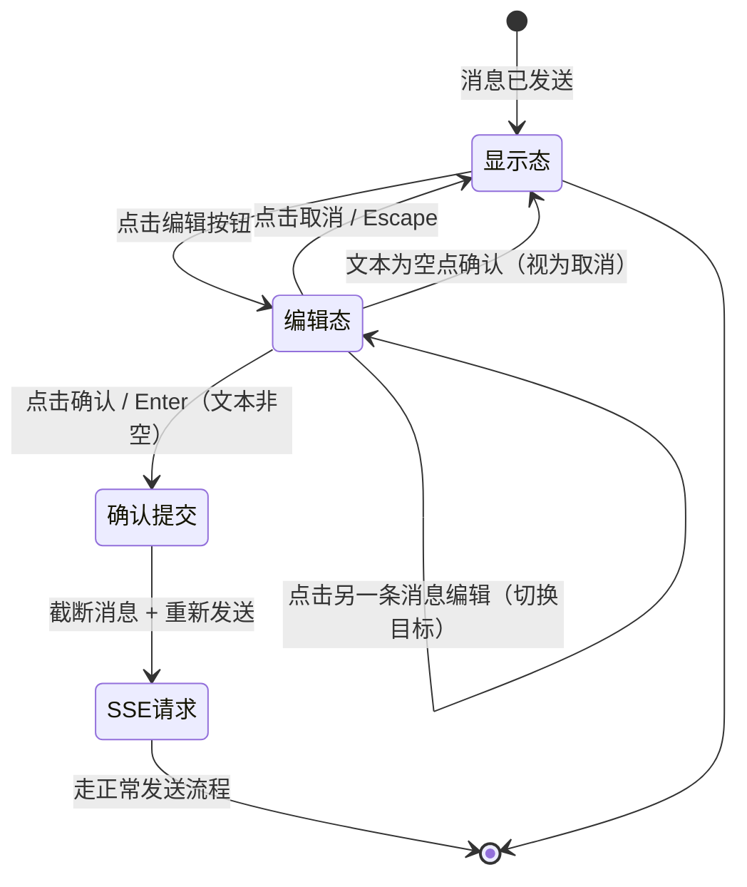
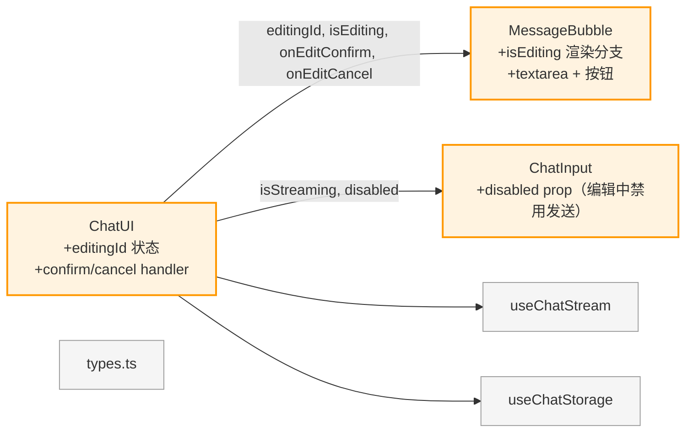

# R005 用户消息原地编辑 — 补充方案设计

> 本文档补充 R005 主文档 §4 交互链中 US-008（编辑已发送的问题）的详细设计。
> 原方案遗漏了编辑操作的交互链步骤，伪代码实现为"删除消息 + 跳回输入框"，
> 用户反馈该交互无法反悔，改为原地编辑模式。

## 1. 分析边界

- 分析类型：new_requirement（补充方案）
- 输入来源：现有代码 + 用户反馈 + R005 主文档
- 已读取代码：
  - `chat-ui.tsx`：`handleEdit` 当前实现（截断 + 回填输入框）
  - `message-bubble.tsx`：编辑按钮渲染 + hover 交互
  - `types.ts`：Message 类型定义
- 明确不分析：
  - 后端变更（纯前端交互改动）
  - 多轮对话上下文传递

## 2. 功能目标

- 用户：点击编辑按钮后，用户消息**原地变为可编辑**，可修改后确认重新发送，也可取消恢复原状
- 成功标准：
  1. 点击编辑 → 用户消息气泡变为 textarea，预填原文，显示 [确认] [取消]
  2. 点击确认 → 该消息之后的对话被删除（含 AI 回复），修改后的文本触发新 SSE 请求
  3. 点击取消 → 消息恢复为原始显示，不产生任何副作用
  4. 编辑中不能发送新消息（全局 isStreaming 语义扩展）
  5. 同一时刻只有一条消息处于编辑状态

## 3. 用户交互链（补充 US-008）

```
用户点击编辑按钮
│
├── 消息气泡变为 textarea + [确认] [取消] 按钮
│   ├── textarea 预填原文，自动聚焦
│   └── 编辑按钮隐藏（已在编辑态）
│   └── ChatInput 发送按钮禁用（防止编辑中发新消息）
│
├── 用户修改文本后点击 [确认] 或按 Enter
│   ├── 文本非空 → 截断该消息及之后所有消息（含 AI 回复）
│   │   ├── 用修改后的文本作为新用户消息
│   │   ├── 创建新 AI 消息（status=retrieving）
│   │   └── 发起 SSE 请求（与 handleSend 相同流程）
│   └── 文本为空 → 视为取消，恢复显示态
│
├── 用户点击 [取消] 或按 Escape
│   ├── 恢复原始消息显示（content 不变）
│   └── 无任何副作用
│
└── 用户点击另一条用户消息的编辑按钮
    └── 退出当前编辑态，切换到新目标消息编辑
```



## 4. 系统逻辑树（补充）

```
handleEdit(messageId)
├── 前置守卫
│  ├── isStreaming → return（SSE 进行中不允许编辑）
│  └── messageId 不存在 → return
│
├── 进入编辑态
│  └── setEditingId(messageId)
│     → MessageBubble 检测 editingId === message.id
│       → 渲染 textarea（预填 content）+ [确认] [取消]
│       → 隐藏编辑按钮
│
├── handleEditConfirm(messageId, newContent)
│  ├── newContent.trim() 为空 → 视为取消，恢复显示态
│  ├── 截断消息：messages.slice(0, msgIndex)
│  ├── 创建新用户消息（newContent）+ 新 AI 消息
│  ├── setMessages + saveMessages
│  ├── setEditingId(null)
│  └── startSSE(newContent, newAiMsgId)
│
└── handleEditCancel()
   └── setEditingId(null) → 恢复原始显示
```

## 5. 模块变更

### 5.1 状态管理 — ChatUI

新增 `editingId` 状态：

```text
const [editingId, setEditingId] = useState<string | null>(null);
```

- `editingId !== null` 时，输入框发送按钮禁用（防止编辑中发新消息）
- 传递给 MessageBubble 作为 `isEditing` prop

### 5.2 组件变更 — MessageBubble

Props 变更：

```text
interface MessageBubbleProps {
  message: Message;
  isStreaming: boolean;
  isEditing: boolean;          // 新增
  onEdit: (messageId: string) => void;
  onEditConfirm: (messageId: string, newContent: string) => void;  // 新增
  onEditCancel: () => void;    // 新增
  onRegenerate?: (messageId: string) => void;
}
```

渲染逻辑变更：

```text
isUser && isEditing 时：
├── 渲染 <textarea>（预填 message.content）代替消息气泡
├── textarea 下方显示 [确认] [取消] 按钮
├── textarea 自动聚焦（useRef + useEffect）
├── Enter 发送（Shift+Enter 换行）— 与 ChatInput 行为一致
└── Escape 取消

isUser && !isEditing 时：
└── 保持现有渲染（消息气泡 + hover 编辑按钮）
```

### 5.3 ChatUI handler 变更

| Handler | 当前行为 | 变更后行为 |
|---------|---------|-----------|
| `handleEdit(msgId)` | 截断消息 + 回填输入框 | `setEditingId(msgId)` — 只进入编辑态 |
| `handleEditConfirm(msgId, newContent)` | 不存在 | 截断 + 创建新消息 + 发 SSE |
| `handleEditCancel()` | 不存在 | `setEditingId(null)` |
| `handleSend()` | 直接发送 | 增加 `editingId !== null` 时禁用 |

**ChatInput 变更**：新增 `disabled` prop（或复用 `isStreaming` 语义），`editingId !== null` 时禁用发送按钮。

## 6. 功能网络影响



**不影响的模块**：后端、SSE 协议、消息持久化、类型定义。

## 7. 测试策略

| 场景 | 测试内容 | 层级 |
|------|---------|------|
| E-EDIT-01 | 点击编辑 → textarea 出现，预填原文 | L1 组件测试 |
| E-EDIT-02 | 点击确认 → 消息截断 + SSE 触发 | L1 组件测试 |
| E-EDIT-03 | 点击取消 → 恢复原始显示 | L1 组件测试 |
| E-EDIT-04 | 确认时空文本 → 视为取消 | L1 组件测试 |
| E-EDIT-05 | 编辑中发新消息 → 被阻止 | L1 组件测试 |
| E-EDIT-06 | 编辑中点其他消息编辑 → 切换编辑目标 | L1 组件测试 |
| E-EDIT-07 | Escape 键取消编辑 | L1 组件测试 |
| E-EDIT-08 | 确认后 localStorage 已更新（旧消息删除） | L1 组件测试 |

## 8. 方案设计

### 8.1 编辑状态管理

编辑态由 ChatUI 持有 `editingId`（`string | null`），通过 props 传递给 MessageBubble。不在 Message 类型上新增字段，因为编辑态是 UI 临时状态，不需要持久化。

### 8.2 textarea 行为

- 与 ChatInput 保持一致：Enter 发送，Shift+Enter 换行
- 自动聚焦（useRef + useEffect focus）
- 最小高度 1 行，最大高度与 ChatInput 一致

### 8.3 确认后的消息处理

确认编辑 = 截断 + 重发：
1. `messages.slice(0, msgIndex)` 删除该消息及之后所有消息
2. 用 `newContent` 创建新用户消息
3. 创建新 AI 消息（status=retrieving）
4. `saveMessages` 持久化
5. `startSSE(newContent, newAiMsgId)` 发起请求

与当前 `handleSend` 的区别仅在于：不需要清空输入框，因为输入来源是 textarea 而非 ChatInput。

### 8.4 迁移策略

- 移除 `handleEdit(msgId)` 中的截断 + 回填逻辑，改为 `setEditingId(msgId)`
- 新增 `handleEditConfirm` 和 `handleEditCancel`
- 移除 ChatUI 中 `handleEdit` 对 `input` / `setInput` 的依赖

## 9. Decision Items

| ID | 决策内容 | Type | Must Plan | Source | Blast Radius |
|----|---------|------|-----------|--------|-------------|
| DEC-edit-001 | 编辑态由 ChatUI editingId 管理，不在 Message 类型新增字段（UI 临时状态不需持久化） | code_design | no | discussion | types.ts 不变 |
| DEC-edit-002 | 确认编辑 = 截断消息 + 重新发送（与当前 handleRegenerate 复用 SSE 发起逻辑） | user_behavior | yes | user_feedback | chat-ui.tsx |
| DEC-edit-003 | 编辑中禁用 ChatInput 发送按钮（editingId !== null 时） | user_behavior | yes | discussion | chat-input.tsx |
| DEC-edit-004 | 空文本确认视为取消（不报错，静默恢复） | user_behavior | no | discussion | message-bubble.tsx |
