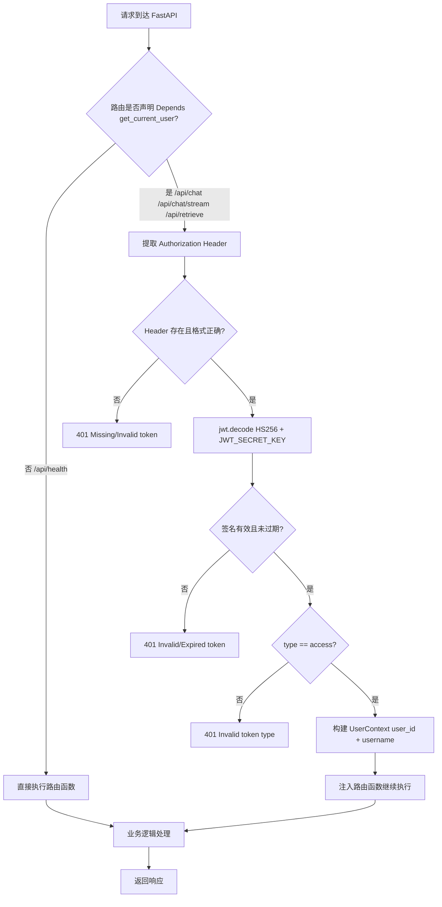
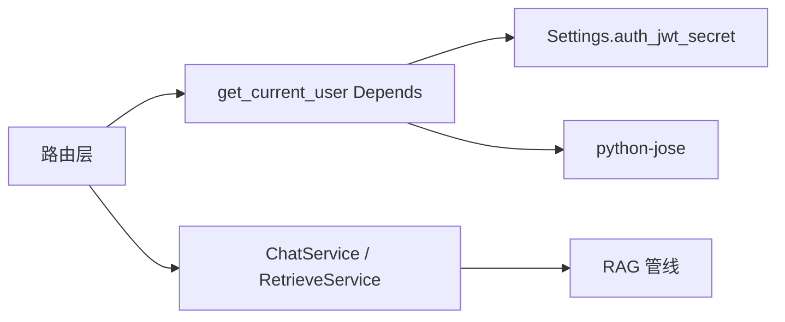
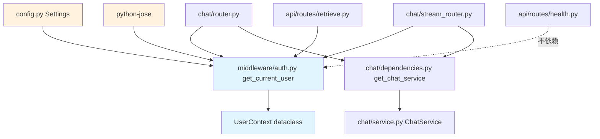
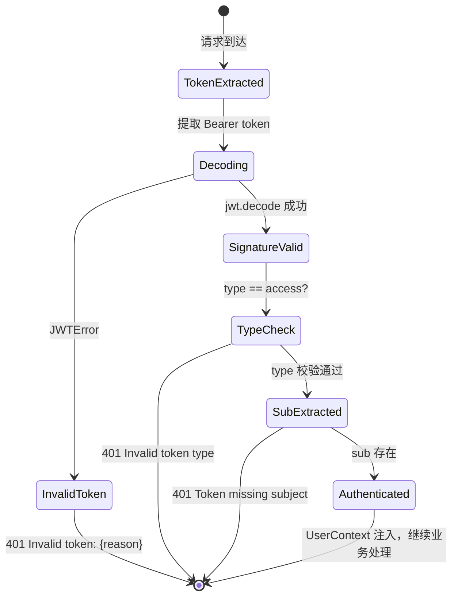
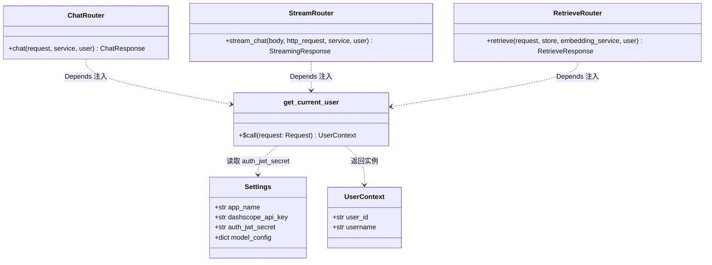

# 用户认证打通 — 后端 设计报告

> 关联设计：[用户认证打通 v1.0 前端](2026-05-22--R006-auth-integration-frontend.md)

## 1. 目标

- 对所有受保护 API 端点（`/api/chat`、`/api/chat/stream`、`/api/retrieve`）实施 JWT 鉴权
- 与 auth-center 共享 HS256 密钥，本地解码验证 JWT，不直接调用 auth-center
- 使用 FastAPI `Depends` 注入模式，按需声明鉴权，不引入全局中间件
- 提取 `user_id` / `username` 封装为 `UserContext`，为 R007 持久化预留

## 2. 现状分析

**当前已有：**

- FastAPI 路由层：`chat/router.py`、`chat/stream_router.py`、`api/routes/retrieve.py`、`api/routes/health.py`
- 依赖注入模式：`chat/dependencies.py` 中 `get_chat_service` 通过 `Depends` 链组装
- 配置管理：`app/config.py` 使用 pydantic-settings `Settings(BaseSettings)` 自动绑定环境变量
- Docker 部署：`deploy/docker-compose.local.yml`

**存在问题：**

- 所有 API 端点无鉴权，任何人可直接调用
- 无用户身份概念，无法为后续 R007 持久化关联用户

## 3. 数据模型与接口

### UserContext

```python
@dataclass(frozen=True)
class UserContext:
    """从 JWT 解码后的用户上下文"""
    user_id: str
    username: str
```

### JWT Payload 结构（auth-center 签发，后端只读验证）

```json
{
  "sub": "user_id_string",
  "client_id": "username_or_client_name",
  "exp": 1719360000,
  "type": "access"
}
```

### API 鉴权矩阵

| 端点 | 方法 | 鉴权 | 理由 |
|------|------|------|------|
| `/api/health` | GET | 否 | Docker 健康检查，不声明 `Depends(get_current_user)` |
| `/api/retrieve` | POST | 是 | 保护检索资源 |
| `/api/chat` | POST | 是 | 消费 LLM 资源 + 需关联用户 |
| `/api/chat/stream` | POST | 是 | 同上 |

### 请求格式变更

| Header | 值 | 必需 | 说明 |
|--------|-----|------|------|
| `Authorization` | `Bearer {jwt_token}` | 是 | auth-center 签发的 access_token |

### 响应格式（鉴权失败）

| 状态码 | 场景 | 响应体 |
|--------|------|--------|
| 401 | 缺少 Authorization header | `{"detail": "Missing authentication token"}` |
| 401 | token 格式错误 / 签名无效 / 已过期 | `{"detail": "Invalid token: {具体原因}"}` |
| 401 | token type 不是 access | `{"detail": "Invalid token type, expected 'access'"}` |
| 401 | token 中缺少 sub 字段 | `{"detail": "Token missing subject (sub)"}` |

所有 401 响应均携带 `WWW-Authenticate: Bearer` header。

## 4. 核心流程

```text
后端系统（R006 鉴权范围）
├─ API 入口
│  ├─ JWT 鉴权（Depends 注入）
│  │  ├─ 提取 Authorization: Bearer {token}
│  │  ├─ python-jose 解码验证（HS256）
│  │  ├─ 校验签名 + 过期时间 + type=access
│  │  └─ 提取 sub(user_id) / client_id → UserContext
│  ├─ 参数校验（Pydantic BaseModel，已有）
│  └─ 路由分发（已有）
├─ 业务逻辑
│  ├─ ChatService（不修改）
│  ├─ RetrieveService（不修改）
│  └─ R006 不传递 user_id 到 service 层
├─ 数据层
│  ├─ 无数据模型变更
│  └─ R006 不涉及数据库操作
├─ 外部依赖
│  ├─ auth-center：共享 JWT_SECRET_KEY（HS256），不直接调用
│  └─ LLM / Embedding / ChromaDB：不变
└─ 返回/错误处理
   ├─ 401 Unauthorized：JWT 缺失/无效/过期
   └─ 业务错误码：沿用 ChatErrorCode 体系
```





### 模块依赖关系图



### 状态与错误处理



| Scenario | State Change | Error Handling | User Feedback |
|----------|--------------|----------------|---------------|
| 无 Authorization header | TokenExtracted -> 401 | `HTTPException(401, "Missing authentication token")` | 前端 apiClient 检测 401 -> 刷新 token -> 重试 |
| token 格式损坏 | Decoding -> 401 | `HTTPException(401, "Invalid token: {JWTError}")` | 同上 |
| token 签名被篡改 | Decoding -> 401 | `HTTPException(401, "Invalid token: Signature verification failed")` | 同上 |
| token 已过期 | Decoding -> 401 | `HTTPException(401, "Invalid token: Signature has expired")` | 同上 |
| token type 不是 access | TypeCheck -> 401 | `HTTPException(401, "Invalid token type, expected 'access'")` | 前端提示认证异常 |
| token 缺少 sub 字段 | SubExtracted -> 401 | `HTTPException(401, "Token missing subject (sub)")` | 前端提示认证异常 |
| JWT_SECRET_KEY 未配置 | 应用启动失败 | `pydantic ValidationError` | 启动报错，需配置环境变量 |
| JWT_SECRET_KEY 与 auth-center 不一致 | 所有请求 -> 401 | 签名验证失败 | 部署配置检查 |

## 5. 项目结构与技术决策

### 目录结构

```
backend/
├─ app/
│  ├─ middleware/              # 【新增】中间件包
│  │  ├─ __init__.py          # 【新增】
│  │  └─ auth.py              # 【新增】JWT 验证 + get_current_user() + UserContext
│  ├─ config.py               # 【修改】新增 auth_jwt_secret 字段
│  ├─ main.py                 # 【不修改】
│  ├─ chat/
│  │  ├─ router.py            # 【修改】注入 Depends(get_current_user)
│  │  ├─ stream_router.py     # 【修改】注入 Depends(get_current_user)
│  │  ├─ dependencies.py      # 【不修改】
│  │  ├─ service.py           # 【不修改】
│  │  ├─ schemas.py           # 【不修改】
│  │  └─ errors.py            # 【不修改】
│  └─ api/
│     └─ routes/
│        ├─ health.py         # 【不修改】
│        └─ retrieve.py       # 【修改】注入 Depends(get_current_user)
├─ requirements.txt           # 【修改】新增 python-jose[cryptography]
├─ deploy/
│  └─ docker-compose.local.yml  # 【修改】后端服务新增 JWT_SECRET_KEY 环境变量
```

### 核心类图



### 模块与边界

| 模块 | 职责 | 边界 |
|------|------|------|
| `app/middleware/auth.py` | JWT 解码验证 + 提取用户信息 + Depends 入口 | 不调用外部服务、不查数据库、不做业务逻辑 |
| `app/config.py` | 提供 `auth_jwt_secret` 配置 | 仅新增一个字段，不修改已有字段 |
| 路由层（router/stream_router/retrieve） | 声明鉴权依赖 | 仅在函数签名加 `user: UserContext = Depends(get_current_user)`，不修改业务逻辑 |
| `app/chat/service.py` | 不修改 | R007 持久化时才引入 user_id |

### 技术决策表

| 决策 | 选型 | 理由 |
|------|------|------|
| JWT 解码库 | python-jose[cryptography] | FastAPI 生态主流选择，支持 HS256 + 多种算法 |
| 鉴权模式 | Depends 按需注入 | 不引入全局中间件，仅受保护端点声明即可 |
| 密钥共享 | 环境变量 JWT_SECRET_KEY | 与 auth-center 部署在同一 docker-compose，共享同一密钥 |

### 第三方依赖清单

| 依赖 | 版本 | 用途 |
|------|------|------|
| `python-jose[cryptography]` | >=3.3.0 | JWT 解码验证（HS256），cryptography extras 提供底层加密支持 |

### 依赖的已有模块

| Module | Dependency Type | Reason | Evidence |
|--------|-----------------|--------|----------|
| `app/config.py` Settings | 配置 | 新增 `auth_jwt_secret` 字段，从 `JWT_SECRET_KEY` 环境变量读取 | `Settings(BaseSettings)` 使用 pydantic-settings 自动绑定环境变量 |
| `app/chat/dependencies.py` | 模式参考 | `get_current_user` 遵循相同的 `Depends()` 注入模式 | `get_chat_service` 通过 `Depends` 链组装依赖 |
| `app/chat/router.py` | 修改目标 | 注入 `Depends(get_current_user)` | `router.post("/chat")` 当前无鉴权 |
| `app/chat/stream_router.py` | 修改目标 | 注入 `Depends(get_current_user)` | `router.post("/chat/stream")` 当前无鉴权 |
| `app/api/routes/retrieve.py` | 修改目标 | 注入 `Depends(get_current_user)` | `router.post("/retrieve")` 当前无鉴权 |
| `requirements.txt` | 依赖 | 新增 `python-jose[cryptography]` | 当前无 JWT 相关依赖 |

### 影响的已有模块

| Module | Impact | Required Change | Risk |
|--------|--------|-----------------|------|
| `app/config.py` | 新增配置字段 | 新增 `auth_jwt_secret: str` | Low — 向后兼容，仅新增字段 |
| `app/chat/router.py` | 注入鉴权 | 函数签名新增 `user: UserContext = Depends(get_current_user)` | Low — 不影响业务逻辑 |
| `app/chat/stream_router.py` | 注入鉴权 | 函数签名新增 `user: UserContext = Depends(get_current_user)` | Low — 不影响业务逻辑 |
| `app/api/routes/retrieve.py` | 注入鉴权 | 函数签名新增 `user: UserContext = Depends(get_current_user)` | Low — 不影响业务逻辑 |
| `app/chat/service.py` | 不修改 | R006 不传递 user_id 到 service | None |
| `app/api/routes/health.py` | 不修改 | Docker 健康检查，不声明 Depends 即不鉴权 | None |
| `app/main.py` | 不修改 | 使用 Depends 注入，无需注册全局中间件 | None |
| `deploy/docker-compose.local.yml` | 新增环境变量 | 后端服务新增 `JWT_SECRET_KEY`，值与 auth-center 一致 | Low — 仅新增一个环境变量 |

### 配置与第三方集成

| 配置项 | 环境变量 | 类型 | 必填 | 说明 |
|--------|----------|------|------|------|
| `Settings.auth_jwt_secret` | `JWT_SECRET_KEY` | `str` | 是 | 与 auth-center 共享的 HS256 签名密钥 |

#### 部署配置要求

`docker-compose.local.yml` 或 `.env` 必须新增：

```yaml
environment:
  - JWT_SECRET_KEY=${JWT_SECRET_KEY}  # 与 auth-center 使用相同的密钥
```

### 代码架构设计

#### config.py 新增字段

在 `Settings` 类中新增 `auth_jwt_secret` 字段：

```python
# app/config.py — 新增字段（插入到 dashscope 配置之后）

class Settings(BaseSettings):
    """应用配置，从环境变量 / .env 文件加载"""

    # ... 已有字段 ...

    # JWT 鉴权 — 与 auth-center 共享密钥（HS256）
    auth_jwt_secret: str = Field(
        ...,
        alias="JWT_SECRET_KEY",
        description="JWT 签名密钥，与 auth-center 共享（HS256）",
    )

    # ... 其余已有字段 ...
```

#### middleware/auth.py 完整实现

```python
# app/middleware/auth.py — 新增文件

"""JWT 鉴权中间件

使用 Depends(get_current_user) 按需注入鉴权。
与 auth-center 共享 HS256 密钥，本地解码验证。
"""

from __future__ import annotations

from dataclasses import dataclass

from fastapi import Depends, HTTPException, Request, status
from fastapi.security import HTTPAuthorizationCredentials, HTTPBearer
from jose import JWTError, jwt

from app.config import Settings, settings

# ---------------------------------------------------------------------------
# 数据模型
# ---------------------------------------------------------------------------

ALGORITHM = "HS256"


@dataclass(frozen=True)
class UserContext:
    """从 JWT 解码后的用户上下文"""

    user_id: str
    username: str


# ---------------------------------------------------------------------------
# Bearer token 提取器
# ---------------------------------------------------------------------------

_bearer_scheme = HTTPBearer(auto_error=False)


# ---------------------------------------------------------------------------
# Depends 注入入口
# ---------------------------------------------------------------------------


def get_current_user(
    request: Request,
    credentials: HTTPAuthorizationCredentials | None = Depends(_bearer_scheme),
) -> UserContext:
    """从 Authorization: Bearer {token} 提取并验证 JWT

    Raises:
        HTTPException 401: token 缺失、格式错误、签名无效、过期、类型不匹配
    """
    if credentials is None:
        raise HTTPException(
            status_code=status.HTTP_401_UNAUTHORIZED,
            detail="Missing authentication token",
            headers={"WWW-Authenticate": "Bearer"},
        )

    token = credentials.credentials

    try:
        payload = jwt.decode(
            token,
            settings.auth_jwt_secret,
            algorithms=[ALGORITHM],
        )
    except JWTError as exc:
        raise HTTPException(
            status_code=status.HTTP_401_UNAUTHORIZED,
            detail=f"Invalid token: {exc}",
            headers={"WWW-Authenticate": "Bearer"},
        ) from exc

    # 校验 token type
    token_type = payload.get("type")
    if token_type != "access":
        raise HTTPException(
            status_code=status.HTTP_401_UNAUTHORIZED,
            detail="Invalid token type, expected 'access'",
            headers={"WWW-Authenticate": "Bearer"},
        )

    # 提取 user_id（sub 字段）
    user_id = payload.get("sub")
    if not user_id:
        raise HTTPException(
            status_code=status.HTTP_401_UNAUTHORIZED,
            detail="Token missing subject (sub)",
            headers={"WWW-Authenticate": "Bearer"},
        )

    # 提取 username（client_id 字段作为显示名）
    username = payload.get("client_id", user_id)

    return UserContext(user_id=str(user_id), username=str(username))
```

#### router.py 注入示例

```python
# app/chat/router.py — 修改后

from fastapi import APIRouter, Depends, HTTPException

from app.chat.schemas import ChatRequest, ChatResponse
from app.chat.service import ChatService
from app.chat.dependencies import get_chat_service
from app.middleware.auth import UserContext, get_current_user  # 新增导入

router = APIRouter(prefix="/api", tags=["chat"])


@router.post("/chat", response_model=ChatResponse)
async def chat(
    request: ChatRequest,
    service: ChatService = Depends(get_chat_service),
    user: UserContext = Depends(get_current_user),  # 新增鉴权注入
):
    # R006: user 注入但不传递到 service（R007 使用 user_id 做持久化时传递）
    result = service.handle_chat(request.question, request.top_k)
    if result is None:
        raise HTTPException(status_code=404, detail="未找到相关教材内容")
    return result
```

#### stream_router.py 注入示例

```python
# app/chat/stream_router.py — 修改后（仅展示变更部分）

from app.middleware.auth import UserContext, get_current_user  # 新增导入


@router.post("/chat/stream")
async def stream_chat(
    body: ChatRequest,
    http_request: Request,
    service: ChatService = Depends(get_chat_service),
    user: UserContext = Depends(get_current_user),  # 新增鉴权注入
):
    # R006: user 注入但不传递到 service
    async def event_generator():
        # ... 与现有逻辑完全一致 ...
```

#### retrieve.py 注入示例

```python
# app/api/routes/retrieve.py — 修改后（仅展示变更部分）

from app.middleware.auth import UserContext, get_current_user  # 新增导入


@router.post("/retrieve", response_model=RetrieveResponse)
async def retrieve(
    request: RetrieveRequest,
    store: ChromaDBStore = Depends(get_vector_store),
    embedding_service: DashScopeEmbedding = Depends(get_embedding_service),
    user: UserContext = Depends(get_current_user),  # 新增鉴权注入
) -> RetrieveResponse:
    # R006: user 注入但不传递到 service
    # ... 与现有逻辑完全一致 ...
```

#### requirements.txt 新增依赖

```
# requirements.txt — 新增

# JWT 鉴权
python-jose[cryptography]>=3.3.0
```

## 6. 验收标准

| 验收条件 | 验证方式 | 通过标准 |
|----------|----------|----------|
| 无 token 请求受保护端点返回 401 | httpx TestClient | `POST /api/chat` 无 Authorization -> 401 |
| 健康检查不受鉴权影响 | httpx TestClient | `GET /api/health` 无 Authorization -> 200 |
| 有效 token 请求受保护端点返回 200 | httpx TestClient | `POST /api/chat` + 有效 Bearer token -> 200 |
| 流式端点鉴权通过 | httpx TestClient | `POST /api/chat/stream` + 有效 token -> SSE 流 |
| 检索端点鉴权通过 | httpx TestClient | `POST /api/retrieve` + 有效 token -> 200 |
| 过期 token 被拦截 | httpx TestClient | 过期 JWT -> 401 |
| 有效 token -> UserContext 正确提取 | 单元测试 | 断言 user_id 和 username 匹配 |
| 损坏 token -> 401 | 单元测试 | 断言 HTTPException + detail 含 "Invalid token" |
| type 非 access -> 401 | 单元测试 | 构造 `type=refresh` 的 JWT -> 401 |
| 不同 JWT_SECRET_KEY -> 401 | 单元测试 | 用错误 secret 签的 JWT -> 401 |
| Docker 环境端到端验证 | docker compose | auth-center 登录 -> 获取 token -> OctoTutor API -> 200 |
| JWT_SECRET_KEY 配置一致 | docker compose | 相同密钥时正常工作，不同密钥时全部 401 |

## 7. 暂不实现

| 功能 | 原因 | 预计周期 |
|------|------|----------|
| user_id 传递到 service 层 | R007 持久化阶段再引入 | R007 |
| RBAC 角色权限控制 | 当前只有普通用户一种角色 | R008+ |
| JWT 签发（后端自签） | 统一由 auth-center 签发 | 不计划 |
| token 黑名单 / 撤销 | 当前无此需求，auth-center 侧管理 | R008+ |
| 审计日志（user_id + 操作记录） | R007 持久化阶段再引入 | R007 |

---

### 测试策略

#### 单元测试

| 测试用例 | 覆盖点 | 方法 |
|----------|--------|------|
| 有效 token -> UserContext 正确提取 | `get_current_user` 正常路径 | 构造合法 JWT，断言 user_id 和 username |
| 无 Authorization header -> 401 | `_bearer_scheme` 返回 None | 不传 header，断言 HTTPException |
| 损坏 token -> 401 | `jwt.decode` 抛 JWTError | 传乱字符串，断言 401 + detail 包含 "Invalid token" |
| 过期 token -> 401 | `exp` 校验 | 构造 exp 已过的 JWT，断言 401 |
| type 非 access -> 401 | type 校验 | 构造 `type=refresh` 的 JWT，断言 401 |
| 缺少 sub -> 401 | sub 提取 | 构造无 sub 的 JWT，断言 401 |
| 不同 JWT_SECRET_KEY -> 401 | 签名校验 | 用错误 secret 签的 JWT，断言 401 |

```python
# 测试骨架示例

import pytest
from jose import jwt

from app.middleware.auth import get_current_user, UserContext, ALGORITHM


def _make_token(payload: dict, secret: str = "test-secret") -> str:
    return jwt.encode(payload, secret, algorithm=ALGORITHM)


def test_valid_token():
    token = _make_token({
        "sub": "user-123",
        "client_id": "testuser",
        "exp": 9999999999,
        "type": "access",
    })
    # ... 调用 get_current_user 并断言 UserContext


def test_missing_header():
    # ... 断言 HTTPException status_code=401
    pass


def test_expired_token():
    token = _make_token({
        "sub": "user-123",
        "exp": 1,
        "type": "access",
    })
    # ... 断言 HTTPException status_code=401
    pass
```

#### 集成测试

| 测试链路 | 验证内容 | 环境 |
|----------|----------|------|
| 无 token -> POST /api/chat -> 401 | 鉴权拦截生效 | httpx TestClient |
| 无 token -> GET /api/health -> 200 | 健康检查不受影响 | httpx TestClient |
| 有效 token -> POST /api/chat -> 200 | 鉴权通过 + 业务正常 | httpx TestClient |
| 有效 token -> POST /api/chat/stream -> SSE 流 | 流式端点鉴权通过 | httpx TestClient |
| 有效 token -> POST /api/retrieve -> 200 | 检索端点鉴权通过 | httpx TestClient |
| 过期 token -> POST /api/chat -> 401 | 过期 token 被拦截 | httpx TestClient |

#### 本地 Docker / docker compose

- docker-compose.local.yml 新增 `JWT_SECRET_KEY` 环境变量
- 验证链路：auth-center 登录 -> 获取 token -> 请求 OctoTutor API -> 200
- 验证链路：无 token 请求受保护端点 -> 401
- 验证链路：auth-center 和 OctoTutor 配置相同 JWT_SECRET_KEY 时正常工作
- LLM / Embedding 可 mock（不影响鉴权测试）

#### 回滚或降级

- 鉴权通过 `Depends` 注入，回滚方式：移除路由函数中的 `user: UserContext = Depends(get_current_user)` 参数即可恢复无鉴权状态
- `auth_jwt_secret` 为 `Field(...)` 必填字段，回滚时也需同时移除该配置项
- 不涉及数据库变更，回滚无数据风险
