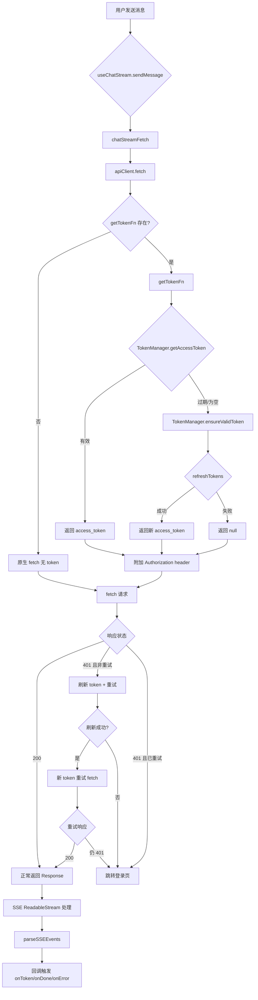
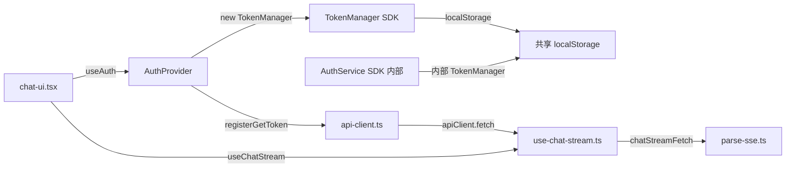
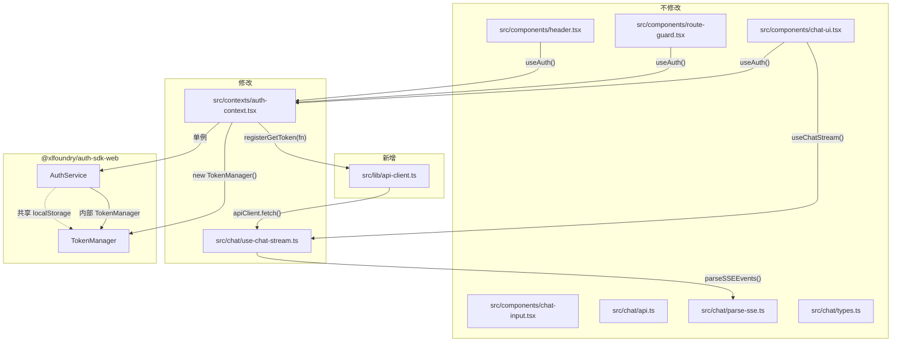
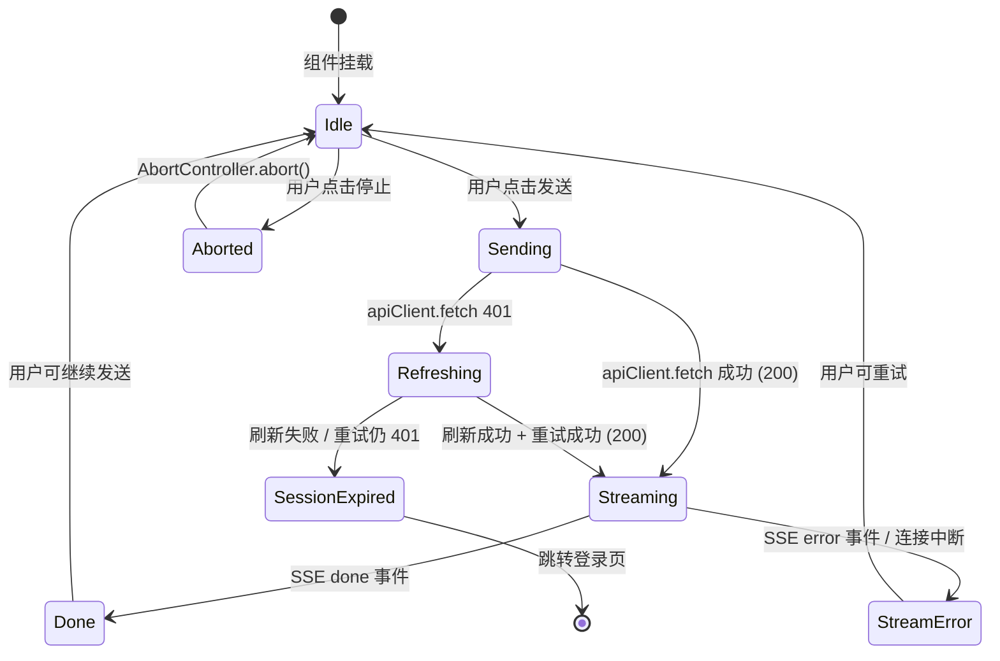

# 用户认证打通 — 前端 设计报告

> 关联设计：[用户认证打通 v1.0 后端](2026-05-22--R006-auth-integration-backend.md)

## 1. 目标

- 新增统一网络层 `api-client.ts`，自动附加 Bearer token + 刷新锁（并发去重）+ 401 重试
- 在 `auth-context.tsx` 中新增独立 `TokenManager` 实例，提供 `getAccessToken()` 回调并注册到 apiClient
- 修改 `use-chat-stream.ts`，将原生 `fetch` 替换为 `apiClient.fetch`
- SSE 流式请求兼容：apiClient 返回原生 `Response`，支持 `response.body.getReader()`

## 2. 现状分析

**当前已有：**

- React 组件层：`chat-ui.tsx`、`chat-input.tsx`、`route-guard.tsx`、`header.tsx`
- 认证上下文：`auth-context.tsx` 提供 `AuthService` 单例和 `useAuth()`
- SSE 流式请求：`use-chat-stream.ts` 使用原生 `fetch` + `parseSSEEvents`
- API 常量：`chat/api.ts` 导出 `API_BASE = '/api'`

**存在问题：**

- 所有 API 请求无 token 注入，后端 R006 鉴权上线后所有请求将被 401 拒绝
- 无 token 刷新机制，token 过期后无自动重试
- 并发请求同时发现 token 过期时，会发起多次刷新请求

## 3. 数据模型与接口

### 模块与边界

| 模块 | 职责 | 知道什么 | 不知道什么 |
|------|------|----------|------------|
| `api-client.ts` | 统一网络层：token 注入 + 刷新锁 + 401 重试 | getTokenFn 回调签名；如何附加 Authorization header；如何用 refreshPromise 去重并发刷新 | 不知道 AuthService、TokenManager、React 组件的存在 |
| `auth-context.tsx` | 认证上下文：SDK 初始化 + token 获取 + 状态管理 | AuthService 单例操作；TokenManager 独立实例的 ensureValidToken()；registerGetToken 注册时机 | 不知道 apiClient 如何使用 token、不知道哪些组件在发请求 |
| `use-chat-stream.ts` | SSE 流式请求：建立连接 + 解析事件 + 错误处理 | apiClient.fetch() 返回 Response；SSE ReadableStream 处理；AbortController 停止 | 不知道 token 从哪来、不知道刷新逻辑、不知道 401 重试逻辑 |
| SDK TokenManager | Token 存储：localStorage 读写 + 过期检测 + 刷新 | authCenterBaseURL、refresh_token；如何调用 auth-center 的 /api/v1/auth/token | 不知道 apiClient、不知道 AuthContext、不知道业务请求 |

### 组件职责划分

| 组件/模块 | 知道什么 | 不知道什么 |
|-----------|----------|------------|
| `api-client.ts` | getTokenFn 回调签名；refreshPromise 去重模式；X-Retry 防重试循环 | AuthService、TokenManager 类名；React 组件树；业务 URL 路径含义 |
| `auth-context.tsx` | AuthService 单例生命周期；TokenManager 独立实例创建和配置；registerGetToken 调用时机 | apiClient 内部如何发请求；useChatStream 如何解析 SSE；哪些组件在消费 token |
| `use-chat-stream.ts` | apiClient.fetch 返回 Response；SSE ReadableStream 解析；AbortController 取消 | token 从哪来；401 如何重试；刷新锁如何工作 |
| `TokenManager (SDK)` | localStorage key 名称（xlfoundry_access_token 等）；auth-center /api/v1/auth/token 接口 | apiClient 的存在；AuthContext 的存在；业务请求 URL |

## 4. 核心流程

```text
前端认证系统
├─ 统一网络层（apiClient）
│  ├─ api-client.ts（新增）
│  │  ├─ fetch() — 原生 fetch 增强（token 注入 + 401 重试）
│  │  ├─ registerGetToken() — 注册 token 获取函数
│  │  └─ refreshPromise — 刷新锁（并发去重）
│  └─ 请求流程
│     ├─ 发请求前：getToken() → 附加 Authorization header
│     ├─ 401 响应：刷新 token + 重试一次（X-Retry 防无限循环）
│     └─ 刷新失败：跳转登录页
├─ 认证上下文（AuthContext）
│  ├─ auth-context.tsx（修改）
│  │  ├─ 新增独立 TokenManager 实例
│  │  ├─ 新增 getAccessToken() 回调
│  │  └─ 初始化后调用 registerGetToken()
│  └─ useAuth() — 消费认证状态
├─ SSE 流式请求
│  ├─ use-chat-stream.ts（修改）
│  │  └─ chatStreamFetch 内 fetch → apiClient.fetch
│  └─ SSE 401 处理：重新建立连接（新 fetch 请求）
└─ 不修改的模块
   ├─ chat-ui.tsx
   ├─ chat-input.tsx
   ├─ route-guard.tsx
   ├─ header.tsx
   ├─ api.ts
   ├─ parse-sse.ts
   └─ types.ts
```





### 模块依赖关系图



### 刷新锁防御场景

| 场景 | 行为 | 结果 |
|------|------|------|
| 单个请求 token 过期 | getTokenFn() → TokenManager.ensureValidToken() → refreshTokens() | 自动刷新，请求正常 |
| 多个并发请求同时发现 token 过期 | 第一个触发 refreshPromise，后续请求 await 同一个 Promise | 只刷新一次，所有请求拿到同一 token |
| 刷新进行中用户点退出 | TokenManager.clearTokens() 清空 localStorage；刷新完成后 getTokenFn 返回的 token 可能已被清除 | 请求拿到 null token，401 重试检查 X-Retry 直接跳登录 |
| 刷新请求本身失败（网络错误） | refreshPromise catch → 返回 null；finally 清空 refreshPromise | 所有等待的请求拿到 null，401 重试也失败 → 跳登录 |
| 刷新请求超时（>30s） | Promise.race 超时 → 返回 null；finally 清空 refreshPromise | 同上，跳登录 |
| SSE 流式请求 401 | apiClient 401 重试拿到新 token → 重新 fetch 建立新 SSE 连接 | 用户看到短暂 loading，然后恢复正常流 |
| 重试请求仍 401 | X-Retry header 存在 → 不再重试 → redirectToLogin | 触发 auth:session-expired 事件 → AuthContext.login() 跳转 |
| refreshTokens() 返回 null（无 refresh_token） | getTokenFn 返回 null → 请求无 Authorization header | 后端返回 401 → 重试无 token → 跳登录 |

### 状态与错误处理



| Scenario | State Change | Error Handling | User Feedback |
|----------|--------------|----------------|---------------|
| 正常发送消息 | Idle → Sending → Streaming → Done | 无错误 | 流式显示 token |
| Token 过期（首次 401） | Sending → Refreshing → Streaming | apiClient 自动刷新 + 重试 | 用户无感知，短暂停顿 |
| Token 刷新失败 | Refreshing → SessionExpired | redirectToLogin 触发跳转 | 跳转认证中心登录页 |
| SSE 连接中断 | Streaming → StreamError | onError 回调 code='00001' action='retry' | 显示错误提示 + 重试按钮 |
| 用户点击停止 | Streaming/Idle → Aborted → Idle | AbortController.abort() | 停止接收，显示已接收内容 |
| 未初始化就发请求 | Sending → Streaming | getTokenFn 为 null → 无 Authorization header → 后端 401 | 401 重试仍无 token → 跳登录 |
| apiClient 注册前 TokenManager 未配置 | getTokenFn 返回 null | 同上 | 同上 |

## 5. 项目结构与技术决策

### 前端架构图

```
┌─────────────────────────────────────────────────────────┐
│                      React 组件层                        │
│  ┌──────────┐  ┌──────────┐  ┌──────────┐  ┌─────────┐ │
│  │ ChatUI   │  │ Header   │  │RouteGuard│  │ Callback│ │
│  └────┬─────┘  └────┬─────┘  └────┬─────┘  └────┬────┘ │
│       │              │              │              │      │
│       ▼              ▼              ▼              ▼      │
│  ┌─────────────────────────────────────────────────┐    │
│  │          AuthContext (useAuth)                   │    │
│  │  ┌──────────────────────────────────────────┐   │    │
│  │  │  AuthService 单例 (SDK)                   │   │    │
│  │  │  login / logout / handleCallback / ...    │   │    │
│  │  └──────────────────────────────────────────┘   │    │
│  │  ┌──────────────────────────────────────────┐   │    │
│  │  │  TokenManager 独立实例 (SDK)     ★ 新增   │   │    │
│  │  │  setConfig / ensureValidToken / ...       │   │    │
│  │  │  getAccessToken() → Promise<string|null>  │   │    │
│  │  └───────────────┬──────────────────────────┘   │    │
│  │                  │ registerGetToken()            │    │
│  │                  ▼                               │    │
│  └──────────────────┼──────────────────────────────┘    │
│                     │                                    │
│  ┌──────────────────▼──────────────────────────────┐    │
│  │        api-client.ts (src/lib/)         ★ 新增   │    │
│  │                                                  │    │
│  │  registerGetToken(fn)  ← AuthProvider 注册       │    │
│  │  apiClient.fetch(url, init) → Promise<Response>  │    │
│  │    ├─ 1. getToken() → Authorization header       │    │
│  │    ├─ 2. refreshPromise 刷新锁（并发去重）        │    │
│  │    └─ 3. 401 → 刷新 + 重试 → 仍失败 → 跳登录    │    │
│  └──────────────────┬──────────────────────────────┘    │
│                     │                                    │
│  ┌──────────────────▼──────────────────────────────┐    │
│  │  use-chat-stream.ts                     ★ 修改   │    │
│  │  chatStreamFetch: fetch(...) → apiClient.fetch() │    │
│  └─────────────────────────────────────────────────┘    │
│                                                          │
└─────────────────────────────────────────────────────────┘
                          │
                          ▼
                  ┌───────────────┐
                  │  后端 API      │
                  │  /api/chat/*   │
                  │  /api/retrieve │
                  │  (JWT 鉴权)    │
                  └───────────────┘
```

### 目录结构

```
frontend/src/
├── lib/
│   └── api-client.ts                  ★ 新增 — 统一网络层
├── contexts/
│   └── auth-context.tsx               ★ 修改 — TokenManager 实例 + getAccessToken
├── chat/
│   ├── use-chat-stream.ts             ★ 修改 — fetch → apiClient.fetch
│   ├── api.ts                         ── 不修改
│   ├── parse-sse.ts                   ── 不修改
│   └── types.ts                       ── 不修改
└── components/
    ├── chat-ui.tsx                     ── 不修改
    ├── chat-input.tsx                  ── 不修改
    ├── route-guard.tsx                 ── 不修改
    └── header.tsx                      ── 不修改
```

### 技术决策表

| 决策 | 选型 | 理由 |
|------|------|------|
| Token 刷新锁 | 模块级 `refreshPromise` 变量 | 轻量、无额外依赖，确保并发请求只刷新一次 |
| 401 重试 | X-Retry header 防循环 | 单次重试，避免无限重试循环 |
| apiClient 注册模式 | `registerGetToken(fn)` 回调 | 解耦 apiClient 与 AuthService/TokenManager，apiClient 不导入 SDK |
| session-expired 通知 | `window.dispatchEvent` CustomEvent | 简单的发布/订阅解耦，apiClient 不直接调用 AuthContext |
| SSE 兼容 | apiClient 返回原生 Response | 与 chatStreamFetch 现有 `response.body.getReader()` 完全兼容 |

### 第三方依赖清单

| 依赖 | 版本 | 用途 |
|------|------|------|
| `@xlfoundry/auth-sdk-web` | 已有 | 提供 `TokenManager` 类，用于 token 获取和刷新 |

### 依赖的已有模块

| Module | Dependency Type | Reason | Evidence |
|--------|-----------------|--------|----------|
| `@xlfoundry/auth-sdk-web` | npm package | 提供 TokenManager 类，用于 token 获取和刷新 | auth-sdk-web/src/token-manager.ts 公共导出 `export { TokenManager }` |
| `auth-context.tsx` | React Context | 现有认证上下文，提供 AuthService 单例和 useAuth() | auth-context.tsx 中 AuthService 单例 + AuthProvider |
| `use-chat-stream.ts` | React Hook | 现有 SSE 流式请求逻辑，需改用 apiClient.fetch | use-chat-stream.ts 第 25 行原生 fetch |
| `chat/api.ts` | 常量 | API_BASE 常量 (`/api`)，apiClient 复用 | api.ts 导出 `API_BASE = '/api'` |
| `parse-sse.ts` | 工具函数 | SSE 事件解析，不修改但 apiClient 返回值需兼容 | chatStreamFetch 使用 parseSSEEvents 处理 response.body ReadableStream |

### 影响的已有模块

| Module | Impact | Required Change | Risk |
|--------|--------|-----------------|------|
| `auth-context.tsx` | 新增 TokenManager 独立实例 + getAccessToken 回调 + registerGetToken 调用 | 1. 导入 TokenManager + registerGetToken<br>2. 新建 tokenManager 实例<br>3. init 后 tokenManager.setConfig(config)<br>4. 新增 getAccessToken 方法<br>5. init 完成后调用 registerGetToken<br>6. AuthContextValue 新增 getAccessToken 字段 | Low — 纯增量修改，不改变现有接口 |
| `use-chat-stream.ts` | chatStreamFetch 内 fetch 替换为 apiClient.fetch | 1. 导入 apiClient<br>2. 第 25 行 `fetch(...)` → `apiClient.fetch(...)`<br>3. 删除 API_BASE import（改由 apiClient 处理） | Low — fetch 签名兼容，apiClient.fetch 返回 Response |
| `chat/api.ts` | 不修改 | apiClient 内部自行定义 BASE_URL 或复用 API_BASE 常量 | None |

### 配置与第三方集成

| Area | Design | Existing Contract | New Contract Needed | Risk |
|------|--------|-------------------|---------------------|------|
| TokenManager 初始化 | AuthContext 中 new TokenManager() 独立实例，setConfig 与 AuthService 共享同一 AuthSDKConfig | AuthService.init(config) 内部调用 tokenManager.setConfig(config) | 无新契约，复用 AuthSDKConfig | Low — 两个 TokenManager 实例操作同一 localStorage key |
| apiClient 注册模式 | registerGetToken(fn) 注册回调，apiClient 不导入任何 SDK 类 | 无 | api-client.ts 导出 registerGetToken 和 fetchWithAuth | Low — 纯函数模块，无 React 依赖 |
| SSE 兼容性 | apiClient.fetch 返回原生 Response，与 chatStreamFetch 现有 response.body.getReader() 调用完全兼容 | chatStreamFetch 第 38 行 response.body?.getReader() | 无 | None — fetch 返回值类型一致 |
| session-expired 事件 | apiClient 通过 window.dispatchEvent CustomEvent 通知 AuthContext | AuthContext 已有 onSessionExpired 回调 | 自定义事件 'auth:session-expired' | Low — 简单的发布/订阅解耦 |

### 代码架构设计

#### 1. api-client.ts — 完整实现

```typescript
/**
 * api-client.ts — 统一网络层
 *
 * 职责：token 注入 + 刷新锁（并发去重）+ 401 重试
 * 不依赖任何 React 组件或 AuthService，通过 registerGetToken 解耦
 */

const BASE_URL = '/api';

type GetTokenFn = () => Promise<string | null>;

/** token 获取函数，由 AuthProvider 初始化后注册 */
let getTokenFn: GetTokenFn | null = null;

/** 注册 token 获取函数 */
export function registerGetToken(fn: GetTokenFn): void {
  getTokenFn = fn;
}

/** 跳转登录页（兜底，使用 AuthContext.login 更优先） */
function redirectToLogin(): void {
  // 通过 window.location 跳转认证中心
  // AuthContext.login() 内部调用 AuthService.login() 完成跳转
  // apiClient 不直接调用 AuthContext，通过事件解耦
  window.dispatchEvent(new CustomEvent('auth:session-expired'));
}

/**
 * 统一 fetch：自动附加 Bearer token + 401 重试
 *
 * 返回值与原生 fetch 完全一致（Response），支持 SSE ReadableStream
 */
export async function fetchWithAuth(
  url: string,
  init?: RequestInit,
): Promise<Response> {
  const fullURL = url.startsWith('http') ? url : `${BASE_URL}${url}`;

  // 1. 获取 token
  const token = getTokenFn ? await getTokenFn() : null;

  // 2. 构建 headers
  const headers = new Headers(init?.headers);
  if (token) {
    headers.set('Authorization', `Bearer ${token}`);
  }
  // 如果没有显式设置 Content-Type 且有 body，默认 JSON
  if (init?.body && !headers.has('Content-Type')) {
    headers.set('Content-Type', 'application/json');
  }

  // 3. 发送请求
  const response = await fetch(fullURL, {
    ...init,
    headers,
  });

  // 4. 401 处理：刷新 token + 重试一次
  if (response.status === 401 && !headers.has('X-Retry')) {
    const newToken = await refreshAndGetToken();

    if (newToken) {
      // 重试请求
      const retryHeaders = new Headers(init?.headers);
      retryHeaders.set('Authorization', `Bearer ${newToken}`);
      retryHeaders.set('X-Retry', 'true'); // 防止无限循环
      if (init?.body && !retryHeaders.has('Content-Type')) {
        retryHeaders.set('Content-Type', 'application/json');
      }

      return fetch(fullURL, {
        ...init,
        headers: retryHeaders,
      });
    }
  }

  // 5. 重试仍 401 或刷新失败：触发 session-expired
  if (response.status === 401) {
    redirectToLogin();
  }

  return response;
}

/** 刷新锁：确保并发请求只刷新一次 */
let refreshPromise: Promise<string | null> | null = null;

/**
 * 刷新 token 并返回新的 access_token
 * 多个并发调用共享同一个刷新 Promise（去重）
 */
async function refreshAndGetToken(): Promise<string | null> {
  // 已有刷新进行中，复用同一个 Promise
  if (refreshPromise) {
    return refreshPromise;
  }

  // 发起刷新
  refreshPromise = (async () => {
    try {
      // 30s 超时保护
      const result = await Promise.race([
        getTokenFn ? getTokenFn() : Promise.resolve(null),
        new Promise<null>((_, reject) =>
          setTimeout(() => reject(new Error('Token refresh timeout')), 30_000),
        ),
      ]);
      return result;
    } catch {
      return null;
    } finally {
      // 无论成功失败，清空刷新锁
      refreshPromise = null;
    }
  })();

  return refreshPromise;
}
```

#### 2. auth-context.tsx — 修改点

```typescript
// === 新增 import ===
import { AuthService, TokenManager, type UserInfo, type AuthState, type AuthSDKConfig } from "@xlfoundry/auth-sdk-web"
import { registerGetToken } from "../lib/api-client"

// === 新增 TokenManager 独立实例（与 AuthService 内部的 TokenManager 共享 localStorage） ===
let tokenManager: TokenManager | null = null

function getTokenManager(): TokenManager {
  if (!tokenManager) {
    tokenManager = new TokenManager()
  }
  return tokenManager
}

// === AuthContextValue 新增字段 ===
export interface AuthContextValue {
  /** 是否已认证 */
  isAuthenticated: boolean
  /** 当前用户信息 */
  user: UserInfo | null
  /** 跳转认证中心登录 */
  login: () => Promise<void>
  /** 登出 */
  logout: () => Promise<void>
  /** 处理 OAuth 回调 */
  handleCallback: () => Promise<UserInfo | null>
  /** SDK 是否初始化完成 */
  isInitialized: boolean
  /** 初始化错误信息 */
  initError: string | null
  /** ★ 新增：获取有效的 access_token（过期自动刷新） */
  getAccessToken: () => Promise<string | null>
}

// === AuthProvider useEffect 内新增逻辑 ===
// 在 service.init(config).then(...) 回调中新增：

// .then((config: RuntimeConfig) => {
//   const sdkConfig: AuthSDKConfig = {
//     clientId: config.clientId,
//     authCenterBaseURL: config.authCenterBaseURL,
//     redirectUri: window.location.origin + "/callback",
//     onSessionExpired: () => {
//       setAuthState({ isAuthenticated: false, user: null })
//     },
//   }
//
//   // ★ 新增：初始化独立 TokenManager 实例
//   const tm = getTokenManager()
//   tm.setConfig(sdkConfig)
//
//   // ★ 新增：注册 getAccessToken 到 apiClient
//   registerGetToken(() => tm.ensureValidToken())
//
//   return service.init(sdkConfig)
// })

// === value 新增 getAccessToken ===
// const value: AuthContextValue = {
//   ...existingFields,
//   getAccessToken: useCallback(async () => {
//     return getTokenManager().ensureValidToken()
//   }, []),
// }

// === 监听 apiClient 的 session-expired 事件，触发 login ===
// useEffect(() => {
//   const handleSessionExpired = () => {
//     const service = getAuthService()
//     service.login()
//   }
//   window.addEventListener('auth:session-expired', handleSessionExpired)
//   return () => window.removeEventListener('auth:session-expired', handleSessionExpired)
// }, [])
```

#### 3. use-chat-stream.ts — 修改点

```typescript
// === 修改 import ===
// 删除: import { API_BASE } from './api';
// 新增:
import { fetchWithAuth } from '../lib/api-client';

// === chatStreamFetch 函数修改（仅第 25 行） ===
export function chatStreamFetch(
  question: string,
  callbacks: SSECallbacks,
  abortController: AbortController,
  onSetStreaming: (v: boolean) => void,
) {
  let firstEventReceived = false;
  let remaining = '';

  // ★ 修改：fetch → fetchWithAuth，URL 不再拼接 API_BASE（apiClient 内部处理）
  fetchWithAuth('/chat/stream', {
    method: 'POST',
    headers: { 'Content-Type': 'application/json' },
    body: JSON.stringify({ question, top_k: 10 }),
    signal: abortController.signal,
  })
    .then(async (response) => {
      // 后续逻辑完全不变（response 类型一致）
      if (!response.ok) {
        // ... 现有错误处理
      }
      const reader = response.body?.getReader();
      // ... 其余代码不变
    })
    .catch((err) => {
      // ... 现有错误处理不变
    })
    .finally(() => {
      onSetStreaming(false);
    });
}
```

## 6. 验收标准

| 验收条件 | 验证方式 | 通过标准 |
|----------|----------|----------|
| registerGetToken 注册后自动附加 Authorization header | 单元测试 | 请求 header 包含 `Bearer {token}` |
| registerGetToken 未注册时不附加 header | 单元测试 | 请求 header 无 Authorization（降级行为） |
| 401 + 刷新成功 → 自动重试 → 返回成功响应 | 单元测试 | 重试请求带新 token，返回 200 |
| 401 + 刷新失败 → 触发 `auth:session-expired` 事件 | 单元测试 | 事件被 dispatch，跳转登录 |
| 401 重试请求带 X-Retry header → 不再重试 | 单元测试 | 只重试一次，不无限循环 |
| 并发调用 fetchWithAuth → getTokenFn 只调用一次刷新 | 单元测试 | refreshPromise 去重验证 |
| 刷新超时（>30s）→ 返回 null → 跳登录 | 单元测试 | 超时后跳转登录 |
| TokenManager 独立实例 init 后正确调用 setConfig | 单元测试 | setConfig 被调用一次 |
| registerGetToken 在 init 完成后被调用 | 单元测试 | 调用顺序正确 |
| getAccessToken() 返回有效 token / 过期后自动刷新 | 单元测试 | 返回非 null token |
| `auth:session-expired` 事件触发 login() | 单元测试 | login 被调用 |
| chatStreamFetch 使用 fetchWithAuth 而非原生 fetch | 单元测试 | 无直接 fetch 调用 |
| URL 路径正确（`/chat/stream`） | 单元测试 | 不再拼接 API_BASE |
| 登录 → 发送 Chat → 带 Authorization → 正常收到 SSE 流 | Docker E2E | 完整链路通过 |
| Token 过期 → 发送消息 → 自动刷新 → 正常收到响应 | Docker E2E | 无感知刷新 |
| 无 token → 发送消息 → 401 → 跳转登录页 | Docker E2E | 跳转认证中心 |
| /api/health 无 token → 200 | Docker E2E | 健康检查不受影响 |

## 7. 暂不实现

| 功能 | 原因 | 预计周期 |
|------|------|----------|
| 请求队列 / 离线缓存 | 当前仅需在线场景 | 不计划 |
| 多 tab 刷新同步 | localStorage 跨 tab 已天然同步 | 不计划 |
| token 加密存储 | 当前使用 localStorage 明文存储，安全性由 auth-center 管理 | R008+ |
| 请求重试策略（指数退避） | 当前仅 401 单次重试，其他错误不重试 | R008+ |
| 请求取消 / 请求去重 | 当前 AbortController 已满足需求 | 不计划 |

---

### 测试策略

#### 单元测试

- **api-client.ts**：
  - `registerGetToken` 注册后 `fetchWithAuth` 自动附加 Authorization header
  - `registerGetToken` 未注册时不附加 header（降级行为）
  - 401 响应 + 刷新成功 → 自动重试 → 返回成功响应
  - 401 响应 + 刷新失败 → 触发 `auth:session-expired` 事件
  - 401 重试请求带 X-Retry header → 不再重试
  - 并发调用 `fetchWithAuth`（多个 401）→ getTokenFn 只调用一次刷新（refreshPromise 去重）
  - 刷新超时（>30s）→ 返回 null → 跳登录

- **auth-context.tsx**：
  - TokenManager 独立实例在 init 后正确调用 setConfig
  - registerGetToken 在 init 完成后被调用
  - getAccessToken() 返回有效 token / 过期后自动刷新
  - `auth:session-expired` 事件触发 login()

- **use-chat-stream.ts**：
  - chatStreamFetch 使用 fetchWithAuth 而非原生 fetch
  - URL 路径正确（`/chat/stream` 而非 `${API_BASE}/chat/stream`）
  - 401 后 apiClient 层自动处理，chatStreamFetch 感知不到 token 问题

#### 集成测试

- 端到端验证（Docker Compose 环境）：
  1. 登录 → 发送 Chat 消息 → 验证请求带 Authorization header → 正常收到 SSE 流
  2. Token 过期（手动修改 localStorage expires_at）→ 发送消息 → 自动刷新 → 正常收到响应
  3. 无 token → 发送消息 → 后端 401 → 前端跳转登录页
  4. /api/health 无 token → 正常返回 200

#### 回滚或降级

- **apiClient 降级**：如果 registerGetToken 未被调用（例如 AuthProvider 初始化失败），apiClient.fetch 仍然工作，只是不附加 Authorization header。后端返回 401 后，触发跳转登录页。行为与当前（R005 无认证）相比是安全的退化。
- **回滚策略**：api-client.ts 是新增文件，回滚只需将 use-chat-stream.ts 的 `fetchWithAuth` 恢复为 `fetch` + `API_BASE`，并删除 api-client.ts。auth-context.tsx 的增量修改也可独立回滚。
