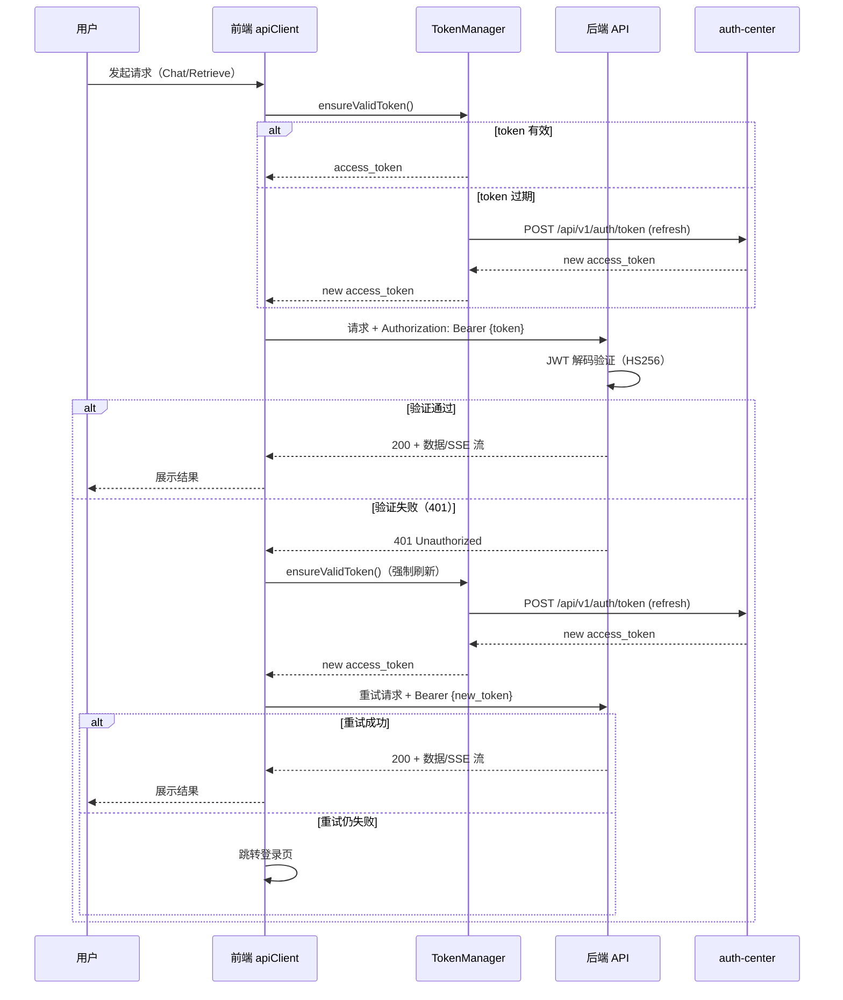

# R006 用户认证打通 需求分析

## 1. 分析边界

- 分析类型：new_requirement（新需求功能分析）
- 输入来源：用户请求 + brainstorm 文档 + R005 已实现代码 + architecture.md + 前后端现有代码 + auth-sdk-web SDK 源码
- 已读取代码：
  - 后端：main.py、config.py、chat/router.py、chat/stream_router.py、chat/dependencies.py、chat/service.py、chat/schemas.py、chat/errors.py、api/routes/health.py、api/routes/retrieve.py、requirements.txt
  - 前端：chat/use-chat-stream.ts、chat/api.ts、chat/types.ts、contexts/auth-context.tsx、components/chat-ui.tsx
  - SDK：auth-sdk-web/src/auth-service.ts、token-manager.ts、http-client.ts、types.ts
  - 部署：docker-compose.local.yml
- 已读取文档：architecture.md、R005 分析文档、R006 brainstorm 文档
- 未读取/缺失上下文：auth-center 服务源码（不在本仓库，通过 brainstorm 文档获取 JWT 细节）
- 明确不分析：
  - 消息持久化（R007）
  - 对话列表 UI（R007）
  - WebSocket 双向通信
  - LangChain/LangGraph Agent 架构（R008）
  - 多轮对话上下文管理（R008）
  - auth-center 服务代码修改
  - auth-sdk-web SDK 代码修改

## 2. 功能目标

- 用户：通过浏览器访问 OctoTutor 的用户
- 目标：**前端请求自动携带 JWT token，后端验证 token 并提取 user_id，实现完整认证链路**
- 成功标准：
  1. 用户登录后，前端所有 API 请求自动附带 `Authorization: Bearer {token}`
  2. 后端对 /api/retrieve、/api/chat、/api/chat/stream 验证 JWT，无效 token 返回 401
  3. /api/health 不需要鉴权，Docker 健康检查不受影响
  4. token 过期时前端自动刷新并重试请求，用户无感知
  5. 刷新失败时跳转登录页
  6. SSE 流式请求同样支持 token 附加和 401 重试
- 非目标：
  - 消息持久化、对话列表 UI（R007）
  - 多轮对话上下文管理（R008）
  - 修改 auth-center 或 auth-sdk-web 代码

## 3. 用户故事

| ID | Role | Action | Benefit | Acceptance |
|----|------|--------|---------|------------|
| US-001 | 用户 | 登录后使用 Chat 功能 | 请求自动携带身份凭证 | apiClient 自动附加 Bearer token |
| US-002 | 用户 | token 过期时继续使用 | 无需重新登录 | apiClient 自动刷新 token 并重试 |
| US-003 | 用户 | 未登录时访问 API | 被正确拦截 | 后端返回 401，前端跳转登录页 |
| US-004 | 运维 | Docker 健康检查 | 不受认证影响 | /api/health 不需要 token |
| US-005 | 用户 | 多个请求同时遇到 token 过期 | 只刷新一次 | refreshPromise 刷新锁去重 |
| US-006 | 用户 | SSE 流式请求中遇到 401 | 自动恢复 | apiClient 支持 SSE + 401 重试 |

## 4. 用户交互链

| Step | User Action | System Response | Success State | Failure/Empty State |
|------|-------------|-----------------|---------------|---------------------|
| 1 | 访问 /chat | RouteGuard 检查登录状态 | 已登录 → 渲染 Chat UI | 未登录 → 跳转认证中心 |
| 2 | 输入问题点击发送 | apiClient 附加 Bearer token → 发送请求 | 请求到达后端 | token 获取失败 → 跳转登录 |
| 3 | 等待回答 | 后端验证 JWT → 提取 user_id → 处理请求 | 正常返回 SSE 流 | 401 → 自动刷新重试 |
| 4 | token 过期（自动） | apiClient 检测过期 → 刷新 → 重试 | 用户无感知 | refresh 失败 → 跳转登录 |
| 5 | 使用检索功能 | apiClient 附加 Bearer token → /api/retrieve | 正常返回结果 | 401 → 同上重试流程 |

## 7. 能力模型

| Capability ID | Name | Source Analysis | Source Decisions | Journey Type | Risk Tags | Must Plan | Required Evidence |
|---------------|------|-----------------|------------------|--------------|-----------|-----------|-------------------|
| CAP-auth-001 | JWT 鉴权验证 | R006-auth-integration | DEC-auth-001, DEC-auth-002 | network | security | yes | entry_action:前端发送请求, actual_endpoint:POST /api/chat/stream + Authorization header, user_visible_success:正常对话, failure_path_result:401 → 前端自动刷新重试 |
| CAP-auth-002 | Token 自动刷新 | R006-auth-integration | DEC-auth-003 | failure_path | security,network | yes | entry_action:token 过期, actual_endpoint:POST /api/v1/auth/token (refresh), user_visible_success:用户无感知，请求自动恢复, failure_path_result:refresh 失败 → 跳转登录页 |
| CAP-auth-003 | 刷新锁去重 | R006-auth-integration | DEC-auth-004 | failure_path | concurrency | yes | entry_action:多个并发请求同时发现 token 过期, actual_endpoint:POST /api/v1/auth/token (refresh), user_visible_success:只刷新一次，所有请求恢复, failure_path_result:刷新失败 → 所有等待请求统一跳转登录 |
| CAP-auth-004 | SSE 请求鉴权 | R006-auth-integration | DEC-auth-005 | network | network,security | yes | entry_action:前端发起 SSE 流式请求, actual_endpoint:POST /api/chat/stream + Authorization header, user_visible_success:流式回答正常显示, failure_path_result:401 → apiClient 刷新重试后重新建立 SSE 连接 |

## 9. Decision Items

| ID | Summary | Type | Must Plan | Source | Blast radius |
|----|---------|------|-----------|--------|--------------|
| DEC-auth-001 | JWT 共享密钥本地验证（HS256），不查 Redis 黑名单 | architecture_impact | yes | brainstorm | middleware/auth.py, config.py |
| DEC-auth-002 | Depends 注入鉴权（非全局中间件），与现有 Depends 模式一致 | architecture_impact | yes | brainstorm | router.py, stream_router.py, retrieve.py |
| DEC-auth-003 | 前端 apiClient 统一网络层，通过 TokenManager 获取 token | architecture_impact | yes | brainstorm + SDK 探查 | api-client.ts, auth-context.tsx |
| DEC-auth-004 | 刷新锁（refreshPromise 去重），防止并发刷新 | failure_path | yes | brainstorm | api-client.ts |
| DEC-auth-005 | SSE 请求走 apiClient，401 重试后重新建立 SSE 连接 | failure_path | yes | brainstorm | api-client.ts, use-chat-stream.ts |
| DEC-auth-006 | user_id 路由层注入但 R006 不传递到 service | scope_boundary | no | brainstorm | router.py, stream_router.py |
| DEC-auth-007 | 不鉴权 /api/health | boundary | no | brainstorm | health.py |
| DEC-auth-008 | TokenManager 独立实例 + AuthContext 暴露 getAccessToken | contract_impact | yes | SDK 探查 | auth-context.tsx, api-client.ts |

## 10. 风险与缺口

### 风险

| ID | Risk | Evidence | Impact | Suggested Handling |
|----|------|----------|--------|--------------------|
| RISK-001 | JWT_SECRET_KEY 未配置导致后端启动失败 | config.py Field(...) 必填 | High | 启动时校验 + 部署文档明确 |
| RISK-002 | auth-center 和后端 JWT_SECRET_KEY 不一致导致所有请求 401 | 共享密钥模式依赖配置同步 | High | docker-compose .env 统一注入 + 集成测试覆盖 |
| RISK-003 | TokenManager 与 AuthService 内部 TokenManager 实例不同步 | 两个独立 TokenManager 实例操作同一 localStorage | Medium | 确保两者使用相同 config；SDK storage-sync 监听跨实例同步 |
| RISK-004 | 刷新锁超时导致所有请求卡住 | refreshPromise 未设超时 | Medium | refresh Promise 加 30s 超时，finally 确保清空 |
| RISK-005 | SSE 流式请求 401 重试，用户短暂看到 loading | SSE 需要重新建立连接 | Low | 首次 401 在 SSE 事件前触发，用户只感知一次短暂 loading |

### 缺口

| ID | Gap | Resolution | Priority |
|----|-----|------------|----------|
| GAP-001 | AuthService 不暴露 getAccessToken() | AuthContext 新增独立 TokenManager 实例，通过 ensureValidToken() 获取 token，暴露 getAccessToken 回调 | High |
| GAP-002 | AuthHttpClient 不支持 SSE ReadableStream | 不使用 AuthHttpClient，自建 apiClient 支持 SSE | High |
| GAP-003 | JWT_SECRET_KEY 部署配置 | docker-compose.local.yml 新增 JWT_SECRET_KEY 环境变量 | High |
| GAP-004 | apiClient 跳转登录页路径与 RouteGuard 一致性 | 使用 AuthContext.login() 方法而非硬编码路径 | Medium |

## 11. 集成测试要求

- 是否需要真实集成测试：是
- 推荐运行方式：本地 Docker Compose（auth-center + OctoTutor 后端 + 前端）
- Docker / docker compose 支持：已有 docker-compose.local.yml，需新增 JWT_SECRET_KEY 环境变量
- mock 允许范围：JWT_SECRET_KEY 必须真实配置；LLM/Embedding 可 mock
- 必须验证的链路：
  1. 无 token 请求受保护端点 → 401
  2. 有效 token 请求 → 200
  3. 过期 token → 401 → 前端刷新重试 → 200
  4. SSE 流式请求 + token → 正常流式返回
  5. /api/health 无 token → 200（不受鉴权影响）
