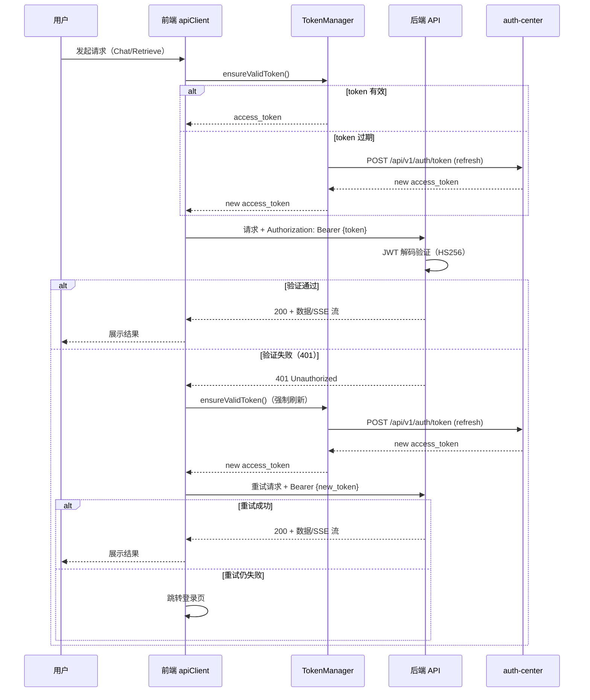

# R006 用户认证打通 — 功能分析

## 概述

前端请求自动携带 JWT token，后端验证 token 并提取 user_id，实现完整认证链路。通过共享密钥（HS256）本地 JWT 验证，前端 apiClient 统一网络层自动附加 token 并处理过期刷新，后端通过 FastAPI Depends 注入鉴权，实现端到端身份认证。

## 一、交互链

用户视角下的操作路径。每条链对应一个具体场景，以用户故事开头。

### 场景 1：登录后使用 Chat

**用户故事**：作为用户，我想登录后使用 Chat 功能，以便请求自动携带身份凭证。

用户访问 /chat 页面，RouteGuard 检查登录状态。已登录则渲染 Chat UI，用户输入问题并发送，apiClient 自动从 TokenManager 获取 access_token 并附加到请求头 `Authorization: Bearer {token}`。后端收到请求后通过 JWT 解码验证（HS256），提取 user_id 注入 UserContext，路由处理器正常执行并返回 SSE 流。

### 场景 2：Token 过期自动恢复

**用户故事**：作为用户，我想 token 过期时继续使用，以便无需重新登录。

用户正常使用过程中 token 过期，apiClient 检测到过期后自动调用 TokenManager.ensureValidToken() 刷新 token，刷新成功后重试原请求，整个过程用户无感知。多个并发请求同时遇到 token 过期时，refreshPromise 刷新锁保证只刷新一次，所有请求共享同一个刷新结果。

### 场景 3：未登录访问

**用户故事**：作为用户，我想未登录时被正确引导，以便知道需要登录。

用户未登录状态下访问需要鉴权的 API（如 /api/chat、/api/retrieve），请求无 token 或 token 无效，后端返回 401 Unauthorized。前端 apiClient 收到 401 后尝试刷新 token，刷新也失败则跳转认证中心登录页，通过 AuthContext.login() 方法确保路径一致。

## 二、逻辑树

系统视角下的处理流程。关注事件流和状态流转，以表格呈现。

### 事件流：JWT 鉴权验证

| 时刻 | 事件 | 处理 | 产生的新事件 |
|------|------|------|-------------|
| T1 | Request arrives | apiClient 拦截，调用 TokenManager.ensureValidToken() | token_ready / token_invalid |
| T2 | token_ready | 提取 Bearer token，附加到 Authorization header | request_with_token |
| T3 | request_with_token | 后端 extract Bearer token from header | token_extracted |
| T4 | token_extracted | JWT decode(HS256) — 验证签名 + exp + type | jwt_validated / jwt_rejected |
| T5 | jwt_validated | 提取 sub(client_id) 作为 user_id，构建 UserContext | UserContext_injected |
| T6 | UserContext_injected | 路由处理器执行业务逻辑 | response_ready |
| T7 | jwt_rejected | 返回 401 Unauthorized | 401_response |
| T8 | 401_response | apiClient 检测到 401，强制刷新 token 并重试一次 | retry_request / login_redirect |
| T9 | retry_request 仍失败 | 触发 auth:session-expired CustomEvent，跳转登录页 | login_redirect |

### 状态流转

| 实体 | 触发事件 | 前状态 | 后状态 |
|------|---------|--------|--------|
| Token | token 过期时间到达 | valid | expired |
| Token | apiClient 发起刷新 | expired | refreshing |
| Token | refresh 成功返回新 token | refreshing | valid |
| Token | refresh 失败（网络错误/refresh_token 也过期） | refreshing | invalid |
| UserContext | jwt_validated | null | authenticated(user_id) |
| UserContext | jwt_rejected | null | unauthenticated |

## 三、功能编号与网络定位

### 本次新增节点

| 编号 | 功能节点 | 前缀含义 | 简介 |
|------|---------|---------|------|
| BF001 | JWT 鉴权基础 | 后端基础 | 共享密钥 HS256 JWT 解码验证 + UserContext 数据结构 |
| BB001 | Router Depends 注入 | 后端业务 | get_current_user() 依赖函数 + 各路由 Depends 挂载 |
| BB002 | 后端集成验证 | 后端业务 | JWT_SECRET_KEY 环境变量 + E2E 冒烟测试覆盖 |
| FF001 | apiClient 统一网络层 | 前端基础 | src/lib/api-client.ts — fetch 封装 + token 附加 + 401 重试 + SSE 支持 |
| FF002 | AuthContext TokenManager 注册 | 前端基础 | AuthContext 初始化独立 TokenManager 实例 + registerGetToken 回调注册 |
| FB001 | useChatStream 改用 apiClient | 前端业务 | use-chat-stream.ts 从直接 fetch 切换为 apiClient.fetch |
| FB002 | 前端集成验证 | 前端业务 | E2E 全栈冒烟测试 — 登录→Chat→SSE→过期恢复 全链路验证 |

### 前置依赖

| 依赖节点 | 依赖方式 | 是否已有 |
|----------|---------|---------|
| auth-center（共享 JWT 密钥） | 后端通过 JWT_SECRET_KEY 与 auth-center 对齐 | 是 |
| auth-sdk-web TokenManager | 前端通过 ensureValidToken() 获取/刷新 token | 是 |
| FastAPI Depends 机制 | 后端路由通过 Depends(get_current_user) 注入鉴权 | 是 |

### 边界接口

| 接口/协议 | 定义方 | 消费方 | 敏感度 |
|-----------|--------|--------|--------|
| Authorization: Bearer {JWT} header | apiClient（前端） | 后端 get_current_user() | 高 — 包含用户身份凭证 |
| JWT payload: {sub, client_id, exp, type=access} | auth-center | 后端 JWT 解码验证 | 高 — 签名验证保障完整性 |
| registerGetToken(fn) callback | auth-sdk-web | AuthContext（前端） | 中 — token 获取通道 |
| auth:session-expired CustomEvent | apiClient（前端） | AuthContext / RouteGuard | 中 — 触发登录跳转 |

## 四、结论

- **开发顺序建议**：BF001 → BB001 → BB002 → FF001 → FF002 → FB001 → FB002。先后端基础（JWT 验证）→ 后端业务（路由挂载 + 验证）→ 前端基础（apiClient）→ 前端业务（接入 + 验证），逐层递进。
- **复杂度集中的地方**：apiClient 刷新锁（refreshPromise 去重 + 30s 超时 + 并发安全），需确保多个并发请求共享同一个刷新 Promise，finally 块确保锁释放。
- **暂不实现的部分及理由**：消息持久化（留给 R007）、对话列表 UI（留给 R007）、Agent 架构/多轮对话上下文管理（留给 R008），R006 聚焦认证链路打通。
