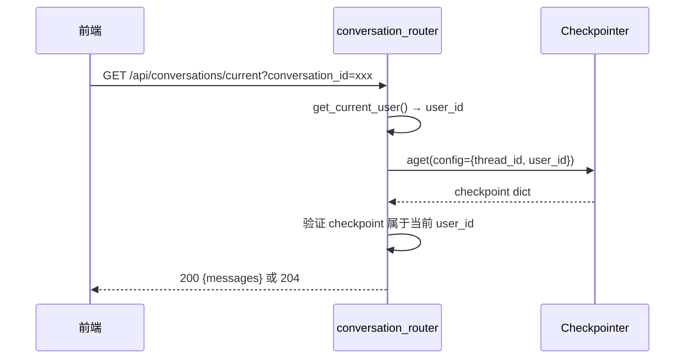

# 架构收敛 — 后端设计报告

## 1. 目标

- **BF001**: LLMGenerator 暴露 `get_chat_model()` 公共方法，graph.py 不再访问私有属性
- **BF002**: 提取 `_build_numbered_context()` 和 `chunks_to_sources()` 为共享函数，消除 3 处重复
- **BB001**: conversation_router 按 user_id 过滤对话查询，修复用户隔离缺失
- **BB002**: 消除 conversation_router 内 MemorySaver 路径的重复遍历逻辑
- **BB003**: 删除 `ChatService.stream_chat()` 死代码和 `nodes.py` 空壳函数

## 2. 现状分析

### 已有能力

- `LLMGenerator` (infra/llm.py)：完整的 LLM 调用封装，持有 `_client`, `_async_client`, `_model`
- `ChatService` (chat/service.py)：检索管线（`_retrieve`）+ 非流式对话（`handle_chat`）
- `conversation_router`：从 checkpointer 加载对话历史
- LangGraph StateGraph：classify → retrieve → respond/refuse 条件路由

### 存在的问题

1. **安全漏洞**：`_load_latest_conversation` 不按 user_id 过滤，任何用户可看到所有人对话
2. **封装违反**：`graph.py:77-82` 访问 `generator._client.api_key`、`generator._client.base_url`、`generator._model` 三个私有属性
3. **死代码**：`ChatService.stream_chat()` (service.py:62-127) 无路由调用；`nodes.py` 中 `retrieve_node`/`respond_node` 是空壳
4. **重复代码**：`_build_numbered_context()` 在 graph.py 和 llm.py 各一份；SourceReference 构建逻辑在 graph.py、service.py、llm.py 三处重复；MemorySaver 遍历逻辑在 conversation_router 内重复

## 3. 数据模型与接口

### 新增接口

**BF001 — LLMGenerator.get_chat_model()**

```python
# infra/llm.py — LLMGenerator 新增方法
def get_chat_model(self) -> "ChatOpenAI":
    """返回 LangChain ChatOpenAI 实例（用于 LangGraph respond 节点）"""
    from langchain_openai import ChatOpenAI
    return ChatOpenAI(
        api_key=self._api_key,
        base_url=self._base_url,
        model=self._model,
        streaming=True,
    )
```

| 决策 | 方案 | 理由 |
|------|------|------|
| 在 `__init__` 中缓存 api_key/base_url | 存为 `self._api_key`, `self._base_url` | 避免从 `_client` 反向提取，保持封装 |
| 每次 get_chat_model 返回新实例 | 不缓存 ChatOpenAI | 用量低（仅 startup 调用一次），避免持有过多连接 |

**BF002 — 共享工具函数**

```python
# domain/models.py 新增
def chunks_to_sources(chunks: list[QueryResult]) -> list[SourceReference]:
    """从检索结果构建引用来源列表"""
    return [
        SourceReference(
            chunk_id=c.chunk_id,
            book=c.metadata.book,
            section=c.metadata.section,
            page_start=c.metadata.page_start,
            page_end=c.metadata.page_end,
        )
        for c in chunks
    ]
```

```python
# rag/context_builder.py 新增（或放在 domain/ 下）
def build_numbered_context(chunks: list[QueryResult]) -> str:
    """构建带编号标记的 context 文本"""
    parts = []
    for i, chunk in enumerate(chunks, 1):
        parts.append(
            f"[{i}] ({chunk.metadata.book} - {chunk.metadata.section}, "
            f"第{chunk.metadata.page_start}-{chunk.metadata.page_end}页)\n"
            f"{chunk.text}"
        )
    return "\n\n".join(parts)
```

| 决策 | 方案 | 理由 |
|------|------|------|
| `chunks_to_sources` 放在 domain/models.py | 紧邻 SourceReference 定义 | 消费方都已 import models |
| `build_numbered_context` 放在 rag/context_builder.py | 紧邻 QueryResult 定义 | 与 RAG 检索相关 |

### BB001 — user_id 隔离

**所有路径都必须验证 user_id**：

1. **`_load_conversation_by_id`**：当前函数签名不含 user_id。修复后接收 `user_id` 参数，加载 checkpoint 后验证归属：
   - PostgresSaver 路径：`aget` 返回的 checkpoint 中检查 configurable.user_id 是否匹配
   - MemorySaver 路径：遍历时检查 meta 中的 user_id
   - 不匹配 → 返回空列表（走 204 逻辑），不暴露 403 避免信息泄漏

2. **`_load_from_postgres_saver`**：`alist` 不支持按 user_id 过滤，遍历结果后从 checkpoint 的 config 中读取 user_id 做过滤。

3. **`_load_from_memory_saver`**：遍历全部 storage 时从 checkpoint meta 中提取 user_id 过滤。

| 决策 | 方案 | 理由 |
|------|------|------|
| `_load_conversation_by_id` 新增 user_id 参数 | 加载后验证归属，不匹配返回空 | 防止遍历 conversation_id 读取他人对话 |
| PostgresSaver alist 后按 config.user_id 过滤 | alist 返回的 tuple 含 config，可提取 configurable.user_id | alist 不支持按 user_id 查询，Python 侧过滤 |
| MemorySaver 从 checkpoint meta 过滤 | 存储结构为 `(checkpoint, meta, parent)` | meta 中包含 configurable 信息 |
| MemorySaver metadata 无 user_id 时 | 不过滤（兼容历史数据和开发模式） | 生产用 PostgresSaver，MemorySaver 仅开发 fallback |

### BB002 — 重复逻辑消除

提取内部辅助函数 `_extract_latest_messages`：

```python
def _extract_latest_messages(namespaces: dict, user_id: str | None = None) -> list:
    """从 MemorySaver namespaces 中提取最新 messages（可选按 user_id 过滤）"""
    best_messages = []
    best_ts = ""
    for _ns, checkpoints in namespaces.items():
        for _cp_id, (checkpoint, meta, _parent) in checkpoints.items():
            # user_id 过滤
            if user_id:
                cp_user_id = meta.get("configurable", {}).get("user_id") if meta else None
                if cp_user_id and cp_user_id != user_id:
                    continue
            channel_values = checkpoint.get("channel_values", {})
            messages = channel_values.get("messages", [])
            ts = checkpoint.get("ts", "")
            if messages and ts >= best_ts:
                best_ts = ts
                best_messages = messages
    return best_messages
```

## 4. 核心流程

### BB001 user_id 隔离流程



边界条件：
- conversation_id 对应的 checkpoint 不属于当前 user_id → 返回 204（而非 403，避免信息泄漏）
- MemorySaver 路径 metadata 中无 user_id（旧数据）→ 不过滤（兼容历史数据）

### BB003 死代码清理范围

```
删除文件内容：
  service.py: stream_chat() 方法 (L62-127)
  nodes.py: retrieve_node() + respond_node() 函数 (L36-48)
  graph.py: _build_numbered_context() → 改为 import from rag/context_builder
  graph.py: SourceReference 列表构建 → 改为调用 chunks_to_sources()
  graph.py: generator._client._* → 改为 generator.get_chat_model()
```

## 5. 项目结构与技术决策

### 改动文件清单

```
backend/
  app/
    infra/llm.py              # BF001: 新增 get_chat_model()，__init__ 缓存 api_key/base_url
    domain/models.py           # BF002: 新增 chunks_to_sources()
    rag/
      context_builder.py      # BF002: 新增文件，提取 build_numbered_context()
    agent/
      graph.py                 # BF001: 用 get_chat_model()；BF002: 用共享函数；删除重复
      nodes.py                 # BB003: 删除 retrieve_node/respond_node 空壳
    chat/
      conversation_router.py   # BB001: user_id 过滤；BB002: 提取 _extract_latest_messages
      service.py               # BB003: 删除 stream_chat()
  tests/
    test_chat_service_stream.py # BB003: 整文件删除（测试被删的 stream_chat）
    test_agent_nodes.py         # BB003: 修正 import（删除 respond_node 引用）
```

### 职责划分

```
graph.py (编排层)
  → 调用 generator.get_chat_model()      # 不直接访问私有属性
  → 调用 chunks_to_sources(chunks)        # 不重复构建 SourceReference
  → 调用 build_numbered_context(chunks)   # 不重复构建 context
  → 调用 chat_service._retrieve()         # 暂不改公开，保持现有调用

conversation_router.py (查询层)
  → 按 user_id 过滤所有查询                # 安全隔离
  → 统一 MemorySaver 遍历逻辑             # 消除重复
```

### 技术决策

| 决策 | 方案 | 理由 |
|------|------|------|
| BF001 缓存 api_key/base_url | `__init__` 存为 `self._api_key`, `self._base_url` | OpenAI 客户端构造参数已传入，无需反向提取 |
| BF002 新文件 vs 已有文件 | `context_builder.py` 新文件放 rag/ | 职责清晰，与 RAG 检索上下文构建相关 |
| BB001 MemorySaver 兼容 | metadata 无 user_id 时不过滤 | 兼容历史数据，PostgresSaver 路径有 user_id |
| BB003 retrieve_node 删除 | 闭包实现已在 graph.py | 空壳函数造成误导，graph.py 注释已说明 |

### 第三方依赖

无新增依赖。所有修改使用已有的 `langchain_openai.ChatOpenAI`、`langgraph`、`openai`。

## 6. 验收标准

| 验收条件 | 验收方式 |
|----------|----------|
| graph.py 不含任何 `._client` 或 `._model` 访问 | `grep -n '_client\|_model' backend/app/agent/graph.py` 无结果 |
| `_build_numbered_context` 只有一处定义 | `grep -rn '_build_numbered_context\|build_numbered_context' backend/` 只在 context_builder.py |
| `chunks_to_sources` 只有一处定义 | `grep -rn 'chunks_to_sources' backend/` 只在 models.py |
| `stream_chat` 方法不存在 | `grep -n 'stream_chat' backend/app/chat/service.py` 无结果 |
| `retrieve_node` 和 `respond_node` 不存在 | `grep -n 'retrieve_node\|respond_node' backend/app/agent/nodes.py` 无结果 |
| user_id 隔离生效 | 测试：不同 user_id 调用 `/conversations/current` 看不到彼此对话 |
| 编译通过 | `python -c "from app.main import app"` |
| 现有测试通过 | `cd backend && python -m pytest tests/ -x` |

## 7. 暂不实现

| 功能 | 理由 |
|------|------|
| ChatService._retrieve 改为公开方法 | 涉及 service.py 公开 API 变更，需确认旧路径 `/api/chat` 是否仍需，留给后续 |
| conversation_router 完全统一用 aget/alist | MemorySaver 的 aget 行为与 PostgresSaver 不一致，需更多调研 |
| 旧 `/api/chat` 非流式路径的 prompt 统一 | 产品决策，不属于架构清理 |
| main.py lifespan 并行化 | 性能优化，不属于架构清理 |
