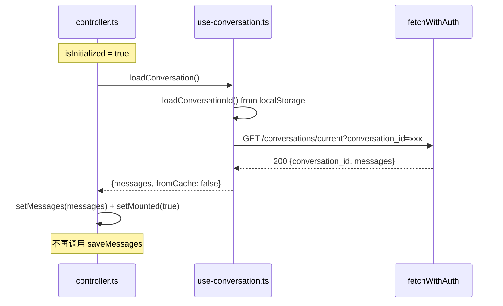

> 关联设计：[架构收敛 1.0 后端](2026-05-24--R007-PATCH01-architecture-cleanup-backend.md)

# 架构收敛 — 前端设计报告

## 1. 目标

- **FB001**: 删除 `use-chat-storage.ts`（死代码，违反"不做前端 LLM 回答缓存"禁止模式）
- **FB001**: 移除 `use-conversation.ts` 内部未使用的 `conversationId` state
- **FB001**: 移除 `controller.ts` 中对 `saveMessages` 的调用
- **FF001**: 更新 architecture.md 目录结构描述

## 2. 现状分析

### 死代码分析

| 文件 | 死代码 | 证据 |
|------|--------|------|
| `use-chat-storage.ts` 全文件 | `saveMessages()` 写入的数据无调用方读取 | `loadMessages()` 在整个项目中零调用 |
| `use-conversation.ts:58` | `useState<string | null>(loadConversationId)` | controller 从未读取此 state，有自己的副本 |
| `controller.ts:3` | `import { saveMessages }` + 所有 `saveMessages()` 调用 | 写入的 localStorage 数据无消费方 |

### 数据流分析

当前前端持久化链路：

```
SSE done/error/stopped
  → controller.ts updateMsg(aiMsgId, ..., terminalStatus)
    → saveMessages(messages)     ← 写入 localStorage
    → 但无人读取！

页面加载
  → controller.ts loadConversation()
    → fetchWithAuth('/conversations/current')  ← 从后端 API 读取
    → 完全忽略 localStorage
```

结论：`saveMessages` 是纯写无读的死路径。删除后不影响任何功能。

## 3. 数据模型与接口

### 改动后的前端模块依赖

```
controller.ts (状态中枢)
  ├── use-conversation.ts  (loadConversation 函数)
  │     └── loadConversationId / saveConversationId  (localStorage conversationId)
  ├── use-chat-stream.ts   (SSE 流式)
  │     └── fetchWithAuth → parse-sse
  └── auth-context.tsx     (isInitialized 守卫)

删除的模块：
  ✗ use-chat-storage.ts  (整体删除)
```

### 改动后的状态管理

| 状态 | 持有者 | 来源 |
|------|--------|------|
| `conversationId` | controller.ts `useState` | localStorage 初始化 + SSE init + API 加载 |
| `messages` | controller.ts `useState` | API 加载 + SSE 流式 |
| `isStreaming` | use-chat-stream.ts | SSE 生命周期 |
| `mounted` | controller.ts `useState` | conversation 加载完成 |

唯一变化：删除 `use-conversation.ts` 内部的 `conversationId` state，该 hook 只导出 `loadConversation` 函数。

## 4. 核心流程

无新流程。清理后的对话加载流程：



## 5. 项目结构与技术决策

### 改动文件清单

```
frontend/src/chat/
  use-chat-storage.ts       # FB001: 整个文件删除
  use-conversation.ts        # FB001: 移除 conversationId state，只导出函数
  controller.ts              # FB001: 移除 saveMessages import 和所有调用
frontend/src/__tests__/
  chat/use-chat-storage.test.ts  # FB001: 整文件删除（测试被删模块）
  chat/use-conversation.test.ts  # FB001: 删除 use-chat-storage mock + 修正测试
  components/chat-ui.test.tsx    # FB001: 删除 use-chat-storage mock + 删除 saveMessages 测试块

.dev-flow/
  architecture.md            # FF001: 更新目录结构描述
```

### 改动详情

**use-conversation.ts 简化为纯函数 hook**：

```typescript
// 改动前
export function useConversation() {
  const [conversationId, setConversationId] = useState<string | null>(loadConversationId);
  // ...
  return { conversationId, loadConversation };
}

// 改动后
export function useConversation() {
  const loadingRef = useRef(false);
  const loadConversation = useCallback(async () => { /* 不变 */ }, []);
  return { loadConversation };
}
```

**controller.ts 移除 saveMessages + 简化 updateMsg**：

```typescript
// 改动前
import { saveMessages } from './use-chat-storage';
const updateMsg = useCallback(
  (id: string, patch: Partial<Message>, terminalStatus?: MessageStatus) => {
    setMessages((prev) => {
      const next = prev.map((m) => (m.id === id ? { ...m, ...patch } : m));
      if (terminalStatus) { saveMessages(next); }
      return next;
    });
  }, [],
);

// 改动后：删除 saveMessages import，移除 terminalStatus 参数
const updateMsg = useCallback(
  (id: string, patch: Partial<Message>) => {
    setMessages((prev) => prev.map((m) => (m.id === id ? { ...m, ...patch } : m)));
  }, [],
);
// 调用处同步移除第三个参数
```

### 技术决策

| 决策 | 方案 | 理由 |
|------|------|------|
| 删除 use-chat-storage.ts | 整个文件删除 | saveMessages 无消费方，loadMessages 无调用方 |
| use-conversation 保留为 hook | 不改为纯函数 | 未来可能需要 hook 能力（如缓存），保持接口兼容 |
| FF001 更新 architecture.md | `services/frontend/` → `frontend/` | 与实际目录一致 |

## 6. 验收标准

| 验收条件 | 验收方式 |
|----------|----------|
| `use-chat-storage.ts` 不存在 | `ls frontend/src/chat/use-chat-storage.ts` 报错 |
| `use-chat-storage.test.ts` 不存在 | `ls frontend/src/__tests__/chat/use-chat-storage.test.ts` 报错 |
| 无 `saveMessages` 调用 | `grep -rn 'saveMessages' frontend/src/` 无结果 |
| 无 `loadMessages` 调用 | `grep -rn 'loadMessages' frontend/src/` 无结果 |
| use-conversation 不导出 conversationId state | 检查 return 值只有 `loadConversation` |
| 前端构建通过 | `cd frontend && npm run build` |
| 刷新后对话正常加载 | 手动测试：刷新 octotutor.localhost/chat 页面 |
| SSE 流式对话正常 | 手动测试：发送消息，确认 token 逐字显示 |

## 7. 暂不实现

| 功能 | 理由 |
|------|------|
| onToken 性能优化（ref 累积） | 性能优化，当前功能正确，不属于架构清理 |
| thinkingSteps 批量更新 | 性能优化，不属于架构清理 |
| controller.ts 测试补充 | 属于测试收敛范畴，不属于架构清理 |
