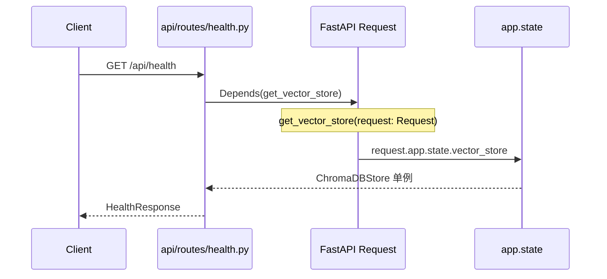
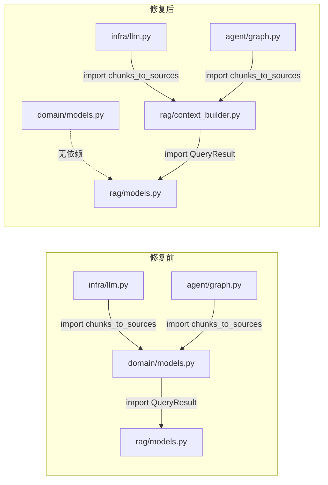

# 架构反向依赖修复 — 后端设计报告

## 1. 目标

- 统一 api/routes/ 的 DI 函数为 `request.app.state` 模式，消除对 `main.py` 的反向依赖
- 将 `chunks_to_sources()` 从 `domain/models.py` 迁移到 `rag/context_builder.py`，消除 domain→rag 的跨层反向依赖

## 2. 现状分析

### 已有能力

- `chat/dependencies.py` 已采用 `request: Request` → `request.app.state.xxx` 的干净 DI 模式（6 个 DI 函数）
- `rag/context_builder.py` 已有 `build_numbered_context()` 函数，与 `chunks_to_sources()` 性质相同（都是 `list[QueryResult] → X` 的转换函数）

### 存在的问题

| 问题 | 位置 | 影响 |
|------|------|------|
| health.py + retrieve.py 通过 `from app.main import app` 获取单例 | api/routes/ 下 2 个文件、4 个 DI 函数 | 路由层反向依赖应用入口，形成 main↔routes 循环 |
| domain/models.py 通过 `from app.rag.models import QueryResult` 定义 chunks_to_sources | domain/models.py | domain 层向上依赖 rag 层，违反分层原则 |

## 3. 核心流程

### 修复 1：routes DI 模式统一



改动点：`get_vector_store()` 和 `get_embedding_service()` 的签名从无参改为接收 `request: Request`，函数体从延迟 import 改为直接访问 `request.app.state`。

### 修复 2：chunks_to_sources 迁移



## 5. 项目结构与技术决策

### 受影响文件

```
backend/app/
├── api/routes/
│   ├── health.py          ← 修改：2 个 DI 函数签名 + 函数体
│   └── retrieve.py        ← 修改：2 个 DI 函数签名 + 函数体
├── domain/
│   └── models.py          ← 修改：删除 chunks_to_sources + QueryResult import
├── rag/
│   └── context_builder.py ← 修改：新增 chunks_to_sources 函数
├── infra/
│   └── llm.py             ← 修改：import 路径变更
└── agent/
    └── graph.py           ← 修改：import 路径变更
```

### 技术决策

| 决策 | 方案 | 理由 |
|------|------|------|
| DI 函数签名 | 加 `request: Request` 参数 | 与 chat/dependencies.py 保持一致，FastAPI 自动注入 Request |
| chunks_to_sources 目标位置 | rag/context_builder.py | 该函数消费 `list[QueryResult]`，与 `build_numbered_context` 同性质，放同一文件最自然 |
| protocols.py 是否修复 | 不修 | Protocol 签名需要 QueryResult 类型，属于类型引用而非逻辑依赖，强行抽象反而增加复杂度 |

## 6. 验收标准

| 验收条件 | 验收方式 |
|----------|----------|
| `api/routes/health.py` 和 `retrieve.py` 无 `from app.main` 导入 | grep 检查 |
| `domain/models.py` 无 `from app.rag` 导入 | grep 检查 |
| `chunks_to_sources` 在 `rag/context_builder.py` 中定义 | 文件读取确认 |
| 所有现有测试通过 | `cd backend && python -m pytest` |
| 无循环依赖引入 | Python import 正常无报错 |

## 7. 暂不实现

| 功能 | 理由 |
|------|------|
| protocols.py 的 QueryResult 引用 | Protocol 接口签名需要具体类型，属于合理的跨层类型引用 |
| 全局依赖方向 lint 规则 | 当前项目无此基础设施，留作后续改进 |
