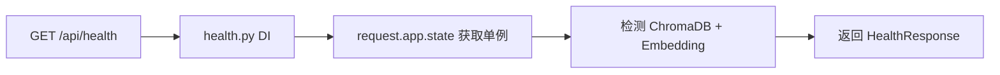
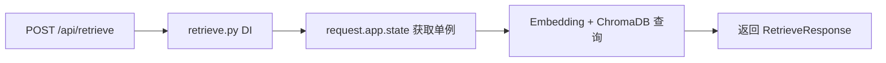
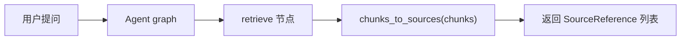

# 架构反向依赖修复 — 功能分析

## 概述

后端模块依赖审查中发现两处架构反向依赖：api/routes 反向依赖 main.py、domain 层向上依赖 rag 层。本补丁将这两处修复为正确的依赖方向，使分层架构保持纯净。

## 一、交互链

本次修复为纯内部架构收敛，**无用户可见交互变更**。所有 API 行为、输入输出保持不变。

但为保证分析完整性，列出受影响的用户场景（行为不变，仅内部路径改变）：

### 场景 1：健康检查

**用户故事**：作为运维人员，我想查看系统健康状态，以便确认服务是否可用。

修复前后用户侧完全无感知，仅 DI 获取单例的方式从 `from app.main import app` 改为 `request.app.state`。

### 场景 2：向量检索

**用户故事**：作为开发者，我想调用检索 API，以便获取相关教材片段。

同上，仅 DI 路径变更。

### 场景 3：LLM 生成（引用来源构建）

**用户故事**：作为学生，我想获得带引用来源的回答，以便追溯知识点出处。

`chunks_to_sources` 函数从 `domain/models.py` 移到 `rag/context_builder.py`，调用方 import 路径变更，逻辑不变。

## 二、逻辑树

### 问题 1：api/routes 反向依赖 main.py

#### 事件流

| 时刻 | 事件 | 处理 | 产生的新事件 |
|------|------|------|-------------|
| T1 | main.py 导入 api/routes/health.py | 模块级执行，注册 router | — |
| T2 | health.py get_vector_store() 被调用 | `from app.main import app` 延迟导入 | main 模块被路由层反向引用 |
| T3 | 返回 app.state.vector_store | 单例获取完成 | — |

**修复后：**

| 时刻 | 事件 | 处理 | 产生的新事件 |
|------|------|------|-------------|
| T1 | main.py 导入 api/routes/health.py | 模块级执行，注册 router | — |
| T2 | health.py get_vector_store(request) 被调用 | `request.app.state.vector_store` | 无反向依赖 |
| T3 | 返回单例 | 获取完成 | — |

#### 状态流转

| 实体 | 触发事件 | 前状态 | 后状态 |
|------|---------|--------|--------|
| health.py get_vector_store | 函数签名变更 | `() -> ChromaDBStore`（内部 import main） | `(request: Request) -> ChromaDBStore`（从 request 获取） |
| retrieve.py get_vector_store | 同上 | 同上 | 同上 |
| retrieve.py get_embedding_service | 同上 | 同上 | 同上 |

### 问题 2：domain/models.py 向上依赖 rag/models.py

#### 事件流

| 时刻 | 事件 | 处理 | 产生的新事件 |
|------|------|------|-------------|
| T1 | infra/llm.py 导入 chunks_to_sources | `from app.domain.models import chunks_to_sources` | infra 层通过 domain 间接依赖 rag |
| T2 | domain/models.py 模块加载 | `from app.rag.models import QueryResult` | domain 层反向依赖 rag 层 |
| T3 | agent/graph.py 导入 chunks_to_sources | `from app.domain.models import chunks_to_sources` | agent 层通过 domain 间接依赖 rag |

**修复后：**

| 时刻 | 事件 | 处理 | 产生的新事件 |
|------|------|------|-------------|
| T1 | chunks_to_sources 移入 rag/context_builder.py | 函数与 `build_numbered_context` 同层 | rag 层自包含 |
| T2 | domain/models.py 移除 QueryResult import | domain 层零 rag 依赖 | 分层纯净 |
| T3 | infra/llm.py 改为从 rag/context_builder 导入 | 直接依赖 rag 层 | 依赖方向正确 |
| T4 | agent/graph.py 同上 | 同上 | 依赖方向正确 |

#### 状态流转

| 实体 | 触发事件 | 前状态 | 后状态 |
|------|---------|--------|--------|
| chunks_to_sources 函数 | 从 domain 移到 rag | 位于 domain/models.py，依赖 QueryResult | 位于 rag/context_builder.py，与 build_numbered_context 同层 |
| domain/models.py | 移除 chunks_to_sources + QueryResult import | 导入 rag.models（反向依赖） | 零内部依赖（纯数据模型） |
| domain/protocols.py | 不变 | 导入 rag.models.QueryResult | 不变（Protocol 接口签名需要 QueryResult 类型，属于合理的跨层引用） |

## 三、功能编号与网络定位

### 本次新增节点

| 编号 | 功能节点 | 前缀含义 | 简介 |
|------|---------|---------|------|
| BF001 | routes DI 模式统一 | 后端基础 | health/retrieve 路由的 DI 函数改用 request.app.state 模式，消除 main.py 反向依赖 |
| BF002 | chunks_to_sources 层级迁移 | 后端基础 | 将 chunks_to_sources 从 domain/models.py 移入 rag/context_builder.py，消除 domain→rag 反向依赖 |

### 前置依赖

| 依赖节点 | 依赖方式 | 是否已有 |
|----------|---------|---------|
| chat/dependencies.py request.app.state 模式 | 复用模式参考 | ✓ 已有 |
| rag/context_builder.py | 目标文件 | ✓ 已有 |
| domain/models.py SourceReference | chunks_to_sources 返回类型 | ✓ 已有 |

### 边界接口

| 接口/协议 | 定义方 | 消费方 | 敏感度 |
|-----------|--------|--------|--------|
| `get_vector_store(request: Request)` | api/routes/health.py, retrieve.py | FastAPI Depends 注入 | 低 — 内部 DI 函数签名变更 |
| `get_embedding_service(request: Request)` | api/routes/health.py, retrieve.py | FastAPI Depends 注入 | 低 — 内部 DI 函数签名变更 |
| `chunks_to_sources(chunks)` | rag/context_builder.py（新位置） | infra/llm.py, agent/graph.py | 低 — import 路径变更，函数签名不变 |

## 四、结论

- **开发顺序**：BF001 → BF002（无依赖关系，可并行，按编号顺序）
- **复杂度**：极低，纯 import 路径和函数签名调整，无逻辑变更
- **风险**：极低 — 改动涉及 DI 函数签名和 import 路径，现有测试覆盖充分
- **暂不实现**：`domain/protocols.py` 导入 `rag/models.QueryResult` 的问题暂不修复。Protocol 接口签名需要引用 QueryResult 类型，这属于合理的跨层类型引用（不是逻辑依赖），强行抽象会引入不必要的间接层
