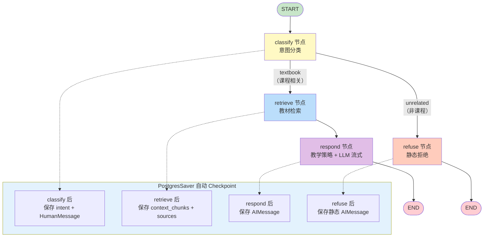
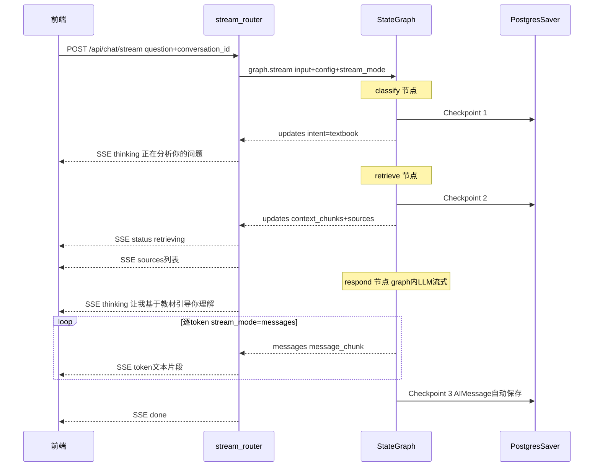

# Agent — 后端 设计报告

> 关联设计：Chat 前端 v1 前端(./2026-05-22--R007-persistence-agent-upgrade-frontend.md)
>
> 基于 brainstorm `brainstorm-2026-05-22--agent-teaching-strategy.md`，旧 ReAct 方案已被 superseded。

## 1. 目标

- 引入 LangGraph StateGraph 编排 classify → retrieve/respond 分支流程，替代手写 if-else
- 接入 PostgresSaver 实现消息自动持久化与对话恢复，无需自建 ORM/迁移
- 设计模块化教学策略 prompt，覆盖引导/兜底/纠正/关联/出题/总结 6 种教学行为
- 改造 SSE 流式接口，支持 thinking 事件和 conversation_id 多轮对话
- 新增对话历史 API，前端可恢复上次对话

## 2. 现状分析

**已有能力**：

- RAG 检索管线完整：Embed → Vector → Threshold → BM25 → RRF → Rerank → Truncate
- 规则式意图分类器（question_classifier.py）：retrieval/direct 二分类
- LLM 流式生成（LLMGenerator.generate_stream）
- JWT 鉴权体系（R006 设计完成，代码待实施）
- ChromaDB 向量库 + DashScope Embedding + DashScope Reranker

**存在的问题**：

- 消息无持久化，刷新即丢失
- 教学行为由 LLM 自由发挥，无引导式/苏格拉底式教学策略约束
- 无对话概念，缺少多轮上下文管理
- 意图分类直接在 ChatService 中 if-else 路由，不可扩展

**基础设施就绪**：

- PostgreSQL 实例（xlfoundryTest）可用，新建 `octotutor_checkpoints` 数据库
- Docker Compose 本地环境已有 auth-center 服务

**方案选型结论**：

| 维度 | 选型 | 理由 |
|------|------|------|
| Agent 编排 | LangGraph StateGraph（条件路由） | 固定分支流程，声明式节点+条件边，比手写 if-else 更可维护 |
| 消息持久化 | LangGraph PostgresSaver | 每节点自动 Checkpoint，不需要自建表/ORM/迁移 |
| 教学策略 | system prompt 驱动 | 教学行为是 LLM 输出风格，不依赖 Agent 架构层 |
| SSE 流式 | `stream_mode=["updates", "messages"]` | graph 内原生 token 级流式 + 节点级状态更新，无需 interrupt_before hack |

**为什么不用 ReAct / tool-calling**：只有一个"工具"（教材检索），教学行为由 prompt 控制，ReAct 循环增加延迟和 token 消耗对固定分支无收益。

## 3. 数据模型与接口

### 数据模型

#### AgentState TypedDict

```python
from typing import TypedDict, Literal
from langchain_core.messages import BaseMessage
from app.rag.models import QueryResult
from app.domain.models import SourceReference

class AgentState(TypedDict):
    messages: list[BaseMessage]              # 对话历史（HumanMessage + AIMessage）
    question: str                            # 当前用户问题
    intent: Literal["textbook", "unrelated"] # 意图分类结果
    context_chunks: list[QueryResult]        # 检索到的教材片段
    sources: list[SourceReference]           # 引用来源列表
    degraded: bool                           # 检索是否降级
    degradation_reason: str | None           # 降级原因
```

**关键设计选择**：

| 决策 | 理由 |
|------|------|
| `messages` 使用 LangChain BaseMessage 列表 | PostgresSaver 原生支持序列化，LangGraph 标准 |
| `question` 作为独立字段 | 从 HumanMessage 提取，方便节点直接访问，无需反复解析 |
| `intent` 用 Literal 而非 str | 条件路由类型安全，路由函数不会拼错字符串 |
| `degraded` + `degradation_reason` | 检索质量不达标时仍返回结果，但标记降级供后续版本暴露给前端 |

#### PostgresSaver 表结构

由 `AsyncPostgresSaver.setup()` 自动管理（幂等），创建 `checkpoint` 和 `checkpoint_writes` 表，无需手动建表或迁移。

| 决策 | 理由 |
|------|------|
| 复用 xlfoundryTest PostgreSQL 实例 | 不新增基础设施，新建数据库 `octotutor_checkpoints` |
| AsyncPostgresSaver 而非同步版本 | 与 FastAPI async 框架兼容 |
| thread_id = conversation_id | 一一映射，简单直接 |
| config 中携带 user_id | 用于后续按用户查询对话列表 |

### 接口契约

#### API 列表速览

| 方法 | 路径 | 用途 |
|------|------|------|
| POST | `/api/chat/stream` | SSE 流式对话（改造） |
| GET | `/api/conversations/current` | 获取当前对话历史（新增） |

#### POST /api/chat/stream

**请求**：

```python
class ChatRequest(BaseModel):
    question: str                    # min_length=1, max_length=2000
    top_k: int = 10                  # ge=3, le=20
    conversation_id: str | None      # null 时后端自动创建 UUID4
```

**SSE 响应事件**：

| event | data 格式 | 触发时机 |
|-------|----------|----------|
| thinking | `{"text": "...", "index": 1}` | classify/respond 节点开始 |
| status | `{"stage": "retrieving"/"generating", "message": "..."}` | retrieve 节点、LLM 生成 |
| sources | `[{"chunk_id": "", "book": "", "section": "", ...}]` | retrieve 节点完成 |
| token | `"文本片段"` | LLM 流式输出逐 token |
| done | `null` | 全部完成 |
| error | `{"code": "02201", "message": "..."}` | 异常 |

#### GET /api/conversations/current

**请求参数**：无（按 Bearer token 中的 user_id 查找最近对话）

**响应 200**：

```json
{
  "conversation_id": "uuid-string",
  "messages": [
    {
      "id": "msg-uuid-1",
      "role": "human",
      "content": "什么是导数？",
      "status": "completed",         // 枚举: completed | stopped | error
      "sources": null,
      "thinking_steps": null,
      "created_at": "2026-05-22T10:30:00Z"
    },
    {
      "id": "msg-uuid-2",
      "role": "ai",
      "content": "你学过函数的变化率吗？...",
      "status": "completed",
      "sources": [{"chunk_id": "c1", "book": "高等数学", "section": "2.1"}],
      "thinking_steps": [{"text": "识别为课程相关问题", "index": 1}],
      "created_at": "2026-05-22T10:30:05Z"
    }
  ]
}
```

**响应 204**：无对话记录（无 body）

**错误码**：

| 错误码 | 含义 |
|--------|------|
| 401 | token 缺失/无效 |
| 02102 | Embedding 服务异常 |
| 02103 | Vector Store 异常 |
| 02201 | LLM 连接失败 |
| 02202 | LLM 流式中断 |
| 02203 | LLM 空响应 |
| 02204 | LLM 超时 |
| 02205 | LLM 限流 |

## 4. 核心流程

### 4.1 StateGraph 编排主流程



**条件边定义**：

```python
def _route_by_intent(state: AgentState) -> str:
    if state.get("intent") == "textbook":
        return "retrieve"
    return "refuse"
```

**业务规则**：

- classify 节点：长度<=3 / 问候闲聊 / 非课程关键词 → unrelated；数学关键词/符号 → textbook；默认走 textbook（宁可多检索不漏检）
- refuse 节点：静态消息，不调 LLM，零延迟零 token
- respond 节点：教学策略 prompt 驱动 LLM 流式生成

### 4.2 SSE 事件时序



**respond 流式方案（`stream_mode=["updates", "messages"]`）**：

1. `graph.stream(input, config, stream_mode=["updates", "messages"], version="v2")` 单次调用
2. `stream_mode="updates"` 产出节点完成事件（classify/retrieve/respond），router 转换为 SSE thinking/status/sources
3. `stream_mode="messages"` 产出 LLM 逐 token 事件，router 转换为 SSE token
4. respond 节点完成后 PostgresSaver 自动 Checkpoint（AIMessage），无需手动 `aupdate_state()`

**chunk 结构（v2 格式）**：

```python
# updates 事件
{"type": "updates", "data": {"classify": {"intent": "textbook"}}}
{"type": "updates", "data": {"retrieve": {"context_chunks": [...], "sources": [...]}}}

# messages 事件
{"type": "messages", "data": (message_chunk, metadata)}
# message_chunk.content 为 token 文本
# metadata["langgraph_node"] 标识来源节点，可按节点过滤
```

### 4.3 异常与降级

| 场景 | 处理 | 用户体验 |
|------|------|----------|
| 启动时 PostgreSQL 连接失败 | 降级为 `MemorySaver`，打印 WARNING | 消息正常返回，刷新后丢失 |
| 运行时 PostgreSQL 连接中断 | catch 异常 → error event + LLM 回答仍返回 | 消息正常返回，本次不持久 |
| LLM 连接/超时/限流 | SSE error event（02201-02205） | 前端显示错误提示 |
| Embedding/Rerank 失败 | SSE error event（02102/02103），Rerank 失败降级为 RRF 结果 | 检索结果可能略差 |
| 意图分类漏检（课程→unrelated） | 分类器默认走 textbook 减少此情况；非课程白名单仅含明确无关词 | 少数边界情况被拒绝 |
| 检索结果为空 | respond 节点仍执行，LLM 标注"教材中未找到"并基于自身知识回答 | 用户获得合理回应 |
| 客户端断线 | graph 继续执行，下一个 Checkpoint 自动保存 | 对话不丢失 |
| 用户主动暂停 | 前端 AbortController 关闭 SSE；后端 stream 迭代器中断，respond 节点未完成，AIMessage 未写入 checkpoint；前端 localStorage 兜底保存部分回答 | 用户看到部分回答（status=stopped），刷新后后端无此条 AIMessage |

## 5. 项目结构与技术决策

### 项目结构

```text
backend/app/
├── agent/                          # 新增模块 — StateGraph 编排
│   ├── __init__.py
│   ├── graph.py                    # StateGraph 定义 + 编译
│   ├── nodes.py                    # 节点函数：classify/retrieve/respond/refuse
│   └── prompts.py                  # 教学策略 system prompt
│
├── chat/
│   ├── schemas.py                  # 修改：ChatRequest + conversation_id, StreamEvent + thinking
│   ├── stream_router.py            # 修改：调用 graph.stream() + LLM 流式
│   ├── conversation_router.py      # 新增：GET /api/conversations/current
│   ├── question_classifier.py      # 修改：返回 textbook/unrelated
│   ├── dependencies.py             # 修改：新增 get_graph/get_checkpointer 依赖
│   ├── router.py                   # 不变（保留非流式接口）
│   └── service.py                  # 不变（保留非流式 ChatService）
│
├── config.py                       # 修改：新增 database_url
├── main.py                         # 修改：lifespan 初始化 PostgresSaver + graph
├── middleware/auth.py              # 不变（R006 设计完成，代码待实施）
├── domain/                         # 不变
├── infra/                          # 不变
└── rag/                            # 不变
```

### 职责划分

```text
API 层（stream_router / conversation_router）
  → Agent 层（graph.py 编排 → nodes.py 节点 → prompts.py 策略）
    → 基础设施层（LLMGenerator / DashScopeEmbedding / ChromaDBStore / BM25 / Reranker）
    → 持久化层（PostgresSaver → PostgreSQL）
  → 配置层（config.py Settings / auth.py JWT）
```

- **stream_router**：调用 `graph.stream(stream_mode=["updates","messages"])` 将 graph 事件（节点更新 + token 流）转换为 SSE 格式
- **graph.py**：声明式定义节点和条件边，`compile()` 绑定 checkpointer
- **nodes.py**：纯函数，接收 AgentState 返回 dict merge，不含路由逻辑
- **prompts.py**：教学策略 prompt 模板，与节点逻辑解耦
- **conversation_router**：直接操作 PostgresSaver 读取对话历史，不经过 graph

### 技术决策

| 决策 | 方案 | 理由 |
|------|------|------|
| Graph 编排 | LangGraph StateGraph | 固定分支流程用条件路由，比 ReAct 简单，比手写 if-else 可维护 |
| 持久化 | PostgresSaver 自动 Checkpoint | 无需自建 conversations/messages 表，setup() 自动建表 |
| 教学策略 | system prompt 驱动 | 6 种教学行为通过 prompt 控制，不依赖 Agent 架构 |
| respond 流式 | `stream_mode=["updates", "messages"]` + `version="v2"` | graph 内原生 token 级流式，PostgresSaver 自动 checkpoint，无需 interrupt hack |
| 对话恢复 | 前端缓存 conversation_id + 后端 checkpoint 查询兜底 | 简化方案，避免复杂的 thread 列表管理 |
| 意图分类 | 规则式（扩展现有分类器） | 不需要 LLM 分类，延迟低，教科书领域关键词足够 |

**第三方依赖清单**：

| 依赖 | 用途 | 状态 |
|------|------|------|
| langgraph >= 0.2.0（推荐 >= 0.6.0） | StateGraph 编排 + stream_mode="messages" | 需新增 |
| langchain-core >= 0.3.0 | BaseMessage 等 LangChain 数据类型 | 需新增 |
| langgraph-checkpoint-postgres >= 0.2.0 | PostgresSaver 持久化 | 需新增 |
| psycopg[binary] >= 3.1.0 | PostgreSQL async 驱动 | 需新增 |

## 6. 验收标准

| 验收条件 | 验收方式 |
|----------|----------|
| [BB002] 课程问题走 textbook 分支：意图分类 → 检索 → 引导式回答（非直接答案） | 集成测试：发送数学问题，验证 SSE 事件序列完整 |
| [BB004] 非课程问题走 unrelated 分支：静态拒绝消息，不调 LLM | 集成测试：发送闲聊，验证返回拒绝消息且无 token 消耗 |
| [BB005] conversation_id 自动创建：不传 → 生成 UUID4 → 第二次传 ID 恢复对话 | 集成测试：连续两次请求验证对话恢复 |
| [BF001] 消息持久化：发送消息 → PostgresSaver Checkpoint → 刷新 → API 加载完整对话 | 集成测试：验证 PostgreSQL 中 checkpoint 数据完整性 |
| [BB006] user_id 隔离：不同用户看不到彼此对话 | 集成测试：两个用户各自发送，验证交叉查询返回空 |
| [BB003] SSE thinking 事件：前端在 classify/respond 阶段收到 thinking 事件 | 前端集成测试：验证事件类型和时序 |
| [BF001] PostgreSQL 不可用时降级为 MemorySaver，消息正常返回 | 关闭 PG → 集成测试：验证降级日志 + 消息仍返回 |
| [BB003] LLM 错误返回正确的 error event（02201-02205） | 单元测试：Mock LLM 抛异常 |
| [BB003] 重新生成：同一 question 再次 stream，后端创建新 AIMessage checkpoint，旧回答保留在历史 | 集成测试：连续两次相同问题发送，验证 checkpoint 中有两条 AIMessage |

## 7. 暂不实现

| 功能 | 理由 |
|------|------|
| followup 追问分支（rewrite 节点） | 需要对话历史支持，先在 R007 验证基础分类+检索+回答闭环，追问改写在后续迭代加入 |
| assess 检索质量评估闭环（rewrite→retrieve→assess 重试循环） | 增加复杂度，先用单次检索验证效果，评估闭环作为优化项 |
| 多对话管理（列表/删除/切换） | 需求尚未明确，R007 只做单对话恢复 |
| 教学策略效果量化评估 | prompt 设计是持续优化过程，R007 先建立基础框架 |
| 检索降级前端提示（degraded/degradation_reason 透传） | 后端 AgentState 已有降级标记，但 SSE 事件和前端 UI 暂不实现，留后续迭代 |
| 编辑已发送消息 | PostgresSaver checkpoint 是 append-only 不支持回改历史 |
