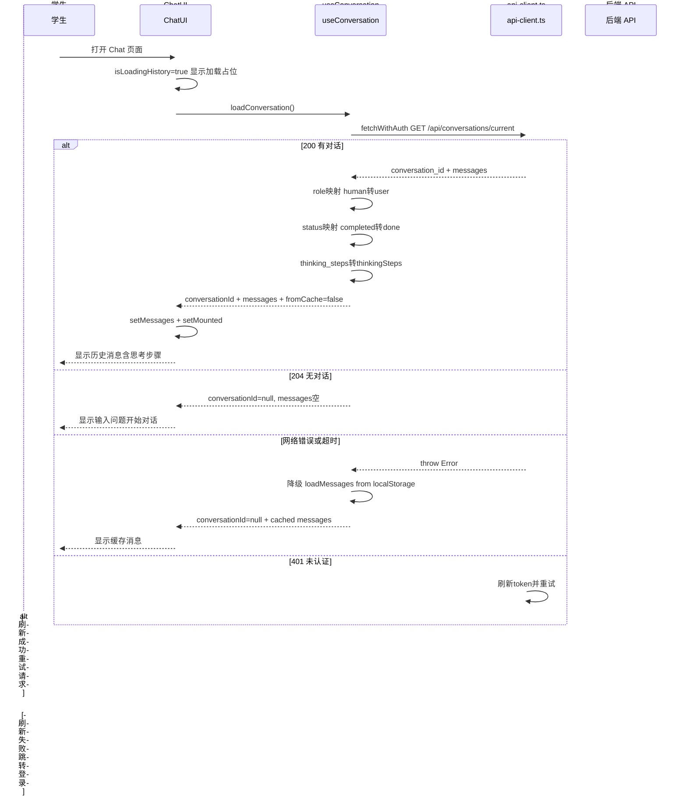
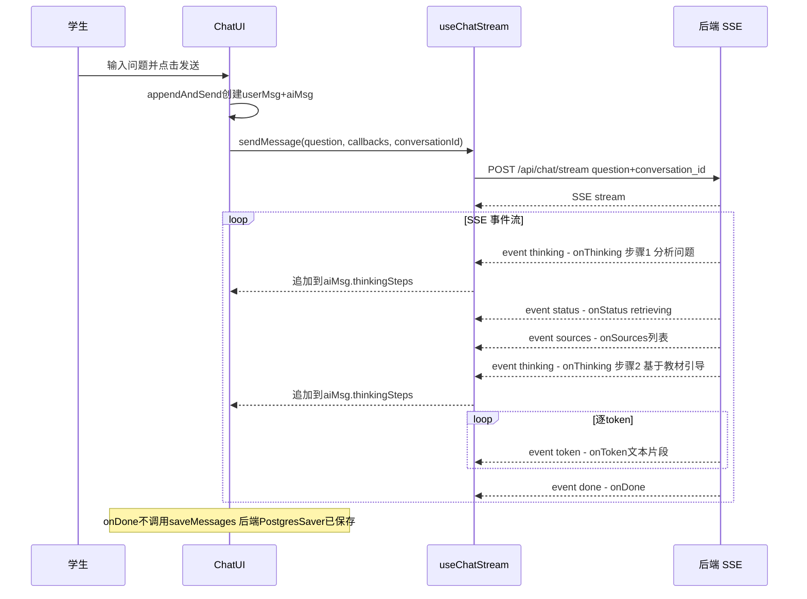
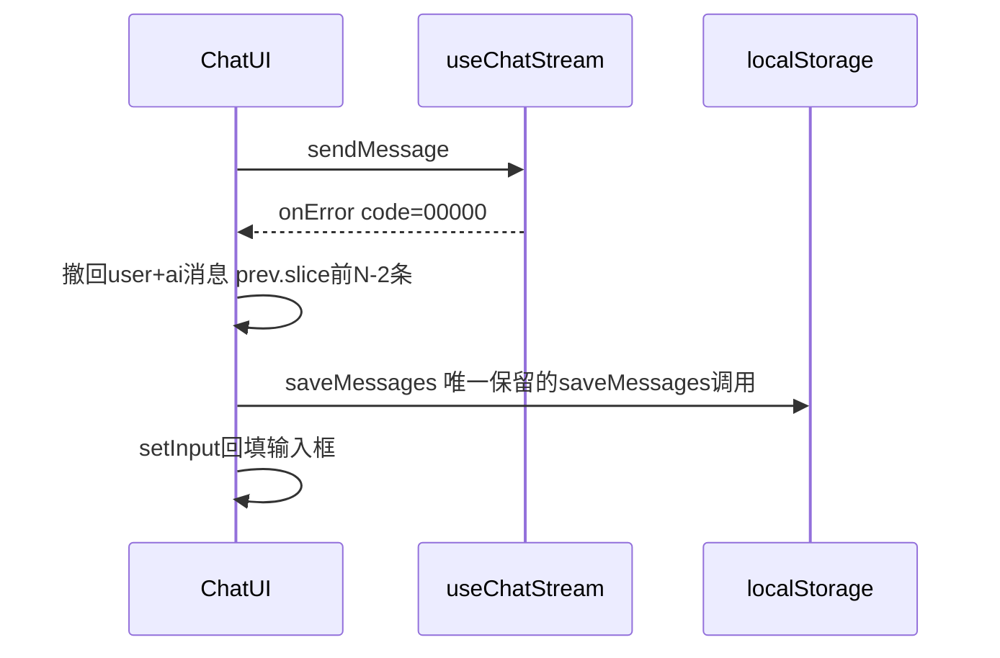
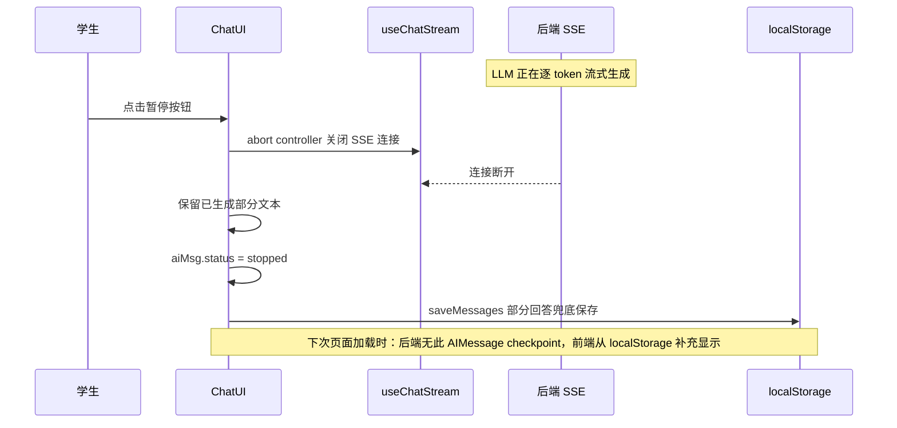
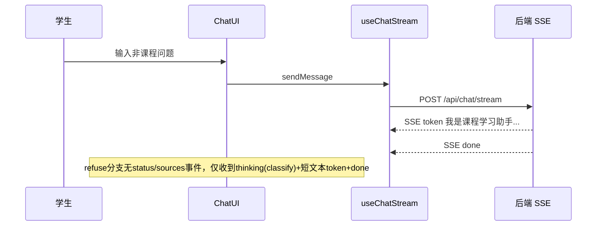

# Chat — 前端 设计报告

> 关联设计：Agent 后端 v2 后端(./2026-05-22--R007-persistence-agent-upgrade-backend.md)

## 1. 目标

- 收敛 api-client.ts 职责为纯 HTTP 请求发送，去掉刷新锁和跳转逻辑；auth-context.tsx 统一用单个 AuthService 管理认证，去掉独立 TokenManager；删除冗余 chat/api.ts
- 从后端 API 加载对话历史，替代 localStorage 作为主存储；API 不可用时降级到 localStorage
- 管理 conversation_id 状态，传递到 SSE 请求体实现后端会话关联
- 接收并展示 SSE thinking 事件，渲染可折叠的思考过程 UI
- 移除终态 saveMessages 调用（后端 PostgresSaver 自动保存），仅保留降级分支

## 2. 现状分析

**已有能力（R006 设计完成，代码待实施）**：
- `api-client.ts` 提供 `fetchWithAuth`，支持 token 注入和 401 自动刷新重试
- `auth-context.tsx` 提供 `TokenManager` + `getAccessToken`，通过 `registerGetToken` 注册到 apiClient
- `use-chat-stream.ts` 处理 SSE 流式响应，支持 status/sources/token/done/error 五种事件
- `parse-sse.ts` 为通用 SSE 解析器，解析 `event: xxx\ndata: xxx` 格式
- `use-chat-storage.ts` 提供 localStorage 消息持久化（loadMessages / saveMessages）

**存在问题**：
- **鉴权架构职责越界**：api-client.ts 内含 token 刷新锁（30s 超时）和 session-expired 跳转逻辑，属于 auth 职责泄漏到 HTTP 层；auth-context.tsx 同时创建 AuthService 和独立 TokenManager 两个实例，通过 localStorage 隐式同步状态；两者通过 DOM CustomEvent 通信，同一应用内部不应走 DOM 事件
- **冗余模块**：`chat/api.ts` 仅导出一个 `API_BASE` 常量，与 `api-client.ts` 的 `BASE_URL` 重复
- 消息仅存 localStorage，换设备/清缓存丢失；后端已有 PostgresSaver 但前端未对接
- 无 conversation_id 管理，后端无法关联同一会话的多轮消息
- 后端智能体产生的思考过程（thinking 事件）未传递到前端

**基础设施就绪（R006/R007 后端完成后可用）**：
- 后端 `GET /api/conversations/current` 待实现，将返回 conversation_id + messages
- 后端 SSE 待新增 `thinking` 事件类型
- 后端 `POST /api/chat/stream` 待新增 `conversation_id` 参数

## 3. 数据模型与接口

### 数据模型

```typescript
/** 思考步骤 — SSE thinking 事件携带 */
export interface ThinkingStep {
  text: string;    // 步骤描述，如 "识别问题类型：课程相关问题"
  index: number;   // 步骤序号（从 1 开始）
}

/** 后端消息格式（role 为 human/ai） */
export interface ApiMessage {
  id: string;
  role: 'human' | 'ai';
  content: string;
  status: 'completed' | 'stopped' | 'error';
  sources?: SourceReference[];
  thinking_steps?: ThinkingStep[];
  created_at: string;
}

/** GET /api/conversations/current 响应体 */
export interface ConversationResponse {
  conversation_id: string;
  messages: ApiMessage[];
}

/** SSECallbacks 新增 onThinking 回调 */
export interface SSECallbacks {
  onStatus: (stage: string, message: string) => void;
  onSources: (sources: SourceReference[]) => void;
  onToken: (token: string) => void;
  onThinking: (step: ThinkingStep) => void;      // R007 新增
  onDone: () => void;
  onError: (error: { code: string; message: string; action: string }) => void;
}

/** Message 新增 thinkingSteps 字段 */
export interface Message {
  id: string;
  role: 'user' | 'ai';
  content: string;
  status: MessageStatus;
  sources?: SourceReference[];
  thinkingSteps?: ThinkingStep[];  // R007 新增：仅 AI 消息有值
  error?: { code: string; message: string; action: string };
  timestamp: number;
}
```

| 设计选择 | 决策 | 理由 |
|---------|------|------|
| ThinkingStep 字段 | 仅 text + index | 后端 SSE 格式 `event: thinking\ndata: {"text":"...","index":1}`，无需额外字段 |
| Message.thinkingSteps 可选 | `thinkingSteps?: ThinkingStep[]` | 仅 AI 消息有值，user 消息为 undefined；后端不发 thinking 时不渲染 |
| conversation_id 前端管理 | 首次 loadConversation 获取后存 React 状态 | 后端根据 user_id 查找最近对话，前端传 null 也能关联；不增加 SSE 协议复杂度 |
| Role 映射 | 后端 `human` -> 前端 `user` | 后端使用 LangGraph 标准 role，前端保持现有命名 |

### 接口契约

| API | 方法 | 请求 | 响应 |
|-----|------|------|------|
| `/api/conversations/current` | GET | — | `{ conversation_id: string, messages: ApiMessage[] }` |
| `/api/chat/stream` | POST | `{ question, top_k: 10, conversation_id: string \| null }` | SSE text/event-stream |

**SSE 事件格式**（新增 thinking）：

| 事件 | data 格式 | 说明 |
|------|-----------|------|
| `thinking` | `{"text": "...", "index": 1}` | R007 新增，智能体思考步骤 |
| `status` | `{"stage": "...", "message": "..."}` | 现有，阶段状态 |
| `sources` | `SourceReference[]` | 现有，来源引用 |
| `token` | `string` | 现有，流式 token |
| `done` | — | 现有，完成信号 |
| `error` | `{"code": "...", "message": "...", "action": "..."}` | 现有，错误信号 |

**错误码来源与处理**：

| 错误码 | 来源 | 前端处理 |
|--------|------|----------|
| 00000 | 前端本地（网络失败/超时） | 撤回 user+ai 消息 + saveMessages 兜底 |
| 02102 | 后端（Embedding 服务异常） | 显示错误提示，保留 user+ai 消息 |
| 02103 | 后端（Vector Store 异常） | 同上 |
| 02201-02205 | 后端（LLM 连接/中断/空响应/超时/限流） | 显示错误提示，保留 user+ai 消息 |

## 4. 核心流程

### 4.1 页面初始化加载



### 4.2 消息发送（含 thinking 事件）



### 4.3 SSE 请求失败降级



### 4.4 用户主动暂停生成

**用户故事**：作为学生，我想在 LLM 回答过程中随时点击暂停，以便在已经获得足够信息时中断生成，不用等待完整回复。

用户在 LLM 流式生成过程中点击暂停按钮。前端通过 AbortController 关闭 SSE 连接，保留已生成的部分回答并标记为 stopped 状态。后端 graph.stream() 迭代器因连接断开而中断，respond 节点未完成，PostgresSaver 未保存 AIMessage。前端将部分回答保存到 localStorage 兜底，下次加载时优先显示后端 checkpoint 数据，若后端无此条消息则从 localStorage 补充。



**关键处理**：

| 步骤 | 处理 | 说明 |
|------|------|------|
| 1 | AbortController.abort() 关闭 SSE | 已有机制（R005 handleStop） |
| 2 | 保留 aiMsg，status 设为 stopped | 已有机制，不撤回消息 |
| 3 | saveMessages 保存到 localStorage | 需要保留，因为后端 checkpoint 中没有这条部分 AIMessage |
| 4 | 下次页面加载 | 优先从后端 checkpoint 加载；若 checkpoint 中无此条回答，前端 localStorage 中有兜底 |

**与 SSE 请求失败的区别**：

| 维度 | 请求失败（4.3） | 主动暂停（4.4） |
|------|----------------|----------------|
| 触发方 | 网络/后端异常 | 用户主动操作 |
| 后端状态 | 请求未到达，无任何记录 | classify+retrieve 已 checkpoint，仅 respond 未完成 |
| 前端处理 | 撤回 user+ai 两条消息 | 保留 aiMsg（部分文本），不撤回 |
| saveMessages | 保存撤回前的消息 | 保存含部分回答的消息 |

### 4.5 非课程问题处理

用户发送非课程问题（如"今天天气怎么样"），后端 classify 节点判定为 unrelated → refuse 节点直接返回静态拒绝消息，不调 LLM。前端侧无需特殊处理：SSE 流中只收到少量 token（拒绝文本）和 done 事件，与正常课程问题流程一致。



**关键区别**：refuse 分支仍经过 classify 节点（会有 thinking 事件），但不经过 retrieve/respond（无 status/sources 事件），直接从 refuse 节点收到 token 流和 done。前端无需区分课程/非课程，统一走 SSE 事件处理。

## 5. 项目结构与技术决策

### 项目结构

```
frontend/src/
├── lib/
│   ├── api-client.ts                  ★ 修改 — 职责收敛：去掉刷新锁/跳转逻辑，registerGetToken → registerAuthHandlers
│   └── utils.ts                       ── 不修改
├── contexts/
│   ├── auth-context.tsx               ★ 修改 — onUnauthorized 不含跳转；新增 useEffect 自动跳转 + 路径白名单；使用 SharedTokenManager
│   └── shared-token-manager.ts        ★ 新增 — TokenManager 包装类，refreshTokens 并发安全
├── chat/
│   ├── use-conversation.ts            ★ 新增 — 后端 conversation API hook
│   │   └── 职责: API 加载对话 + conversationId 管理 + role/status 映射 + 降级
│   ├── use-chat-stream.ts             ★ 修改 — conversationId 参数 + thinking 事件分发
│   ├── types.ts                       ★ 修改 — 新增 ThinkingStep/ConversationResponse/ApiMessage + 扩展 Message/SSECallbacks
│   ├── use-chat-storage.ts            ── 不修改 — 降级保留
│   ├── api.ts                         ✕ 删除 — API_BASE 与 api-client.ts BASE_URL 重复
│   └── parse-sse.ts                   ── 不修改 — 通用解析器，不关心 event type
└── components/
    ├── chat-ui.tsx                     ★ 修改 — 加载历史 + conversationId + onThinking + 移除 saveMessages
    ├── message-bubble.tsx              ★ 修改 — 集成 ThinkingProcess 组件
    ├── thinking-process.tsx            ★ 新增 — 可折叠思考过程组件
    ├── route-guard.tsx                 ✕ 删除 — AuthContext 统一处理跳转，RouteGuard 不再需要
    ├── chat-input.tsx                  ── 不修改
    └── source-card.tsx                 ── 不修改
```

### 职责划分

| 组件/模块 | 知道什么 | 不知道什么 |
|-----------|----------|------------|
| `use-conversation.ts` | conversation API 路径；role/status/thinkingSteps 映射规则；API 失败降级 localStorage | SSE 流式逻辑；消息发送逻辑；UI 渲染 |
| `chat-ui.tsx` | conversationId 状态；messages 列表；何时调用 loadConversation / startSSE | API 请求细节（token 注入、401 重试）；SSE 解析细节；后端保存时机 |
| `use-chat-stream.ts` | conversationId 需传给后端；thinking 事件需回调；fetchWithAuth 发 SSE 请求 | conversationId 从哪来；消息保存逻辑；thinking 步骤如何展示 |
| `thinking-process.tsx` | steps 数据；isStreaming 状态；折叠/展开交互 | 消息完整结构；其他 UI 逻辑；thinking 数据来源 |
| `message-bubble.tsx` | 消息有 thinkingSteps 时渲染 ThinkingProcess | thinking 步骤的具体交互逻辑（由 ThinkingProcess 内部管理） |
| `api-client.ts` | 如何附加 Authorization header；401 时调用 onUnauthorized 回调重试一次 | token 怎么来、怎么刷新；业务 URL 含义；页面跳转 |
| `auth-context.tsx` | 认证状态权威源；未登录自动跳转（白名单外的路径）；onSessionExpired 状态清除 | 各页面的具体 UI 渲染 |

### 技术决策

| 决策 | 方案 | 理由 |
|------|------|------|
| conversation_id 获取方式 | 方案 A：前端 loadConversation() 后存 React 状态，首次传 null 后端自动创建 | 后端根据 user_id 关联对话，无需 SSE 返回 conversation_id，不增加协议复杂度 |
| saveMessages 调用策略 | 终态全部移除，仅 onError(00000) 和 handleStop 保留 | 后端 PostgresSaver 自动保存终态；00000 表示请求未到达后端需兜底；handleStop 时 respond 未完成无 checkpoint 需兜底 |
| thinking 事件处理位置 | use-chat-stream.ts switch 新增 case | 与 status/sources/token 处理模式一致；parse-sse.ts 保持通用不修改 |
| conversationId 参数传递 | sendMessage 第三参数，可选 | 不破坏现有调用签名，向后兼容 |
| ThinkingProcess 默认状态 | 折叠 | 不干扰主要回答内容阅读 |
| api-client 职责边界 | 去掉 refreshAndGetToken/redirectToLogin，改用 registerAuthHandlers 注入 getToken + onUnauthorized | HTTP 层不应包含 auth 刷新/跳转逻辑；刷新锁由 AuthService 内部管理 |
| TokenManager 实例 | 去掉独立 TokenManager，统一用 AuthService 一个实例 | 两个实例通过 localStorage 隐式同步是脆弱设计；AuthService 内部已有 TokenManager |
| 401→跳转通信 | registerAuthHandlers.onUnauthorized 回调替代 DOM CustomEvent | 同一应用内部不应走 DOM 事件；回调更直接、可追踪 |
| 未登录自动跳转 | AuthContext 统一处理：useEffect 监听 isInitialized + isAuthenticated + pathname（路由变化），未登录且不在白名单时自动调用 login() | 系统性解决：任何页面未登录都自动跳转，不依赖每个页面手动包裹 RouteGuard；pathname 依赖确保客户端路由切换时也触发检查 |
| route-guard | 删除组件 | AuthContext 统一处理跳转后 RouteGuard 只剩 loading 功能，不值得独立组件；loading 状态可在各页面自行处理 |
| onUnauthorized 回调 | 只返回 null，不调用 service.login()；刷新失败时调用 setAuthState(isAuthenticated=false) | API 层不触发页面跳转；刷新失败时主动将状态设为 false，触发 AuthContext 的自动跳转 useEffect |
| 白名单路径 | `/`（首页）、`/callback`（OAuth 回调） | 这两个页面不需要登录；其他路径未登录一律跳转 |
| Token 并发刷新 | SharedTokenManager 包装类，内部 Promise 复用 | SDK 的 refreshTokens() 不保证并发安全；包装后所有调用方共享同一个刷新 Promise，避免重复刷新导致 token 失效 |
| chat/api.ts | 删除 | API_BASE 与 api-client.ts BASE_URL 重复 |

**saveMessages 调用点变化**：

| 调用点 | R005（现有） | R007 | 理由 |
|--------|-------------|------|------|
| appendAndSend（发送时） | `saveMessages(newMessages)` | 移除 | 后端 SSE 开始时保存 HumanMessage |
| updateMsgAndSave（终态） | `saveMessages(next)` | 移除 | 后端 PostgresSaver 自动保存 |
| handleStop（停止时） | `saveMessages(next)` | **保留** | respond 节点未完成，后端无 AIMessage checkpoint，需 localStorage 兜底 |
| handleRegenerate（重新生成） | `saveMessages(newMessages)` | 移除 | 后端 PostgresSaver 自动保存新回答；旧回答保留在 checkpoint 历史中 |
| onError(00000)（请求失败） | `saveMessages(next)` | **保留** | 后端没收到消息，需 localStorage 兜底 |

## 6. 验收标准

| 验收条件 | 验收方式 |
|---------|---------|
| 打开页面 → API 返回历史消息 → 正确显示（含 thinkingSteps） | 集成测试：mock GET /conversations/current 返回含 thinking_steps 的消息 |
| API 失败 → 降级 localStorage → 显示缓存消息 | 单元测试：mock fetchWithAuth 抛异常，验证 loadMessages() 被调用 |
| 首次发送（conversationId=null）→ 后端自动创建对话 → SSE 正常 | 集成测试：conversationId=null → SSE 流正常返回 |
| 后续发送 conversationId 正确传递到请求体 | 单元测试：验证 chatStreamFetch body 包含 conversation_id |
| SSE thinking 事件到达 → aiMsg.thinkingSteps 追加 | 单元测试：mock thinking 事件 → 验证 onThinking 回调被调用 |
| ThinkingProcess 默认折叠，点击展开/折叠 | 组件测试：验证 expanded 状态切换 |
| 流式中标题显示"思考中..."，完成后显示"思考过程（N 步）" | 组件测试：验证 isStreaming true/false 下的标题文本 |
| AI 消息有 thinkingSteps 渲染 ThinkingProcess，无则不渲染 | 组件测试：验证条件渲染 |
| onDone/handleRegenerate 不调用 saveMessages | 组件测试：spyOn saveMessages → 验证不被调用 |
| handleStop 调用 saveMessages（部分回答兜底） | 组件测试：触发 handleStop → 验证 saveMessages 被调用 |
| handleStop 后 aiMsg.status 为 stopped，保留已生成文本 | 组件测试：触发 handleStop → 验证 status 和 content |
| onError(00000) 仍调用 saveMessages（降级） | 组件测试：触发 00000 错误 → 验证 saveMessages 被调用 |
| api-client 不含 refreshAndGetToken/redirectToLogin 逻辑 | 代码审查：api-client.ts 无刷新锁、无 DOM dispatchEvent |
| api-client 通过 registerAuthHandlers 接收 getToken + onUnauthorized | 单元测试：mock onUnauthorized 返回新 token → 验证 401 重试成功 |
| auth-context 只有一个 AuthService 实例，无独立 TokenManager | 代码审查：auth-context.tsx 无 new TokenManager |
| auth-context 通过 registerAuthHandlers 注册，不再使用 DOM 事件 | 代码审查：无 window.addEventListener auth:session-expired |
| auth-context onUnauthorized 不含 service.login() 调用 | 代码审查：onUnauthorized catch 块中无 login 调用 |
| auth-context 初始化完成 + 未认证 + 不在白名单 → 自动跳转登录 | 单元测试：mock isInitialized=true, isAuthenticated=false, pathname='/chat' → 验证 login 被调用 |
| auth-context 白名单路径 / 和 /callback 不触发跳转 | 单元测试：pathname='/' 或 '/callback' → 验证 login 未被调用 |
| route-guard.tsx 已删除，无其他文件引用 | Grep 验证：无 import from route-guard |
| chat/api.ts 已删除，无其他文件引用 API_BASE | Grep 验证：无 import from chat/api |
| 401 → api-client 自动刷新 token → 重试成功 → 用户无感知 | 集成测试：mock 401 → 验证 token 刷新 + 重试 |
| 后端不发 thinking 事件 → ThinkingProcess 不渲染 → 回答正常 | 集成测试：SSE 流无 thinking 事件 → 验证不渲染 |

## 7. 暂不实现

| 功能 | 理由 |
|------|------|
| conversation_id 在 SSE done 事件中返回（方案 B） | 当前后端根据 user_id 关联即可；多 tab 场景出现时再升级 |
| rewrite 追问改写 / assess 检索质量评估闭环 | 后端 R007 首期裁剪，后续迭代加入 |
| 思考过程步骤搜索/过滤 | 步骤数量少（通常 3-5 步），无搜索必要 |
| 思考步骤 Markdown 渲染 | 步骤文本为纯描述性语句，无需富文本 |
| 对话列表管理（多对话切换） | 当前仅需最近一次对话，多对话管理为后续需求 |
| 离线完整支持 | 当前降级策略仅保留历史查看，离线发送不在本次范围 |
| 编辑已发送消息 | PostgresSaver checkpoint 是 append-only 不支持回改历史；用户可直接发新消息纠正，旧问答保留在历史中；后续可通过 checkpoint 分支实现 |
| 检索降级提示 UI（degraded/degradation_reason） | 后端 AgentState 已有降级标记，但 SSE 事件和前端 UI 暂不实现，留后续迭代 |
