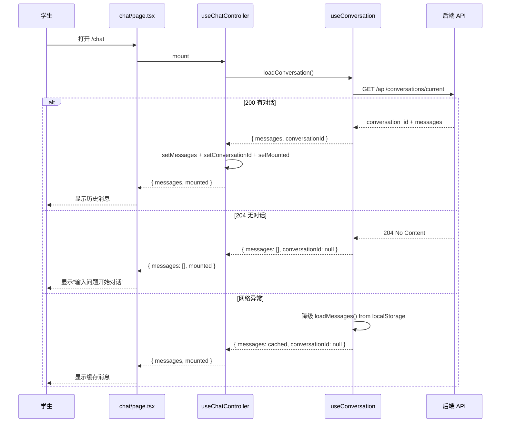
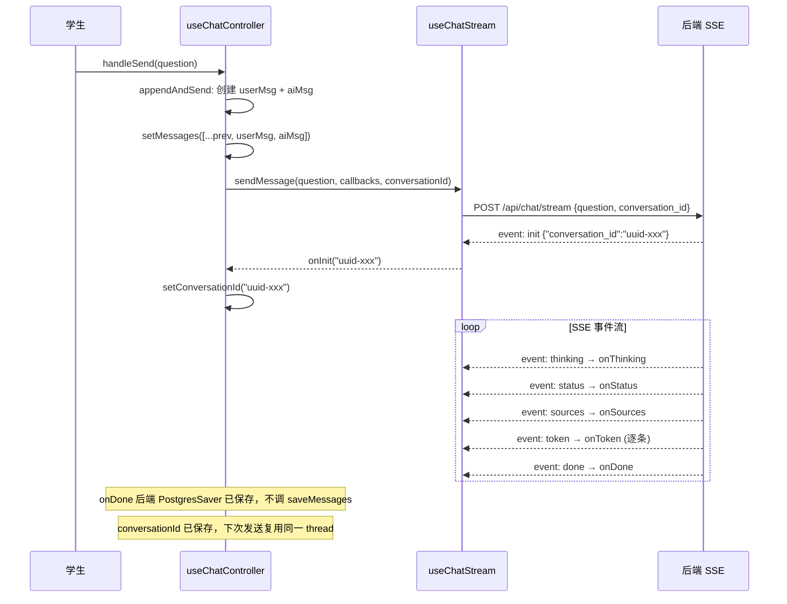
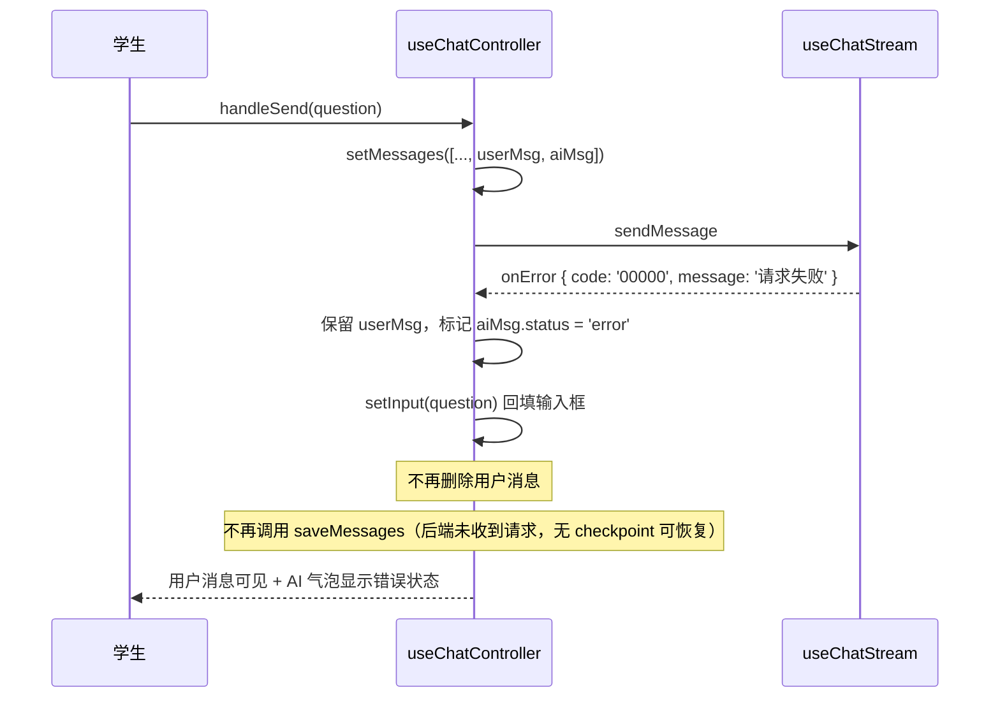
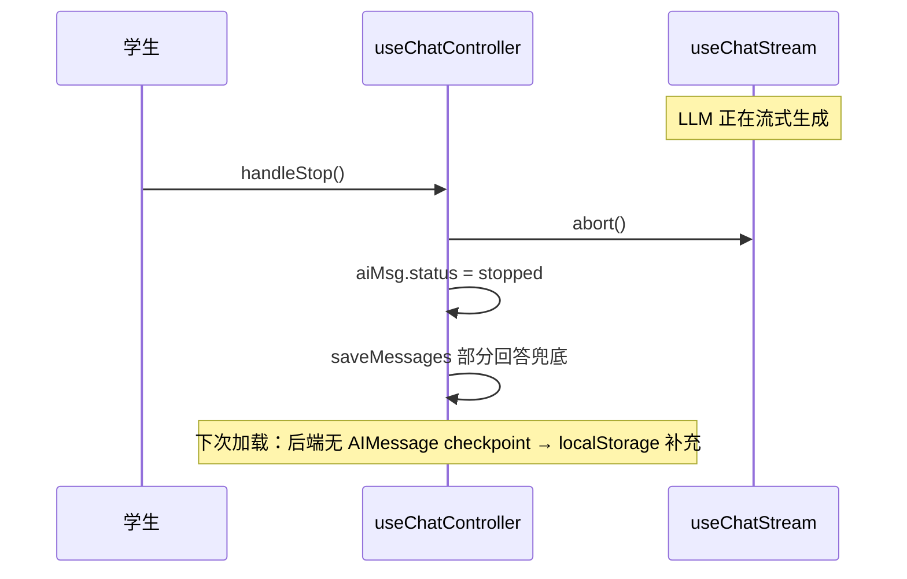

# Chat — 前端 设计报告

> 关联设计：Agent 后端 v2 后端(./2026-05-22--R007-persistence-agent-upgrade-backend.md)

## 1. 目标

- 收敛 api-client.ts 职责为纯 HTTP 请求发送，去掉刷新锁和跳转逻辑；auth-context.tsx 统一用单个 AuthService 管理认证，去掉独立 TokenManager；删除冗余 chat/api.ts
- 从后端 API 加载对话历史，替代 localStorage 作为主存储；API 不可用时降级到 localStorage
- SSE 首个事件回传 `conversation_id`，前端保存复用，实现多轮消息关联同一 thread
- 接收并展示 SSE thinking 事件，渲染可折叠的思考过程 UI
- 抽取 `useChatController` 统一管理消息状态、对话加载、SSE 流和持久化，ChatUI 只负责渲染
- 修复 `loadConversation` 未用 `useCallback` 导致引用不稳定、消息被清空的 bug
- 移除终态 saveMessages 调用（后端 PostgresSaver 自动保存），仅保留降级分支

## 2. 现状分析

**已有能力（R006 设计完成，代码已实施）**：
- `api-client.ts` 提供 `fetchWithAuth`，支持 token 注入和 401 自动刷新重试
- `auth-context.tsx` 提供 `SharedTokenManager` + `AuthService`，通过 `registerAuthHandlers` 注入 api-client
- `use-chat-stream.ts` 处理 SSE 流式响应，支持 status/sources/token/done/error 五种事件
- `parse-sse.ts` 为通用 SSE 解析器，解析 `event: xxx\ndata: xxx` 格式
- `use-chat-storage.ts` 提供 localStorage 消息持久化（loadMessages / saveMessages）
- `use-conversation.ts` 对话加载 hook，GET /conversations/current + 降级 localStorage
- AuthContext 统一自动跳转（白名单 `/`, `/callback`），RouteGuard 已删除

**已发现的问题（R007 实施过程中暴露）**：
- **conversation_id 未回传**：后端 `stream_router.py` 生成 UUID 作为 thread_id，但 SSE 流中从不返回 conversation_id。前端 conversationId 始终为 null，每条消息创建独立 thread，无法关联多轮对话。用户退出页面后组件卸载，再进来只能拿到最近一个 thread 的单条消息
- **loadConversation 引用不稳定**：`use-conversation.ts` 的 `loadConversation` 未用 `useCallback` 包裹，每次渲染产生新引用。`chat-ui.tsx` 的 `useEffect([loadConversation])` 检测到依赖变化后重新调用 → `setMessages([])` 覆盖用户刚发的消息 → **消息一闪消失**
- **onError 删除用户消息过于激进**：SSE 请求失败时前端构造 `code: '00000'`，触发 `prev.slice(0, -2)` 撤回 user+ai 两条消息。但用户已输入的内容不应被静默删除，应保留用户消息、标记 AI 消息为 error
- **conversation_router 204 响应不规范**：`JSONResponse(status_code=204, content=None)` 会序列化 `"null"` 作为 body，违反 HTTP 204 不应有 body 的规范。导致 Starlette error middleware 抛出 `Response content longer than Content-Length`

**基础设施就绪**：
- 后端 `GET /api/conversations/current` 已实现，返回 conversation_id + messages
- 后端 `POST /api/chat/stream` 已实现，接受 `conversation_id` 参数
- 后端 SSE 已有 `thinking` 事件类型
- 后端 PostgresSaver 自动保存 checkpoint

## 3. 数据模型与接口

### 数据模型

```typescript
/** 思考步骤 — SSE thinking 事件携带 */
export interface ThinkingStep {
  text: string;
  index: number;
}

/** 后端消息格式（role 为 human/ai） */
export interface ApiMessage {
  id: string;
  role: 'human' | 'ai';
  content: string;
  status: 'completed' | 'stopped' | 'error';
  sources?: SourceReference[];
  thinking_steps?: ThinkingStep[];
  created_at: string;
}

/** GET /api/conversations/current 响应体 */
export interface ConversationResponse {
  conversation_id: string;
  messages: ApiMessage[];
}

/** SSECallbacks — 全部事件回调 */
export interface SSECallbacks {
  onInit: (conversationId: string) => void;              // R007-v4 新增
  onStatus: (stage: string, message: string) => void;
  onSources: (sources: SourceReference[]) => void;
  onToken: (token: string) => void;
  onThinking: (step: ThinkingStep) => void;
  onDone: () => void;
  onError: (error: { code: string; message: string; action: string }) => void;
}

/** Message */
export interface Message {
  id: string;
  role: 'user' | 'ai';
  content: string;
  status: MessageStatus;
  sources?: SourceReference[];
  thinkingSteps?: ThinkingStep[];
  error?: { code: string; message: string; action: string };
  timestamp: number;
}
```

| 设计选择 | 决策 | 理由 |
|---------|------|------|
| conversation_id 获取方式 | **SSE init 事件回传**（方案 B） | 实测方案 A（前端不获取，后端用 user_id 关联）失败：每条消息创建新 thread，无法关联多轮对话。init 事件在 SSE 流开头返回 conversation_id，前端保存后复用 |
| ThinkingStep 字段 | 仅 text + index | 后端 SSE 格式 `event: thinking\ndata: {"text":"...","index":1}`，无需额外字段 |
| Message.thinkingSteps 可选 | `thinkingSteps?: ThinkingStep[]` | 仅 AI 消息有值，user 消息为 undefined |
| Role 映射 | 后端 `human` → 前端 `user` | 后端使用 LangGraph 标准 role，前端保持现有命名 |
| onError 处理策略 | 保留用户消息，仅标记 AI 为 error | 用户已输入的内容不应被静默删除。用户消息保留可见，AI 消息显示 error 状态 + 重试按钮 |
| ChatController 层级 | useChatController (hook) | 不引入额外状态管理库，React Context + 自定义 hook 够用；ChatUI 300+ 行需拆分职责 |
| loadConversation 稳定性 | useCallback 空依赖 | 函数内部不依赖响应式状态，空依赖确保引用稳定，useEffect 不重复触发 |

### 接口契约

| API | 方法 | 请求 | 响应 |
|-----|------|------|------|
| `/api/conversations/current` | GET | — | 200: `{ conversation_id, messages: ApiMessage[] }` / 204: 无 body |
| `/api/chat/stream` | POST | `{ question, top_k, conversation_id? }` | SSE text/event-stream |

**SSE 事件格式**：

| 事件 | data 格式 | 位置 | 说明 |
|------|-----------|------|------|
| `init` | `{"conversation_id": "uuid"}` | **首个事件** | R007-v4 新增，返回当前对话 ID |
| `thinking` | `{"text": "...", "index": 1}` | classify 后 | 智能体思考步骤 |
| `status` | `{"stage": "...", "message": "..."}` | 各阶段 | 阶段状态 |
| `sources` | `SourceReference[]` | retrieve 后 | 来源引用 |
| `token` | `string` | respond 中 | 流式 token |
| `done` | — | 末尾 | 完成信号 |
| `error` | `{"code":"...","message":"...","action":"..."}` | 异常时 | 错误信号 |

**错误码处理策略（更新）**：

| 错误码 | 来源 | 前端处理 |
|--------|------|----------|
| 00000 | 前端本地（网络失败/HTTP 非 200） | **保留用户消息**，AI 消息标记 error，文本回填输入框 |
| 02102-02205 | 后端 | 保留 user+ai 消息，AI 显示 error 状态 |

## 4. 核心流程

### 4.1 页面初始化 + ChatController



### 4.2 消息发送（含 conversation_id 回传）



### 4.3 SSE 请求失败（保留用户消息）



### 4.4 用户主动暂停生成



## 5. 项目结构与技术决策

### 项目结构

```
frontend/src/
├── lib/
│   ├── api-client.ts                  ✓ 已完成 — registerAuthHandlers + fetchWithAuth
│   └── utils.ts                       ── 不修改
├── contexts/
│   ├── auth-context.tsx               ✓ 已完成 — SharedTokenManager + 自动跳转 + 白名单
│   └── shared-token-manager.ts        ✓ 已完成 — 并发安全 refreshTokens
├── chat/
│   ├── controller.ts                  ★ 新增 — 统一聊天控制器（消息状态 + 对话加载 + SSE + 持久化）
│   ├── use-conversation.ts            ★ 修改 — useCallback 包裹 + conversationId 管理
│   ├── use-chat-stream.ts             ✓ 已完成 — thinking case + conversationId 参数
│   ├── types.ts                       ★ 修改 — SSECallbacks 新增 onInit
│   ├── use-chat-storage.ts            ── 不修改 — 降级保留
│   └── parse-sse.ts                   ── 不修改 — 通用解析器
└── components/
    ├── chat-ui.tsx                     ★ 修改 — 瘦身：只渲染，业务逻辑委托 controller
    ├── message-bubble.tsx              ✓ 已完成 — ThinkingProcess 集成
    ├── thinking-process.tsx            ✓ 已完成 — 可折叠思考过程
    ├── chat-input.tsx                  ── 不修改
    └── source-card.tsx                 ── 不修改
```

**后端配合修改**：

```
backend/app/chat/
├── stream_router.py                   ★ 修改 — SSE 首个事件返回 init {conversation_id}
└── conversation_router.py             ★ 修改 — 204 响应改用 Response(status_code=204)
```

### 职责划分

| 组件/模块 | 知道什么 | 不知道什么 |
|-----------|----------|------------|
| `controller.ts` | 消息列表状态；conversationId；何时加载对话/发送消息/停止/重试；SSE 回调逻辑；saveMessages 时机 | UI 渲染细节（组件结构、样式、DOM） |
| `chat-ui.tsx` | controller 返回的 messages/input/isStreaming/mounted；如何渲染 MessageBubble/ChatInput | 消息从哪来、SSE 怎么调、saveMessages 何时触发 |
| `use-conversation.ts` | conversation API 路径；role/status 映射；降级 localStorage | SSE 流式逻辑；UI 渲染 |
| `use-chat-stream.ts` | conversationId 传给后端；init/thinking 等事件回调；fetchWithAuth 发 SSE 请求 | conversationId 从哪来；消息保存逻辑 |
| `api-client.ts` | 如何附加 Authorization header；401 时重试 | token 怎么来、业务 URL 含义 |

**调用方向**：

```
chat-ui.tsx (渲染层)
    │
    └─► controller.ts (业务层)
          ├─► useConversation (对话加载)
          ├─► useChatStream (SSE 流)
          └─► useChatStorage (降级持久化)
                │
                └─► api-client.ts (HTTP 层)
                      │
                      └─► auth-context.tsx (鉴权层)
```

### 技术决策

| 决策 | 方案 | 理由 |
|------|------|------|
| conversation_id 获取方式 | **SSE init 事件回传** | 方案 A（前端不获取）实测失败：每条消息创建新 thread。init 事件在 SSE 流开头一次性返回，前端保存后复用，简单可靠 |
| controller 实现形式 | 自定义 hook (useChatController) | 不引入 Redux/Zustand 等状态管理库；React hook 够用；ChatUI 组件 300+ 行需要拆分职责 |
| onError 用户消息处理 | 保留用户消息 + AI 标记 error + 文本回填输入框 | 用户已输入内容不应被静默删除；回填输入框方便重试 |
| loadConversation 稳定性 | useCallback 空依赖数组 | 函数内部不依赖响应式状态（fetchWithAuth 是模块级函数，setConversationId 是稳定引用） |
| conversation_router 204 | `Response(status_code=204)` 替代 `JSONResponse(status_code=204, content=None)` | HTTP 204 不应有 body；JSONResponse 会序列化 "null" 导致 Content-Length 冲突 |
| saveMessages 调用策略 | 终态全部移除，仅 handleStop 保留 | 后端 PostgresSaver 自动保存；handleStop 时 respond 未完成无 checkpoint 需兜底；onError 不再调 saveMessages（用户消息保留可见，无需兜底保存） |
| ThinkingProcess 默认状态 | 折叠 | 不干扰主要回答内容阅读 |

**saveMessages 调用点变化**：

| 调用点 | R005 | R007-v4 | 理由 |
|--------|------|---------|------|
| appendAndSend（发送时） | `saveMessages` | 移除 | 后端 SSE 开始时保存 |
| updateMsgAndSave（终态） | `saveMessages` | 移除 | PostgresSaver 自动保存 |
| handleStop（停止时） | `saveMessages` | **保留** | respond 未完成，无 checkpoint |
| handleRegenerate | `saveMessages` | 移除 | PostgresSaver 自动保存 |
| onError(00000)（请求失败） | `saveMessages` + 撤回 | **保留消息 + 不调 saveMessages** | 用户消息保留可见；后端没收到请求无需兜底 |

## 6. 验收标准

| 验收条件 | 验收方式 |
|---------|---------|
| 打开页面 → API 返回历史消息 → 正确显示（含 thinkingSteps） | 集成测试：mock GET /conversations/current 返回含 thinking_steps 的消息 |
| API 返回 204 → 显示空态提示 | 手动操作：新用户首次进入 /chat |
| API 失败 → 降级 localStorage → 显示缓存消息 | 单元测试：mock fetchWithAuth 抛异常 |
| **SSE init 事件返回 conversation_id → 前端保存** | 单元测试：mock init 事件 → onInit 回调设置 conversationId |
| **后续发送使用同一 conversation_id** | 单元测试：第二次 sendMessage body 包含 init 返回的 conversation_id |
| **退出页面再进入 → 加载历史消息（含多轮对话）** | 手动操作：发 2 条消息 → 离开 /chat → 返回 /chat → 看到 2 轮对话 |
| SSE thinking 事件 → thinkingSteps 追加 | 单元测试：mock thinking 事件 → onThinking 被调用 |
| ThinkingProcess 默认折叠，点击展开/折叠 | 组件测试 |
| **onError(00000) 保留用户消息，AI 标记 error** | 单元测试：触发 00000 → userMsg 仍在 → aiMsg.status = 'error' |
| **onError(00000) 文本回填输入框** | 单元测试：触发 00000 → input 值为发送的文本 |
| handleStop 调用 saveMessages（部分回答兜底） | 单元测试 |
| onDone / handleRegenerate 不调用 saveMessages | 单元测试 |
| api-client 通过 registerAuthHandlers 接收回调 | 单元测试 |
| auth-context 自动跳转 + 白名单正常 | 单元测试 |
| **ChatUI 不超过 80 行（纯渲染逻辑）** | 代码审查 |
| **controller.ts 包含所有业务逻辑** | 代码审查：handleSend/handleStop/handleRegenerate 在 controller 中 |

## 7. 暂不实现

| 功能 | 理由 |
|------|------|
| 对话列表管理（多对话切换、新建对话） | 当前仅需最近一次对话，多对话管理为后续需求 |
| 离线完整支持 | 当前降级策略仅保留历史查看，离线发送不在本次范围 |
| 编辑已发送消息 | PostgresSaver checkpoint 是 append-only；后续可通过 checkpoint 分支实现 |
| 检索降级提示 UI | 后端 AgentState 已有降级标记，但 SSE 事件和前端 UI 暂不实现 |
| 思考步骤搜索/过滤 | 步骤数量少（通常 3-5 步），无搜索必要 |
| 思考步骤 Markdown 渲染 | 步骤文本为纯描述性语句，无需富文本 |
