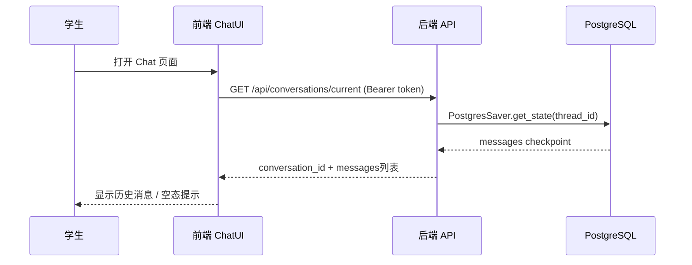
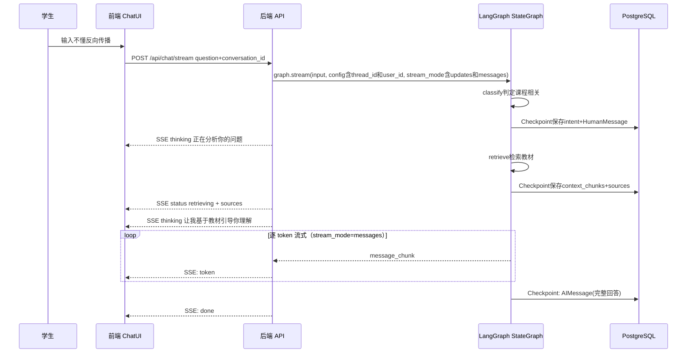
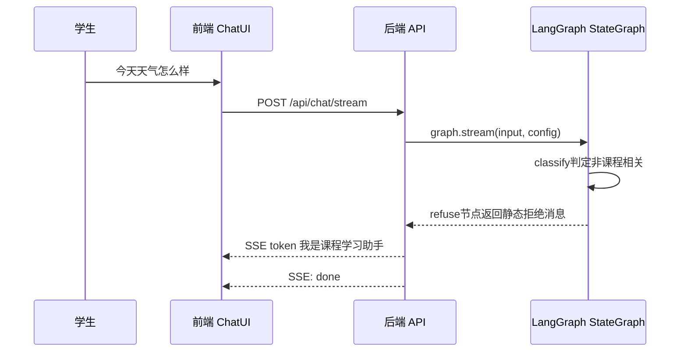
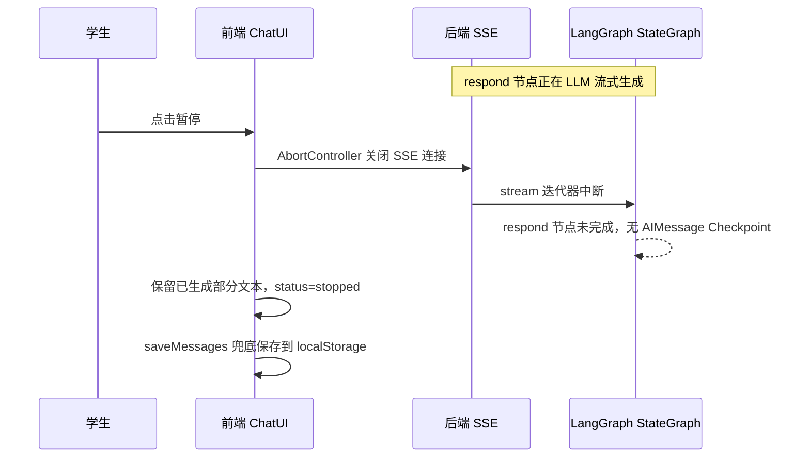
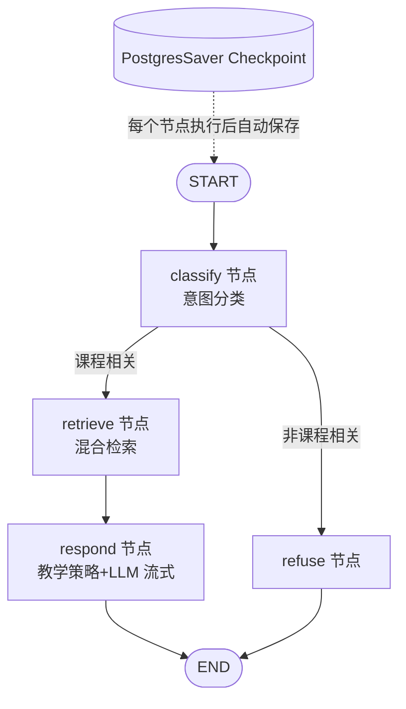

# 消息持久化 + 智能体教学策略升级 — 功能分析

## 概述

OctoTutor 当前的消息存储依赖浏览器 localStorage，页面刷新后可能丢失，且无法跨设备同步。同时，现有回答逻辑是简单的 retrieve-then-generate 流水线，缺乏教学策略引导。R007 要做三件事：(1) 引入 LangGraph StateGraph + PostgresSaver，将消息持久化到 PostgreSQL，实现对话不丢失、跨设备可恢复；(2) 升级智能体为教学策略驱动的引导式回答，包括意图分类、检索，以及类比驱动、启发式引导等教学能力；(3) 收敛前端鉴权架构职责 — api-client.ts 去掉刷新锁和跳转逻辑回归纯 HTTP 层，auth-context.tsx 去掉独立 TokenManager 统一用 AuthService，route-guard 只判断状态不触发跳转。不做 ReAct/tool-calling/外部工具，教学行为完全由 system prompt 驱动。

## 一、交互链

### 场景 1：打开页面恢复对话

**用户故事**：作为学生，我想打开 Chat 页面时看到之前的对话记录，以便继续之前的学习。

用户打开 Chat 页面，前端调用 `GET /api/conversations/current` 携带 Bearer token。后端根据 user_id 查询 PostgresSaver Checkpoint，返回该用户最近的 conversation_id 和消息列表。如果有历史消息，前端渲染历史对话；如果没有，显示空态提示。

### 场景 2：问课程问题（引导式教学）

**用户故事**：作为学生，我想问一个课程相关的知识点问题，以便得到引导式提问而非直接答案，帮我真正理解知识。

用户输入"我不懂反向传播"并发送。后端通过 LangGraph StateGraph 处理：classify 节点判断为课程相关 → retrieve 节点检索教材 → respond 节点基于教学策略 prompt 引导式回答。前端通过 SSE 流式接收：先显示 thinking 事件（推理步骤，可折叠），再逐 token 显示引导式回答。每个 StateGraph 节点执行后 PostgresSaver 自动 Checkpoint。

### 场景 3：问非课程问题

**用户故事**：作为学生，我想问一个与课程无关的问题时得到明确拒绝，以便知道系统只回答课程相关问题。

用户输入"今天天气怎么样"。classify 节点判断为非课程相关 → refuse 节点返回静态拒绝消息"我是课程学习助手，专注于帮你理解教材内容"。前端显示拒绝消息。

### 场景 4：刷新后恢复对话

**用户故事**：作为学生，我想刷新页面后看到完整对话，以便不丢失学习记录。

用户刷新页面，前端调用 GET /api/conversations/current，后端从 PostgresSaver Checkpoint 加载消息，前端恢复渲染。若之前有用户主动暂停导致的部分回答（后端无 AIMessage checkpoint），前端从 localStorage 补充显示。

### 场景 5：查看智能体思考过程

**用户故事**：作为学生，我想看到智能体的推理步骤，以便理解它如何分析我的问题。

智能体回答时，respond 节点通过 SSE 发送 thinking 事件（推理步骤），前端以可折叠形式展示。

### 场景 6：主动暂停生成

**用户故事**：作为学生，我想在 LLM 回答过程中随时点击暂停，以便在已经获得足够信息时中断生成，不用等待完整回复。

用户在 LLM 流式生成过程中点击暂停按钮。前端通过 AbortController 关闭 SSE 连接，已生成的部分回答保留在界面并标记为 stopped 状态。后端 graph.stream() 迭代器因连接断开而中断，respond 节点未完成执行，PostgresSaver 未保存 AIMessage。前端将部分回答保存到 localStorage 兜底。

若用户发现输入有误想修改（如"什么是导致"改为"什么是导数"），不支持编辑已发送消息。用户直接在输入框输入新问题发送即可，旧问答（含错误问题）保留在对话历史中。

## 二、逻辑树

### 事件流：课程问题处理

| 时刻 | 事件 | 处理 | 产生的新事件 |
|------|------|------|-------------|
| T1 | 学生发送消息 | POST /api/chat/stream 接收 {question, conversation_id} | conversation_id 为 null 时后端自动创建 |
| T2 | graph.stream 启动 | classify 节点：意图分类 | 判定为 textbook / unrelated |
| T3 | classify 完成 | PostgresSaver 自动 Checkpoint（intent + HumanMessage） | SSE: thinking + 触发条件路由 |
| T4 | 路由到 retrieve | retrieve 节点：Embed → Vector Store → BM25 → RRF 融合 → Rerank | SSE: status(retrieving) + sources；若检索降级则标记 degraded=true |
| T5 | retrieve 完成 | PostgresSaver 自动 Checkpoint（context_chunks + sources + degraded + degradation_reason） | 路由到 respond |
| T6 | respond 开始 | respond 节点：教学策略 prompt + LLM 流式生成 | SSE: thinking(推理步骤) |
| T7 | LLM 生成中 | stream_mode=messages 逐 token 流式输出 | SSE: token |
| T8 | LLM 生成完成 | PostgresSaver 自动 Checkpoint（AIMessage 完整回答） | SSE: done |

### 事件流：非课程问题处理

| 时刻 | 事件 | 处理 | 产生的新事件 |
|------|------|------|-------------|
| T1 | 学生发送非课程问题 | POST /api/chat/stream 接收 | - |
| T2 | classify 完成 | 判定为 unrelated | 路由到 refuse |
| T3 | refuse 节点 | 返回静态拒绝消息 | SSE: token("我是课程学习助手...") |
| T4 | 完成 | PostgresSaver Checkpoint | SSE: done |

### 事件流：页面加载恢复对话

| 时刻 | 事件 | 处理 | 产生的新事件 |
|------|------|------|-------------|
| T1 | 学生打开页面 | 前端调用 GET /api/conversations/current | - |
| T2 | 后端查询 | PostgresSaver.get_state(thread_id) 按 user_id | 返回 messages[] |
| T3 | 前端渲染 | 有消息 → 显示历史；无消息 → 空态提示 | - |

### 事件流：用户主动暂停生成

| 时刻 | 事件 | 处理 | 产生的新事件 |
|------|------|------|-------------|
| T1 | 用户点击暂停 | 前端 AbortController.abort() 关闭 SSE 连接 | - |
| T2 | 连接断开 | 后端 stream 迭代器中断，respond 节点未完成 | 无 AIMessage Checkpoint |
| T3 | 前端保留部分回答 | aiMsg.status = stopped，保留已生成文本 | - |
| T4 | 前端兜底保存 | saveMessages 保存到 localStorage | - |

### 状态流转

| 实体 | 触发事件 | 前状态 | 后状态 |
|------|----------|--------|--------|
| Conversation | conversation_id 为 null 创建新对话 | 不存在 | active（有 conversation_id） |
| Conversation | classify 完成 | active | classified（textbook / unrelated） |
| Message | 学生发送消息 | - | HumanMessage 已保存（Checkpoint） |
| Message | respond 完成 | generating | AIMessage 已保存（Checkpoint） |
| Message | 用户主动暂停 | generating | stopped（仅前端 localStorage 兜底，后端无 Checkpoint） |
| Conversation | SSE done 完成 | classified | completed（等待下一条消息） |

### StateGraph 流程图

## 三、功能编号与网络定位

### 本次新增节点

| 编号 | 功能节点 | 前缀含义 | 简介 |
|------|----------|---------|------|
| BF001 | PostgresSaver 初始化 | 后端基础 | FastAPI lifespan 中初始化 PostgresSaver，连接 xlfoundryTest PostgreSQL，自动管理 checkpoint 表 |
| BF002 | DATABASE_URL 配置 | 后端基础 | config.py 新增 database_url 字段，docker-compose.local.yml 新增 DATABASE_URL 环境变量 |
| BB001 | StateGraph 编排 | 后端业务 | LangGraph StateGraph 替代手写 retrieve→generate 流水线，定义条件路由（classify → retrieve/respond → refuse），stream_mode=["updates","messages"] 原生流式 |
| BB002 | classify 节点 | 后端业务 | 意图分类（textbook/unrelated），替代现有 question_classifier 的 retrieval/direct 分类 |
| BB003 | respond 节点 + 教学策略 prompt | 后端业务 | 教学策略 system prompt 驱动 LLM（类比驱动、趣味记忆、步骤化叙事、启发式引导、兜底解释、纠正误解、知识关联、出练习题、总结回顾），stream_mode=messages 逐 token 流式 + SSE thinking 事件 |
| BB004 | refuse 节点 | 后端业务 | 非课程问题返回静态拒绝消息 |
| BB005 | conversation_id 管理 | 后端业务 | ChatRequest 新增 conversation_id 字段，null 时后端自动创建，thread_id = conversation_id |
| BB006 | user_id 传递 | 后端业务 | R006 的 get_current_user() 获取 user_id，通过 graph config 传入 StateGraph |
| FF001 | SSE thinking 事件 | 前端基础 | StreamEvent.type 新增 "thinking"，后端发送推理步骤 |
| FF002 | 鉴权架构优化 | 前端基础 | api-client.ts 职责收敛（去掉刷新锁/跳转，registerGetToken→registerAuthHandlers）；auth-context.tsx 去掉独立 TokenManager 统一用 AuthService；route-guard 只判断状态不触发跳转；删除冗余 chat/api.ts |
| FB001 | 前端思考过程展示 | 前端业务 | chat-ui.tsx 可折叠展示 thinking 推理步骤 |
| FB002 | 前端对话加载 | 前端业务 | 打开页面调用 GET /api/conversations/current 恢复对话，替代 localStorage 逻辑 |

### 前置依赖

| 依赖节点 | 依赖方式 | 是否已有 |
|----------|----------|----------|
| R006 get_current_user() 注入 user_id | 调接口（Depends 注入） | R006 设计完成，代码待实施 |
| R006 fetchWithAuth (api-client.ts) | 调接口（R007 同步优化：职责收敛） | R006 设计完成，代码待实施 |
| R006 auth-context.tsx | 注册 registerAuthHandlers（R007 同步优化：去重 TokenManager） | R006 设计完成，代码待实施 |
| @xlfoundry/auth-sdk-web AuthService | 调接口 | 已引入（R006） |
| xlfoundryTest PostgreSQL 实例 | 共享数据 | 已有 |
| 现有 retrieve 逻辑（Embed + Vector Store + BM25 + RRF + Rerank） | 调接口 | 已有 |
| 现有 SSE 流式输出（stream_router.py） | 调接口 | 已有，需扩展 thinking 事件 |

### 边界接口

| 接口/协议 | 定义方 | 消费方 | 敏感度 |
|-----------|--------|--------|--------|
| POST /api/chat/stream {question, conversation_id, top_k} | 后端 stream_router | 前端 use-chat-stream | 中（需 auth） |
| GET /api/conversations/current（按 Bearer token 中 user_id 查找最近对话） | 后端 conversation router | 前端 use-conversation | 中（需 auth）。200 返回 {conversation_id, messages[]} 含完整字段；204 无对话记录 |
| registerAuthHandlers(getToken, onUnauthorized) | 前端 api-client.ts | 前端 auth-context.tsx | 高（token 获取 + 401 处理） |
| SSE event type: thinking | 后端 schemas.py | 前端 chat-ui.tsx | 低 |
| SSE event type: status(retrieving) + sources | 后端 stream_router | 前端 chat-ui.tsx | 低 |
| graph config: {thread_id, user_id} | 后端 stream_router | LangGraph StateGraph | 高（user_id 隔离） |
| DATABASE_URL | docker-compose.local.yml | config.py + PostgresSaver | 高（数据库凭据） |

## 四、结论

- **开发顺序建议**：FF002（鉴权架构优化：api-client 职责收敛 + auth-context 去重）→ BF001/BF002（基础设施：PostgreSQL 连接 + PostgresSaver）→ BB001/BB002/BB004（StateGraph 骨架：classify + refuse + 基本路由）→ BB005/BB006（conversation_id + user_id 传递）→ BB003（教学策略 prompt）→ FF001/FB001（thinking 事件 + 前端展示）→ FB002（前端对话加载替代 localStorage）
- **复杂度集中的地方**：(1) LangGraph StateGraph 条件路由 + stream_mode=["updates","messages"] 原生流式的正确接入；(2) PostgresSaver 与 FastAPI lifespan 初始化的异步协调；(3) 教学策略 prompt 工程的调优（确保 LLM 引导而非直接给答案）
- **暂不实现的部分及理由**（各模块特有的暂不实现项见对应设计文档）：
  - 对话列表 UI 侧边栏：R007 范围裁剪，保持单对话模式
  - 多对话切换交互：同上，留给后续需求周期
  - ReAct / tool-calling / 外部工具：用户明确表示"后面也不会加"，教学行为完全由 prompt 驱动
  - rewrite 追问改写 / assess 检索质量评估闭环：先验证基础 classify+retrieve+respond 闭环，追问改写和评估闭环作为后续迭代加入
  - 编辑已发送消息：PostgresSaver checkpoint 是 append-only，不支持回改历史消息；用户可直接发新消息纠正，旧问答保留在历史中；后续可通过 LangGraph checkpoint 分支实现
  - 教学策略效果量化评估：prompt 设计是持续优化过程，R007 先建立基础框架，效果量化留后续迭代
  - 检索降级前端提示：后端 AgentState 已有 degraded/degradation_reason 标记，但 SSE 事件和前端 UI 暂不透传，留后续迭代
- **关键风险**：
  - R006 未实施会导致 user_id 获取不可用 → R007 依赖 R006 先完成
  - 教学策略 prompt 可能不生效（LLM 直接给答案不引导）→ 需迭代调优
  - 意图分类误判 → 默认走课程路径，宁可多检索不漏检索
  - PostgreSQL 连接不可用 → 降级为消息仍返回但不保存
