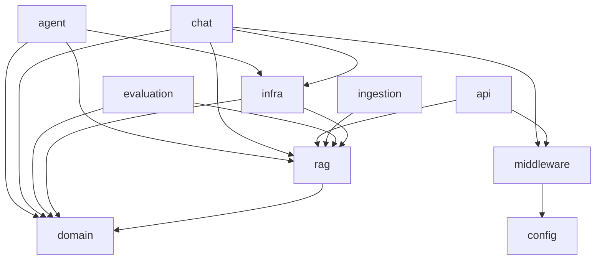

# architecture-refactor — 后端 设计报告

## 1. 目标

- 消除 `agent → chat` 的同层依赖（`question_classifier` 归属不合理）
- 消除 `infra.llm` 对 `rag.context_builder` 的反向依赖（职责过重）
- 理顺依赖方向，确保严格单向：业务层 → 基础设施层 → 基础层
- 所有现有测试不回归

## 2. 现状分析

### 已有能力

完整的后端架构：`domain` → `rag` → `infra` → `chat/agent/api/ingestion/evaluation` → `main`，功能完备，无循环依赖。

### 存在的问题

基于 `docs/module-dependency.md` 依赖图审计，发现 **3 个架构缺陷**：

| # | 问题 | 影响 |
|---|------|------|
| 1 | `agent.nodes` 导入 `chat.question_classifier` | agent 和 chat 业务层同层耦合，agent 不能独立演进 |
| 2 | `infra.llm` 导入 `rag.context_builder`（2 个函数） | 基础设施层反向依赖 rag 包，llm 混入了 context 格式化逻辑 |
| 3 | `rag.context_builder` 同时被 `infra.llm` 和 `agent.graph` 依赖 | context_builder 做的是"为 LLM 格式化 prompt"，放在 rag 检索包里语义不对 |

### 当前依赖（问题路径标红）

```
agent.nodes ──→ chat.question_classifier     ← 同层耦合
infra.llm ────→ rag.context_builder          ← 层级穿越
agent.graph ──→ rag.context_builder          ← 语义不当
```

## 3. 核心流程

### 3.1 重构前依赖图

```mermaid
graph TB
    agent --> chat
    agent --> rag
    infra --> rag

    style agent --> chat fill:#f66,stroke:#f66
    style infra --> rag fill:#f66,stroke:#f66
```

### 3.2 重构后依赖图



**关键变化**：
- `agent` 不再依赖 `chat`，改为依赖 `infra`
- `rag.context_builder` 移入 `infra`，rag 包更纯粹

## 4. 项目结构与技术决策

### 4.1 变更清单

| 变更 | 操作 | 理由 |
|------|------|------|
| `chat/question_classifier.py` | **移动** → `domain/classifier.py` | 意图分类是通用能力，不属于 chat 特有，agent/api 都可能用 |
| `rag/context_builder.py` | **移动** → `infra/context_builder.py` | 为 LLM 格式化 prompt 是 infra 职责，不是 rag 检索职责 |
| `infra/llm.py` | **修改** import 路径 | 改为从同包 `infra.context_builder` 导入 |
| `agent/nodes.py` | **修改** import 路径 | 改为从 `domain.classifier` 导入 |
| `agent/graph.py` | **修改** import 路径 | 改为从 `infra.context_builder` 导入 |
| `chat/service.py` | **修改** import 路径 | 改为从 `domain.classifier` 导入 |
| `tests/test_question_classifier.py` | **修改** import 路径 | `from app.chat.question_classifier` → `from app.domain.classifier` |
| `tests/test_llm_generator.py` | **修改** import 路径（4 处） | `from app.rag.context_builder` → `from app.infra.context_builder` |
| `chat/dependencies.py` | **无变更** | 不涉及被移动模块 |

### 4.2 重构后模块职责

```
domain/
  models.py          — 数据模型（不变）
  protocols.py       — Protocol 接口（不变）
  classifier.py      — 【新】意图分类，从 chat 移入

infra/
  llm.py             — LLM 调用（不变）
  bm25.py            — BM25 检索（不变）
  reranker.py        — 重排序（不变）
  context_builder.py — 【新】context 格式化，从 rag 移入

rag/
  models.py          — RAG 数据模型（不变）
  embeddings.py      — 向量化（不变）
  vector_store.py    — 向量存储（不变）
  chunkers/          — 分块器（不变）
  readers/           — PDF 读取（不变）
  classifiers/       — 块类型分类（不变）
```

### 4.3 技术决策

| 决策 | 方案 | 理由 |
|------|------|------|
| question_classifier 放哪 | `domain/classifier.py` | 它是无状态的纯函数，只依赖 re 标准库，属于通用业务逻辑，domain 是最合适的归属 |
| context_builder 放哪 | `infra/context_builder.py` | 它做的是"把检索结果格式化成 LLM prompt 文本"，服务对象是 LLM 而非检索，放在 infra 跟 llm 同包最自然 |
| 是否改函数签名 | 不改 | `classify_question`、`build_numbered_context`、`chunks_to_sources` 签名不变，只改 import 路径 |
| 是否改 domain.protocols | 不改 | protocols 依赖的 models 没有变化 |

### 4.4 依赖方向变化对比

| 模块 | 重构前依赖 | 重构后依赖 |
|------|-----------|-----------|
| agent.nodes | chat.question_classifier | domain.classifier |
| agent.graph | rag.context_builder | infra.context_builder |
| infra.llm | rag.context_builder | infra.context_builder（同包） |
| chat.service | chat.question_classifier | domain.classifier |

## 5. 验收标准

| 验收条件 | 验收方式 |
|----------|----------|
| `domain/classifier.py` 存在，内容与原 `chat/question_classifier.py` 一致 | `diff` 对比 |
| `infra/context_builder.py` 存在，内容与原 `rag/context_builder.py` 一致 | `diff` 对比 |
| 所有 import 路径更新完毕，无残留引用旧路径 | `grep -rn "from app.chat.question_classifier" backend/` 和 `grep -rn "from app.rag.context_builder" backend/` 返回 0 结果（覆盖 app/ 和 tests/） |
| 无循环依赖 | `python -c "import app.main"` 不报错 |
| 全部测试通过 | `cd backend && python -m pytest` |
| 依赖图验证：agent 不再依赖 chat，infra 不再跨包依赖 rag | 重新生成 `docs/module-dependency.puml` 并对比 |

## 6. 暂不实现

| 功能 | 理由 |
|------|------|
| rag → domain 同层依赖消除 | rag.context_builder 依赖 domain.models.SourceReference 是合理的，context_builder 移走后 rag 不再直接依赖 domain，此问题自动消失 |
| domain.protocols 依赖 rag.models 的同层问题 | protocols 定义的是接口签名，依赖 QueryResult 类型合理，不影响架构清晰度 |
| 进一步拆分 chat 包为子包 | 当前 chat 包内聚性可接受，没有强烈拆分动机 |
| 抽象 classifier 为 Protocol 接口 | 当前只有一种分类实现，过早抽象 |
