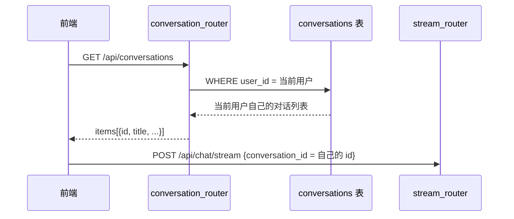
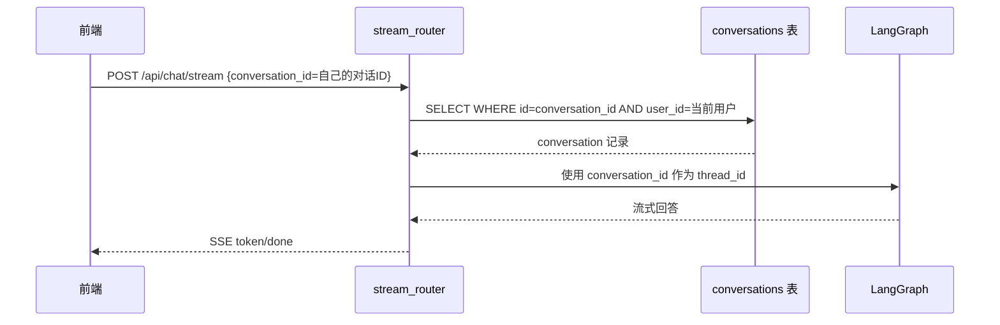
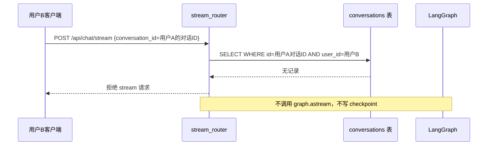
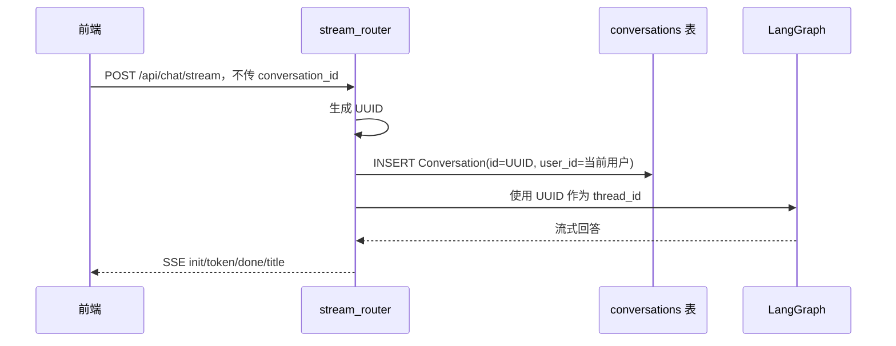

# 流式对话 conversation_id 归属校验 — 需求分析

## 概述

R009 引入了多对话管理：前端通过对话列表拿到当前用户自己的 `conversation_id`，再把它带到 `/api/chat/stream` 里继续对话。

正常 UI 链路下，这个流程看起来是安全的：

```text
用户登录
→ GET /api/conversations
→ 后端按 user_id 返回该用户自己的对话列表
→ 前端从列表中拿到 conversation_id
→ 用户点击某条自己的对话
→ /api/chat/stream 携带这个 conversation_id 继续对话
```

问题在于，后端接口不能只假设请求一定来自正常 UI。只要 `/api/chat/stream` 接受前端传入已有 `conversation_id`，就必须在使用它之前校验：

```text
conversation_id 是否属于当前 token 对应的 user_id？
```

当前列表、更新、删除接口已经通过 `id + user_id` 查询 `conversations` 表来保证归属隔离。但流式发送接口在已有 `conversation_id` 的情况下，当前逻辑会直接把它作为 LangGraph `thread_id` 使用，缺少同样的归属校验。

因此，本补丁要补齐的是 **stream 入口的用户归属校验**，不是修改对话列表 UI，也不是修改 `conversation.id = thread_id` 的整体设计。

---

## 一、为什么对话列表安全，stream 仍然可能有问题

### 正常路径

正常用户从页面点击对话时，`conversation_id` 来自列表接口。



这条链路下，前端拿不到别人的 `conversation_id`。

### 绕过路径

但 HTTP API 可以被手动构造。攻击者或异常客户端不一定通过对话列表拿 ID，而是可以直接向 stream 接口提交一个已有 ID：

```http
POST /api/chat/stream
Authorization: Bearer 用户B的token

{
  "question": "继续回答",
  "conversation_id": "用户A的conversation_id"
}
```

如果 stream 接口不校验 `conversation_id + user_id`，就会出现入口不一致：

```text
列表 / 更新 / 删除接口：
  使用 id + user_id 查询，能挡住越权访问

流式发送接口：
  直接使用 body.conversation_id 作为 thread_id，可能绕过列表入口
```

所以这个问题不是“UUID 会不会撞”，也不是“前端列表会不会给错 ID”。真正的问题是：**后端某个入口相信了客户端传入的 ID，没有再次确认归属。**

---

## 二、当前逻辑的问题点

当前 `/api/chat/stream` 的关键逻辑可以概括为：

```text
conversation_id = body.conversation_id or uuid4()
is_new_conversation = not body.conversation_id

如果是新对话：
  创建 Conversation(id=conversation_id, user_id=当前用户)

如果是已有对话：
  直接使用 body.conversation_id

graph.astream(..., config.thread_id = conversation_id, config.user_id = 当前用户)
```

新对话没有问题，因为 ID 由后端生成，并且创建时绑定当前 `user_id`。

已有对话的问题在于：`body.conversation_id` 是客户端传入的。后端在把它交给 LangGraph 作为 `thread_id` 之前，没有先查询 `conversations` 表确认：

```text
id = body.conversation_id
AND user_id = 当前用户
```

这会带来两个风险：

1. **越权继续对话风险**

   用户 B 如果拿到用户 A 的 `conversation_id`，可能把它作为自己的 stream 请求参数。

2. **两套存储边界被绕开**

   R009 的设计里，`conversations` 表是产品层对话入口，PostgresSaver 是 LangGraph 状态存储。已有对话应该先经过 `conversations` 表归属校验，再进入 checkpoint 链路。否则 stream 接口可能绕开产品层元数据，直接碰到 `thread_id`。

---

## 三、补丁目标

为 `/api/chat/stream` 补齐已有 `conversation_id` 的归属校验。

### 必须做到

- 新对话流程不变：不传 `conversation_id` 时，后端生成 UUID，并创建 `conversations` 记录
- 已有对话流程新增校验：传入 `conversation_id` 时，先查询 `conversations` 表
- 查询条件必须包含当前用户：

```text
Conversation.id == conversation_id
Conversation.user_id == current_user.user_id
```

- 查到记录后，才允许把 `conversation_id` 作为 LangGraph `thread_id` 使用
- 查不到时，拒绝本次 stream 请求
- 拒绝时不能暴露“这个 ID 是否属于其他用户”，统一按“对话不存在或不可访问”处理

### 必须避免

- 不能只判断 `conversation_id` 格式是否合法
- 不能只判断 checkpoint 是否存在
- 不能只依赖 `config.user_id`
- 不能让不存在于 `conversations` 表的旧 `thread_id` 继续作为已有对话使用

---

## 四、用户场景

### 场景 1：用户继续自己的对话

**用户故事**：作为学生，我想点击自己的历史对话继续提问。



期望结果：请求成功，继续原对话。

### 场景 2：用户携带他人的 conversation_id

**用户故事**：作为系统，我要阻止用户通过手动构造请求访问他人的对话。



期望结果：请求失败；不调用 LangGraph；不更新任何人的 conversation 元数据。

### 场景 3：新对话

**用户故事**：作为学生，我想点击新建对话后发送第一条问题。



期望结果：原有新建对话链路不回归。

---

## 五、逻辑树

```text
/api/chat/stream
├── body.conversation_id 为空
│   ├── 后端生成 uuid4
│   ├── 创建 conversations 记录，绑定当前 user_id
│   └── 允许 graph.astream
│
└── body.conversation_id 非空
    ├── 查询 conversations 表：id + user_id
    ├── 查到
    │   └── 允许 graph.astream
    └── 查不到
        ├── 拒绝请求
        ├── 不调用 graph.astream
        ├── 不更新 message_count / updated_at
        └── 不写入 checkpoint
```

---

## 六、边界问题

### 1. 已有 checkpoint 但没有 conversations 记录怎么办？

R009 之后，`conversations` 表是多对话管理的业务入口。已有 `conversation_id` 的 stream 请求必须能在 `conversations` 表里找到当前用户的记录。

如果 checkpoint 存在但 conversation 记录不存在，应该视为不可访问，不能绕过业务表直接继续。

### 2. 返回 HTTP 错误还是 SSE error？

需要在方案设计阶段确定。

当前 stream 接口是 SSE 语义，前端已有 SSE `error` 处理。但如果归属校验发生在进入 `StreamingResponse` 之前，也可以直接返回 HTTP 错误。

方案设计需要权衡：

- 前端现有错误处理能否复用
- 是否要保持 stream 接口所有业务失败都走 SSE error
- 测试如何覆盖

### 3. 使用哪个错误码？

倾向于统一表达为“对话不存在或不可访问”，避免暴露他人对话是否存在。

具体复用 conversation 错误码，还是新增 chat stream 错误码，留到方案设计阶段决定。

---

## 七、验收标准

| 验收条件 | 验收方式 |
| --- | --- |
| 新对话不传 `conversation_id` 时仍能创建 conversation 并正常流式回答 | 后端测试 / SSE 集成测试 |
| 当前用户传自己的 `conversation_id` 时可以继续对话 | 后端测试 / SSE 集成测试 |
| 用户 B 传用户 A 的 `conversation_id` 时请求失败 | 越权测试 |
| 越权请求不调用 `graph.astream` | mock graph 断言 |
| 越权请求不更新 `message_count` / `updated_at` | 查询 conversations 表或 mock repo 断言 |
| 越权请求不写入用户 A 的 checkpoint | checkpointer / graph 未调用断言 |
| 不存在的 `conversation_id` 不能作为已有对话继续 | 后端测试 |

---

## 八、暂不处理

| 范围 | 原因 |
| --- | --- |
| 前端主动隐藏或过滤异常 ID | 前端不是安全边界，后端必须兜底 |
| 多 tab 同一对话并发发送 | 属于并发写入/消息顺序问题，另开需求处理 |
| 新对话重复点击导致创建多条新 conversation | 属于请求幂等问题，另开需求处理 |
| checkpoint 与 conversations 表的强事务一致性 | 两套存储当前没有统一事务，本补丁只补 stream 入口归属校验 |
| conversation_id 改为不可猜测之外的额外访问令牌 | 当前 UUID 已足够防猜测，本问题重点是服务端归属校验 |
