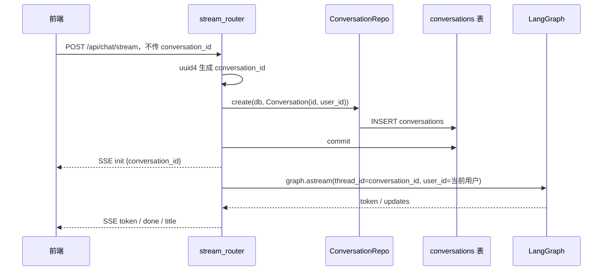
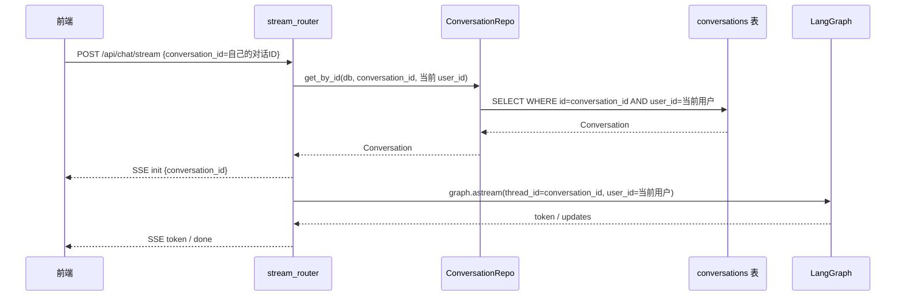
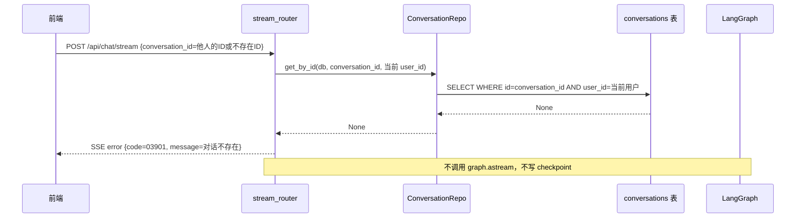

# 流式对话 conversation_id 归属校验 — 后端方案设计

## 1. 目标

为 `/api/chat/stream` 补齐已有 `conversation_id` 的用户归属校验，保证 stream 入口和 R009 已有的列表、更新、删除入口具备一致的安全边界。

本补丁只处理一个问题：

```text
当请求携带已有 conversation_id 时，必须确认它属于当前登录用户，才能作为 LangGraph thread_id 使用。
```

---

## 2. 当前问题

当前 `stream_router.py` 的核心逻辑是：

```python
conversation_id = body.conversation_id or str(uuid.uuid4())
is_new_conversation = not body.conversation_id

if is_new_conversation:
    conv = Conversation(id=conversation_id, user_id=user.user_id)
    await ConversationRepo.create(db, conv)
    await db.commit()

config = {
    "configurable": {
        "thread_id": conversation_id,
        "user_id": user.user_id,
    }
}
```

新对话没有问题：`conversation_id` 由后端生成，并立即绑定当前用户。

已有对话的问题是：`conversation_id` 来自客户端。当前代码没有先查询 `conversations` 表确认：

```text
id = body.conversation_id
AND user_id = 当前用户
```

因此，stream 入口和其他 conversation API 的安全边界不一致。

---

## 3. 设计决策

### 3.1 校验位置

归属校验放在 `stream_chat()` 进入 `graph.astream()` 之前。

```text
stream_chat
├── 解析 conversation_id
├── 新对话：创建 conversation
├── 已有对话：查询 ConversationRepo.get_by_id(db, conversation_id, user.user_id)
├── 校验通过：构造 graph config，进入 graph.astream
└── 校验失败：返回 SSE error，不调用 graph.astream
```

这样可以保证失败请求不会进入 LangGraph，也不会写入 checkpoint。

### 3.2 失败返回方式

采用 **SSE error 事件**，不直接返回普通 JSON 错误。

原因：

- `/api/chat/stream` 是 SSE 接口，前端 `useChatStream` 已经有 `error` 事件处理
- 如果直接返回 HTTP 404/403，当前前端只会得到较泛的“请求失败”
- SSE error 可以复用现有前端错误展示路径
- 对客户端来说，归属失败和不存在都表现为同一个业务错误，不暴露他人对话是否存在

失败响应保持 `text/event-stream`：

```text
event: error
data: {"code":"03901","message":"对话不存在","action":"refresh"}
```

使用 `ConversationErrorCode.NOT_FOUND`。虽然真实原因可能是“不属于当前用户”，但对外统一表达为“对话不存在”，避免暴露资源存在性。

如果归属校验过程本身发生数据库异常，则按内部错误处理，返回 SSE error：

```text
event: error
data: {"code":"02901","message":"服务异常，请重试","action":"retry"}
```

这种情况下同样不能发送 `init`，也不能进入 `graph.astream`。

### 3.3 是否发送 init

归属校验失败时不发送 `init`。

原因：

- `init` 的语义是“本次 stream 已确认使用这个 conversation_id”
- 对非法或不可访问的 `conversation_id` 发送 `init` 会误导前端
- 前端收到 `error` 后应按失败处理

### 3.4 是否允许 checkpoint fallback

不允许。

R009 之后，`conversations` 表是多对话管理的业务入口。已有对话必须有当前用户自己的 conversation 记录。

即使 PostgresSaver 中存在某个 `thread_id`，只要 `conversations` 表里找不到 `id + user_id`，stream 就不能继续。

### 3.5 Repository 是否新增方法

优先复用现有：

```python
ConversationRepo.get_by_id(db, conversation_id, user.user_id)
```

这个方法已经表达了本补丁需要的查询语义，不需要新增 Repository API。

### 3.6 架构文档是否更新

需要更新 `architecture.md`。

本补丁不是新增一类 API，但它补齐了 `/api/chat/stream` 的资源归属不变量：

```text
已有 conversation_id 在进入 LangGraph thread_id 之前，必须通过 conversations 表按 id + user_id 校验归属。
```

建议把这条写入 `architecture.md` 的“不变量”或“权威边界”中，避免后续改 stream 入口时再次绕过 `conversations` 表。

### 3.7 与 R010 的执行顺序

当前 `active_rc` 是 R010，且 R010 涉及 `backend/app/chat/stream_router.py`、SSE 事件映射和相关测试。

因此执行本补丁时要遵守以下顺序约束：

- 如果 R010 已先完成并修改了 `stream_router.py`，本补丁必须基于 R010 后的代码实现归属校验
- 如果本补丁先实现，R010 后续改动不得覆盖归属校验逻辑
- 任务拆解时应把 `stream_router.py` 标记为与 R010 存在冲突风险的文件，执行前先检查当前文件状态

---

## 4. 目标流程

### 4.1 新对话



新对话流程保持不变。

### 4.2 已有对话归属通过



### 4.3 已有对话归属失败



---

## 5. 代码改动设计

### 5.1 `backend/app/chat/stream_router.py`

新增 import：

```python
from app.chat.errors import ConversationErrorCode, make_conversation_error
```

或在现有 import 中补充 conversation error 相关函数。

在 `conversation_id` / `is_new_conversation` 计算之后加入分支：

```python
conversation_id = body.conversation_id or str(uuid.uuid4())
is_new_conversation = not body.conversation_id

if is_new_conversation:
    conv = Conversation(id=conversation_id, user_id=user.user_id)
    await ConversationRepo.create(db, conv)
    await db.commit()
else:
    try:
        conv = await ConversationRepo.get_by_id(db, conversation_id, user.user_id)
    except Exception:
        logger.exception("[stream] conversation ownership check failed")
        async def error_generator():
            yield _sse_frame(
                "error",
                make_error(ChatErrorCode.INTERNAL_ERROR),
            )

        return StreamingResponse(
            error_generator(),
            media_type="text/event-stream",
        )

    if conv is None:
        async def error_generator():
            yield _sse_frame(
                "error",
                make_conversation_error(ConversationErrorCode.NOT_FOUND),
            )

        return StreamingResponse(
            error_generator(),
            media_type="text/event-stream",
        )
```

之后再构造 graph config 并进入原有 `event_generator()`。

注意点：

- 归属失败时不 yield `init`
- 归属失败时不调用 `graph.astream`
- 归属失败时不调用 `ConversationRepo.update_message_stats`
- 归属失败时不调用标题生成
- 归属校验数据库异常时同样不 yield `init`，不调用 `graph.astream`

### 5.2 `backend/app/chat/errors.py`

优先不改。

复用已有：

```python
ConversationErrorCode.NOT_FOUND = "03901"
```

对外语义保持“对话不存在”，不新增“无权限访问对话”错误码。

### 5.3 `backend/app/infra/conversation_repo.py`

不需要新增方法。

复用现有：

```python
get_by_id(session, conv_id, user_id)
```

### 5.4 前端

不需要修改。

`use-chat-stream.ts` 已经支持 SSE `error` 事件：

```typescript
case 'error':
  callbacks.onError(event.data as { code: string; message: string; action: string });
  break;
```

归属失败会走现有错误处理。

---

## 6. 测试设计

### 6.1 新增测试：已有对话归属通过

目标：传入已有 `conversation_id` 且属于当前用户时，请求继续成功。

断言：

- `ConversationRepo.get_by_id` 被调用，参数包含 `conversation_id` 和当前 `user_id`
- 响应中包含 `init` 帧
- `init.conversation_id` 等于传入 ID
- `graph.astream` 被调用
- 不调用 `ConversationRepo.create`

### 6.2 新增测试：已有对话归属失败

目标：传入不存在或不属于当前用户的 `conversation_id` 时，stream 返回 error，并且不进入 graph。

断言：

- `ConversationRepo.get_by_id` 返回 `None`
- SSE 第一帧是 `error`
- error code 为 `03901`
- 不发送 `init`
- 不调用 `graph.astream`
- 不调用 `ConversationRepo.update_message_stats`
- 不调用标题生成

### 6.3 新增测试：归属校验数据库异常

目标：`ConversationRepo.get_by_id` 抛异常时，stream 返回内部错误，并且不进入 graph。

断言：

- `ConversationRepo.get_by_id` 抛异常
- SSE 第一帧是 `error`
- error code 为 `02901`
- 不发送 `init`
- 不调用 `graph.astream`
- 不调用 `ConversationRepo.update_message_stats`
- 不调用标题生成

### 6.4 新增测试：新对话不回归

目标：不传 `conversation_id` 时，仍按原逻辑创建 conversation 并返回 init。

断言：

- `ConversationRepo.create` 被调用
- 不调用 `ConversationRepo.get_by_id`
- 响应包含 `init`
- 后续能正常 `done`

### 6.5 更新现有测试

现有 `test_existing_conversation_no_create`、`test_existing_conversation_no_title_generation` 这类测试在传入已有 `conversation_id` 时，需要 mock：

```python
ConversationRepo.get_by_id = AsyncMock(return_value=Conversation(...))
```

否则新增归属校验后，测试会走失败分支。

### 6.6 推荐测试文件

优先修改：

```text
backend/tests/test_stream_conversation.py
backend/tests/test_sse_integration.py
```

如已有 helper 可复用，避免重复搭建 TestClient。

---

## 7. 验收标准

| 验收条件 | 验收方式 |
| --- | --- |
| 新对话不传 `conversation_id` 时流程不变 | `test_new_conversation_creates_record` 等现有测试通过 |
| 已有对话属于当前用户时可继续 stream | 新增/更新后端测试 |
| 已有对话不属于当前用户时返回 SSE error | 新增越权测试 |
| 归属校验数据库异常时返回内部错误 SSE error | 新增异常测试 |
| 越权请求不发送 `init` | SSE frame 断言 |
| 越权请求不调用 `graph.astream` | mock graph 断言 |
| 越权请求不更新 `message_count` / `updated_at` | `ConversationRepo.update_message_stats.assert_not_called()` |
| 越权请求不触发标题生成 | generator mock 断言 |
| conversation CRUD 相关测试不回归 | 运行 R009 相关后端测试 |
| architecture.md 记录 stream 归属不变量 | 文档检查 |

建议执行：

```bash
cd backend
python -m pytest tests/test_stream_conversation.py -v
python -m pytest tests/test_sse_integration.py -v
python -m pytest tests/test_router_auth_integration.py -v
```

如时间允许，再跑后端全量测试。

---

## 8. 暂不实现

| 范围 | 理由 |
| --- | --- |
| 前端改动 | 现有 SSE error 处理足够承接本补丁 |
| 新错误码 | 复用 03901，避免暴露资源存在性 |
| HTTP 403/404 返回 | 本接口是 SSE，优先保持 SSE error 协议一致 |
| checkpoint 与 conversations 表强一致性 | 本补丁只修 stream 入口归属校验 |
| 同一 conversation 并发发送锁 | 属于消息顺序/并发写入问题，另开需求 |
| 新对话重复提交幂等 | 属于请求幂等问题，另开需求 |
| 数据库迁移或模型调整 | 不涉及表结构变化 |
