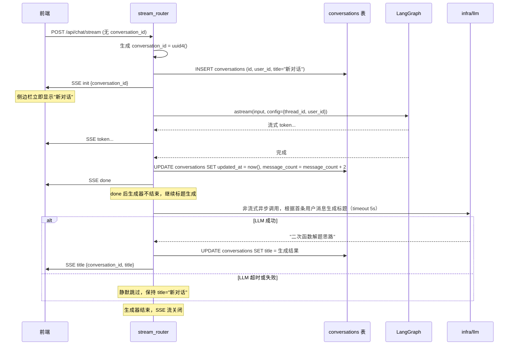
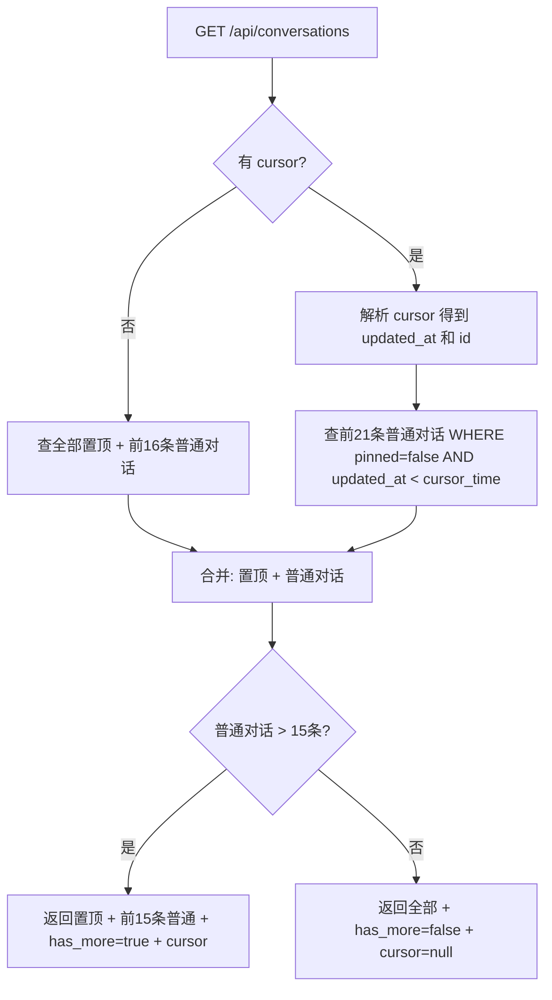
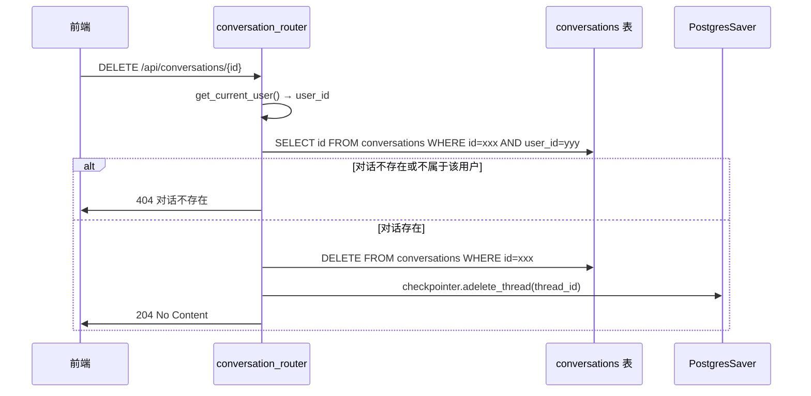

# 多对话管理 — 后端 设计报告

> 关联设计：[conversation-management v1.0 前端](2026-05-24--R009-conversation-management-frontend.md)

## 1. 目标

- 新建 `conversations` 业务表，存储对话元数据（标题、置顶、时间）
- 提供对话列表 API（游标分页 + 置顶排序）
- 提供对话更新 API（重命名、置顶/取消置顶）
- 提供对话删除 API（硬删除 conversation 记录 + LangGraph checkpoint）
- 流式对话完成时自动创建 conversation 记录 + LLM 生成标题
- 通过 SSE `title` 事件推送生成的标题到前端

## 2. 现状分析

### 已有能力

- LangGraph PostgresSaver checkpoint 持久化（按 thread_id 存储 messages）
- `AsyncPostgresSaver.adelete_thread(thread_id)` 可删除指定线程的全部 checkpoint
- `GET /api/conversations/current` 加载单个对话历史
- JWT 鉴权 + UserContext 提供 user_id
- `infra/llm.py` 可调用 LLM（用于标题生成）
- psycopg 3 异步驱动已安装
- PostgreSQL 连接已配置（`settings.database_url`）

### 存在的问题

- 没有 conversation 业务表，对话元数据无处存放
- 没有对话列表/更新/删除 API
- conversation_id 在 stream 中被动生成，不创建业务记录
- 没有对话标题，无法在侧边栏展示

### 基础设施就绪

- PostgreSQL：已就绪，复用 `octotutor_checkpoints` 库
- SQLAlchemy 2.0 async：**需新增**，用于 conversations 表的 ORM 映射 + 连接池管理

## 3. 数据模型与接口

### 数据模型

```sql
CREATE TABLE conversations (
    id          VARCHAR(36)  PRIMARY KEY,          -- UUID，与 LangGraph thread_id 一致
    user_id     VARCHAR(255) NOT NULL,             -- JWT sub 字段
    title       VARCHAR(255) NOT NULL DEFAULT '新对话',
    pinned      BOOLEAN      NOT NULL DEFAULT FALSE,
    pinned_at   TIMESTAMPTZ,                       -- 置顶时间，用于置顶区内排序
    message_count INTEGER     NOT NULL DEFAULT 0,  -- 消息数（含 user + ai）
    created_at  TIMESTAMPTZ  NOT NULL DEFAULT NOW(),
    updated_at  TIMESTAMPTZ  NOT NULL DEFAULT NOW() -- 每次发消息时更新
);

-- 游标分页查询优化：先置顶（按 pinned_at 倒序）再普通（按 updated_at 倒序）
CREATE INDEX idx_conversations_user_list
    ON conversations (user_id, pinned DESC, updated_at DESC);
```

| 决策 | 方案 | 理由 |
|------|------|------|
| 主键类型 | VARCHAR(36) UUID | 与 LangGraph thread_id 一致，不需要额外映射 |
| 是否用 ORM | 引入 SQLAlchemy 2.0 async | 性能好、功能全、类型安全，后续扩展方便 |
| 是否独立库 | 复用 octotutor_checkpoints | 一个库就够了，减少连接管理复杂度 |
| 表迁移方式 | 手写 SQL（main.py lifespan 中执行） | 项目没有 Alembic，对话表结构简单，不需要引入迁移框架 |

### 接口契约

#### `GET /api/conversations` — 对话列表

请求：
```json
// Query Params
{
  "cursor": "2026-05-24T10:00:00Z|uuid-xxx",  // 可选，上一页最后一条的游标
  "limit": 20                                   // 可选，默认 20，最大 50
}
```

响应 `200`：
```json
{
  "items": [
    {
      "id": "uuid-xxx",
      "title": "二次函数解题思路",
      "pinned": true,
      "pinned_at": "2026-05-24T10:00:00Z",
      "message_count": 6,
      "created_at": "2026-05-23T08:00:00Z",
      "updated_at": "2026-05-24T10:00:00Z"
    }
  ],
  "cursor": "2026-05-24T09:00:00Z|uuid-yyy",
  "has_more": true
}
```

空列表响应 `200`：
```json
{
  "items": [],
  "cursor": null,
  "has_more": false
}
```

#### `PATCH /api/conversations/{conversation_id}` — 更新对话

请求（重命名）：
```json
{ "title": "新标题" }
```

请求（置顶）：
```json
{ "pinned": true }
```

请求（取消置顶）：
```json
{ "pinned": false }
```

响应 `200`：
```json
{
  "id": "uuid-xxx",
  "title": "二次函数解题思路",
  "pinned": true,
  "pinned_at": "2026-05-24T10:00:00Z",
  "message_count": 6,
  "created_at": "2026-05-23T08:00:00Z",
  "updated_at": "2026-05-24T10:00:00Z"
}
```

错误响应 `404`：
```json
{ "code": "03901", "message": "对话不存在", "action": "refresh" }
```

错误响应 `400`（置顶超限）：
```json
{ "code": "03902", "message": "最多置顶 5 条对话", "action": "unpin_first" }
```

错误响应 `400`（标题为空或过长）：
```json
{ "code": "03903", "message": "标题不能为空且不超过200字", "action": "retry" }
```

#### `DELETE /api/conversations/{conversation_id}` — 删除对话

无请求体。

响应 `204`：无内容。

错误响应 `404`：
```json
{ "code": "03901", "message": "对话不存在", "action": "refresh" }
```

#### SSE 新增事件 `title`

在 `done` 事件之后推送（仅新对话且标题生成成功时）。**注意**：`done` 不再是 SSE 流的最后一帧，`title` 才是（或 `done` 后无 `title` 则流结束）。

```
event: title
data: {"conversation_id": "uuid-xxx", "title": "二次函数解题思路"}
```

### 错误码扩展

使用 `03xxx` 模块编号（03 = 对话管理模块），与现有 `02xxx`（对话流式模块）区分。

| 错误码 | 含义 | action |
|--------|------|--------|
| 03901 | 对话不存在 | refresh |
| 03902 | 置顶数量超限（最多 5 条） | unpin_first |
| 03903 | 标题校验失败（空或过长） | retry |
| 03904 | 对话创建失败 | retry |

## 4. 核心流程

### 4.1 对话自动创建 + 标题生成

**关键设计**：
1. conversation 记录在 **init 阶段**（流开始时）创建，标题为"新对话"，前端立即在侧边栏看到
2. `done` 不再是 SSE 流的最后一帧。event_generator 在 yield done 后继续执行：调用 LLM 生成标题 → yield title 帧 → 生成器结束



**业务规则**：
- conversation 记录在 init 阶段（生成 conversation_id 后立即）创建，前端侧边栏立刻可见
- `event_generator` 在 yield done 后不返回，继续执行标题生成
- 标题生成使用 LLM 非流式异步调用（`AsyncOpenAI.chat.completions.create`，不设 `stream=True`），设 5s timeout
- 标题生成失败或超时 → 静默跳过，不推送 title 事件，conversation 保持 title="新对话"
- 已有 conversation 记录的对话（多轮），只更新 `updated_at` 和 `message_count`，不重复创建、不生成标题
- 标题生成 prompt：`请用不超过20个字概括以下问题的核心主题，直接输出标题，不要加引号：{user_message}`
- `message_count` 在 done 后更新：本轮对话产生的消息数（通常 +2：一条 user + 一条 ai）
- `updated_at` 仅在有新消息产生时更新（stream_router 中），重命名/置顶操作不更新

### 4.2 对话列表查询（游标分页）

**设计策略**：置顶对话最多 5 条，数据量小，首页一次返回全部；游标分页只用于普通对话。



**游标格式**：`{updated_at_iso}|{conversation_id}`，Base64 编码。cursor 只指向普通对话（pinned=false）。

**排序规则**：
- 首页：置顶区按 `pinned_at` 倒序 + 普通区按 `updated_at` 倒序
- 翻页：只查 `WHERE pinned = false AND (updated_at < cursor_time OR (updated_at = cursor_time AND id < cursor_id))`
- 同一时间精度内按 id 倒序（确保稳定排序）

### 4.3 删除对话



**注意**：checkpoint 清理失败不阻断删除响应（conversation 记录已删除，checkpoint 残留不影响业务）。

## 5. 项目结构与技术决策

### 项目结构

```
backend/app/
├── chat/
│   ├── conversation_router.py   # 修改：新增 list/update/delete 端点
│   ├── stream_router.py         # 修改：新增 conversation 创建 + title 推送
│   ├── schemas.py               # 修改：新增 Conversation 相关 schema
│   └── dependencies.py          # 修改：新增 get_db session 注入
├── domain/
│   ├── models.py                # 修改：新增 Conversation SQLAlchemy model
│   └── classifier.py            # 不变
├── infra/
│   ├── database.py              # 新建：SQLAlchemy async engine + session factory + 建表
│   ├── conversation_repo.py     # 新建：Conversation CRUD 数据访问层
│   ├── context_builder.py       # 不变
│   └── llm.py                   # 修改：新增非流式异步方法（标题生成用，timeout=5s）
├── config.py                    # 不变（复用 database_url）
└── main.py                      # 修改：lifespan 中初始化 DB engine + 建表
```

### 职责划分

```
conversation_router → dependencies.get_db → infra.conversation_repo → domain.models
                   → dependencies.get_checkpointer → PostgresSaver (仅删除用)

stream_router → dependencies.get_db → infra.conversation_repo → domain.models
             → infra.llm (标题生成)
```

### 技术决策

| 决策 | 方案 | 理由 |
|------|------|------|
| ORM 选择 | SQLAlchemy 2.0 async | 性能好、功能全、类型安全 |
| SQLAlchemy driver | `postgresql+psycopg://` | 与现有项目 psycopg 3 驱动一致 |
| 数据库连接 | SQLAlchemy async engine，复用 settings.database_url | 同一个 PostgreSQL 库；pool_size=5 |
| 连接池 | SQLAlchemy 默认 pool_size=5，与 PostgresSaver 连接池独立 | 两个连接池共存，4GB 服务器需控制总连接数 |
| 表迁移 | lifespan 中 CREATE TABLE IF NOT EXISTS（在 PostgresSaver setup 之后执行） | 结构简单，不需要 Alembic；确保数据库已存在 |
| 游标分页 | 置顶一次返回 + 普通对话 keyset pagination | 置顶最多 5 条不需要分页，普通对话按 updated_at + id 游标 |
| 标题生成 LLM 调用 | `AsyncOpenAI.chat.completions.create`（非流式，stream=False，timeout=5s） | 标题只需一个短字符串，不需要流式；需在 infra/llm.py 新增非流式异步方法 |
| 标题推送 | SSE title 事件（在 done 之后、生成器结束之前推送） | 复用已有 SSE 通道；done 不再是最后一帧 |
| conversation 与 checkpoint 关联 | 通过 id = thread_id 隐式关联 | 不需要外键，两个存储系统独立管理 |
| updated_at 更新策略 | 仅在 stream_router 产生新消息时更新 | 重命名/置顶不更新，保持"最近活跃"排序语义正确 |
| message_count 更新策略 | stream_router done 后 +2（一条 user + 一条 ai） | 简单可靠，不从 checkpoint 重新计算 |
| PATCH 标题校验 | 非空 + 长度 <= 200 字 | 防止空标题和超长标题 |

### 第三方依赖清单

| 依赖 | 用途 | 已有/需新增 |
|------|------|-----------|
| sqlalchemy >= 2.0 | async ORM + 连接池管理 | 需新增 |

### architecture.md 更新清单

后端设计标注 `architecture_md_updates: true`，以下为需要更新的具体条目：

1. **系统拓扑**：将 `SQLite (metadata)` 更新为 `PostgreSQL (checkpoints + conversations)`（实际代码早已不用 SQLite，R007 引入 PostgresSaver 时就已切换）
2. **关键决策**：新增"SQLAlchemy 2.0 async ORM"决策条目
3. **权威边界**：补充 `/api/conversations` 为对话管理（列表/更新/删除）唯一入口
4. **不变量**：SSE 事件格式 type 列表从 `init/thinking/status/sources/token/done/error` 更新为 `init/thinking/status/sources/token/done/title/error`
5. **禁止模式**：移除 `R006 不做消息持久化（留给 R007）`（R007 已完成）

## 6. 验收标准

| 验收条件 | 验收方式 |
|----------|----------|
| conversations 表自动创建 | 启动后端，检查数据库存在 conversations 表 |
| `GET /api/conversations` 返回分页列表 | curl 带 Bearer token 请求，验证 items/cursor/has_more |
| `PATCH /api/conversations/{id}` 重命名成功 | curl PATCH，验证 title 更新 |
| `PATCH /api/conversations/{id}` 置顶成功 | curl PATCH pinned=true，验证置顶 + 置顶上限 5 条 |
| `DELETE /api/conversations/{id}` 删除成功 | curl DELETE，验证 conversation 记录和 checkpoint 均被清除 |
| 流式对话自动创建 conversation 记录 | 发送首条消息，验证 conversations 表新增记录 |
| LLM 自动生成标题 | 发送首条消息，验证 SSE title 事件推送 + title 非"新对话" |
| 无新 conversation 时只更新 updated_at | 多轮对话中发消息，验证不重复创建记录 |
| 全部现有测试通过 | `cd backend && python3 -m pytest` |

## 7. 暂不实现

| 功能 | 理由 |
|------|------|
| Alembic 数据库迁移 | conversations 表结构简单，lifespan 建表足够，后续有需要再引入 |
| 对话搜索/标签 | 需求未明确 |
| 对话导出 | 需求未明确 |
| 对话分享 | brainstorm 明确排除 |
| 软删除/回收站 | brainstorm 明确硬删除 |
| conversation → checkpoint 外键约束 | 两个存储系统独立管理，外键会增加耦合 |
