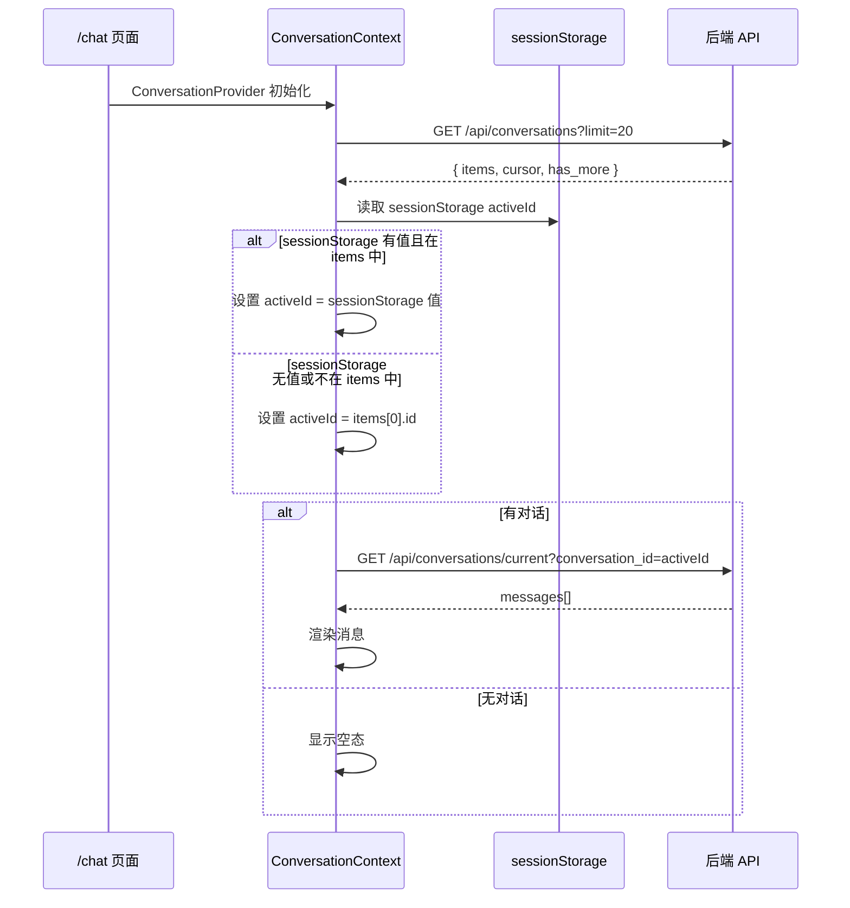
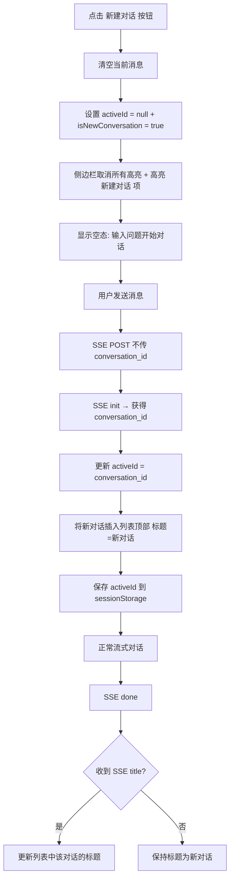
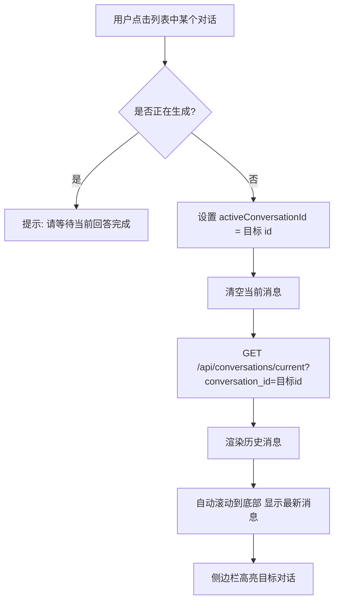
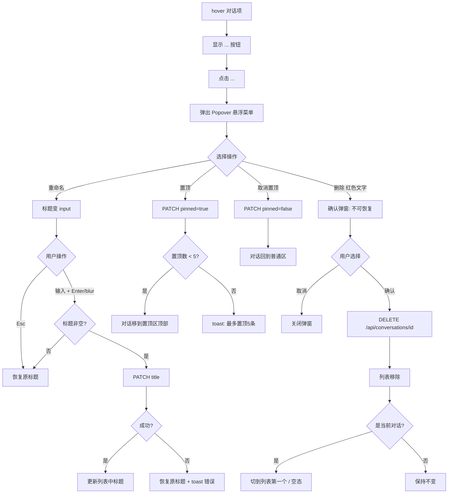

# 多对话管理 — 前端 设计报告

> 关联设计：[conversation-management v1.0 后端](2026-05-24--R009-conversation-management-backend.md)

## 1. 目标

- 左侧侧边栏展示对话列表，右侧为对话区（DeepSeek/ChatGPT 风格）
- 支持新建对话、切换对话、滚动加载更多
- 每个对话项支持三点菜单操作（重命名、置顶/取消置顶、删除）
- 重构 conversationId 从单值 localStorage 变为 Context 管理的多对话状态
- 对接后端新增的 conversations API

## 2. 现状分析

### 已有能力

- `useChatController` hook 管理消息状态 + SSE 流式交互
- `use-conversation.ts` 管理 conversationId（单值 localStorage）
- SSE 解析器（parse-sse.ts）支持 init/status/sources/thinking/token/done/error 事件
- apiClient 统一网络层（Bearer token + 401 重试）
- shadcn/ui 已配置（components.json），CSS 变量中已预留 `--sidebar-*`
- Tailwind CSS v4 + lucide-react 图标库

### 存在的问题

- conversationId 是单个 localStorage 值，无法管理多个对话
- 没有侧边栏组件，页面只有单列对话区
- 没有"新建对话"按钮
- 没有对话列表 API 调用
- 没有对话操作菜单（重命名/置顶/删除）

### 基础设施就绪

- shadcn/ui：已配置但未安装预制组件，需执行 `npx shadcn@latest add sidebar`
- CSS 变量：`--sidebar-*` 已在 globals.css 中预定义
- React 19 + Next.js 16 App Router

## 3. 数据模型与接口

### 前端数据模型

```typescript
// 对话列表项（对应后端 GET /api/conversations 响应）
// 注意：字段保持与后端 snake_case 一致，不额外做 camelCase 转换
interface ConversationItem {
  id: string;
  title: string;
  pinned: boolean;
  pinned_at: string | null;
  message_count: number;
  created_at: string;
  updated_at: string;
}

// 对话列表状态
interface ConversationListState {
  items: ConversationItem[];
  cursor: string | null;
  hasMore: boolean;
  isLoading: boolean;
  isInitialized: boolean;       // 区分"加载中"和"无数据"
  activeId: string | null;      // 当前选中的对话 ID
  isNewConversation: boolean;   // 是否处于"新建对话"态（activeId=null 时区分空态和新建态）
}

// SSE 回调接口扩展（在现有 SSECallbacks 基础上新增）
interface SSECallbacks {
  onInit: (conversationId: string) => void;
  onStatus: (stage: string, message: string) => void;
  onSources: (sources: SourceReference[]) => void;
  onThinking: (step: ThinkingStep) => void;
  onToken: (token: string) => void;
  onTitle: (conversationId: string, title: string) => void;  // ★ 新增：标题更新回调
  onDone: () => void;
  onError: (error: { code: string; message: string; action: string }) => void;
}
```

### 状态管理架构

| 决策 | 方案 | 理由 |
|------|------|------|
| 状态管理方式 | React Context + useReducer（预估 10-12 个 actions） | 状态复杂度适中：列表 CRUD + activeId + 分页 + 新建态；Context 可被侧边栏和对话区共享；后续复杂度增长可迁移 zustand |
| 消息缓存 | 不缓存，切换对话时重新从后端加载 | 避免内存膨胀和多对话消息状态同步问题；切换时显示 loading 态 |
| conversationId 恢复 | sessionStorage 存储当前 activeId | 页面刷新后可恢复上次选中的对话（session 级别，关闭标签页自动清除）；首次打开时从列表 API 获取后选第一个 |
| SSE title 事件 | 在 use-chat-stream.ts 新增 `case 'title'` + SSECallbacks.onTitle | 与后端 SSE title 事件对齐，init→token→done→title 顺序处理 |
| ConversationItem 字段命名 | 保持 snake_case 与后端一致 | 与现有 ApiMessage 风格一致，避免引入转换层 |

### API 调用清单

| API | 方法 | 用途 | 调用时机 |
|-----|------|------|---------|
| `/api/conversations` | GET | 加载对话列表 | 页面初始化 + 滚动加载 |
| `/api/conversations/{id}` | PATCH | 重命名/置顶 | 菜单操作 |
| `/api/conversations/{id}` | DELETE | 删除对话 | 菜单操作确认后 |
| `/api/conversations/current` | GET | 加载对话消息 | 切换对话时（`?conversation_id=xxx`） |
| `/api/chat/stream` | POST | SSE 流式对话 | 发送消息时 |

## 4. 核心流程

### 4.1 页面初始化



### 4.2 新建对话



### 4.3 切换对话



### 4.4 三点菜单操作



## 5. 项目结构与技术决策

### 项目结构

```
frontend/src/
├── app/
│   └── chat/
│       └── page.tsx            # 修改：引入 ConversationProvider 包裹 + 布局改为 sidebar + main
├── chat/
│   ├── controller.ts           # 修改：activeConversationId 从 Context 读取
│   ├── use-conversation.ts     # 修改：移除 localStorage 单值逻辑，改为 Context
│   ├── use-chat-stream.ts      # 修改：新增 title 事件回调
│   ├── use-conversation-list.ts # 新建：对话列表 hook（加载/分页/CRUD）
│   ├── types.ts                # 修改：新增 ConversationItem 类型
│   └── parse-sse.ts            # 不变
├── components/
│   ├── chat-layout.tsx         # 新建：sidebar + main 布局骨架
│   ├── conversation-sidebar.tsx # 新建：侧边栏（列表 + 新建按钮 + 分页）
│   ├── conversation-item.tsx   # 新建：单个对话项（标题 + 三点菜单）
│   ├── conversation-menu.tsx   # 新建：三点菜单 Popover（重命名/置顶/删除）
│   ├── delete-confirm-dialog.tsx # 新建：删除确认弹窗
│   ├── chat-ui.tsx             # 修改：接收外部 conversationId，不再内部管理
│   └── header.tsx              # 修改：移动端侧边栏 toggle 按钮
├── contexts/
│   └── conversation-context.tsx # 新建：对话列表 + 当前对话 Context
└── lib/
    └── api-client.ts           # 不变
```

### 职责划分

```
ConversationContext（全局状态）
  ├── items: ConversationItem[]        ← useConversationList 调用 API
  ├── activeId: string | null          ← 切换/新建 时设置
  └── 操作方法: switchTo / createNew / pin / unpin / rename / delete

ConversationSidebar → 读取 Context.items → 渲染列表
ConversationItem → 读取 Context 操作方法 → 触发 API 调用
ChatUI → 读取 Context.activeId → 加载消息
useChatController → 读取 Context.activeId → SSE 请求携带 conversation_id
```

### 技术决策

| 决策 | 方案 | 理由 |
|------|------|------|
| 侧边栏组件 | shadcn/ui Sidebar | CSS 变量已预留，组件成熟，支持折叠 |
| Popover 菜单 | shadcn/ui Popover | 三点菜单标准实现 |
| 确认弹窗 | shadcn/ui AlertDialog | 删除确认标准实现 |
| 状态管理 | React Context + useReducer | 状态简单，不需要 zustand |
| 消息缓存策略 | 不缓存，切换时重新加载 | 避免内存膨胀 |
| conversationId 持久化 | 不持久化到 localStorage | 页面刷新时从列表 API 恢复 |
| toast 提示 | shadcn/ui Sonner (toast) | 操作反馈（置顶上限提示等） |

### 第三方依赖清单

| 依赖 | 用途 | 已有/需新增 |
|------|------|-----------|
| shadcn/ui sidebar | 侧边栏组件 | 需安装（`npx shadcn@latest add sidebar`） |
| shadcn/ui popover | 三点菜单 | 需安装（`npx shadcn@latest add popover`） |
| shadcn/ui alert-dialog | 删除确认弹窗 | 需安装（`npx shadcn@latest add alert-dialog`） |
| shadcn/ui sonner | toast 提示 | 需安装（`npx shadcn@latest add sonner`） |
| shadcn/ui input | 重命名输入框 | 需安装（`npx shadcn@latest add input`） |

## 6. 验收标准

| 验收条件 | 验收方式 |
|----------|----------|
| 侧边栏正常显示对话列表 | 登录后进入 /chat，左侧显示对话列表 |
| 置顶对话排在列表顶部 | 置顶一个对话，验证它出现在列表最上方 |
| 新建对话功能正常 | 点击新建 → 发消息 → 验证列表新增对话 + 标题自动生成 |
| 切换对话加载历史 | 点击列表中另一个对话，验证右侧加载对应消息 |
| 重命名功能正常 | 三点菜单 → 重命名 → 输入新标题 → 验证列表更新 |
| 置顶功能正常 | 三点菜单 → 置顶 → 验证移到置顶区 → 验证上限 5 条 |
| 删除功能正常 | 三点菜单 → 删除 → 确认 → 验证列表移除 + 若为当前对话则切换 |
| 滚动分页加载 | 滚动到底部，验证加载更多对话 |
| 删除当前对话自动切换 | 删除当前正在查看的对话，验证自动切到下一个 |
| 发送消息后自动滚到底部 | 发送消息或收到 AI 回复时，消息区自动滚动到最底部 |
| 切换对话后自动滚到底部 | 切换到另一个对话加载历史后，消息区自动滚动到最新消息 |
| 流式生成时自动跟随 | AI 流式回复时，消息区持续自动滚动到最新 token |
| 现有对话功能不回归 | 流式对话、重新生成、停止生成等功能正常 |

## 7. 暂不实现

| 功能 | 理由 |
|------|------|
| 侧边栏折叠/展开 | 先做基础版，后续加折叠 |
| 移动端适配 | brainstorm 明确只做桌面端 |
| `/chat/[id]` URL 动态路由 | 先用 state 管理，不引入路由复杂度 |
| 对话搜索 | 需求未明确 |
| 多 tab 刷新同步 | 后续优化 |
| 消息本地缓存 | R007-PATCH01 已移除，不恢复 |
| 拖拽排序 | 需求未提及 |
