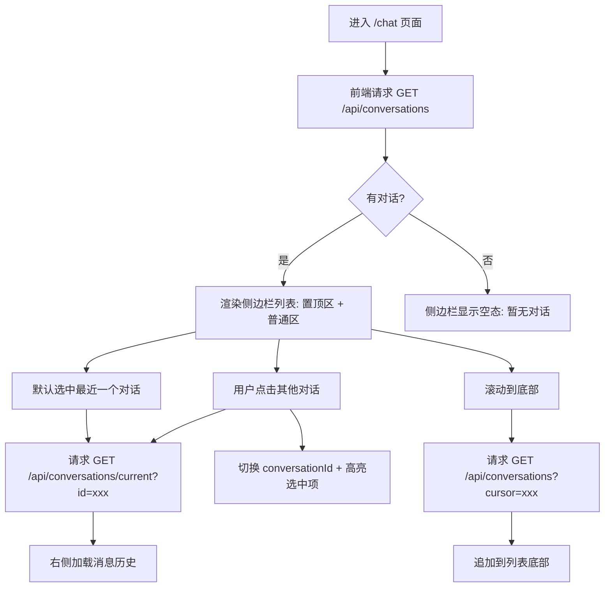
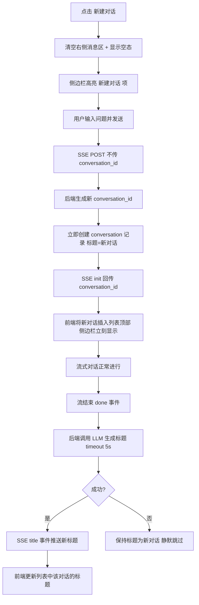
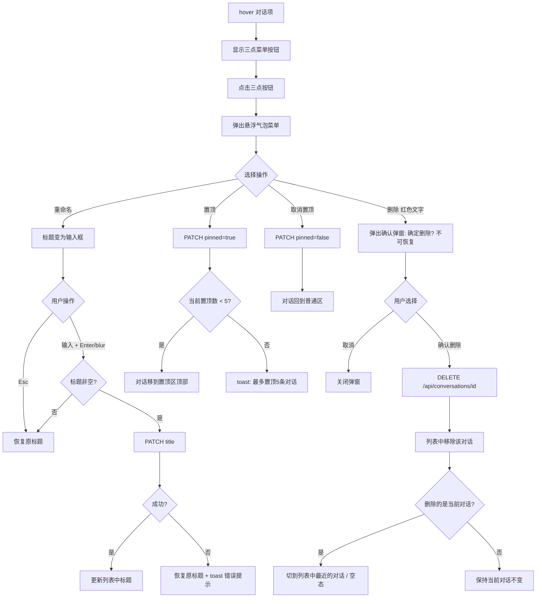

# 多对话管理 — 功能分析

## 概述

为 OctoTutor 增加多对话管理能力：左侧侧边栏展示对话列表，支持新建/切换/重命名/置顶/删除对话，LLM 自动生成对话标题。当前系统是单对话模式——前端 localStorage 只存一个 conversationId，后端没有独立的 conversation 业务表，对话元数据无处存放。

## 一、交互链

### 场景 1：查看对话列表

**用户故事**：作为学生用户，我想在左侧看到所有历史对话，以便快速回顾和切换。

用户进入 /chat 页面 → 左侧侧边栏展示对话列表（置顶区 + 按时间排序的普通区）→ 置顶对话固定在列表顶部，其余按最近活跃时间倒序 → 每个对话项显示标题和最后活跃时间 → 滚动到底部自动加载更多（每次 20 条）→ 点击某个对话 → 右侧加载该对话历史消息 → 该对话项高亮为当前选中态。

### 场景 2：新建对话

**用户故事**：作为学生用户，我想开始一个新的话题对话，以便和之前的讨论分开。

用户点击侧边栏顶部的"新建对话"按钮 → 右侧消息区清空，显示空态提示 → 用户输入问题并发送 → 前端调用 SSE 流（不传 conversation_id）→ 后端生成新 conversation_id → 后端立即创建 conversation 记录（标题="新对话"）→ SSE init 事件回传 conversation_id → 前端收到后将新对话插入列表顶部 → 流式对话进行 → 流结束后后端调用 LLM 生成标题 → SSE title 事件推送新标题 → 列表中该对话的标题从"新对话"更新为 LLM 生成的标题。

### 场景 3：操作菜单（重命名/置顶/删除）

**用户故事**：作为学生用户，我想管理我的对话，包括重命名、置顶常用对话、删除不需要的对话。

用户鼠标 hover 到某个对话项 → 对话项右侧出现三点菜单按钮 → 点击三点按钮 → 弹出悬浮气泡菜单（重命名/置顶/删除）→ 选择操作：

**重命名**：菜单中点"重命名" → 对话标题变为可编辑输入框 → 按 Enter 或失焦提交 → 调用 PATCH → 成功则标题更新，失败则恢复原标题 + toast 错误提示 → 按 Esc 或清空标题则取消恢复原标题 → 菜单关闭。

**置顶**：菜单中点"置顶" → 调用 PATCH /api/conversations/{id} { pinned: true } → 成功 → 对话移到置顶区顶部 → 菜单关闭。若已达 5 条上限 → toast 提示"最多置顶 5 条对话，请先取消已有置顶"。

**取消置顶**：菜单中点"取消置顶" → 调用 PATCH /api/conversations/{id} { pinned: false } → 对话回到普通区。

**删除**：菜单中点"删除"（红色文字）→ 弹出确认弹窗"确定删除这条对话？删除后不可恢复" → 确认 → 调用 DELETE /api/conversations/{id} → 后端删除 conversation 记录 + LangGraph checkpoint → 列表中移除该对话 → 若删除的是当前对话则自动切到列表中最近的一个对话；若没有其他对话则显示空态。

## 二、逻辑树

### 事件流：新建对话 + 标题生成

| 时刻 | 事件 | 处理 | 产生的新事件 |
|------|------|------|-------------|
| T1 | 用户发送消息（无 conversation_id） | stream_router 生成 uuid 作为 conversation_id | — |
| T2 | conversation_id 生成后立即 | 创建 conversation 记录（title="新对话"） | conversation 记录写入 DB |
| T3 | SSE init 帧发送 | 推送 `{ conversation_id }` 给前端 | 前端收到 conversation_id + 侧边栏立即显示 |
| T4 | graph.astream 开始执行 | LangGraph PostgresSaver 自动创建 checkpoint | — |
| T5 | 流式对话完成（done 帧） | 更新 updated_at 和 message_count | — |
| T6 | done 后 | 提取首条用户消息内容，调用 LLM 生成标题 | LLM 标题生成请求 |
| T7 | LLM 返回标题 | 更新 conversation.title | — |
| T8 | 标题更新完成 | SSE 推送 title 事件 | 前端更新列表中对话标题 |

### 事件流：对话列表加载

| 时刻 | 事件 | 处理 | 产生的新事件 |
|------|------|------|-------------|
| T1 | 页面加载 / chat 路由 | 前端请求 `GET /api/conversations?limit=20` | — |
| T2 | 后端收到请求 | 从 conversations 表查询该用户的对话列表 | — |
| T3 | 查询结果 | 置顶对话排在最前（按 pinned_at 排序），普通对话按 updated_at 倒序 | — |
| T4 | 返回结果 | `{ items: [...], cursor: "xxx", has_more: true }` | 前端渲染列表 |
| T5 | 用户滚动到底部 | 前端请求 `GET /api/conversations?cursor=xxx&limit=20` | — |
| T6 | 后端游标分页查询 | 返回下一页 | 前端追加到列表 |

### 事件流：删除对话

| 时刻 | 事件 | 处理 | 产生的新事件 |
| T1 | 用户确认删除 | 前端调用 `DELETE /api/conversations/{id}` | — |
| T2 | 后端收到请求 | 验证 user_id 归属 | — |
| T3 | 归属校验通过 | 删除 conversations 表记录 | — |
| T4 | 记录删除后 | 调用 PostgresSaver 清理该 thread_id 的所有 checkpoint | — |
| T5 | 全部清理完成 | 返回 204 | 前端从列表移除 |

### 状态流转

| 实体 | 触发事件 | 前状态 | 后状态 |
|------|---------|--------|--------|
| Conversation | 流开始时（init 阶段） | 不存在 | created（title="新对话", pinned=false） |
| Conversation | LLM 标题生成完成 | title="新对话" | title=LLM 生成结果 |
| Conversation | 用户重命名 | title=旧标题 | title=用户输入 |
| Conversation | 用户置顶 | pinned=false | pinned=true, pinned_at=now |
| Conversation | 用户取消置顶 | pinned=true | pinned=false, pinned_at=null |
| Conversation | 用户删除 | pinned=true/false | 不存在（硬删除） |
| Conversation | 对话有新消息 | updated_at=旧时间 | updated_at=now（保持列表排序） |
| 前端 Sidebar | 删除当前对话 | conversationId=被删ID | conversationId=列表最近一个 / null |

**异常流**：
- LLM 标题生成失败或超时（5s）→ conversation 保持 title="新对话"，不影响对话功能，前端不报错，不推送 title 事件
- 删除对话时 checkpoint 清理失败 → conversation 记录仍删除成功（checkpoint 残留不影响业务，可后续清理）
- 置顶数量超限 → 后端返回 400 + 错误码 03902，前端 toast 提示用户

## 三、功能编号与网络定位

### 本次新增节点

| 编号 | 功能节点 | 前缀含义 | 简介 |
|------|---------|---------|------|
| BF001 | Conversation 数据模型 | 后端基础 | Conversation dataclass + 数据库建表 |
| BF002 | Conversation Repository | 后端基础 | 对话 CRUD 数据访问层 |
| BF003 | 标题生成服务 | 后端基础 | 调用 LLM 根据首条消息生成对话标题 |
| BB001 | 对话列表 API | 后端业务 | `GET /api/conversations` 游标分页 + 置顶排序 |
| BB002 | 对话更新 API | 后端业务 | `PATCH /api/conversations/{id}` 重命名/置顶/取消置顶 |
| BB003 | 对话删除 API | 后端业务 | `DELETE /api/conversations/{id}` 硬删除 + checkpoint 清理 |
| BB004 | 对话自动创建 + 标题触发 | 后端业务 | 流式对话完成时检测新对话并创建记录，触发标题生成 |
| FF001 | 侧边栏组件骨架 | 前端基础 | Sidebar 布局 + shadcn/ui 集成 + 折叠能力 |
| FF002 | 对话状态管理重构 | 前端基础 | conversationId 从单值变多值，对话列表 state 提升 |
| FB001 | 对话列表 UI | 前端业务 | 列表渲染 + 分页加载 + 选中态 + 空态 |
| FB002 | 新建 + 切换对话 | 前端业务 | 新建按钮 + 切换逻辑 + 消息区刷新 |
| FB003 | 对话操作菜单 | 前端业务 | 三点菜单 + 重命名/置顶/删除 + 确认弹窗 |

### 前置依赖

| 依赖节点 | 依赖方式 | 是否已有 |
|----------|---------|---------|
| PostgresSaver checkpoint | BB004/BB003 通过 thread_id 关联 | 已有 |
| JWT 鉴权 + UserContext | BB001/BB002/BB003 通过 get_current_user 获取 user_id | 已有 |
| SSE 流式对话 | BB004 在流结束时触发标题生成 | 已有 |
| LLM 调用能力 | BF003 调用 infra/llm 生成标题 | 已有 |
| 错误码体系 | BB001/BB002/BB003 使用 errors.py | 已有 |
| shadcn/ui 基础 | FF001 使用 shadcn/ui Sidebar 组件 | 已配置未安装 |
| apiClient 网络层 | FB001~FB003 调用对话 API | 已有 |

### 边界接口

| 接口/协议 | 定义方 | 消费方 | 敏感度 |
|-----------|--------|--------|--------|
| `GET /api/conversations?cursor=&limit=20` | BB001 | FB001 | 低 |
| `PATCH /api/conversations/{id}` | BB002 | FB003 | 低 |
| `DELETE /api/conversations/{id}` | BB003 | FB003 | 中（不可恢复） |
| SSE `title` 事件 `{ conversation_id, title }` | BB004 | FB002 | 低 |
| Conversation SQLAlchemy Model | BF001 | BF002/BB001/BB002/BB003/BB004 | 中（核心模型） |
| checkpointer 清理接口 | BB003 | PostgresSaver | 高（影响 checkpoint 数据） |

## 四、结论

- **开发顺序建议**：
  1. BF001（数据模型）→ BF002（Repository）→ BF003（标题生成）
  2. BB001~BB004（后端 API，按编号顺序）
  3. FF001（侧边栏骨架）→ FF002（状态管理重构）
  4. FB001~FB003（前端业务，按编号顺序）

- **复杂度集中**：
  - **BB004 对话自动创建 + 标题触发**：需要在流式对话的生命周期中嵌入"检测新对话 → 创建记录 → 异步生成标题 → SSE 推送标题"链路，涉及 stream_router 改动
  - **FF002 状态管理重构**：当前 conversationId 是单个 localStorage 值，需要重构为对话列表 + 当前对话 + 消息缓存的多层状态管理
  - **BB003 删除 + checkpoint 清理**：需要同时清理业务表和 LangGraph checkpoint，PostgresSaver 的清理 API 需要调研

- **architecture.md 可能涉及的变更**：
  - 系统拓扑：新增 `PostgreSQL (conversations)` 或在现有 PostgreSQL 标注新增业务表
  - 权威边界：补充 `/api/conversations` 为对话管理唯一入口
  - 不变量：补充 conversation 表与 checkpoint 的关联关系
  - 禁止模式：移除 R006 遗留的"R006 不做消息持久化"（已由 R007 完成）

- **暂不实现**：
  - 对话搜索/标签分类（需求未明确）
  - 对话导出（需求未明确）
  - 移动端适配（当前只做桌面端）
  - 分享对话（brainstorm 明确排除）
  - 软删除/回收站（brainstorm 明确硬删除）
  - 多 tab 同步（后续优化）
  - URL 动态路由 `/chat/[id]`（先用 state 管理对话切换，不引入路由复杂度）
