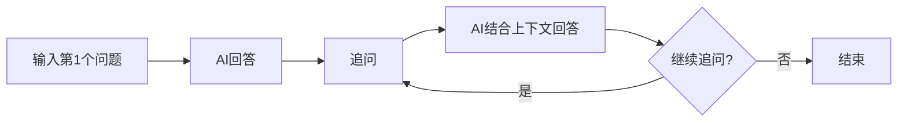
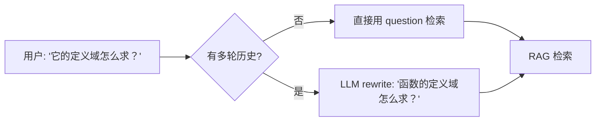
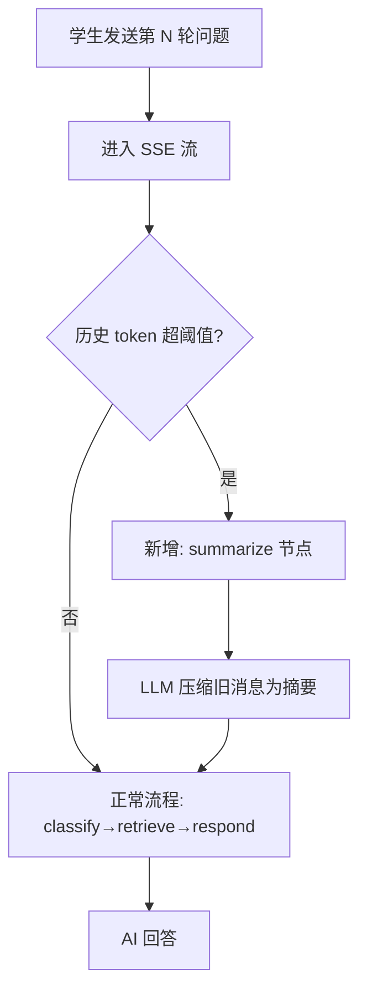
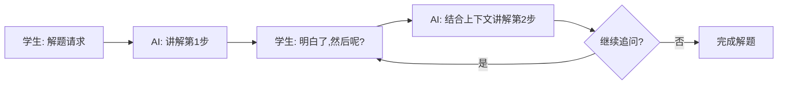

# 长对话上下文管理 — 功能分析

## 概述

当前有两个核心问题：(1) `_respond` 节点每次构建 LLM 输入时只包含 `[SystemMessage + 当前HumanMessage]`，完全忽略 `state["messages"]` 中的历史对话；(2) RAG 检索只用当前 question 原文，追问中的代词（"它"、"这个"）对检索系统无意义，导致后续轮次检索跑偏。本需求修复多轮对话 bug、引入 query rewriting 改善检索精准度、并加入 token 预算管理 + 摘要压缩支持无限长度对话。

## 一、交互链

### 场景 1：追问式多轮对话

**用户故事**：作为学生，我想在 AI 回答后继续追问，以便逐步深入理解一个概念。

1. 学生输入「什么是函数？」→ AI 回答函数定义
2. 学生追问「定义域怎么求？」→ AI 基于上一轮回答的函数定义，补充定义域的求解方法
3. 学生追问「能举个例子吗？」→ AI 结合前两轮语境，举一个带定义域求解的具体例子
4. 学生随时可切换到新话题，AI 能正确识别话题切换



### 场景 2：追问检索精准（Query Rewriting）

**用户故事**：作为学生，我想用代词追问（"它的定义域怎么求？"），AI 仍然能精准检索到相关内容。

1. 学生：「什么是函数？」→ RAG 检索「函数」→ 精准命中教材函数章节
2. 学生追问：「它的定义域怎么求？」→ 系统 rewrite 为「函数的定义域怎么求？」→ RAG 检索精准命中定义域章节
3. 学生追问：「能举个例子吗？」→ 系统 rewrite 为「函数定义域的求解例子」→ RAG 检索命中例题



### 场景 3：长对话自动压缩

**用户故事**：作为学生，我想和 AI 进行长时间的深入讨论，不必担心对话长度限制。

1. 学生连续多轮讨论函数章节（30+ 轮）
2. 后台自动检测 token 预算接近上限
3. 系统自动将早期对话压缩为摘要（学生无感知）
4. 对话继续进行，LLM 输入 = 摘要 + 近期历史 + 当前 RAG context



### 场景 4：延续式教学

**用户故事**：作为学生，我想让 AI 逐步带我解题，每一步都基于前面的讲解。

1. 学生：「帮我解这道三角函数题」
2. AI 分步骤讲解第一步
3. 学生：「明白了，然后呢？」→ AI 继续讲解第二步
4. 学生：「这里为什么用 sin？」→ AI 解释具体步骤的原因（引用前几轮的上下文）



## 二、逻辑树

### 关键代码现状

**stream_router.py:69-72** — input_state 每轮传入：
```python
input_state = {
    "messages": [HumanMessage(content=body.question)],  # 只有当前问题
    "question": body.question,
}
```

**graph.py:85-113** — `_respond` 节点（bug 所在）：
```python
# 只用 question + chunks，完全忽略 state["messages"]
messages = [SystemMessage(...), HumanMessage(content=user_content)]
response = await chat_model.ainvoke(messages)
return {"messages": [response]}  # 只返回 AIMessage
```

**AgentState.messages** 使用 `add_messages` reducer，每轮追加 HumanMessage（来自 input_state）和 AIMessage（来自 respond/refuse 输出）。checkpoint 实际存储的是干净的历史：`[HumanMsg(q1), AIMsg(a1), HumanMsg(q2), AIMsg(a2), ...]`，不含 RAG context（RAG context 只在 `_respond` 的临时 HumanMessage 中，不入 checkpoint）。

### 事件流：多轮对话

| 时刻 | 事件 | 处理 | 产生的新事件 |
|------|------|------|-------------|
| T1 | 用户发送第 N 轮问题 | stream_router 构建 input_state `{messages: [HumanMsg], question}` | graph.astream 启动 |
| T2 | graph 加载 checkpoint | PostgresSaver 按 thread_id 恢复历史 state，`add_messages` reducer 将新 HumanMsg 追加到历史 | state.messages = [...旧历史..., HumanMsg(当前问题)] |
| T3 | summarize 节点执行 | 估算总 token（summary + messages + 预留 RAG 空间），未超阈值则 no-op | — |
| T4 | classify 节点执行 | 判断意图 textbook/unrelated | 路由到 rewrite 或 refuse |
| T5 | rewrite 节点执行 | 有历史时：LLM 改写 question 为独立问题；无历史时：原样透传 | state.rewritten_question |
| T6 | retrieve 节点执行 | 用 rewritten_question（或原始 question）做混合检索 + Rerank | — |
| T7 | respond 节点执行 | 动态拼接 system prompt（教学策略 + RAG context），构建 `[DynamicSystemMsg, SummaryMsg?, RecentHistory, HumanMsg(原样问题)]` → LLM → AIMessage | PostgresSaver 自动保存 checkpoint |
| T8 | SSE 推送完成 | stream_router 推送 done 事件 | — |

### 事件流：摘要压缩触发

| 时刻 | 事件 | 处理 | 产生的新事件 |
|------|------|------|-------------|
| T1 | summarize 节点检测 token | `estimate_tokens(summary) + estimate_tokens(messages) + RESERVED > THRESHOLD` | 触发摘要 |
| T2 | 分割历史消息 | 保留最近 RECENT_MESSAGES_KEEP 条（5 轮），其余为"待摘要" | — |
| T3 | 调用 LLM 生成摘要 | Prompt: "简洁总结对话要点，保留关键数学概念和解题思路" + 旧摘要 + 旧消息 | 产出新摘要 |
| T4 | 更新 state | 返回 `{conversation_summary: new_summary}` + `RemoveMessage` 移除已摘要的旧消息 | 摘要持久化到 checkpoint，state.messages 缩减为近期消息 |

### 事件流：Query Rewriting

| 时刻 | 事件 | 处理 | 产生的新事件 |
|------|------|------|-------------|
| T1 | rewrite 节点检查 | `len(state["messages"]) <= 1`（首轮无历史） | — 直接透传，不调 LLM |
| T2 | rewrite 节点（多轮） | 取最近 2-3 轮历史 + 当前 question，调 LLM 改写 | 产出 rewritten_question |
| T3 | rewrite LLM 失败 | fallback 到原始 question，不阻断流程 | — |

### 状态流转

| 实体 | 触发事件 | 前状态 | 后状态 |
|------|---------|--------|--------|
| AgentState.conversation_summary | summarize 超阈值 | null 或旧摘要 | 新摘要（合并旧摘要 + 旧消息） |
| AgentState.rewritten_question | rewrite 节点 | null | 改写后的独立问题（首轮为 null） |
| AgentState.messages | 每轮 input_state | [...历史] | [...历史, HumanMsg(当前问题)] |
| AgentState.messages | respond 完成 | [...历史, HumanMsg] | [...历史, HumanMsg, AIMsg] |
| AgentState.messages | summarize 摘要成功 | [全部历史] | [RemoveMessage 移除已摘要的旧消息，保留近期 N 条] |
| Token 预算状态 | summarize 检查 | under_threshold | over_threshold → 触发压缩 |

**异常处理**：
- 摘要 LLM 调用失败：不阻断流程，返回空集 no-op，后续轮次会再次检测并重试
- Token 估算不准：保守配置阈值（65%）+ 字符估算系数（1.5），留足余量

### LLM 消息构建逻辑（respond 节点修改后）

采用业界主流方案：**RAG context 动态注入 system prompt**，对话历史原样透传，用户消息不被修改。

```
[SystemMessage: 教学策略 prompt + 本轮 RAG context]   ← 动态拼接，每轮更新
  "你是一位耐心...的教学助手
   以下是检索到的教材内容：
   [1] (必修第一册 - 1.2, 第15页)
   函数的定义域是...
   请基于以上教材内容回答学生的问题。"

[SystemMessage: 对话摘要]（如存在）                      ← 压缩后的历史 ~1000 token

[HumanMessage] "什么是函数？"                            ← 近期历史（原样）
[AIMessage] "函数是..."                                  ← 近期历史
[HumanMessage] "定义域怎么求？"                          ← 近期历史
[AIMessage] "定义域是..."                                ← 近期历史
...
[HumanMessage] "能举个例子吗？"                          ← 当前轮用户问题（原样，不修改）
```

**设计决策**：
- RAG context 动态注入 system prompt（LangChain 官方推荐做法：`create_stuff_documents_chain` + `{context}` 占位符）
- 每轮 system prompt 动态重建（教学策略 + 本轮检索结果）
- 无检索结果时，system prompt 只含教学策略，不含 RAG 部分
- 对话历史 user/assistant 消息原样透传，不做任何处理
- 参考：https://python.langchain.com/docs/tutorials/qa_chat_history/

## 三、功能编号与网络定位

### 本次新增节点

| 编号 | 功能节点 | 前缀含义 | 简介 |
|------|---------|---------|------|
| BF001 | token-counter | 后端基础 | Token 估算工具函数 + TokenBudget 配置常量 |
| BB001 | summarize-node | 后端业务 | 摘要压缩节点：token 检查 + LLM 摘要 + RemoveMessage 清理旧消息 |
| BB002 | rewrite-node | 后端业务 | Query rewriting：多轮时用 LLM 改写追问为独立问题，首轮透传 |
| BB003 | respond-multi-turn | 后端业务 | 修复 respond 节点：使用历史消息 + 摘要构建 LLM 输入 |
| BB004 | eval-infra | 后端业务 | 评估基础设施：数据集(23条) + eval runner + 确定性 Graders(state_check/tool_calls/transcript/deterministic_tests/static_analysis) + Tracked Metrics |
| BB005 | llm-judge-eval | 后端业务 | LLM-as-Judge 评估：4 维度 rubric + assertions + Judge 调用 + 评估报告生成 |

### 前置依赖

| 依赖节点 | 依赖方式 | 是否已有 |
|----------|---------|---------|
| AgentState (graph.py) | 扩展 conversation_summary + rewritten_question 字段 | ✅ 已有，需扩展 |
| PostgresSaver checkpointer | 读写 checkpoint 持久化历史 | ✅ 已有 |
| ChatOpenAI (langchain_openai) | 摘要 + rewrite LLM 调用 | ✅ 已有（复用 generator.get_chat_model） |
| TEACHING_SYSTEM_PROMPT (prompts.py) | System prompt | ✅ 已有，不改 |
| build_numbered_context (context_builder.py) | 构建 RAG context 文本 | ✅ 已有，不改 |

### 边界接口

| 接口/协议 | 定义方 | 消费方 | 敏感度 |
|-----------|--------|--------|--------|
| AgentState.conversation_summary | graph.py (BB001) | respond 节点 (BB003) | 低 — 新增字段 |
| AgentState.rewritten_question | graph.py (BB002) | retrieve 节点 | 低 — 新增字段，首轮为 null |
| estimate_tokens(text) → int | BF001 | summarize 节点 (BB001) | 低 — 纯函数 |
| TokenBudget 配置常量 | BF001 | summarize + respond | 低 — 可配置化 |
| LangGraph graph 拓扑 | graph.py | stream_router.py | 中 — 新增 summarize + rewrite 节点 |

### 图结构变更

当前：`START → classify → [retrieve → respond | refuse] → END`

变更后：`START → summarize → classify → [rewrite → retrieve → respond | refuse] → END`

### 不涉及的接口

- **前端无变更**：SSE 事件格式不变，conversation_id 传递逻辑不变，消息展示不变
- **API Schema 不变**：ChatRequest / ChatResponse / StreamEvent 格式不变
- **SSE 事件不变**：init/thinking/status/sources/token/done/title/error 类型不变
- **checkpoint 存储不变**：PostgresSaver 格式不变，只是 state 多了一个字段

## 四、结论

### 开发顺序

```
BF001 (token-counter) → BB001 (summarize-node) → BB002 (rewrite-node) → BB003 (respond-multi-turn) → BB004 (eval-infra) → BB005 (llm-judge-eval)
```

后端 6 个任务，纯后端变更，无前端改动。

### BB004+BB005 评估设计

**设计参考**：Anthropic《Demystifying evals for AI agents》— 6 类 Grader + Tracked Metrics 完整评估体系。

**任务拆分**：BB004（评估基础设施 + 确定性 Graders）→ BB005（LLM-as-Judge 评估）。BB004 不调 LLM，快速执行；BB004 通过后再跑 BB005 的 LLM 精评，避免浪费 LLM 调用费。

#### 评估数据集

正负用例平衡，覆盖不同难度层级：

| 层级 | 场景 | 难度 | 正面用例 | 负面用例 | 示例 |
|------|------|------|---------|---------|------|
| L1 | 简单代词替换 | 低 | 5 组 | 2 组 | "什么是函数？" → "它的定义域怎么求？" |
| L2 | 省略补全 | 中 | 5 组 | 2 组 | "什么是函数？" → "能举个例子吗？" |
| L3 | 连锁追问（回溯多轮） | 高 | 3 组 | 1 组 | "什么是三角函数？" → "它的图像？" → "和余弦有什么关系？" |
| L4 | 话题切换 | 高 | 3 组 | 2 组 | "什么是函数？" → "那向量呢？" |

总计：16 正面 + 7 负面 = 23 条用例

**负面用例定义**（测试"行为不应该发生"）：

| 负面场景 | 说明 |
|----------|------|
| 首轮不 rewrite | 无历史时 rewritten_question 应为 null |
| 完整问题不修改 | 问题已完整独立时 rewrite 不应改变语义 |
| 话题切换后不关联旧话题 | "那向量呢？" 不应 rewrite 为"函数和向量的关系" |

#### Grader 1: llm_rubric + assertions

每个评估维度独立 LLM Judge，每个 Judge 含 rubric（总分标准）+ assertions（细粒度行为断言）。

**评分标准**（含 Unknown 退出机制）：

| 分数 | 含义 |
|------|------|
| 5 | 完美，无任何问题 |
| 4 | 良好，小瑕疵 |
| 3 | 可接受，有明显不足 |
| 2 | 较差，关键信息缺失 |
| 1 | 完全错误 |
| 0 | Unknown — 信息不足，无法判断 |

| 维度 | Rubric | Assertions |
|------|--------|------------|
| Rewrite 质量 | 改写后问题的语义完整性 0-5 分 | ① 改写后包含原始问题中的数学概念 ② 代词已被替换为具体概念 ③ 改写后可独立理解，无需对话上下文 |
| 检索相关性 | 检索结果与问题的匹配度 0-5 分 | ① 返回的 chunks 主题与问题一致 ② chunks 数量 ≥ 1 ③ chunks 包含关键数学术语 |
| 上下文连贯性 | 回答是否正确引用历史上下文 0-5 分 | ① 回答引用了前几轮对话的概念 ② 回答没有与历史矛盾的内容 ③ 回复语气保持教学一致性 |
| 摘要保真度 | 关键概念和解题思路的保留度 0-5 分 | ① 摘要保留了关键数学术语 ② 摘要保留了解题步骤的因果链 ③ 摘要未引入对话中未出现的信息 |

#### Grader 2: state_check

验证每轮执行完毕后 AgentState 的最终状态是否正确。

| 场景 | 断言 |
|------|------|
| 首轮（无历史） | `rewritten_question is None` |
| 首轮（无历史） | `conversation_summary is None` |
| 多轮 rewrite | `rewritten_question is not None and rewritten_question != question` |
| summarize 未触发 | `conversation_summary is None or unchanged` |
| summarize 触发后 | `conversation_summary is not None and len(conversation_summary) > 0` |
| summarize 触发后 | `len(messages) <= RECENT_MESSAGES_KEEP + 1` |
| summarize 触发后 | 被移除的消息不出现在 messages 中 |

#### Grader 3: tool_calls

验证节点是否按预期调用了正确的工具/LLM，参数是否正确。

| 场景 | 断言 |
|------|------|
| rewrite 首轮 | 未调用 LLM（透传，无 rewrite prompt 调用） |
| rewrite 多轮 | 调用了 LLM，输入包含历史对话 |
| summarize 未超阈值 | 未调用 LLM（no-op） |
| summarize 超阈值 | 调用了 LLM，返回了 RemoveMessage 指令 |
| retrieve（有 rewrite） | 检索输入 == rewritten_question，而非原始 question |
| retrieve（无 rewrite） | 检索输入 == 原始 question |

#### Grader 4: transcript 约束

| 约束 | 说明 |
|------|------|
| 首轮不触发 summarize | summarize 在首轮应 no-op（无历史可压缩） |
| 单轮 graph 耗时上限 | 全链路 ≤ 30s（含 LLM 调用） |

#### Grader 5: deterministic_tests（回归保护）

确保 R010 改动不破坏现有功能。

| 类型 | 说明 |
|------|------|
| pass-to-pass | R010 前通过的单轮对话测试（test_agent_nodes.py、test_agent_graph.py）仍全部通过 |
| pass-to-pass | SSE 事件映射测试（test_stream_router.py）仍全部通过 |
| fail-to-pass | 修复 `_respond` 不传历史的 bug 后，多轮对话 respond 测试从失败变为通过 |

#### Grader 6: static_analysis

| 检查项 | 工具 | 说明 |
|--------|------|------|
| 代码规范 | `ruff check` | 无 lint 错误 |
| 类型正确性 | `mypy` | AgentState 新字段、函数签名变更无类型错误 |
| Prompt 安全 | 人工审查 | SUMMARIZE_PROMPT / REWRITE_PROMPT 无格式化注入风险 |

#### Tracked Metrics

| 指标 | 业务含义 | 基线预期 |
|------|---------|---------|
| n_toolcalls | 每轮 LLM 调用次数（summarize + rewrite + respond） | 首轮 ≤ 2（retrieve 无 LLM + respond），多轮 ≤ 3（+rewrite），触发摘要时 ≤ 4 |
| n_total_tokens | 每轮总 token 消耗 | 首轮 ≤ 5000，多轮 ≤ 7000，含摘要时 ≤ 10000 |
| time_to_first_token | 用户发消息到首 token 的时间 | 无 rewrite ≤ 1s，有 rewrite ≤ 3s |
| time_to_last_token | 用户发消息到回答完成的总耗时 | 无摘要 ≤ 15s，含摘要 ≤ 25s |

#### 评估流程

**BB004 流程（确定性，不调 LLM）**：

1. **static_analysis**：`ruff check` + `mypy` 通过
2. **deterministic_tests**：`pytest` 全部通过（pass-to-pass + fail-to-pass）
3. 读取评估数据集（JSON 格式，每组含多轮对话 + expected 行为标注）
4. 逐轮调用 agent pipeline（MemorySaver，不依赖 PostgresSaver），收集中间产物 + 计时
5. **state_check**：验证每轮 AgentState 最终状态
6. **tool_calls**：验证节点调用行为
7. **transcript 约束**：验证执行轨迹
8. **deterministic 粗筛**：关键词断言 + 数量/长度检查（快速失败）
9. 收集 **tracked metrics**：n_toolcalls / n_total_tokens / time_to_first_token / time_to_last_token
10. 输出确定性评估报告（粗筛通过率 + state_check/tool_calls 结果 + tracked metrics）

**BB005 流程（LLM 精评，依赖 BB004 通过）**：

1. 读取 BB004 的中间产物数据
2. **llm_rubric + assertions**：每个维度独立 LLM Judge 精评
3. 输出完整评估报告（BB004 确定性结果 + assertions 通过率 + 各维度 rubric 得分 + 总体得分）

#### 验收标准

**BB004 验收**：
- static_analysis 全部通过
- deterministic_tests 全部通过（pass-to-pass + fail-to-pass）
- state_check 全部通过
- tool_calls 全部通过
- transcript 约束全部通过
- 确定性粗筛全部通过（负面用例正确拒绝、正面用例正确通过）
- Tracked metrics 均在基线预期范围内

**BB005 验收**：
- LLM rubric assertions 平均通过率 ≥ 90%
- L1-L2 场景：Rewrite 质量 rubric ≥ 4 分
- L3-L4 场景：Rewrite 质量 rubric ≥ 3 分
- 上下文连贯性 rubric 平均 ≥ 4 分
- 评估脚本输出完整结构化报告（BB004 + BB005 汇总）

### 复杂度集中点

1. **respond 节点的消息构建逻辑**（BB003）— 需要正确处理 summary + recent history + RAG context 的组合，边界条件多（首轮无历史、摘要后历史为空、无检索结果等）
2. **Query rewriting 质量**（BB002）— 改写 prompt 需要保留数学语义，改写质量直接影响检索精准度
3. **摘要质量**（BB001）— 摘要 prompt 需要保留数学概念和解题思路，丢失关键信息会导致后续回答质量下降
4. **Token 估算准确性**（BF001）— 纯字符估算可能有 20-30% 偏差，需要保守配置阈值（65%）留足余量

### 暂不实现

| 功能 | 理由 |
|------|------|
| 分层记忆（短期/长期多级摘要） | 过度设计，单层摘要已能满足需求 |
| 精确 token 计数（tiktoken） | 字符估算 + 保守阈值够用，后续可替换 |
| 摘要 SSE 事件通知 | 摘要对用户透明，无 UX 需求 |
| 摘要持久化到独立存储 | 直接存在 AgentState 由 PostgresSaver 管理，无需额外表 |
| 前端"上下文已压缩"提示 | 无 UX 价值，用户不关心内部实现 |

### architecture.md 需更新

- 移除禁止模式中的「R004 不做多轮对话状态管理（DEC-rag-007）」— R010 已实现
- 新增决策记录：DEC-rag-010 摘要压缩方案
- 新增决策记录：DEC-rag-011 Query Rewriting 方案
- 更新 StateGraph 拓扑描述：START → summarize → classify → rewrite → retrieve → respond
