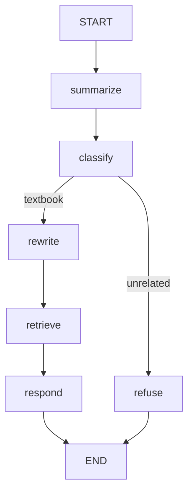
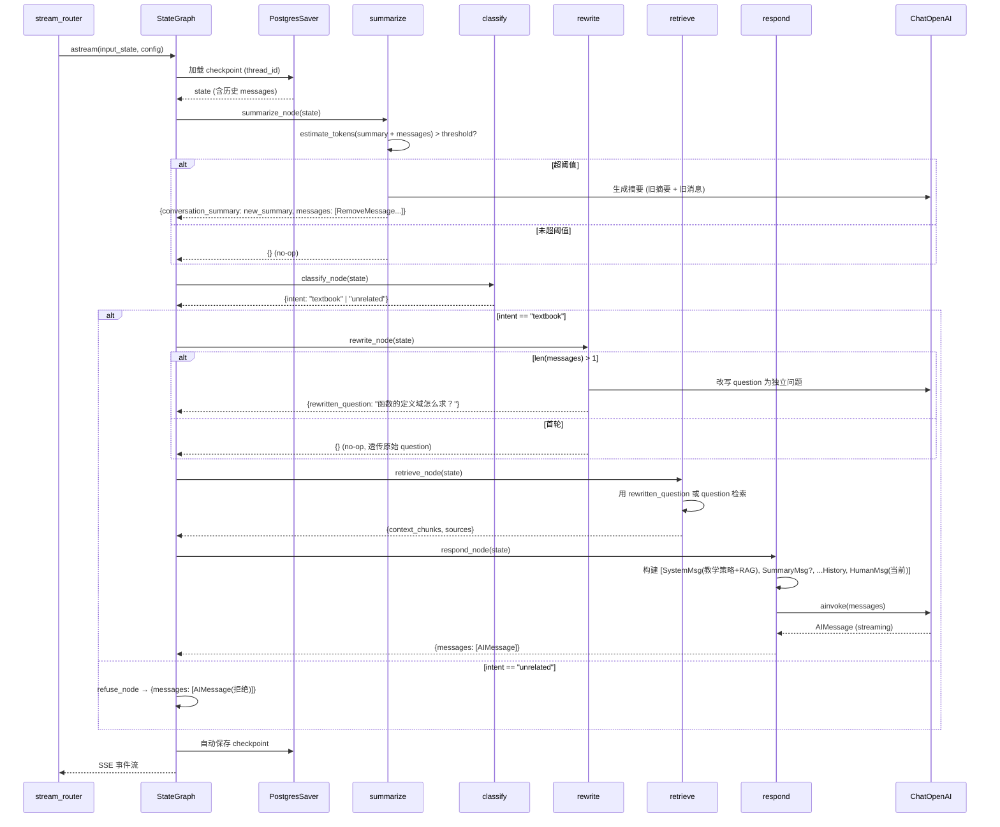
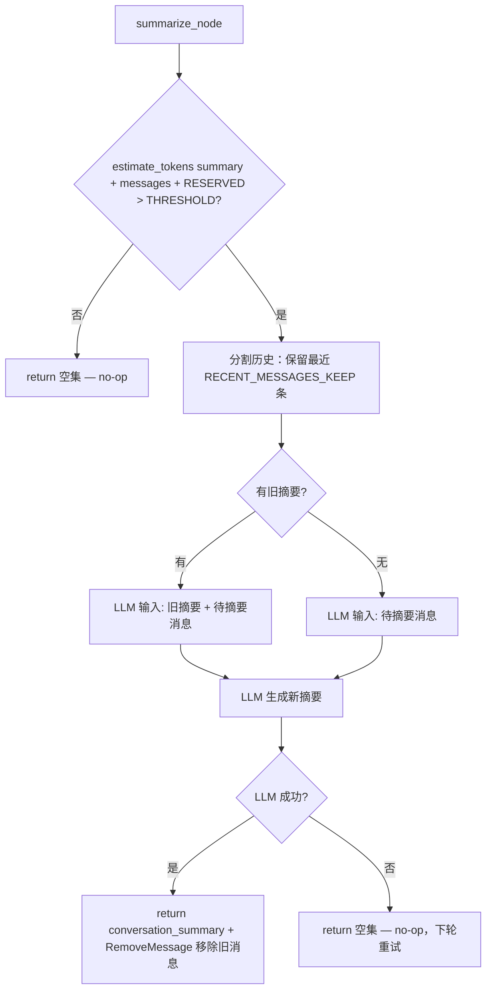

# 长对话上下文管理 — 后端设计报告

## 1. 目标

- 修复 `_respond` 节点不传历史消息的 bug，让多轮对话生效
- 新增 summarize 节点：token 预算管理 + LLM 摘要压缩 + RemoveMessage 清理旧消息，支持无限长度对话
- 新增 rewrite 节点：多轮时用 LLM 改写追问为独立问题，提升 RAG 检索精准度
- 改造 respond 节点：动态 system prompt 注入 RAG context + 摘要 + 历史消息原样透传

## 2. 现状分析

### 已有能力

| 能力 | 文件 | 状态 |
|------|------|------|
| LangGraph StateGraph 编排 | `agent/graph.py` | `START → classify → [retrieve → respond \| refuse] → END` |
| AgentState + add_messages reducer | `agent/graph.py` | checkpoint 存储 `[HumanMsg, AIMsg, ...]` |
| PostgresSaver checkpointer | `chat/dependencies.py` | thread_id = conversation_id |
| ChatOpenAI streaming | `infra/llm.py:get_chat_model()` | streaming=True |
| 教学策略 system prompt | `agent/prompts.py` | TEACHING_SYSTEM_PROMPT |
| RAG context 构建 | `infra/context_builder.py` | build_numbered_context() |
| 问题分类器 | `domain/classifier.py` | 规则引擎，textbook/unrelated |
| SSE 双流事件映射 | `chat/stream_router.py` | updates + messages |
| 对话持久化 CRUD | `infra/conversation_repo.py` | SQLAlchemy async ORM |

### 存在的问题

1. **_respond 不传历史**（graph.py:85-113）：构建 `[SystemMessage, HumanMessage(current+RAG)]`，完全忽略 `state["messages"]`
2. **RAG 检索只看当前 question**（graph.py:68-73）：追问中的代词对检索无意义
3. **无 token 预算管理**：长对话（30+ 轮）会撞 LLM 200K context window 上限

## 3. 数据模型与接口

### AgentState 扩展

```python
class AgentState(dict):
    messages: Annotated[list[BaseMessage], add_messages]  # 不变
    question: str                                          # 不变
    intent: Literal["textbook", "unrelated"]               # 不变
    context_chunks: list[QueryResult]                      # 不变
    sources: list[SourceReference]                         # 不变
    degraded: bool                                         # 不变
    degradation_reason: str | None                         # 不变
    # --- R010 新增 ---
    conversation_summary: str                              # 摘要文本（null 表示未触发）
    rewritten_question: str                                # 改写后的独立问题（null 表示未改写）
```

| 决策 | 理由 |
|------|------|
| 新增字段而非新表 | PostgresSaver 自动持久化 AgentState，无需额外存储 |
| conversation_summary 由 summarize 节点写入 | 只在超阈值时触发，首轮一定为 null |
| rewritten_question 由 rewrite 节点写入 | 只在多轮时触发，首轮一定为 null |

### TokenBudget 配置常量

```python
# 新文件：agent/token_budget.py

class TokenBudget:
    CONTEXT_WINDOW = 200_000       # LLM context window 上限
    SUMMARIZE_THRESHOLD = 0.65     # 65% 时触发摘要（130K）
    RESERVED_FOR_RAG = 8_000       # 预留给 RAG context + system prompt
    RESERVED_FOR_OUTPUT = 4_000    # 预留给 LLM 输出
    RECENT_MESSAGES_KEEP = 10      # 摘要时保留最近 10 条消息（5 轮）
```

| 决策 | 理由 |
|------|------|
| 字符估算 × 1.5 | 纯函数，不引入 tiktoken 依赖；保守系数抵消中文字符偏差 |
| 65% 触发阈值 | 留足够余量给 RAG + 输出，避免阈值附近反复触发 |
| 无 HARD_MESSAGE_LIMIT | summarize 用 RemoveMessage 移除旧消息，state 不会无限增长 |

### estimate_tokens 纯函数

```python
def estimate_tokens(text: str) -> int:
    """保守估算文本 token 数（中文 1 字 ≈ 1.5 token）"""
    return int(len(text) * 1.5)
```

### 接口变更

| 接口 | 变更 | 影响 |
|------|------|------|
| graph 拓扑 | 新增 summarize + rewrite 节点 | stream_router.py SSE 事件映射需新增节点处理 |
| AgentState | +2 字段 | PostgresSaver 自动兼容，旧 checkpoint 无新字段时默认 null |
| retrieve 节点 | 读 rewritten_question 优先于 question | 检索逻辑不变，只改输入来源 |
| respond 节点 | 重写消息构建逻辑 | SSE token 流不变 |

### SSE 事件变更

stream_router.py `_map_node_update_to_sse` 需新增两个节点的 SSE 映射：

```python
# summarize 节点 — 推送 thinking 事件
elif node_name == "summarize":
    summary = node_output.get("conversation_summary")
    if summary:
        yield _sse_frame("thinking", {"text": "上下文已压缩", "index": 0})

# rewrite 节点 — 推送 thinking 事件
elif node_name == "rewrite":
    rewritten = node_output.get("rewritten_question")
    if rewritten:
        yield _sse_frame("thinking", {"text": f"查询改写: {rewritten}", "index": 1})
```

| 决策 | 理由 |
|------|------|
| summarize 不推送独立事件 | 摘要对用户透明，只在 thinking 里提示 |
| rewrite 推送改写结果 | 用户可感知"系统理解了我的追问"，debug 时也有用 |

## 4. 核心流程

### 4.1 新图拓扑

```
START → summarize → classify → [rewrite → retrieve → respond | refuse] → END
```



### 4.2 多轮对话完整流程



### 4.3 summarize 节点逻辑



**RemoveMessage 机制**：

LangGraph 的 `add_messages` reducer 支持 `RemoveMessage` 指令。summarize 节点返回：

```python
from langgraph.graph.message import RemoveMessage

return {
    "conversation_summary": new_summary,
    "messages": [RemoveMessage(id=msg.id) for msg in old_messages],
}
```

`add_messages` reducer 识别 `RemoveMessage` 后会从 messages 列表中移除指定 ID 的消息。这样：
- state.messages 只保留近期消息，不会无限增长
- checkpoint 存储大小可控
- summarize 不会每轮都触发（摘要后消息总量下降，回到阈值以下）

| 决策 | 理由 |
|------|------|
| 用 RemoveMessage 移除旧消息 | LangGraph 原生支持，add_messages reducer 自动处理删除 |
| 摘要成功后才移除 | 保证摘要质量，避免信息丢失 |
| 摘要失败时 no-op | 不移除消息，下轮重新检测并重试 |
| 保留最近 RECENT_MESSAGES_KEEP 条 | 5 轮近期历史直接传给 LLM，无需通过摘要 |

### 4.4 rewrite 节点逻辑

```python
REWRITE_PROMPT = """基于以下对话历史，将用户的追问改写为一个独立的、完整的问题。
要求：
1. 保留原始问题的数学语义
2. 将代词（它、这个、那个）替换为具体概念
3. 直接输出改写后的问题，不要解释

对话历史：
{history}

用户追问：{question}

改写后的独立问题："""
```

| 决策 | 理由 |
|------|------|
| 用同一 LLM 做 rewrite | rewrite 任务简单，无需额外模型配置 |
| LLM 失败 fallback 原始 question | 不阻断流程，降级到原始检索 |
| 取最近 2-3 轮历史 | 足够解析代词，不会输入过长 |

### 4.5 respond 节点消息构建（修复后）

```
构建 LLM 输入消息列表：

1. SystemMessage: 教学策略 prompt
   - 有 RAG context 时追加 "以下是检索到的教材内容：{context}"
   - 无 RAG context 时只含教学策略

2. SystemMessage: 对话摘要（如 conversation_summary 存在）
   - "以下是之前对话的要点总结：{summary}"

3. state["messages"] 全量原样透传：
   - summarize 已移除旧消息，state 中只剩近期消息
   - 末尾的 HumanMessage 是当前轮用户问题，原样保留
```

**与 LangChain 官方模式对应**：

| LangChain 组件 | 我们的实现 |
|----------------|-----------|
| `create_stuff_documents_chain` + `{context}` | SystemMessage 中动态拼接 RAG context |
| `MessagesPlaceholder("chat_history")` | state["messages"] 近期历史原样透传 |
| `"{input}"` | messages 末尾的 HumanMessage（原样，不修改） |
| `create_history_aware_retriever` | rewrite 节点改写后再检索 |

参考：https://python.langchain.com/docs/tutorials/qa_chat_history/

## 5. 项目结构与技术决策

### 项目结构

```
backend/app/agent/
├── __init__.py
├── graph.py              # AgentState + create_graph（改造：新增 summarize/rewrite/retrieve/respond 闭包 + 扩展 state）
├── nodes.py              # classify_node + refuse_node（不变，无 LLM 调用的节点放这里）
├── prompts.py            # TEACHING_SYSTEM_PROMPT（不变）+ REWRITE_PROMPT（新增）+ SUMMARIZE_PROMPT（新增）
├── token_budget.py       # 新增：TokenBudget 配置 + estimate_tokens 函数

backend/app/chat/
├── stream_router.py      # SSE 事件映射（改造：新增 summarize/rewrite 节点映射）

backend/eval/
├── __init__.py
├── multi_turn_eval.py    # 新增：BB004 评估主脚本（确定性 Graders + Tracked Metrics）
├── graders.py            # 新增：BB004 state_check / tool_calls / deterministic / transcript grader 实现
├── judge_prompts.py      # 新增：BB005 LLM rubric + assertions prompt 常量
├── llm_judge_eval.py     # 新增：BB005 LLM-as-Judge 评估主脚本

backend/eval/datasets/
├── multi_turn_eval.json  # 新增：多轮对话评估数据集（L1-L4 场景）

backend/tests/
├── test_token_budget.py  # 新增：estimate_tokens 单元测试
├── test_agent_graph.py   # 改造：新增 summarize/rewrite 节点编译测试
├── test_agent_nodes.py   # 改造：新增 rewrite/summarize 节点单元测试
├── test_graph_integration.py  # 改造：新增多轮对话集成测试
```

### 职责划分

```
stream_router.py          → 构建 input_state, SSE 事件映射（不感知节点内部逻辑）
graph.py                  → AgentState 定义, 图编排, summarize/rewrite/retrieve/respond 闭包
                           （需要 LLM 或 chat_service 的节点用闭包注入依赖）
nodes.py                  → classify_node, refuse_node（无 LLM 调用的纯逻辑节点）
prompts.py                → 所有 prompt 文本常量
token_budget.py           → TokenBudget 配置 + estimate_tokens 纯函数
```

**调用方向**：graph.py → nodes.py, prompts.py, token_budget.py

### 技术决策

| 决策 | 方案 | 理由 |
|------|------|------|
| Token 估算方式 | `len(text) * 1.5` 字符估算 | 不引入 tiktoken 依赖，保守系数抵消偏差 |
| RAG context 位置 | 动态注入 SystemMessage | LangChain 官方推荐，不修改用户消息 |
| 摘要 LLM | 复用 get_chat_model() | 摘要任务简单，同模型即可 |
| Rewrite LLM | 复用 get_chat_model() | 改写任务简单，同模型即可 |
| 摘要存储 | AgentState.conversation_summary | PostgresSaver 自动持久化 |
| 旧消息清理 | RemoveMessage API | LangGraph 原生支持，add_messages reducer 自动处理删除，避免 state 无限增长 |
| graph 拓扑变更 | summarize 紧跟 START | 每轮都检查 token 预算，未超阈值时 no-op |
| 新节点归属 | graph.py 闭包 | 与现有 _retrieve/_respond 一致，需要注入 LLM/chat_service 依赖的节点用闭包 |

### 第三方依赖

| 依赖 | 用途 | 已有/需新增 |
|------|------|------------|
| langchain-core | BaseMessage, SystemMessage, HumanMessage | ✅ 已有 |
| langchain-openai | ChatOpenAI | ✅ 已有 |
| langgraph | StateGraph, add_messages, RemoveMessage | ✅ 已有 |

无新增依赖。

## 6. 验收标准

### 功能验收

| 验收条件 | 验收方式 |
|----------|----------|
| estimate_tokens 纯函数单测通过 | `pytest tests/test_token_budget.py` |
| summarize 节点编译通过 | `pytest tests/test_agent_graph.py -k "compile"` |
| rewrite 节点编译通过 | `pytest tests/test_agent_graph.py -k "compile"` |
| 新图拓扑包含 6 个节点 | `pytest tests/test_agent_graph.py -k "nodes"` |
| 多轮对话 respond 构建正确消息列表 | `pytest tests/test_agent_nodes.py -k "respond"` |
| rewrite 节点首轮透传、多轮改写 | `pytest tests/test_agent_nodes.py -k "rewrite"` |
| summarize 节点未超阈值时 no-op | `pytest tests/test_agent_nodes.py -k "summarize"` |
| summarize 节点超阈值时生成摘要 + RemoveMessage | `pytest tests/test_agent_nodes.py -k "summarize"` |
| SSE 事件映射支持新节点 | `pytest tests/test_stream_router.py` |
| 多轮对话端到端可工作 | `pytest tests/test_graph_integration.py` |
| LLM streaming 不受影响 | 手动 `curl` SSE 端点验证 token 流 |

### 效果验收 — BB004 评估基础设施 + 确定性 Graders

**评估数据集**：23 条用例（16 正面 + 7 负面），覆盖 L1-L4 难度层级，含"不该 rewrite"的负面场景。

#### Grader 2: state_check

| 场景 | 断言 |
|------|------|
| 首轮 | `rewritten_question is None`, `conversation_summary is None` |
| 多轮 rewrite | `rewritten_question is not None and != question` |
| summarize 触发后 | `summary non-empty`, `len(messages) <= RECENT_MESSAGES_KEEP + 1` |

#### Grader 3: tool_calls

| 场景 | 断言 |
|------|------|
| rewrite 首轮 | 未调 LLM（透传） |
| rewrite 多轮 | 调了 LLM，输入含历史 |
| summarize 未超阈值 | 未调 LLM（no-op） |
| summarize 超阈值 | 调了 LLM + 返回 RemoveMessage |
| retrieve 有 rewrite | 输入 == rewritten_question |

#### Grader 4: transcript 约束

- 首轮不触发 summarize
- 单轮 graph 全链路 ≤ 30s

#### Grader 5: deterministic_tests

- pass-to-pass：现有单轮对话测试 + SSE 测试仍通过
- fail-to-pass：多轮 respond 测试从失败变通过

#### Grader 6: static_analysis

- `ruff check` 无错误
- `mypy` 无类型错误

#### Tracked Metrics

| 指标 | 基线预期 |
|------|---------|
| n_toolcalls | 首轮 ≤ 2，多轮 ≤ 3，含摘要 ≤ 4 |
| n_total_tokens | 首轮 ≤ 5000，多轮 ≤ 7000，含摘要 ≤ 10000 |
| time_to_first_token | 无 rewrite ≤ 1s，有 rewrite ≤ 3s |
| time_to_last_token | 无摘要 ≤ 15s，含摘要 ≤ 25s |

#### BB004 验收条件

| 验收条件 | 验收方式 |
|----------|----------|
| static_analysis 通过 | `ruff check && mypy` |
| deterministic_tests 通过 | `pytest tests/`（含 pass-to-pass + fail-to-pass） |
| state_check 全部通过 | `python -m eval.multi_turn_eval --dataset eval/datasets/multi_turn_eval.json` |
| tool_calls 全部通过 | 同上 |
| transcript 约束全部通过 | 同上 |
| 确定性粗筛全部通过 | 同上 |
| Tracked metrics 在基线范围内 | 同上 |

### 效果验收 — BB005 LLM-as-Judge 评估

**前置条件**：BB004 全部通过。

#### Grader 1: llm_rubric + assertions

每个维度独立 LLM Judge（0-5 分，含 Unknown=0），每个 Judge 含 rubric + assertions。

| 维度 | Assertions |
|------|------------|
| Rewrite 质量 | ① 包含原始数学概念 ② 代词已替换 ③ 可独立理解 |
| 检索相关性 | ① chunks 主题一致 ② chunks ≥ 1 ③ 包含关键术语 |
| 上下文连贯性 | ① 引用了前几轮概念 ② 无历史矛盾 ③ 教学语气一致 |
| 摘要保真度 | ① 保留关键术语 ② 保留因果链 ③ 未引入未出现的信息 |

#### BB005 验收条件

| 验收条件 | 验收方式 |
|----------|----------|
| LLM assertions 平均通过率 ≥ 90% | `python -m eval.llm_judge_eval --dataset eval/datasets/multi_turn_eval.json` |
| L1-L2 Rewrite rubric ≥ 4 分 | 同上 |
| L3-L4 Rewrite rubric ≥ 3 分 | 同上 |
| 上下文连贯性 rubric 平均 ≥ 4 分 | 同上 |
| 输出完整结构化报告（BB004 + BB005 汇总） | 同上 |

## 7. 暂不实现

| 功能 | 理由 |
|------|------|
| RAG 检索结果缓存 | 多轮对话每轮 query 不同，缓存命中率低（已记 backlog） |
| 精确 token 计数（tiktoken） | 字符估算 + 保守阈值够用，后续可替换 |
| 分层记忆（短期/长期摘要） | 过度设计，单层摘要已满足需求 |
| 摘要 SSE 独立事件 | 摘要对用户透明，thinking 事件提示即可 |
| rewrite 规则预判（代词检测） | LLM 改写延迟可接受，后续可加规则加速 |
| 评估 Transcript 日志持久化 | 当前评估只输出分数报告，中间产物日志待后续补充（已记 backlog） |

## 8. architecture.md 更新

R010 完成后需更新：

1. **移除禁止模式**：删除「R004 不做多轮对话状态管理（DEC-rag-007）」— R010 已实现
2. **新增决策记录 DEC-rag-010**：摘要压缩方案 — token 预算管理 + LLM 摘要 + RemoveMessage 清理旧消息。理由：LangGraph 原生 RemoveMessage 支持 add_messages reducer 删除指定消息，避免 state 无限增长。影响范围：graph.py summarize 节点。
3. **新增决策记录 DEC-rag-011**：Query Rewriting 方案 — 多轮时 LLM 改写追问为独立问题 + 首轮透传 + 失败 fallback。理由：追问中的代词对 RAG 检索无意义，改写为独立问题后检索精准度提升。影响范围：graph.py rewrite 节点 + retrieve 节点输入来源。
4. **更新图拓扑描述**：`START → summarize → classify → rewrite → retrieve → respond | refuse → END`
5. **新增不变量**：respond 节点构建 LLM 输入时使用动态 system prompt 注入 RAG context，对话历史原样透传，不修改用户消息
6. **更新不变量**：LLM 调用统一在 Backend 内 — 补充 summarize/rewrite 节点的 LLM 调用也走 infra/llm.py 的 get_chat_model()
