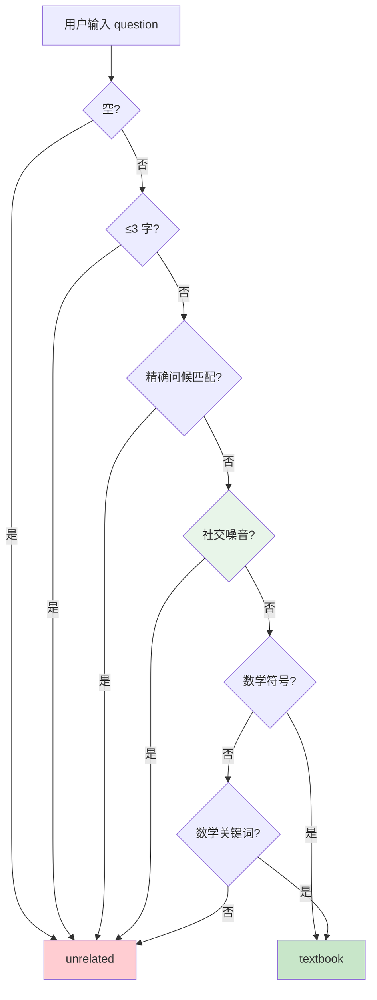

# 分类器默认策略修正 — 后端设计

## 1. 目标

- 将 classify_question 的默认返回值从 `textbook` 改为 `unrelated`，使非数学输入被正确拒绝
- 补充社交噪音检测，处理"你好你好"、"哈哈哈哈"等重复社交输入
- 补充数学上下文关键词（"题"、"算"），防止默认翻转后误伤合法数学问题

## 2. 现状分析

当前分类器 (`app/domain/classifier.py`) 是纯规则分类，按优先级链式判断：

```
空/短 → 问候精确匹配 → 数学符号 → 数学关键词 → 默认 textbook
```

**问题**：默认 `return "textbook"` 导致所有未命中规则的输入都走 RAG 检索 + LLM 回复。实测 "背诵一下将进酒"、"你好你好"、"今天天气怎么样" 全部被分类为 textbook，产生无关回答。

**根因**：设计哲学"宁可多检索"与课程助手的产品定位矛盾——课程助手应该"宁可拒答，不误答"。

**影响范围**：
- `app/domain/classifier.py` — 分类器核心逻辑
- `tests/test_question_classifier.py` — 单元测试（3 个测试期望需翻转）
- `eval/graders.py` 中 `tool_calls_check` 的 textbook/unrelated 路径断言不受影响（断言基于 expected，不是硬编码路径）
- `app/agent/nodes.py` 不变（classify_node 只调用 classify_question）

## 3. 核心流程

### 分类逻辑变更（伪代码）



绿色节点为新增步骤，红色/绿色终端分别表示 unrelated/textbook。

### 社交噪音检测逻辑

```
输入: normalized text（已 lower + 去尾标点）
1. 遍历 _GREETING_PATTERNS，将匹配到的模式从 text 中移除
2. 去残余标点
3. 如果残余为空 → 整句都是问候/社交词 → unrelated
```

覆盖场景：你好你好、哈哈哈哈、嗯嗯好的、你好谢谢、嗨嗨嗨

安全边界："你好请问函数" → 去掉"你好"后残余"请问函数"（含"函数"关键词）→ 不误判

## 5. 技术决策

| 决策 | 方案 | 理由 |
|------|------|------|
| 默认策略 | `unrelated` | 课程助手应保守拒答，不做通用聊天 |
| 社交噪音检测 | 移除问候词后检查残余 | 比枚举所有重复模式更优雅，天然覆盖组合 |
| 新增关键词 | "题"、"算" | 数学辅导中高频出现的上下文词，置信度高 |
| 不引入 LLM 分类 | 保持纯规则 | 当前规则覆盖已足够，LLM 增加延迟和成本 |
| 不修改 nodes.py | 只改 classifier.py | classify_node 只调用 classify_question，无耦合 |

## 6. 验收标准

| 验收条件 | 验收方式 |
|----------|----------|
| 默认输入（无数学关键词）→ unrelated | `pytest tests/test_question_classifier.py -v` |
| "这道题怎么做" → textbook | 单测覆盖 |
| "帮我算一下" → textbook | 单测覆盖 |
| "你好你好" → unrelated | 单测覆盖 |
| "背诵一下将进酒" → unrelated | 单测覆盖 |
| "哈哈哈哈" → unrelated | 单测覆盖 |
| 现有 12 个 textbook 用例仍通过 | `pytest tests/test_question_classifier.py -v` |
| 无 lint 错误 | `ruff check app/domain/classifier.py tests/test_question_classifier.py` |

## 7. 暂不实现

| 功能 | 理由 |
|------|------|
| LLM 意图分类 | 增加延迟 ~2s 和成本，当前规则覆盖足够 |
| 多轮上下文感知分类 | classify 只看 question 是设计选择，上下文由 rewrite 节点处理 |
| 否定关键词列表（"背"、"诗"等） | 默认改为 unrelated 后不再需要显式否定 |
