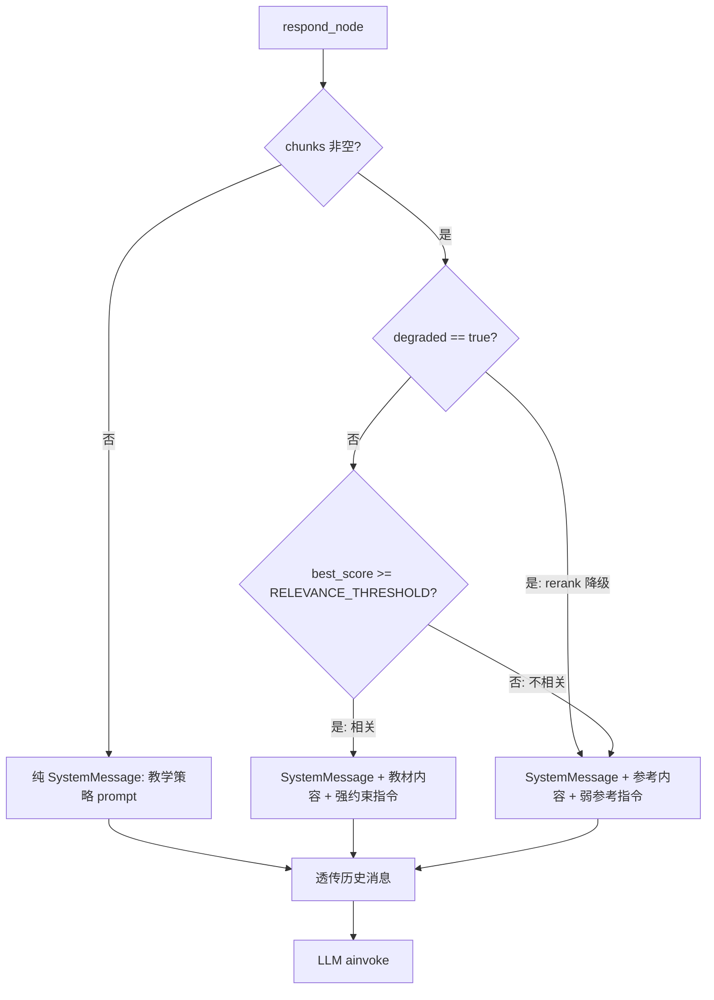

# LLM 忠实性与接地性修复 — 后端设计报告

> 关联设计：[长对话上下文管理 v1.1 后端](2026-05-26--long-context-dialogue-backend.md)

## 1. 目标

- 修复 LLM 基于不相关检索内容编造回答的幻觉问题
- 改造 respond 节点的 context 注入策略：从无条件注入改为按相关性分级注入
- 重写 TEACHING_SYSTEM_PROMPT，加入"忠于教材"约束作为最高优先级
- 补齐测试：新增"无关 context"场景的单元测试和集成测试
- 补齐评估：eval 数据集新增 negative context 用例，新增 grounding 维度 Judge

## 2. 现状分析

### 已有能力

| 能力 | 文件 | 状态 |
|------|------|------|
| 线性 StateGraph 拓扑 | `agent/graph.py` | 4 节点，无分支 |
| RAG 检索管线 | `chat/service.py` | Embed → Vector → BM25 → RRF → Rerank → Truncate |
| context 注入到 SystemMessage | `agent/graph.py:200-202` | **无条件注入 + 强指令** |
| 教学策略 system prompt | `agent/prompts.py` | 鼓励发散，**无接地约束** |
| 确定性评估 (BB004) | `eval/multi_turn_eval.py` | 42 用例，**无无关 context 场景** |
| LLM Judge 评估 (BB005) | `eval/llm_judge_eval.py` | 4 维度，**无 grounding/faithfulness 维度** |
| Faithfulness Grader | `app/evaluation/graders/llm_judge.py` | 已有 claim 级判定能力，**但未接入 R010 eval** |

### 存在的问题

**问题根因链**：检索到内容 ≠ 内容与问题相关 → 无条件注入 + "请基于教材回答"强指令 → LLM 被迫基于不相关内容编造 → 产生幻觉

具体表现（真实对话）：
- 用户输入非数学问题或模糊问题
- RAG 检索到"圆锥曲线"等内容（向量相似度最高的 chunk）
- LLM 被指令"请基于以上教材内容回答学生的问题"逼着回答
- 产出"主题乐园"、"会拐弯的箭头"等教材中不存在的编造内容

### 5 条缺陷逃逸路径（DF-20260528-01）

| # | 逃逸路径 | 说明 |
|---|---------|------|
| 1 | Mock LLM 天然免疫幻觉 | 5 个测试文件全部 mock，不会产生幻觉 |
| 2 | 检索结果全部构造为相关 | 每个测试的 chunk 都跟问题匹配 |
| 3 | respond 只验结构不验内容 | 只检查 AIMessage 类型，不检查内容忠实度 |
| 4 | System prompt 只验关键词 | `assert "类比" in prompt`，不评估约束效果 |
| 5 | eval 数据集无 negative context | 42 条用例全是正常检索场景 |

## 3. 数据模型与接口

### 无新增数据模型

本次改动不涉及新增表/字段。使用已有的 `QueryResult.score`（reranker 分数）作为相关性信号。

### QueryResult.score 来源

```
Embed → Vector(cosine_similarity) → Threshold(0.3) → BM25 → RRF → Rerank(reranker_score)
```

经过 rerank 后，`score` 是 reranker 分数（0-1 范围）。降级时是 RRF 分数（0-1/k 范围）。

### AgentState 无变更

不新增 state 字段。相关性判断在 respond 节点内部完成，不需要跨节点传递。

## 4. 核心流程

### 4.1 改造后的 respond 节点逻辑



**关键决策：分级注入而非二值过滤**

| 场景 | chunks | degraded | best_score | 注入策略 | LLM 指令 |
|------|--------|----------|-----------|---------|---------|
| 无检索结果 | 空 | - | - | 不注入 | "基于自身知识回答" |
| 相关内容 | 有 | false | ≥ 阈值 | 注入为教材内容 | "严格基于教材内容回答，只使用明确出现的内容" |
| 不相关内容 | 有 | false | < 阈值 | 注入为参考信息 | "仅供参考，如不相关基于知识回答" |
| 降级（rerank 失败） | 有 | true | - | 注入为参考信息 | "仅供参考，如不相关基于知识回答" |

**降级分支说明**：当 `degraded=True` 时，score 是 RRF 分数（范围 `1/(k+rank)`，k=60），语义和范围与 reranker 分数完全不同，不能直接用于相关性判断。因此降级时跳过相关性判断，统一走弱参考路径。

**用户可见行为**：三种注入策略对前端 SSE 流无差异 — SSE 事件序列不变（status/sources/token/done），sources 事件仍然推送所有检索到的 chunk。分级注入是后端内部行为，用户通过 LLM 回复内容的质量间接感知差异。

| 决策 | 理由 |
|------|------|
| 分级注入而非二值过滤 | 保留模糊区域的弹性，避免硬切导致有用内容被丢弃 |
| 使用 reranker score 作为相关性信号 | reranker 是最后一道质量关卡，分数最可靠 |
| 降级时跳过相关性判断 | RRF 分数与 reranker 分数语义不同，阈值不通用 |
| 阈值可配置 | 不同 reranker 模型分数分布不同，需可调 |
| 不新增节点 | 在 respond 内部完成判断，不改变拓扑 |
| SSE 事件不变 | 分级注入是后端策略，前端无需感知，避免接口变更 |

### 4.2 TEACHING_SYSTEM_PROMPT 改造

**新增"忠实性约束"章节，设为最高优先级**：

```
## 忠实性约束（最高优先级，覆盖所有其他策略）
- 只说检索到的教材内容中明确存在的内容
- 绝不编造教材中没有的概念、定理、例题或比喻
- 类比和比喻只能用于解释教材中已有的概念，不能无中生有
- 如果检索到的内容与问题无关，说明这一点并引导学生提出具体问题
- 如果不确定某内容是否在教材中，标注"教材中未直接涉及"
- 每次只聚焦一个概念，不要试图覆盖多个不相关的话题
```

**调整教学策略优先级**：将"忠实性"提到所有教学策略之前。

| 决策 | 理由 |
|------|------|
| "最高优先级，覆盖所有其他策略" | 防止发散策略（类比、启发）与忠实性冲突 |
| "绝不编造"而非"尽量避免编造" | 零容忍措辞对 LLM 约束力更强 |
| 保留类比但限定范围 | 类比是有效教学手段，但只能用于解释已有概念 |

### 4.3 Context 注入指令改造

**现状**：
```python
system_content += "请基于以上教材内容回答学生的问题。"
```

**改为分级指令**：

```python
if best_score >= threshold:
    # 高相关性 — 强约束
    system_content += "\n\n以下是检索到的教材内容：\n{context}\n请严格基于以上教材内容回答。只使用教材中明确出现的信息，不要编造教材中没有的内容。"
else:
    # 低相关性 — 参考性质
    system_content += "\n\n以下是一些可能相关的参考内容：\n{context}\n如果这些内容与学生的问题相关，可以参考使用；如果不相关，基于你的知识回答并标注'教材中未直接涉及'。"
```

## 5. 项目结构与技术决策

### 项目结构

```
backend/app/agent/
├── graph.py              # 改造：respond 节点分级注入逻辑
├── prompts.py            # 改造：TEACHING_SYSTEM_PROMPT 加忠实性约束

backend/app/core/
├── config.py             # 改造：新增 RELEVANCE_THRESHOLD 配置项

backend/app/chat/
├── service.py            # 不变

backend/eval/
├── judge_prompts.py      # 改造：新增 GROUNDING_PROMPT 维度（R010 专项评估）
├── llm_judge_eval.py     # 改造：接入 grounding 维度评估
├── datasets/
│   └── multi_turn_eval.json  # 改造：新增 negative context 用例

backend/app/evaluation/graders/
│   └── llm_judge.py      # 不变（生产级回归测试用 Faithfulness Grader）

backend/tests/
├── test_agent_nodes.py   # 改造：新增无关 context 场景测试
├── test_graph_integration.py  # 改造：新增无关 context 集成测试
├── test_grounding_eval.py     # 新增：grounding 评估测试
```

### 技术决策

| 决策 | 方案 | 理由 |
|------|------|------|
| 相关性信号 | reranker score | 最可靠的质量指标，已经过 rerank 精炼 |
| 相关性阈值 | 可配置常量，默认 0.5 | 初始值基于 DashScope gte-rerank 文档建议，上线前需用真实数据集验证分布并调优 |
| 降级分支 | degraded=True 时跳过相关性判断 | RRF 分数（`1/(k+rank)`）与 reranker 分数（0-1）语义不同，阈值不通用 |
| 分级策略 | 4 级（无/相关/不相关/降级） | 降级单列，避免误用 RRF 分数 |
| Prompt 约束措辞 | "最高优先级" + "绝不编造" | 强措辞对 LLM 约束力更强 |
| 不新增节点 | 在 respond 内完成 | 不改变拓扑，最小化改动范围 |
| Grounding 评估路径 | 双路径 | R010 专项：`eval/judge_prompts.py` 新增 GROUNDING_PROMPT 第 5 维度；生产回归：复用 `app/evaluation/graders/llm_judge.py` 的 Faithfulness Grader |

### 第三方依赖

无新增依赖。

## 6. 验收标准

### 功能验收

| 验收条件 | 验收方式 |
|----------|----------|
| TEACHING_SYSTEM_PROMPT 包含"忠实性约束"章节 | `pytest tests/test_agent_nodes.py -k "prompt"` |
| 忠实性约束标记为"最高优先级" | `pytest tests/test_agent_nodes.py -k "prompt"` |
| respond 节点高相关性场景注入强约束指令 | `pytest tests/test_agent_nodes.py -k "respond_relevant"` |
| respond 节点低相关性场景注入弱参考指令 | `pytest tests/test_agent_nodes.py -k "respond_irrelevant"` |
| respond 节点无 chunks 时不注入 context | `pytest tests/test_agent_nodes.py -k "respond_no_chunks"` |
| respond 节点降级场景走弱参考路径 | `pytest tests/test_agent_nodes.py -k "respond_degraded"` |
| 高相关性分级注入集成测试通过 | `pytest tests/test_graph_integration.py -k "relevant"` |
| 低相关性分级注入集成测试通过 | `pytest tests/test_graph_integration.py -k "irrelevant"` |

### 评估验收

| 验收条件 | 验收方式 |
|----------|----------|
| eval 数据集新增 ≥ 5 条 negative context 用例 | 查看 `multi_turn_eval.json` |
| GROUNDING_PROMPT 维度定义完成（R010 专项第 5 维度） | `pytest tests/test_grounding_eval.py` |
| 真实 LLM 场景：输入"你好"不产生教材内容幻觉 | 手动 smoke 测试 |
| 真实 LLM 场景：输入非数学问题提示超出范围 | 手动 smoke 测试 |
| LLM Judge grounding 维度可运行 | `python -m eval.llm_judge_eval --dataset eval/datasets/multi_turn_eval.json` |
| 用真实数据验证 reranker 分数分布，确认默认阈值有效性 | 上线前跑一次 `eval/llm_judge_eval.py` 观察 score 分布，必要时调整阈值 |

### 质量验收

| 验收条件 | 验收方式 |
|----------|----------|
| 现有 68 个测试全部通过 | `pytest tests/ -q` |
| ruff 无新增错误 | `ruff check app/ tests/` |
| 无新增第三方依赖 | `pip freeze \| diff` |

## 7. 暂不实现

| 功能 | 理由 |
|------|------|
| LLM-based 相关性评估（用 LLM 判断 chunks 是否相关） | 增加延迟和成本，score 阈值先试 |
| 动态阈值（基于分数分布自动调整） | 过度设计，固定阈值先上线 |
| retrieve 节点返回相关性标记 | 不改变 retrieve 节点接口，在 respond 内完成判断 |
| 前端显示"低相关性"提示 | 前端不变，后端先修好行为 |

## 8. architecture.md 更新

1. **新增决策记录 DEC-rag-014**：
   - Type: 架构决策
   - 内容：respond 节点 context 分级注入策略 — 按检索结果相关性分级注入系统指令（相关→强约束/不相关→弱参考/降级→弱参考/空→不注入），避免 LLM 基于不相关内容产生幻觉
   - Must Plan: no（在 respond 节点内部完成，不涉及新模块）
   - Source: DF-20260528-01 缺陷逃逸分析
   - Blast Radius: graph.py respond 节点 + prompts.py TEACHING_SYSTEM_PROMPT + config.py RELEVANCE_THRESHOLD

2. **新增决策记录 DEC-rag-015**：
   - Type: 约束决策
   - 内容：忠实性约束最高优先级 — TEACHING_SYSTEM_PROMPT 新增"忠实性约束"章节，标记为最高优先级覆盖所有其他策略，要求 LLM 只说教材中明确存在的内容
   - Must Plan: no（纯 prompt 修改）
   - Source: DF-20260528-01 缺陷逃逸分析
   - Blast Radius: prompts.py TEACHING_SYSTEM_PROMPT

3. **更新不变量**：respond 节点使用分级 context 注入 — 高相关性强约束、低相关性和降级弱参考、无结果不注入。降级（degraded=True）时跳过相关性判断，统一走弱参考路径。
