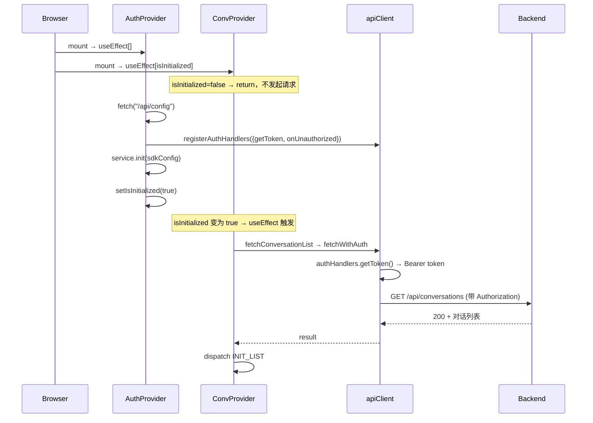

# Auth 竞态修复 — 前端设计报告

## 1. 目标

- ConversationProvider 初始化加载对话列表前等待 Auth SDK 初始化完成
- 消除刷新页面后对话列表"时有时无"的竞态 bug

## 2. 现状分析

### 已有能力

- `AuthProvider`（`auth-context.tsx`）：异步初始化链 `fetch("/api/config") → registerAuthHandlers → service.init → setIsInitialized(true)`，暴露 `isInitialized` 状态
- `useAuth()` hook：返回 `isInitialized` 等认证状态
- `useChatController`（`controller.ts:37-48`）：**已有正确模式** — useEffect 依赖 `[isInitialized]`，加 `if (!isInitialized) return` 守卫
- `ConversationProvider`（`conversation-context.tsx`）：已 import `useAuth`（第 17 行），但 Provider 内部未调用

### 问题

- `ConversationProvider` 第 195-222 行 useEffect 依赖为 `[]`，挂载后立刻调用 `fetchConversationList`
- 此时 `authHandlers` 为 `null`（`api-client.ts:16`），`fetchWithAuth` 不带 token 发请求
- 后端返回 401，catch 块只做 `SET_LOADING false`，列表为空且无重试
- `controller.ts` 已有正确的 `isInitialized` 守卫模式，但 `ConversationProvider` 没有照搬

### 基础设施就绪

- `useAuth()` 已可用（AuthProvider 在组件树上层，`layout.tsx:35`）
- `ConversationProvider` 已 import `useAuth`（第 17 行），只需调用

## 3. 数据模型与接口

本需求不涉及数据模型变更或新增接口。

### 关键依赖接口

| 接口 | 来源 | 消费方 |
|------|------|--------|
| `useAuth().isInitialized: boolean` | `auth-context.tsx:36` | `ConversationProvider` |
| `fetchConversationList(cursor?, limit): Promise<result>` | `use-conversation-list.ts` | `ConversationProvider` |

## 4. 核心流程

### 4.1 修复后：刷新页面加载对话列表



### 4.2 异常路径：Auth 初始化失败

`initError` 被 AuthProvider 捕获，`isInitialized` 保持 `false`。ConversationProvider 的 useEffect 永远不触发，列表保持空。这与当前 AuthProvider 的自动跳转登录逻辑一致（`auth-context.tsx:152-157`），用户会被重定向到登录页。

### 4.3 异常路径：fetchConversationList 失败

Auth 守卫只解决竞态。如果 Auth 完成后 fetchConversationList 仍失败（网络错误、服务异常），走现有 catch 逻辑：`SET_LOADING false`，列表为空。**不增加重试**。

## 5. 项目结构与技术决策

### 改动文件

```
frontend/src/
└── contexts/
    └── conversation-context.tsx    ← 唯一改动文件
```

### 职责划分

```
AuthProvider (auth-context.tsx)
  │ 暴露 isInitialized
  ▼
ConversationProvider (conversation-context.tsx)
  │ 读取 isInitialized，守卫 useEffect
  │ 调用 fetchConversationList（经 api-client 带 token）
  ▼
Sidebar (conversation-sidebar.tsx)
  │ 消费 ConversationContext.items 渲染列表
```

### 技术决策

| 决策 | 方案 | 理由 |
|------|------|------|
| 守卫方式 | `if (!isInitialized) return` | 项目内已有模式（controller.ts:38），保持一致 |
| 依赖数组 | `[isInitialized]` | 与 controller.ts:48 一致 |
| 错误处理 | 不改 | catch 块逻辑不变，只修复时序问题 |
| 新增重试 | 不做 | 超出本需求范围，竞态修复后失败概率极低 |

## 6. 验收标准

| 验收条件 | 验收方式 |
|----------|----------|
| ConversationProvider useEffect 依赖 `[isInitialized]` | 代码审查 |
| useEffect 内有 `if (!isInitialized) return` 守卫 | 代码审查 |
| 已登录用户刷新 /chat 后对话列表 100% 显示 | 手动刷新 5 次，每次列表正常 |
| 首次访问（未登录）不触发 fetchConversationList | DevTools Network 观察：无 /api/conversations 请求 |
| controller.ts 原有行为不变 | `python -m pytest tests/ -v` 后端测试通过 |
| 前端编译无错误 | `cd frontend && npm run build` |

## 7. 暂不实现

| 功能 | 理由 |
|------|------|
| fetchConversationList 失败自动重试 | 本需求只修复竞态，不增加重试 |
| 列表加载骨架屏 | UI 优化，独立需求 |
| Auth 失败重定向前的空状态展示 | 已有 AuthProvider 自动跳转逻辑 |
