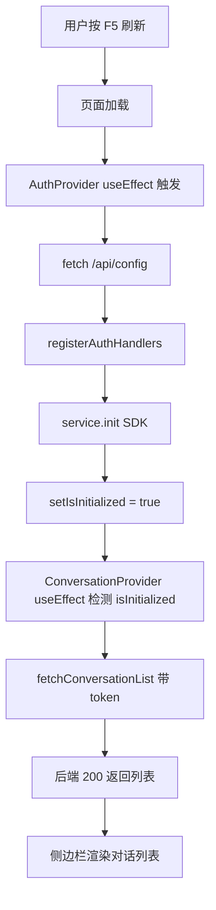
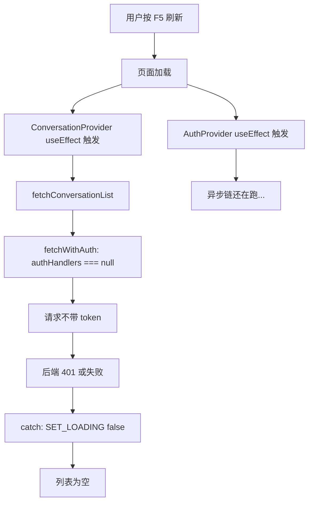

# Auth 竞态修复 — 刷新后对话列表时有时无

## 概述

用户刷新 /chat 页面后，侧边栏对话列表有时显示为空。根因是 `ConversationProvider` 的 `useEffect([])` 在挂载后立刻调用 `fetchConversationList`，此时 `AuthProvider` 的异步初始化链尚未完成（`registerAuthHandlers` 未调用），导致请求不带 Authorization header，后端返回 401 或被 api-client 静默丢弃。本项目内已有正确模式：`controller.ts` 的 `useEffect([isInitialized])` 守卫。本需求将同一模式应用到 `ConversationProvider`。

## 一、交互链

### 场景 1：刷新后对话列表正常加载（修复后）

**用户故事**：作为已登录用户，我想刷新页面后立即看到我的对话列表，以便继续之前的对话。

1. 用户在 /chat 页面按 F5 刷新
2. 页面白屏短暂加载
3. AuthProvider 完成异步初始化（fetch config → registerAuthHandlers → init SDK → setIsInitialized(true)）
4. ConversationProvider 检测到 isInitialized=true，发起 fetchConversationList
5. 请求携带 Bearer token，后端返回对话列表
6. 侧边栏渲染对话列表，自动选中上次活跃对话



### 场景 2：刷新后对话列表为空（当前 bug）

**用户故事**：作为已登录用户，我不希望刷新后对话列表随机消失。

1. 用户刷新 /chat
2. AuthProvider 和 ConversationProvider 的 useEffect 同时触发（同一渲染周期）
3. ConversationProvider 立即调用 fetchConversationList
4. fetchWithAuth 发现 authHandlers === null，请求不带 token
5. 后端返回 401 或请求失败
6. catch 块只做 SET_LOADING false，列表保持为空



## 二、逻辑树

### 事件流：页面刷新初始化

| 时刻 | 事件 | 处理 | 产生的新事件 |
|------|------|------|-------------|
| T0 | React 渲染 AuthProvider + ConversationProvider | 两个 useEffect 同时入队 | - |
| T1 | AuthProvider useEffect 执行 | fetch("/api/config") 异步开始 | - |
| T1 | ConversationProvider useEffect 执行 | fetchConversationList() 立即调用 | → fetchWithAuth |
| T2 | fetchWithAuth 检查 authHandlers | authHandlers === null → token = null | → 不带 Auth 的 HTTP 请求 |
| T3 | 后端返回 401 | catch 块捕获 | → SET_LOADING false，列表为空 |
| T4 | AuthProvider fetch("/api/config") 完成 | registerAuthHandlers() | authHandlers 被设置 |
| T5 | service.init 完成 | setIsInitialized(true) | → 如果有守卫的 useEffect 此时触发 |

### 状态流转

| 实体 | 触发事件 | 前状态 | 后状态 |
|------|---------|--------|--------|
| authHandlers (api-client) | AuthProvider registerAuthHandlers | null | {getToken, onUnauthorized} |
| AuthProvider.isInitialized | service.init 完成 | false | true |
| ConversationProvider.isInitialized | INIT_LIST action | false | true |
| ConversationProvider.items | fetchConversationList 成功 | [] | [对话列表] |
| ConversationProvider.items | fetchConversationList 失败 | [] | []（bug：永远空） |

**异常回退**：当前 bug 场景下，fetchConversationList 失败后列表为空，用户需要手动再次刷新才可能成功（竞态窗口因网络延迟而缩小）。没有自动重试机制。

### 关键代码对照

**Bug 位置**：`conversation-context.tsx:195-222`

```tsx
useEffect(() => {
  // 不等 Auth，直接发请求
  const result = await fetchConversationList(undefined, 20);
}, []);  // ← 空依赖
```

**正确参照**：`controller.ts:37-48`

```tsx
const { isInitialized } = useAuth();  // ← 获取 Auth 状态
useEffect(() => {
  if (!isInitialized) return;          // ← 守卫
  loadConversation(activeId)...
}, [isInitialized]);                   // ← 依赖 isInitialized
```

**ConversationProvider 已 import useAuth 但未使用**：`conversation-context.tsx:17`

```tsx
import { useAuth } from '@/contexts/auth-context';  // ← 已导入
// 但 Provider 内从未调用 useAuth()
```

## 三、功能编号与网络定位

### 本次新增节点

| 编号 | 功能节点 | 前缀含义 | 简介 |
|------|---------|---------|------|
| FF001 | ConversationProvider Auth 守卫 | 前端基础 | ConversationProvider 初始化加载等待 Auth isInitialized |

### 前置依赖

| 依赖节点 | 依赖方式 | 是否已有 |
|----------|---------|---------|
| AuthProvider.isInitialized | useAuth() 读取状态 | 已有（auth-context.tsx） |
| useAuth hook | 调用 | 已有（已 import 未使用） |
| controller.ts 模式 | 参照代码 | 已有（controller.ts:37-48） |

### 边界接口

| 接口/协议 | 定义方 | 消费方 | 敏感度 |
|-----------|--------|--------|--------|
| useAuth().isInitialized | auth-context.tsx | ConversationProvider | 低（只读布尔值） |
| fetchConversationList | use-conversation-list.ts | ConversationProvider | 中（需要 token） |

## 四、结论

- **开发顺序**：只需改一个文件 `conversation-context.tsx`，单任务可完成
- **复杂度**：极低。改动 3-5 行：调用 useAuth() + useEffect 依赖改 `[isInitialized]` + 加 `if (!isInitialized) return` 守卫
- **暂不实现**
  - 失败自动重试（本需求只修复竞态，不增加重试逻辑）
  - 加载骨架屏优化（UI 层面的加载态改进）
  - 全局 loading 状态（等其他 Provider 也需要时再统一处理）
