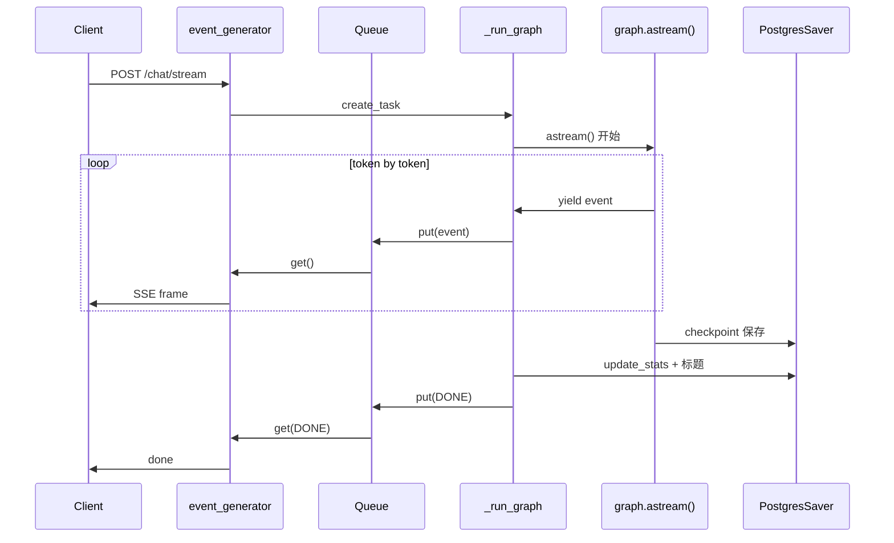
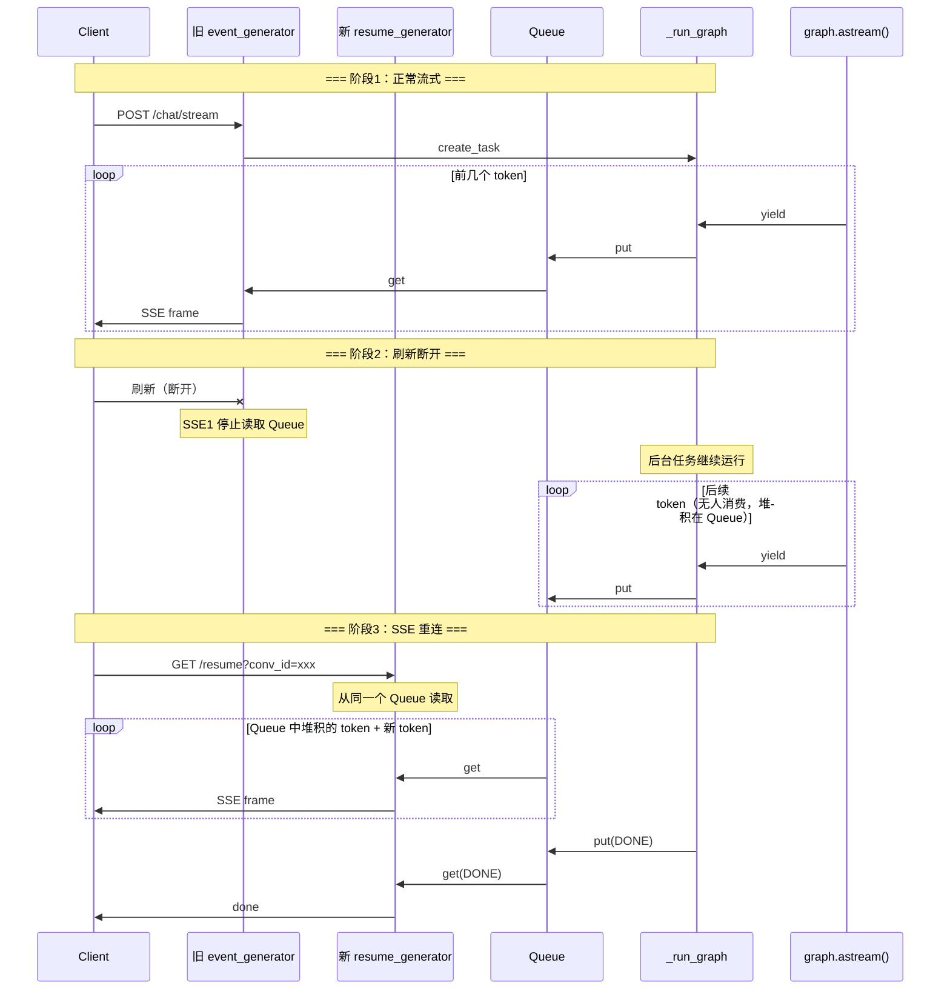
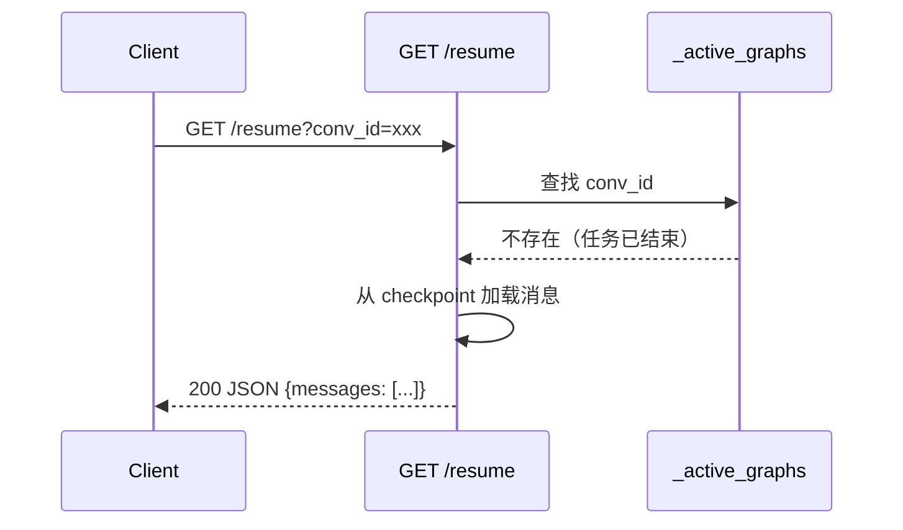
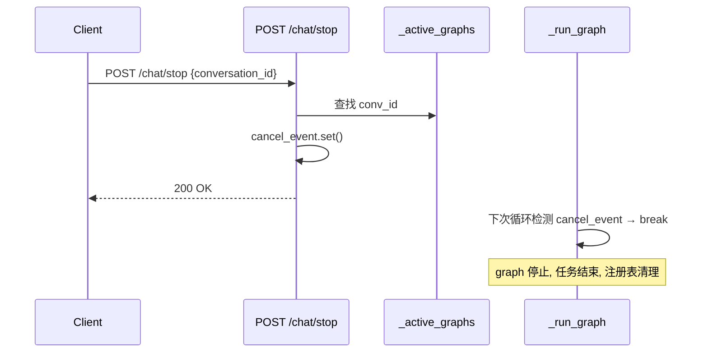

# SSE 断连恢复 — 后端设计报告

> 关联分析：[SSE 断连恢复 分析 v2.0](2026-06-03--sse-decouple.md)

## 1. 目标

- 客户端 SSE 断裂后，graph 推理继续完成
- 前端可通过 SSE 重连接续接收 token（流式体验）
- 用户点击停止可取消推理
- 断连后统计和标题仍正常更新

## 2. 现状分析

### 当前架构（问题）

```
POST /chat/stream
  → event_generator()
    → async for event in graph.astream()   ← graph 绑定在 SSE generator 上
      → yield SSE frame
```

客户端断开 → generator 链被清理 → graph.astream() 被取消 → LLM 推理中断。

### 目标架构

```
POST /chat/stream
  → asyncio.create_task(_run_graph)        ← graph 在独立后台任务中运行
  → event_generator()                      ← SSE 从 Queue 读取
    → queue.get() → yield SSE frame

GET /chat/stream/resume
  → resume_generator()                     ← 新 SSE 连接从同一个 Queue 读取
    → queue.get() → yield SSE frame

POST /chat/stop
  → cancel_event.set()                     ← 通知后台任务停止
```

## 3. 核心流程

### 3.1 正常对话（无变化）



### 3.2 刷新后 SSE 重连



### 3.3 刷新时 graph 已完成



### 3.4 用户点击停止



## 4. 项目结构与技术决策

### 改动文件

```
backend/app/chat/
└── stream_router.py    ← 主要改动（后台任务 + 重连 + 停止）

backend/app/chat/
└── schemas.py          ← 新增 StopRequest schema

frontend/src/chat/
├── controller.ts       ← 移除轮询, 新增 SSE 重连
├── use-chat-stream.ts  ← 新增 resumeStream + stop 调用
```

### 技术决策

| 决策 | 方案 | 理由 |
|------|------|------|
| 后台任务 | `asyncio.create_task()` | 轻量，事件循环管理，无需外部队列 |
| 事件传递 | `asyncio.Queue(maxsize=0)` | 无限大小，后台任务 put 永不阻塞 |
| 任务注册 | `_active_graphs: dict[str, GraphTaskInfo]` | 模块级字典，resume/stop 查询用 |
| 取消机制 | `asyncio.Event` per conversation | 后台任务在事件边界检查，非强取消 |
| 超时保护 | `asyncio.timeout(300)` | 5 分钟硬上限，防止挂死 |
| 重连端点 | `GET /chat/stream/resume` | GET 语义（获取数据），SSE 响应 |
| 已完成时重连 | 返回 JSON | 直接返回 checkpoint 消息，避免多余 SSE |

### 关键数据结构

```python
@dataclass
class GraphTaskInfo:
    queue: asyncio.Queue          # 事件队列
    cancel_event: asyncio.Event   # 停止信号
    task: asyncio.Task            # 后台任务引用

_GRAPH_DONE = object()   # sentinel
_GRAPH_ERROR = object()  # sentinel

_active_graphs: dict[str, GraphTaskInfo] = {}
```

### 关键代码骨架

#### _run_graph 后台任务

```python
async def _run_graph(graph, input_state, config, queue, cancel_event,
                     db, conversation_id, user, question, is_new, app_state):
    """后台任务：迭代 graph.astream()，put 事件到 queue"""
    try:
        async with asyncio.timeout(300):  # 5 分钟硬上限
            async for event in graph.astream(input_state, config=config, stream_mode=["updates", "messages"]):
                if cancel_event.is_set():
                    logger.info(f"[stream] cancelled by user: {conversation_id}")
                    break
                await queue.put(event)
    except TimeoutError:
        logger.warning(f"[stream] graph timeout: {conversation_id}")
    except Exception as e:
        logger.error(f"[stream] graph error: {e}", exc_info=True)
        await queue.put(_GRAPH_ERROR)
        return
    else:
        await queue.put(_GRAPH_DONE)

    # 完成后更新统计和标题（仅非取消）
    if not cancel_event.is_set():
        try:
            await ConversationRepo.update_message_stats(db, conversation_id)
            await db.commit()
        except Exception as e:
            logger.warning(f"[stream] update_message_stats failed: {e}")

        if is_new:
            try:
                title = await app_state.generator.generate_title(question)
                if title:
                    await ConversationRepo.update(db, conversation_id, user.user_id, title=title)
                    await db.commit()
            except Exception as e:
                logger.warning(f"[stream] title generation failed: {e}")
    finally:
        _active_graphs.pop(conversation_id, None)
```

#### stream_chat 改造

```python
@router.post("/chat/stream")
async def stream_chat(...):
    ...  # 校验 + 创建对话（不变）

    queue = asyncio.Queue()
    cancel_event = asyncio.Event()
    task_info = GraphTaskInfo(queue=queue, cancel_event=cancel_event, task=None)
    _active_graphs[conversation_id] = task_info

    task = asyncio.create_task(_run_graph(graph, input_state, config, queue, cancel_event,
                                          db, conversation_id, user, body.question,
                                          is_new_conversation, http_request.app.state))
    task_info.task = task

    async def event_generator():
        try:
            yield _sse_frame("init", {"conversation_id": conversation_id})
            while True:
                if await http_request.is_disconnected():
                    return
                try:
                    event = await asyncio.wait_for(queue.get(), timeout=5.0)
                except asyncio.TimeoutError:
                    continue
                if event is _GRAPH_DONE:
                    yield "event: done\ndata: null\n\n"
                    return
                elif event is _GRAPH_ERROR:
                    yield _sse_frame("error", make_error(ChatErrorCode.INTERNAL_ERROR))
                    return
                async for frame in _map_event_to_sse(event, http_request):
                    yield frame
        except Exception as e:
            logger.error(f"SSE stream error: {e}", exc_info=True)

    return StreamingResponse(event_generator(), media_type="text/event-stream")
```

#### resume_stream 重连端点

```python
@router.get("/chat/stream/resume")
async def resume_stream(
    conversation_id: str = Query(...),
    http_request: Request = None,
    checkpointer=Depends(get_checkpointer),
    db: AsyncSession = Depends(get_db),
    user: UserContext = Depends(get_current_user),
):
    """恢复断开的 SSE 流"""
    # 归属校验
    conv = await ConversationRepo.get_by_id(db, conversation_id, user.user_id)
    if not conv:
        return JSONResponse(status_code=404, content=make_conversation_error(ConversationErrorCode.NOT_FOUND))

    task_info = _active_graphs.get(conversation_id)

    if task_info is None:
        # 后台任务已完成，从 checkpoint 返回完整消息
        messages = await _load_conversation_by_id(checkpointer, conversation_id, user.user_id)
        if not messages:
            return Response(status_code=204)
        api_messages = [_to_api_message(msg, idx) for idx, msg in enumerate(messages)]
        return JSONResponse({"conversation_id": conversation_id, "messages": [m.model_dump() for m in api_messages]})

    # 后台任务仍在运行，通过 SSE 推送
    async def resume_generator():
        try:
            yield _sse_frame("init", {"conversation_id": conversation_id})
            while True:
                if await http_request.is_disconnected():
                    return
                try:
                    event = await asyncio.wait_for(task_info.queue.get(), timeout=5.0)
                except asyncio.TimeoutError:
                    continue
                if event is _GRAPH_DONE:
                    yield "event: done\ndata: null\n\n"
                    return
                elif event is _GRAPH_ERROR:
                    yield _sse_frame("error", make_error(ChatErrorCode.INTERNAL_ERROR))
                    return
                async for frame in _map_event_to_sse(event, http_request):
                    yield frame
        except Exception as e:
            logger.error(f"Resume stream error: {e}", exc_info=True)
            yield _sse_frame("error", make_error(ChatErrorCode.INTERNAL_ERROR))

    return StreamingResponse(resume_generator(), media_type="text/event-stream")
```

#### stop_chat 停止端点

```python
@router.post("/chat/stop")
async def stop_chat(
    body: StopRequest,
    user: UserContext = Depends(get_current_user),
):
    """停止正在进行的 graph 推理"""
    task_info = _active_graphs.get(body.conversation_id)
    if task_info:
        task_info.cancel_event.set()
    return JSONResponse({"status": "ok"})
```

## 5. 验收标准

| 验收条件 | 验收方式 |
|----------|----------|
| graph.astream() 在后台任务中执行 | 代码审查 |
| SSE 断开后 graph 继续运行 | E2E 测试 |
| GET /resume 返回 SSE 流（任务运行中） | E2E 测试 |
| GET /resume 返回 JSON（任务已完成） | E2E 测试 |
| POST /stop 取消推理 | E2E 测试 |
| 断连后 update_message_stats 执行 | 单元测试 |
| 断连后标题生成执行 | 单元测试 |
| 正常对话不受影响 | E2E 回归测试 |
| 前端移除轮询，改用 SSE 重连 | 代码审查 |
| 前端停止按钮调 POST /stop | 代码审查 |

## 6. 暂不实现

| 功能 | 理由 |
|------|------|
| 后台任务限流 | 单用户场景 |
| 断线自动重连（网络抖动） | 只处理刷新场景 |
| 重连时回放已发送的 token | 刷新后页面重建，从当前状态继续即可 |
