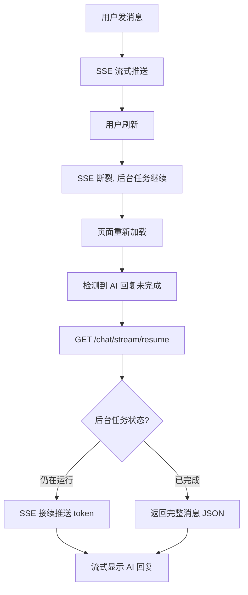

# SSE 断连恢复 — 解耦 Graph 执行 + SSE 重连

## 概述

用户发消息后刷新页面，AI 回复丢失。根因是 `graph.astream()` 绑定在 SSE generator 生命周期上，客户端断开时 graph 被取消。

R011 期间实现了轮询作为临时方案，但未经正式设计评审。轮询有 3 秒延迟、浪费无效请求、用户体验差（不是流式输出）。

本需求系统性修复：后端解耦 graph 执行到独立后台任务，前端通过 SSE 重连接续接收 token。体验与不刷新一致。

## 一、交互链

### 场景 1：发消息后刷新 → SSE 重连 → 流式继续（修复后）

**用户故事**：作为已登录用户，我想在发消息后刷新页面时看到 AI 继续流式输出，与没刷新一样。

1. 用户在 /chat 发消息，AI 开始流式输出
2. 用户按 F5 刷新，SSE 断裂
3. 页面重新加载，前端检测到"AI 回复未完成"
4. 前端发起 SSE 重连：`GET /chat/stream/resume?conversation_id=xxx`
5. 后端检测到后台任务仍在运行，通过 SSE 推送剩余 token
6. 前端继续流式显示 AI 回复，与未断开体验一致

### 场景 2：用户点击停止 → 推理取消

**用户故事**：作为已登录用户，我点击停止后 LLM 应停止推理，不浪费资源。

1. 用户发消息，AI 开始推理
2. 用户点击"停止"按钮
3. 前端调用 `POST /chat/stop` 发送停止信号
4. 后端后台任务收到信号，停止 graph 执行
5. 前端显示"已停止"

### 场景 3：发消息后正常等待（无变化）

1. 用户发消息，SSE 流式推送正常
2. AI 回复逐 token 显示，体验不变

### 场景 4：刷新时 graph 已完成

1. 用户发消息 → AI 回复完成
2. 用户刷新页面
3. 前端加载消息 → AI 回复已在 checkpoint 中 → 正常显示，无需重连

## 二、逻辑树

### 事件流：刷新后 SSE 重连

| 时刻 | 事件 | 处理 | 产生的新事件 |
|------|------|------|-------------|
| T0 | POST /chat/stream | 创建 Queue + 后台任务 + SSE generator | → graph.astream() 在后台运行 |
| T1 | SSE 推送 token | 后台任务 put → SSE get → yield | → 客户端收到 token |
| T2 | 客户端刷新 | SSE generator 停止读取 Queue | → 后台任务继续 put（Queue 堆积） |
| T3 | 页面重新加载 | GET /conversations/current | → 检测到 AI 回复未完成 |
| T4 | GET /chat/stream/resume | 后端检测到活跃后台任务 | → 新 SSE generator 读取 Queue |
| T5 | Queue 中堆积的 token | 新 SSE generator 逐个 yield | → 客户端收到堆积 token（瞬时） |
| T6 | 后台任务继续产生新 token | put 到 Queue → SSE yield | → 客户端继续流式接收 |
| T7 | graph 完成 | DONE sentinel → SSE done | → 前端标记完成 |
| T8 | 后台任务收尾 | update_message_stats + 标题生成 | → 数据一致 |

### 事件流：停止按钮

| 时刻 | 事件 | 处理 | 产生的新事件 |
|------|------|------|-------------|
| T0 | 用户点击停止 | 前端调 POST /chat/stop | → cancel_event.set() |
| T1 | 后台任务检测到 cancel | break 退出 graph.astream() | → graph 执行停止 |
| T2 | 前端 abort SSE | AbortController.abort() | → SSE generator 停止 |

### 状态流转

| 实体 | 触发事件 | 前状态 | 后状态 |
|------|---------|--------|--------|
| _active_graphs[conv_id] | POST /chat/stream 开始 | 不存在 | {queue, cancel_event, task} |
| _active_graphs[conv_id] | 后台任务完成 | 存在 | 已移除 |
| _active_graphs[conv_id] | POST /chat/stop | 存在 | cancel_event=set, 任务退出后移除 |
| SSE 连接 | 客户端刷新 | 已连接 | 断开（后台任务不受影响） |
| SSE 重连 | GET /resume | 无 | 从 Queue 读取事件 |

**异常回退**：
- 重连时后台任务已完成 → 返回 checkpoint 中的完整消息（JSON）
- 重连时后台任务异常 → 返回 error SSE 事件
- 后台任务超时（5分钟）→ 强制取消，清理注册表

## 三、功能编号与网络定位

### 本次新增节点

| 编号 | 功能节点 | 前缀含义 | 简介 |
|------|---------|---------|------|
| BB001 | Graph 后台执行 | 后端业务 | graph.astream() 解耦到 asyncio.Task，注册到 _active_graphs |
| BB002 | SSE 重连端点 | 后端业务 | GET /chat/stream/resume 接续推送剩余事件 |
| BB003 | 停止信号端点 | 后端业务 | POST /chat/stop 设置 cancel_event |
| FB001 | SSE 重连前端 | 前端业务 | 刷新后检测未完成回复 → 发起 SSE 重连 |
| FB002 | 停止按钮适配 | 前端业务 | 停止前调 POST /chat/stop |

### 前置依赖

| 依赖节点 | 依赖方式 | 是否已有 |
|----------|---------|---------|
| PostgresSaver checkpoint | graph 自动保存 | 已有 |
| GET /conversations/current | 前端加载消息 | 已有 |
| SSE 事件解析 (useChatStream) | 重连复用解析逻辑 | 已有 |
| 前端轮询机制 | 替换为 SSE 重连 | 已有（将移除） |

### 边界接口

| 接口/协议 | 定义方 | 消费方 | 敏感度 |
|-----------|--------|--------|--------|
| GET /chat/stream/resume | stream_router.py | 前端 controller | 中（需要 auth） |
| POST /chat/stop | stream_router.py | 前端 use-chat-stream | 中（需要 auth） |
| _active_graphs 注册表 | stream_router.py 模块级 | BB001/BB002/BB003 共享 | 低（进程内） |

## 四、结论

- **开发顺序**：先后端 BB001 → BB002 → BB003，再前端 FB001 → FB002
- **复杂度**：中。核心改动在 stream_router.py（后台任务 + 重连端点 + 停止端点），前端改动在 controller.ts + use-chat-stream.ts（SSE 重连 + 停止适配）
- **移除轮询**：FB001 实现后，移除 controller.ts 中的 polling useEffect、POLLING_PLACEHOLDER_PREFIX、needsPollingPlaceholder、withPollingPlaceholder
- **暂不实现**
  - 后台任务限流/限并发（单用户）
  - 重连认证复用（直接用 Bearer token）
  - 断线自动重连（只处理刷新场景，不处理网络抖动）
