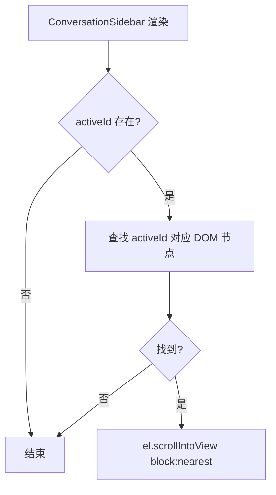
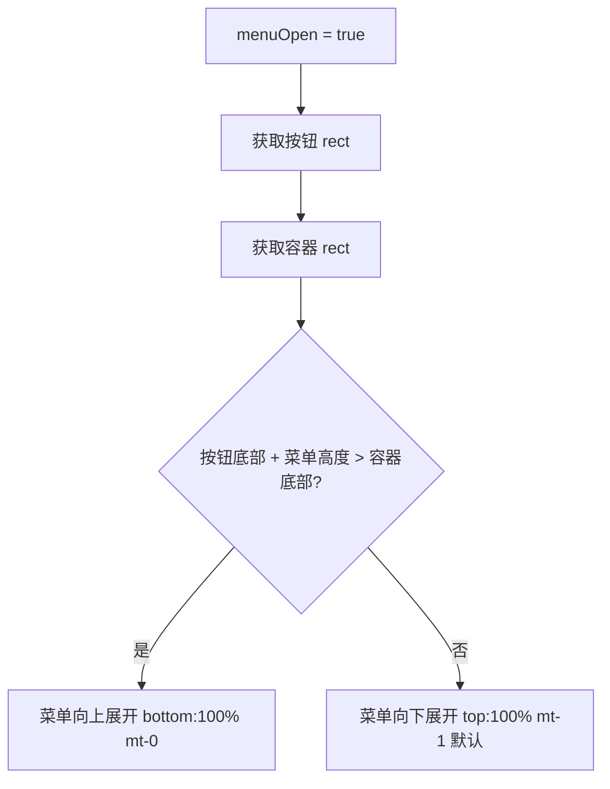

# 侧边栏体验修复 — 前端设计

## 1. 目标

- 刷新页面后，侧边栏自动滚动到当前选中的对话项，保持用户上下文
- 三点操作菜单根据对话项位置自动向上/向下展开，不被容器裁剪

## 2. 现状分析

### 已有基础设施

- `ConversationSidebar`：`scrollRef` 已持有滚动容器 DOM 引用，`overflow-y-auto` 容器
- `ConversationItemCard`：`menuOpen` state 控制菜单显隐，`absolute right-0 mt-1` 定位
- `activeId`：`sessionStorage` 持久化，ConversationProvider 初始化时读取

### 问题

1. **scrollIntoView 缺失**：activeId 恢复后，侧边栏 scrollTop 始终为 0，无逻辑将选中项滚入可视区域
2. **菜单溢出**：`absolute` 定位 + 容器 `overflow-y-auto`，底部项菜单被裁剪

## 3. 数据模型与接口

无新增数据模型，纯行为修改。

### 关键 DOM 结构（现有）

```
ConversationSidebar
  └─ div[ref=scrollRef, overflow-y-auto]  ← 滚动容器
       ├─ pinnedItems → ConversationItemCard[]
       └─ normalItems → ConversationItemCard[]
            └─ div[relative]  ← 菜单锚点
                 ├─ button (三点)
                 └─ div[absolute right-0 mt-1]  ← 菜单面板
```

## 4. 核心流程

### FF001：scrollIntoView



实现方式：给每个 `ConversationItemCard` 传 `activeId`，内部用 `useEffect` + `ref` 在 `isActive` 首次变为 true 时调用 `scrollIntoView({ block: 'nearest', behavior: 'instant' })`。

| 决策 | 方案 | 理由 |
|------|------|------|
| scrollIntoView 位置 | `block: 'nearest'` | 不强制居中，只确保可见，避免跳动 |
| scrollIntoView 时机 | activeId 变化后 useEffect | 不在渲染中同步调用，避免布局抖动 |
| scroll 行为 | `behavior: 'instant'` | 初始化时不要动画，切换对话时用 smooth |

**切换对话时的 smooth 滚动**：用户点击切换时，`behavior: 'smooth'` 提供更好的体验感。初始化时 `instant` 避免页面加载时的滚动动画。

### FF002：菜单碰撞检测



实现方式：菜单打开时用 `useRef` + `useLayoutEffect` 计算按钮相对于滚动容器的位置，决定向上还是向下。

| 决策 | 方案 | 理由 |
|------|------|------|
| 检测方式 | `getBoundingClientRect` 对比按钮和容器 | 精确可靠，无依赖 |
| 状态 | `menuDirection: 'down' \| 'up'` state | 控制菜单 className |
| 菜单高度 | 固定 3 项 ≈ 120px | 菜单项数固定，硬编码阈值即可 |
| 检测时机 | `useLayoutEffect` 在 menuOpen 变化时 | 在浏览器 paint 前计算，避免闪烁 |

**菜单 CSS 变体**：

向下（默认）：
```
absolute right-0 top-full mt-1
```

向上：
```
absolute right-0 bottom-full mb-1
```

## 5. 项目结构与技术决策

### 改动文件

| 文件 | 改动 | 说明 |
|------|------|------|
| `frontend/src/components/conversation-sidebar.tsx` | 无改动 | scrollIntoView 逻辑在 ItemCard 内部 |
| `frontend/src/components/conversation-item-card.tsx` | 修改 | 添加 scrollIntoView + 菜单碰撞检测 |

### 职责划分

- `ConversationItemCard` 负责自己的 scrollIntoView（知道自己是否 active）和菜单定位
- `ConversationSidebar` 不需要改动，滚动容器已有 `scrollRef`

### 技术决策

| 决策 | 方案 | 理由 |
|------|------|------|
| 不引入 Popover 组件 | 自己用 getBoundingClientRect 计算 | 项目已有 @base-ui/react Popover 但它解决的是更复杂的场景，此处只需判断上/下方向，3 行逻辑即可 |
| 不用 Portal | 菜单保持在 DOM 原位 | 菜单被 `overflow-y-auto` 裁剪是定位方向问题，不是 z-index 问题。改为向上展开即可解决 |
| scrollIntoView vs scrollRef.scrollTo | scrollIntoView | 原生 API，不需要跨组件传递 scrollRef |

## 6. 验收标准

| 验收条件 | 验收方式 |
|----------|----------|
| 刷新后选中项在可视区域内 | 手动验证：选中底部对话 → F5 → 看到高亮项可见 |
| 切换对话后侧边栏滚动到目标 | 手动验证：点击视口外的对话项 → 列表滚动到该项 |
| 底部对话项菜单向上展开 | 手动验证：滚动到底部 → 点击三点 → 菜单完整可见 |
| 顶部对话项菜单向下展开 | 手动验证：列表顶部 → 点击三点 → 菜单正常向下 |
| 现有测试全部通过 | `npm test` |

## 7. 暂不实现

| 功能 | 理由 |
|------|------|
| sessionStorage → localStorage | 刷新保持是 session 级需求，关闭标签页后从最新对话开始是合理的 |
| 菜单左右碰撞检测 | 侧边栏宽度固定 w-64，菜单 w-36 不会溢出 |
| Portals 方案 | 不需要，向上展开即可解决裁剪问题 |
