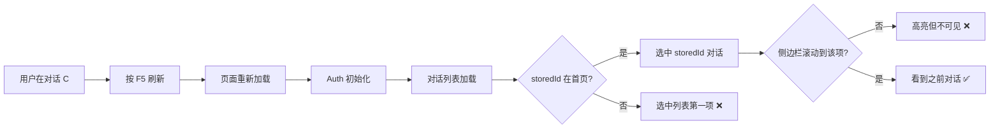
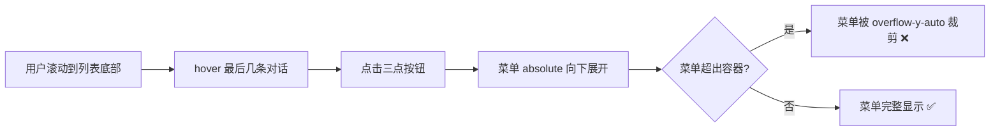

# 侧边栏体验修复 — 刷新选中恢复 + 菜单溢出

## 概述

两个独立的侧边栏体验问题：1）刷新页面后原来选中的对话被重置；2）三点操作菜单始终向下展开，当对话项位于列表底部时菜单被裁剪不可见。两者都是纯前端问题，不涉及后端改动。

## 一、交互链

### 场景 1：刷新后恢复选中对话

**用户故事**：作为用户，我想刷新页面后继续看到之前正在查看的对话，以便无缝恢复工作。

**当前行为**：
1. 刷新 → `getStoredActiveId()` 从 `sessionStorage` 读取 ID
2. 加载首页 20 条对话 → 检查 `storedId` 是否在其中
3. 若不在 → 退回选第一项（用户感知为"选中被重置"）
4. 若在 → activeId 正确，但侧边栏 scroll 位置在顶部，若选项不在可视区域则看不到高亮

### 场景 2：底部对话项的操作菜单被裁剪

**用户故事**：作为用户，我想点击任何对话的三点菜单都能完整看到所有选项，以便执行重命名/置顶/删除操作。

**当前行为**：
- 菜单定位：`absolute right-0 mt-1`，始终向下展开
- 容器：`overflow-y-auto` 裁剪溢出内容
- 对话项在列表下半部分时，菜单向下展开超出容器可视区域，部分或全部菜单项被裁剪

## 二、逻辑树

### 事件流：刷新恢复

| 时刻 | 事件 | 处理 | 产生的新事件 |
|------|------|------|-------------|
| T1 | 页面加载 | `sessionStorage.getItem('octotutor_active_conversation_id')` | 初始 state.activeId = storedId |
| T2 | Auth SDK 初始化完成 | `isInitialized = true` | 触发 ConversationProvider useEffect |
| T3 | useEffect 触发 | `fetchConversationList(undefined, 20)` | API 请求 |
| T4 | API 返回首页数据 | INIT_LIST dispatch + SET_ACTIVE 检查 | activeId = storedId（若在首页）/ items[0].id（若不在） |
| T5 | controller useEffect 触发 | `loadConversation(activeId)` | 加载消息 |
| — | **缺失** | **无 scrollIntoView** | **侧边栏不滚动到选中项** |

### 事件流：菜单定位

| 时刻 | 事件 | 处理 | 产生的新事件 |
|------|------|------|-------------|
| T1 | hover 对话项 | CSS opacity transition → 三点按钮可见 | — |
| T2 | 点击三点按钮 | `setMenuOpen(true)` | 渲染 absolute 菜单 |
| T3 | React 渲染菜单 | CSS `absolute right-0 mt-1` | 菜单始终在按钮下方 |
| — | **缺失** | **无碰撞检测** | **不判断是否超出可视区域** |

### 状态流转

| 实体 | 触发事件 | 前状态 | 后状态 |
|------|---------|--------|--------|
| activeId | T4 SET_ACTIVE | sessionStorage 值 | storedId（命中）/ items[0].id（未命中） |
| sidebar scroll | T4 | 初始 scrollTop=0 | scrollTop=0（**无恢复，无 scrollIntoView**） |
| menuOpen | 点击三点 | false | true（菜单渲染在 absolute 位置） |
| 菜单可见性 | T3 渲染 | — | 取决于对话项在列表中的位置（底部 → 被裁剪） |

### 根因分析

**问题 1 根因**：两个子问题叠加
1. **ID 恢复失败**：后端按 `updated_at DESC` 排序返回首页 20 条，若活跃对话较旧不在首页 → activeId 被重置为第一项
2. **滚动位置丢失**：即使 activeId 正确，侧边栏 `scrollTop` 始终为 0，无 `scrollIntoView` 逻辑

**问题 2 根因**：纯 CSS `absolute` 定位，无 JS 动态计算方向。需根据按钮在容器中的位置决定向上还是向下展开。

## 三、功能编号与网络定位

### 本次新增节点

| 编号 | 功能节点 | 前缀含义 | 简介 |
|------|---------|---------|------|
| FF001 | 选中项 scrollIntoView | 前端基础 | 侧边栏列表初始化/切换后自动滚动到 activeItem |
| FF002 | 菜单碰撞检测 | 前端基础 | 三点菜单根据位置自动向上/向下展开，防止溢出裁剪 |

### 前置依赖

| 依赖节点 | 依赖方式 | 是否已有 |
|----------|---------|---------|
| ConversationSidebar | 修改 scrollIntoView 逻辑 | ✅ 已有 |
| ConversationItemCard | 修改菜单定位逻辑 | ✅ 已有 |
| ConversationProvider | activeId 恢复逻辑 | ✅ 已有 |

### 边界接口

| 接口/协议 | 定义方 | 消费方 | 敏感度 |
|-----------|--------|--------|--------|
| scrollIntoView API | 浏览器 | ConversationSidebar | 低 |
| getBoundingClientRect | 浏览器 | ConversationItemCard | 低 |

## 四、结论

- **开发顺序**：FF001 先做（刷新体验），FF002 后做（菜单定位）
- **复杂度**：FF001 简单（加 useEffect + scrollIntoView），FF002 中等（需碰撞检测计算）
- **暂不实现**：
  - sessionStorage 改 localStorage（刷新保持是 session 级别的需求，sessionStorage 合理；关闭标签页后重新打开选第一个是合理的）
  - 虚拟滚动（当前 20 条分页足够，性能不是瓶颈）
