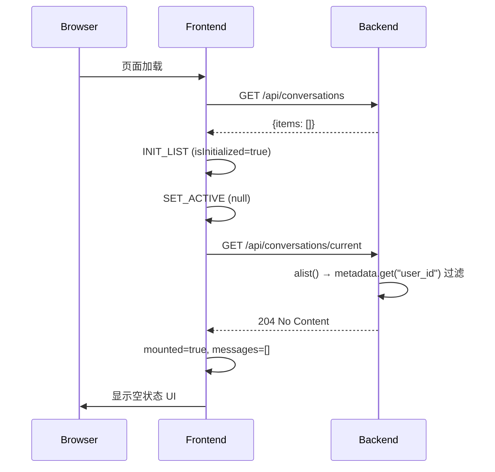
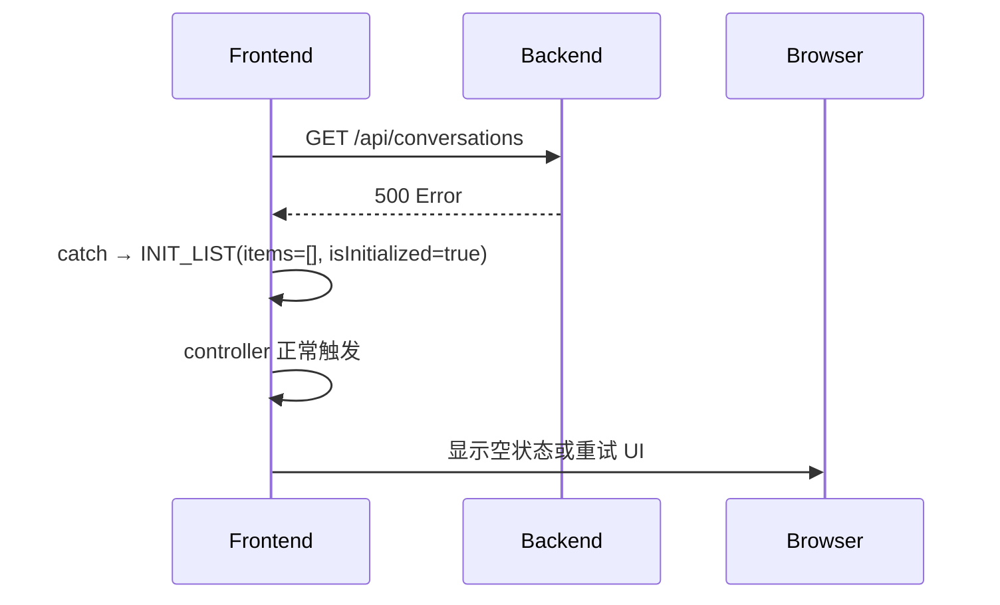

# 对话安全与初始化修复 — 设计报告

## 1. 目标

- 修复后端 checkpoint 归属校验：从 `config` 读 `user_id` 改为从 `metadata` 读
- 修复前端 catch 块未推进 `isInitialized` 状态
- 前端增加加载失败的错误状态 UI

## 2. 现状分析

### 后端

LangGraph PostgresSaver 的 `alist()` 返回 `CheckpointTuple`：
- `tuple_item.config["configurable"]` 只包含 `thread_id`
- `tuple_item.metadata` 包含 `user_id` 等额外字段

3 处代码从 `config` 读 `user_id`，永远得到 `None`，导致：
- `_load_from_postgres_saver`：遍历所有用户的 checkpoint，无过滤
- `load_conversation_by_id`：归属校验失效，任何用户可加载任何对话
- `extract_latest_messages`：MemorySaver 路径，meta 结构不同，暂不影响

### 前端

- `conversation-context.tsx:88-92`：catch 块只 dispatch `SET_LOADING: false`，不设 `isInitialized: true`
- `chat-ui.tsx:32-38`：`!mounted` 时只显示"加载中..."，无错误/重试状态

## 3. 数据模型与接口

无新增数据模型或接口。只修改已有接口的行为。

### 接口行为变更

| 接口 | 变更前 | 变更后 |
|------|--------|--------|
| `GET /api/conversations/current` | 无 conversation_id 时可能返回他人数据 | 严格按 user_id 过滤，无匹配返回 204 |
| `GET /api/conversations/current?conversation_id=xxx` | 归属校验失效 | 正确校验 user_id 归属 |

## 4. 核心流程

### 修复后：新用户首次访问



### 修复后：API 失败容错



## 5. 项目结构与技术决策

### 改动文件清单

| 文件 | 改动类型 | 改动内容 |
|------|---------|---------|
| `backend/app/chat/conversation_router.py:112` | 修改 | `config` → `metadata` 读 user_id |
| `backend/app/chat/conversation_utils.py:59` | 修改 | `config` → `metadata` 读 user_id |
| `frontend/src/contexts/conversation-context.tsx:88-92` | 修改 | catch 块 dispatch INIT_LIST |
| `frontend/src/components/chat-ui.tsx` | 修改 | 新增 error 状态 + 重试按钮 |

### 技术决策

| 决策 | 方案 | 理由 |
|------|------|------|
| user_id 读取来源 | `tuple_item.metadata.get("user_id")` | LangGraph PostgresSaver 将额外 configurable 字段存入 metadata |
| catch 块修复策略 | dispatch INIT_LIST with empty items | 保持状态机完整推进，避免 isInitialized 卡在 false |
| 错误 UI 方案 | chat-ui 新增 error 状态分支 | 与现有 loading/success 状态并列 |

### metadata 字段验证

需确认 `tuple_item.metadata` 中 `user_id` 的确切 key 和格式。根据 `stream_router.py:174-179` 保存时的 config：

```python
config = {"configurable": {"thread_id": conversation_id, "user_id": user.user_id}}
```

LangGraph 将 configurable 中的非核心字段提升到 metadata，key 保持不变为 `user_id`。需通过测试或日志确认实际 key。

## 6. 验收标准

| 验收条件 | 验收方式 |
|----------|----------|
| 新用户 GET /conversations/current 返回 204 | API 测试 |
| 用户 A 无法获取用户 B 的对话消息 | API 测试（用两个用户 token 分别请求） |
| 前端 catch 后 isInitialized 推进为 true | 前端单元测试 |
| 加载失败显示错误提示 + 重试按钮 | 手动验证（模拟 API 失败） |
| 已有对话功能不受影响 | 回归测试 |

## 7. 暂不实现

| 功能 | 理由 |
|------|------|
| 列表为空时跳过 loadConversation 调用 | 优化项，非 bug 修复范围 |
| sessionStorage 改 localStorage | 非本次需求 |
| 邮箱验证（auth-center） | 外部项目，记录 backlog |
