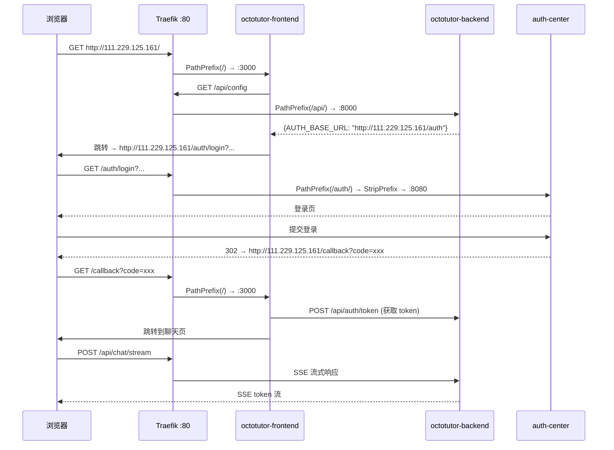

# IP 直连改造 — 设计报告

## 1. 目标

- 将线上部署从域名（`octotutor.xiaolutang.top`）切换到 IP 直连（`http://111.229.125.161`）
- 去掉 TLS/HTTPS，使用 HTTP 直连
- 去掉 Traefik `Host()` 路由规则，改用纯 PathPrefix 路由
- 确保 OAuth 登录和 SSE 聊天在 IP 直连模式下正常工作

## 2. 现状分析

### 已有能力

- 本地部署（`docker-compose.local.yml`）已经使用 HTTP + `web` entrypoint + 无 TLS 模式运行
- 前端 API 请求全部使用相对路径 `/api`，自动跟随 origin，无域名硬编码
- OAuth 回调地址动态生成：`window.location.origin + "/callback"`
- SSE 聊天通过相对路径 `/chat/stream` 请求，与域名无关

### 当前线上配置问题

| 问题 | 现状 | 目标 |
|------|------|------|
| 域名依赖 | `Host(octotutor.xiaolutang.top)` | 去掉域名 |
| TLS 依赖 | `websecure` + `tls.certresolver=ali` | 去掉 TLS，改用 HTTP |
| AUTH_BASE_URL | `https://auth.xiaolutang.top` | `http://111.229.125.161/auth` |

### 路由对比

**现状**（按域名区分）：

```
octotutor.xiaolutang.top:443/api/* → OctoTutor 后端 (priority=10)
octotutor.xiaolutang.top:443/*     → OctoTutor 前端 (priority=1)
auth.xiaolutang.top:443/*          → auth-center
```

**目标**（按 PathPrefix 区分，同 IP:80）：

```
111.229.125.161:80/auth/* → auth-center (priority=20，xlfoundryTest 项目配置)
111.229.125.161:80/api/*  → OctoTutor 后端 (priority=10)
111.229.125.161:80/*      → OctoTutor 前端 (priority=1)
```

## 3. 核心流程

### 3.1 用户访问全链路（IP 模式）



### 3.2 异常路径

| 场景 | 表现 | 原因 | 处理 |
|------|------|------|------|
| auth-center 未配置 `/auth` PathPrefix | 登录页 404 或返回 OctoTutor 前端 | OctoTutor 前端兜底路由接走了 `/auth/*` 请求 | xlfoundryTest 项目需同步配置 auth-center 的 Traefik labels |
| auth-center 回调白名单未更新 | OAuth 回调被拒绝，用户看到错误页 | auth-center 不认识 `http://111.229.125.161/callback` | auth-center 管理后台添加回调地址 |
| auth-center 不支持 base path | 静态资源 404、重定向丢失前缀 | auth-center 内部链接没有 `/auth` 前缀 | auth-center 需配置 `root_path="/auth"` |

## 4. 项目结构与技术决策

### 4.1 改动文件清单

```
deploy/
├── docker-compose.yml        # ← 改：Traefik labels 去 Host + 去 TLS
├── .remote.env               # ← 改：AUTH_BASE_URL 改为 IP + /auth
├── .remote.env.example       # ← 改：注释说明更新
└── setup-env.sh              # ← 改：AUTH_BASE_URL 默认值改为 IP + /auth
```

前端/后端代码零改动。

### 4.2 docker-compose.yml 具体改动

**前端 octotutor-frontend labels 变更**：

| Label | 改前 | 改后 |
|-------|------|------|
| `rule` | `Host(\`${OCTOTUTOR_DOMAIN:-octotutor.xiaolutang.top}\`)` | `PathPrefix(\`/\`)` |
| `entrypoints` | `websecure` | `web` |
| `tls` | `true` | 删除 |
| `tls.certresolver` | `ali` | 删除 |
| `priority` | `1` | `1`（不变） |

**后端 octotutor-backend labels 变更**：

| Label | 改前 | 改后 |
|-------|------|------|
| `rule` | `Host(\`${OCTOTUTOR_DOMAIN}\`) && PathPrefix(\`/api/\`)` | `PathPrefix(\`/api/\`)` |
| `entrypoints` | `websecure` | `web` |
| `tls` | `true` | 删除 |
| `tls.certresolver` | `ali` | 删除 |
| `priority` | `10` | `10`（不变） |

**.remote.env 变更**：

| 变量 | 改前 | 改后 |
|------|------|------|
| `AUTH_BASE_URL` | `https://auth.xiaolutang.top` | `http://111.229.125.161/auth` |

### 4.3 技术决策

| 决策 | 方案 | 理由 |
|------|------|------|
| 去掉 Host() 约束 | 纯 PathPrefix 路由 | 无域名可用，IP 直连不需要 Host 匹配 |
| 不用端口分离 | PathPrefix(/auth/) 区分 auth-center | 不需要改 Traefik 静态配置，只需 labels |
| 去掉 TLS | HTTP 直连 | 无域名无法签发合法证书，HTTP 对内网/IP 场景足够 |
| 前端/后端代码不改 | 依赖已有的相对路径和动态回调 | 分析确认所有路径都是相对的，无需任何代码改动 |

### 4.4 不变部分

- `docker-compose.local.yml`：本地部署不受影响，保持 `Host(octotutor.localhost)` + `web` 不变
- 前端代码：`api-client.ts`、`auth-context.tsx`、`use-chat-stream.ts` 均无需改动
- 后端代码：所有 API 路由、SSE 端点、JWT 验证均无需改动

## 5. 验收标准

| 验收条件 | 验收方式 |
|----------|----------|
| `docker-compose.yml` labels 去掉 Host、TLS、websecure | 文件 diff 检查 |
| `.remote.env` 的 AUTH_BASE_URL 指向 `http://111.229.125.161/auth` | 文件 diff 检查 |
| 部署后通过 `http://111.229.125.161` 可访问前端页面 | 手动浏览器访问 |
| 前端能获取 `/api/config` 返回正确的 AUTH_BASE_URL | 浏览器 DevTools Network 面板 |
| 点击登录跳转到 `http://111.229.125.161/auth/login` | 浏览器地址栏确认 |
| 登录成功回调到 `http://111.229.125.161/callback` 并完成认证 | 浏览器 DevTools + 页面状态 |
| SSE 聊天正常流式输出 | 发送消息验证流式响应 |

## 6. 暂不实现

| 功能 | 理由 |
|------|------|
| HTTPS / TLS 证书 | 无域名无法签发合法证书，HTTP 直连当前够用 |
| auth-center 的 `/auth` PathPrefix 配置 | 属于 xlfoundryTest 项目，不在 OctoTutor 范围内 |
| auth-center 管理后台回调白名单更新 | 属于手动运维操作，不在代码范围内 |
| auth-center `root_path="/auth"` 支持 | 属于 xlfoundryTest 项目代码改动 |
