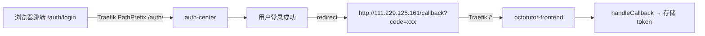
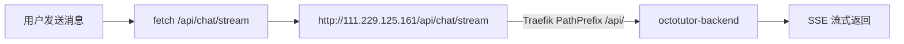

# IP 直连改造 — 功能分析

## 概述

线上部署当前依赖 `xiaolutang.top` 域名（DNS 解析 + TLS 证书），域名续费需成本。本次需求：去掉域名依赖，改为通过服务器 IP `111.229.125.161` 直接访问 OctoTutor。核心改动在 Traefik 路由规则（去 Host、改 PathPrefix）和 TLS 配置（HTTPS → HTTP），同时需确保 OAuth 登录和 SSE 聊天在 IP 直连模式下正常工作。

## 关键前提（已确认）

1. **auth-center 与 OctoTutor 在同一台服务器** `111.229.125.161`，共用同一个 Traefik 网关
2. **路由方案：PathPrefix 分离**，不用端口分离

去掉域名后，两个服务都通过同一 IP:80 访问，用 PathPrefix 区分：

| 路径 | 服务 | Traefik priority |
|------|------|-----------------|
| `/auth/*` | auth-center | 20（最高） |
| `/api/*` | OctoTutor 后端 | 10 |
| `/*` | OctoTutor 前端 | 1（兜底） |

`AUTH_BASE_URL` 改为 `http://111.229.125.161/auth`。

## 一、交互链

### 场景 1：用户通过 IP 直接访问 OctoTutor

**用户故事**：作为学生，我想通过 `http://111.229.125.161` 直接访问 OctoTutor，以便不需要域名就能使用系统。

1. 用户在浏览器输入 `http://111.229.125.161`
2. 浏览器发送 HTTP 请求到 `111.229.125.161:80`
3. Traefik 匹配 `/*`（priority=1），转发到 octotutor-frontend
4. 前端加载，调用 `/api/config` 获取 `AUTH_BASE_URL`（= `http://111.229.125.161/auth`）和 `AUTH_CLIENT_ID`
5. 前端检测未登录，调用 `login()` → 跳转到 `http://111.229.125.161/auth/...`

```mermaid
flowchart LR
    A[用户输入 http://111.229.125.161] --> B[Traefik :80]
    B -->|PathPrefix /*| C[octotutor-frontend]
    C --> D[前端加载]
    D --> E[/api/config → AUTH_BASE_URL]
    E --> F[跳转 http://111.229.125.161/auth/...]
```

### 场景 2：OAuth 登录回调（IP 模式）

**用户故事**：作为学生，我想在 auth-center 完成登录后自动回到 OctoTutor，以便无缝继续操作。

1. 浏览器跳转到 `http://111.229.125.161/auth/login?...`（auth-center 登录页）
2. Traefik 匹配 `/auth/*`（priority=20），StripPrefix 后转发到 auth-center 容器
3. 用户在 auth-center 完成登录
4. auth-center 重定向回 `redirectUri` = `http://111.229.125.161/callback`
5. Traefik 匹配 `/*`（priority=1），转发到 octotutor-frontend 的 `/callback` 页面
6. 前端处理 OAuth code，存储 token，跳转到之前的页面



### 场景 3：SSE 流式聊天（IP 模式）

**用户故事**：作为学生，我想在 IP 直连模式下正常进行流式对话，以便聊天体验不受影响。

1. 用户在聊天界面输入问题，点击发送
2. 前端通过 `fetchWithAuth('/chat/stream')` 发起 POST 请求
3. URL 拼接：`/api` + `/chat/stream` = `/api/chat/stream`（相对路径，自动跟随当前 origin）
4. 浏览器实际请求 `http://111.229.125.161/api/chat/stream`
5. Traefik 匹配 `/api/*`（priority=10），转发到后端
6. 后端返回 SSE 流，前端逐 token 读取
7. 如果断线，`resumeStream()` 请求 `http://111.229.125.161/api/chat/stream/resume`



## 二、逻辑树

### 事件流：IP 直连访问全链路

| 时刻 | 事件 | 处理 | 产生的新事件 |
|------|------|------|-------------|
| T1 | 浏览器请求 `http://111.229.125.161/` | Traefik 匹配 `/*` → frontend | 返回前端页面 |
| T2 | 前端请求 `/api/config` | Traefik 匹配 `/api/*` → backend | 返回 `{AUTH_BASE_URL: "http://111.229.125.161/auth", ...}` |
| T3 | 前端构造 `redirectUri = window.location.origin + "/callback"` | 值为 `http://111.229.125.161/callback` | — |
| T4 | 前端跳转到 auth-center | 浏览器导航到 `http://111.229.125.161/auth/...` | Traefik 匹配 `/auth/*` |
| T5 | Traefik StripPrefix `/auth` | auth-center 收到 `/...`（无前缀） | auth-center 处理请求 |
| T6 | auth-center 回调 `http://111.229.125.161/callback` | Traefik 匹配 `/*` → frontend | 前端处理 OAuth code |
| T7 | 用户发消息，请求 `/api/chat/stream` | Traefik 匹配 `/api/*` → backend | SSE 流开始 |

### 事件流：Traefik 路由规则变化

| 时刻 | 事件 | 处理 |
|------|------|------|
| T1 | 前端路由 | 原：`Host(octotutor.xiaolutang.top) + websecure + TLS` → 新：`PathPrefix() + web + 无TLS` |
| T2 | 后端路由 | 原：`Host(...) && PathPrefix(/api/) + websecure + TLS` → 新：`PathPrefix(/api/) + web + 无TLS` |

### 状态流转

| 实体 | 触发事件 | 前状态 | 后状态 |
|------|---------|--------|--------|
| Traefik 前端路由 | 配置变更 | `Host(octotutor.xiaolutang.top) + websecure + TLS` | `PathPrefix() + web + 无TLS` |
| Traefik 后端路由 | 配置变更 | `Host(...) && PathPrefix(/api/) + websecure + TLS` | `PathPrefix(/api/) + web + 无TLS` |
| AUTH_BASE_URL | 配置变更 | `https://auth.xiaolutang.top` | `http://111.229.125.161/auth` |
| redirectUri | 运行时动态 | `https://octotutor.xiaolutang.top/callback` | `http://111.229.125.161/callback` |
| auth-center OAuth 配置 | 管理员手动 | 允许回调 `https://octotutor.xiaolutang.top/callback` | 新增允许回调 `http://111.229.125.161/callback` |

**异常流**：
- auth-center 未支持 `/auth` base path → 内部链接/重定向丢失前缀 → 静态资源 404 或路由错误
- auth-center 未添加 IP 回调地址 → OAuth 回调被拒绝 → 用户看到错误页
- `/auth/*` 规则优先级不够高 → 被 OctoTutor 前端兜底路由接走 → auth-center 页面返回 OctoTutor

## 三、功能编号与网络定位

### 本次新增节点

| 编号 | 功能节点 | 前缀含义 | 简介 |
|------|---------|---------|------|
| BF001 | IP 直连路由配置 | 后端基础 | Traefik 路由去掉 Host 约束和 TLS，entrypoints 从 websecure 改为 web |
| BF002 | Auth Center 回调适配 | 后端基础 | AUTH_BASE_URL 改为 `http://111.229.125.161/auth`，auth-center 后台添加 IP 回调地址 |

### 前置依赖

| 依赖节点 | 依赖方式 | 是否已有 |
|----------|---------|---------|
| Traefik 网关 | 外部基础设施，web entrypoint 开放 | 已有 |
| auth-center | 需支持 `/auth` base path（`root_path` 或等效配置）| **需改造** |
| auth-center Traefik 路由 | xlfoundryTest 项目的 docker-compose labels 需改为 PathPrefix | **需改造** |
| 前端 api-client | 相对路径 `/api`，自动跟随 origin | 已有，无需改动 |
| 前端 auth-context | `window.location.origin + "/callback"` 动态回调 | 已有，无需改动 |

### 边界接口

| 接口/协议 | 定义方 | 消费方 | 敏感度 |
|-----------|--------|--------|--------|
| Traefik 路由 labels | docker-compose.yml | Traefik 网关 | 低 |
| AUTH_BASE_URL | .remote.env | 浏览器（/api/config） | 低 |
| OAuth redirectUri | 前端动态生成 | auth-center 校验 | 中（白名单需同步） |

### 不受影响的接口

| 接口 | 原因 |
|------|------|
| `/api/chat/stream`（SSE） | 相对路径，跟随 origin，无域名硬编码 |
| `/api/chat/stream/resume`（SSE 重连） | 同上 |
| JWT Bearer token | 纯 token 验证，与域名无关 |
| apiClient 所有请求 | `BASE_URL = '/api'` 相对路径 |

## 四、结论

### 开发顺序建议

1. **BF001（Traefik 路由改造）**：改 `deploy/docker-compose.yml` 的 Traefik labels，去 TLS、去 Host、改 entrypoints 为 web
2. **BF002（Auth 适配）**：改 `deploy/.remote.env` 的 `AUTH_BASE_URL` 为 `http://111.229.125.161/auth`
3. 重新部署验证

### 复杂度集中

- **auth-center base path 适配**：auth-center 需要支持 `/auth` 前缀（FastAPI 的 `root_path` 或等效机制），确保内部链接、重定向、静态资源都带 `/auth` 前缀。这是 PathPrefix 方案的核心难点。
- **回调白名单**：auth-center 管理后台需添加 `http://111.229.125.161/callback`。

### 暂不实现的部分

- 自签证书 / Let's Encrypt（HTTP 直连足够）
- 前端代码改动（无需改动）

### 架构约束变更

| 约束 | 原文 | 变更 |
|------|------|------|
| 系统拓扑 | `User → Traefik → Frontend` | 不变，入口从域名变为 IP |
| 认证链路 | `Browser → auth-center (OAuth 2.0 + PKCE)` | 不变，auth-center URL 从域名变为 IP + PathPrefix |

### OctoTutor 项目外的配套操作

1. **auth-center**（xlfoundryTest 项目）：支持 `/auth` base path（FastAPI `root_path="/auth"`）
2. **auth-center Traefik labels**（xlfoundryTest 项目）：改为 `PathPrefix(/auth/) + StripPrefix(/auth) + web + 无TLS`
3. **auth-center 管理后台**：OAuth 客户端添加回调地址 `http://111.229.125.161/callback`
