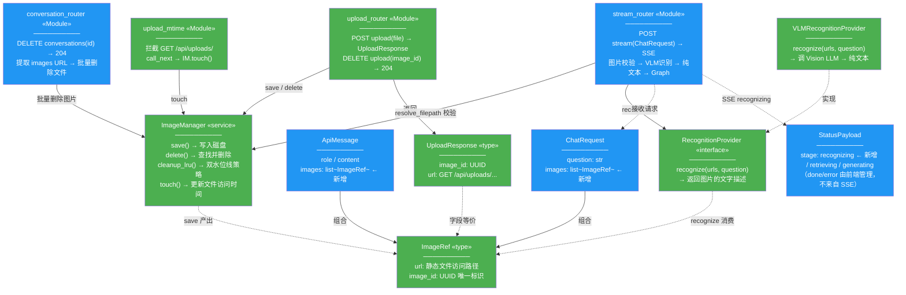
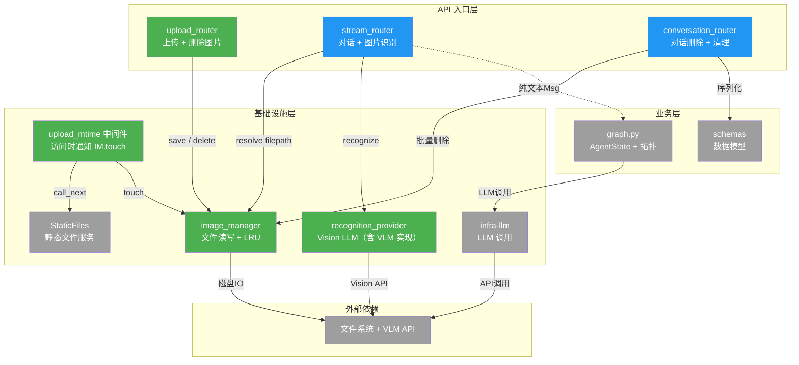
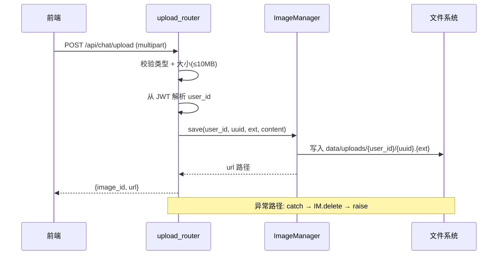
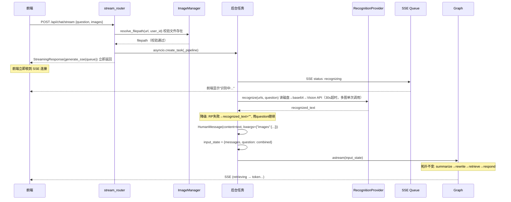
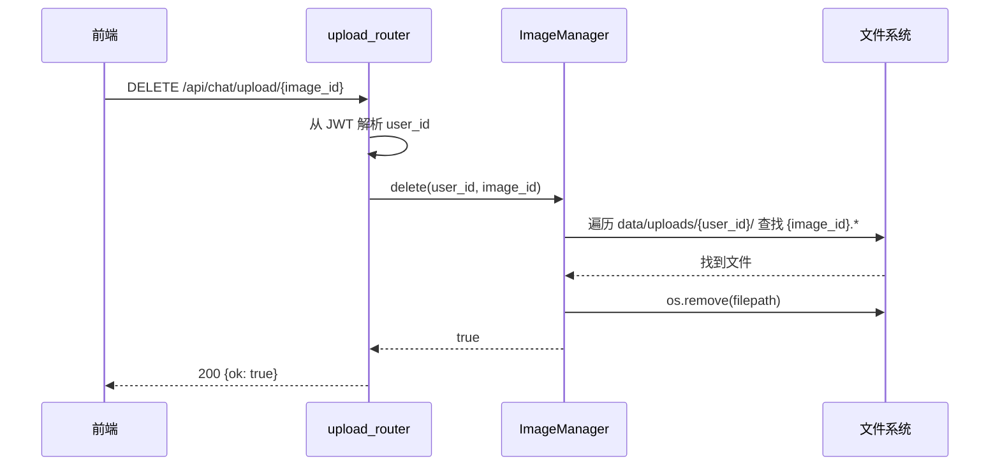
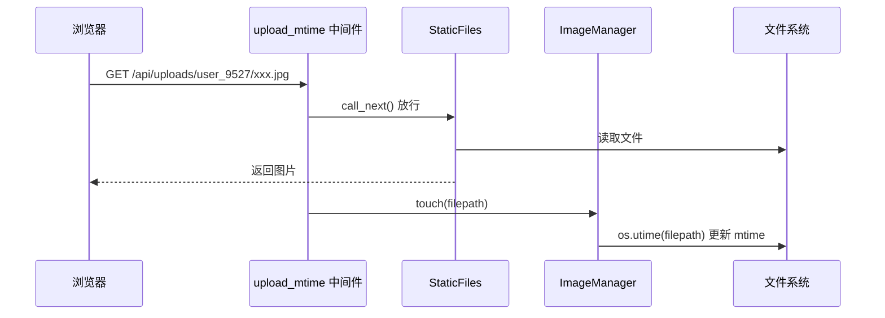
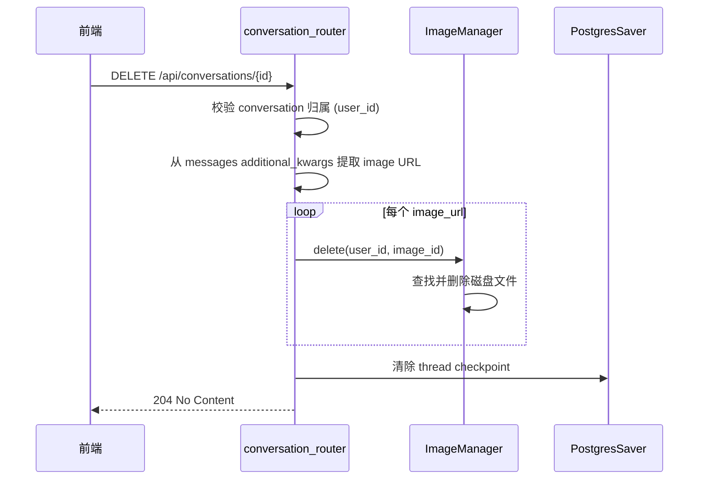

# 多模态图片识别 — 后端设计报告

> 关联设计：[多模态图片识别 3.0 前端](./2026-06-05--multimodal-image-frontend.md)

## 1. 目标

- 图片上传/删除 REST API（BF001/BB001）
- 可插拔 Vision LLM 识别层 + qwen3-vl-flash 默认实现（BF002）
- stream_router 图片预处理：识别图片 → 构造纯文本 HumanMessage（BB002）
- 历史消息序列化：从 additional_kwargs 提取图片引用（BB003）
- StaticFiles + 中间件 LRU 清理（BF001）
- SSE 新增 `recognizing` 状态阶段
- 对话删除时关联清理图片文件

**核心决策**：识别在 stream_router 预处理，Graph 拓扑不变、AgentState 不变。不引入数据库表，图片生命周期通过文件系统管理。

## 2. 现状分析

### 已有能力

| 能力 | 来源 | 复用方式 |
|------|------|---------|
| OpenAI 兼容 LLM 调用（NewAPI 代理） | infra/llm.py | Vision LLM 走同协议、同 base_url |
| JWT 鉴权（Depends 按需注入） | middleware/auth.py | Upload/Delete 端点鉴权 |
| SSE 流式事件（queue + asyncio.Task） | chat/stream_router.py | 预处理阶段直接写入 queue |
| DashScope base64 + 多模态调用 | rag/readers/pdf_reader.py | base64 编码模式可参考 |
| HumanMessage.additional_kwargs | LangChain 标准 | 用于保存图片引用（与现有 sources 存储方式一致） |
| FastAPI 中间件 | 现有 auth 中间件模式 | 图片访问 mtime 更新中间件 |

### 需要改造的卡点

| 卡点 | 文件:行 | 问题 |
|------|---------|------|
| ChatRequest 只接受纯文本 question | schemas.py:10-20 | 需扩展 images 字段 |
| HumanMessage content 构造为纯字符串 | stream_router.py:182-185 | 含图片时需先识别再构造纯文本 |
| to_api_message 不读 additional_kwargs 的 images | conversation_utils.py:73-123 | 需从 additional_kwargs 提取 images |
| StatusPayload 只有 retrieving/generating | schemas.py:39-42 | 需新增 recognizing |
| delete_conversation 不清理图片 | conversation_router.py:209-231 | 需增加从消息提取 URL → 删文件 |
| config.py 无 vision 配置 | config.py | 需新增 vision_model 等配置项 |
| main.py 无 StaticFiles / 启动清理 / 中间件 | main.py | 需新增 mount + middleware + cleanup |

### 不需要改的文件

| 文件 | 原因 |
|------|------|
| graph.py（AgentState + 拓扑） | HumanMessage 进入 Graph 时已是纯文本，不需要 recognize 节点 |
| _format_msg_line | content 始终为 str |
| estimate_tokens | content 始终为 str |
| domain/models.py | 不引入数据库表，不需要 ORM 模型 |

### 基础设施就绪

| 项目 | 状态 | 说明 |
|------|------|------|
| NewAPI 代理 | ✅ | qwen3-vl-flash 已就绪，复用 newapi_api_key + newapi_base_url |
| data/ 目录 | ✅ | 已存在，新增 uploads/ 子目录 |
| python-multipart | ❓ | FastAPI UploadFile 依赖，需确认 requirements.txt，缺失时添加 |

## 3. 方案总览

### 项目结构

> 🟢 新增　🔵 改造　⚪ 不变

```
backend/app/
├── agent/
│   ├── graph.py              ⚪ 拓扑和 AgentState 完全不变
│   └── prompts.py            🔵 新增 RECOGNITION_SYSTEM_PROMPT
├── chat/
│   ├── schemas.py            🔵 ImageRef + ChatRequest.images + ApiMessage.images + StatusPayload
│   ├── stream_router.py      🔵 图片预处理：校验→VLM识别→纯文本HumanMessage+SSE recognizing
│   ├── upload_router.py      🟢 POST upload + DELETE upload/{id}
│   ├── conversation_utils.py 🔵 to_api_message 从 additional_kwargs 提取 images
│   ├── conversation_router.py🔵 delete_conversation 增加图片文件清理
│   └── errors.py             ⚪ 不变
├── infra/
│   ├── recognition.py        🟢 RecognitionProvider 协议 + VLMRecognitionProvider
│   └── image_manager.py      🟢 ImageManager：上传/删除/LRU清理 + touch
├── middleware/
│   ├── auth.py               ⚪ JWT 鉴权（不变）
│   └── upload_mtime.py       🟢 图片访问时通知 ImageManager.touch()
├── config.py                 🔵 +vision_model / image_max_size_mb / image_max_storage_mb
└── main.py                   🔵 +StaticFiles mount + upload_mtime中间件 + upload_router + 启动LRU清理 + recognition_provider 初始化
```

### 职责划分

```
upload_router
  → ImageManager (文件写入/删除/查找) + JWT 解析 user_id

image_manager（核心基础设施）
  → save: 生成 UUID + 写文件到 data/uploads/{user_id}/ + 更新 _total_size
  → delete: 遍历 user_id 目录查找文件 + 删除 + 更新 _total_size
  → cleanup_lru: 双水位线策略（高水位1GB触发，低水位800MB停止）+ asyncio.Lock 并发安全
  → touch: 更新文件访问时间（LRU 依据），被 middleware 调用
  → _total_size: 内存计数器（启动时磁盘计算一次，之后 save/delete 加减维护）

upload_mtime_middleware（HTTP 层观察者）
  → 拦截 GET /api/uploads/ → call_next() 放行 → image_manager.touch(filepath)

stream_router（核心改造点）
  → 有 images: 校验文件存在 → RecognitionProvider.recognize() → 纯文本 HumanMessage
  → 无 images: 现有流程不变

Graph（完全不变）
  → summarize → rewrite → retrieve → respond

to_api_message
  → additional_kwargs.get("images") → ApiMessage.images

delete_conversation
  → 从消息提取图片 URL → ImageManager 删除文件
```

### 类图



> **类图图例**：绿色 = 新增，蓝色 = 改造。改造类中标注 `← 新增` 的字段为本版本新增。
> 从上到下阅读：**业务入口**（3 个 Router）→ **中间件**（upload_mtime）→ **基础设施服务**（ImageManager、RecognitionProvider）→ **数据模型**（ImageRef、ChatRequest 等）。
>
> **目录文件省略说明**：
> - **conversation_utils**：辅助函数集合，是 conversation_router 的内部实现细节
> - **prompts.py**：新增 RECOGNITION_SYSTEM_PROMPT 常量，不是类
> - **config.py**：新增 vision_model / image_max_size_mb / image_max_storage_mb 配置项，不是类
> - **main.py**：新增 StaticFiles mount、upload_mtime 中间件挂载、LRU 清理启动、recognition_provider 初始化，是启动代码不是类
> - **upload_mtime.py**：中间件函数（非类），拦截图片访问请求后调 ImageManager.touch()，在模块依赖图中以「upload_mtime 中间件」节点表示

### 模块依赖关系



图例：绿色=新增，蓝色=改造，灰色=不变。config 读取和 main.py 初始化箭头已省略（配置读取是全局共识）。conversation_utils 是 conversation_router 的内部实现细节（消息序列化辅助函数），不作为独立模块出现，其职责已归入 conversation_router 对 schemas 的直接依赖。RP 节点包含 RecognitionProvider 接口及其 VLMRecognitionProvider 实现（类图中分开表示，模块依赖图中合并）。prompts.py（新增 RECOGNITION_SYSTEM_PROMPT）是常量文件，不是运行时模块，不单独出现。

阅读方式：从上到下，请求流经 API 入口层 → 业务层 → 基础设施层 → 外部依赖。实线 = 运行时调用，虚线 = 数据产出（stream_router 产出纯文本 HumanMessage 送入 Graph）。四层边界清晰：入口层处理 HTTP、业务层定义流程和数据、基础设施层封装外部资源、最底层是外部系统。

## 4. 数据模型与接口

### 文件存储模型

**无数据库表，纯文件系统管理**：

```
data/uploads/{user_id}/{uuid}.{ext}

例：data/uploads/user_9527/a1b2c3d4-e5f6-7890-abcd-ef1234567890.jpg
```

- `user_id`：从 JWT 解析，编入路径用于归属校验
- `uuid`：image_id，上传时生成
- `ext`：原始文件扩展名（jpg/png/webp）

**关键设计决策**：

| 决策 | 理由 |
|------|------|
| 识别在 stream_router 预处理 | Graph 拓扑不变、AgentState 不变、下游节点零改造 |
| additional_kwargs 存图片引用 | 复用 LangChain 标准字段，PostgresSaver 透明序列化，与 sources 一致 |
| HumanMessage content 始终为纯文本 | 进入 Graph 前已识别完成，_format_msg_line / estimate_tokens 不需改动 |
| user_id 编入文件路径 | DELETE 端点校验归属，无需数据库表 |
| 不引入数据库表 | 图片管理通过文件系统完成，避免 pending/confirmed 状态复杂度 |

### 接口契约

**1. POST /api/chat/upload** — 上传图片

请求：`multipart/form-data`，字段 `file`
- 文件类型限制：jpg/jpeg/png/webp
- 文件大小限制：≤ 10MB

成功响应 200：
```json
{"image_id": "a1b2c3d4-xxxx-xxxx-xxxx-xxxxxxxxxxxx", "url": "/api/uploads/user_9527/a1b2c3d4-xxxx.jpg"}
```

**2. DELETE /api/chat/upload/{image_id}** — 删除图片

成功响应 200：`{"ok": true}`
错误：404（不存在或不属于当前用户）

后端通过 JWT 解析 user_id → 遍历 `data/uploads/{user_id}/` 查找 `{image_id}.*` 文件 → 删除。

**3. POST /api/chat/stream** — 扩展（新增 images 字段）

请求体：
```json
{
  "question": "重点讲第二步",
  "top_k": 10,
  "conversation_id": "uuid",
  "images": [
    {"url": "/api/uploads/user_9527/xxx.jpg", "image_id": "uuid-1"}
  ]
}
```

无 images 时与现有一致，零影响。

**4. DELETE /api/conversations/{id}** — 变更：新增图片清理

对话删除时，从消息 additional_kwargs 提取图片 URL → 删除关联磁盘文件。失败只 logger.warning，不阻断对话删除。

**5. Schema 变更汇总**

```python
class ImageRef(BaseModel):
    url: str
    image_id: str

class ChatRequest(BaseModel):
    question: str = Field(..., min_length=1, max_length=2000)
    top_k: int = Field(default=10, ge=3, le=20)
    conversation_id: str | None = Field(default=None)
    images: list[ImageRef] = Field(default_factory=list, max_length=3)  # NEW

class ApiMessage(BaseModel):
    # ... 现有字段 ...
    images: list[ImageRef] = Field(default_factory=list)  # NEW

# StatusPayload stage 扩展
stage: Literal["recognizing", "retrieving", "generating"]  # ← 新增 recognizing
```

### RecognitionProvider 接口

```python
# infra/recognition.py
class RecognitionProvider(Protocol):
    async def recognize(self, image_urls: list[str], question: str) -> str: ...

class VLMRecognitionProvider:
    """默认实现：通过 OpenAI 兼容 API 调用 Vision LLM"""

    def __init__(self, api_key: str, base_url: str, model: str, upload_dir: str): ...

    async def recognize(self, image_urls: list[str], question: str) -> str:
        # 1. 根据 URL 路径定位磁盘文件（/api/uploads/{user_id}/{uuid}.{ext} → data/uploads/{user_id}/{uuid}.{ext}）
        # 2. 读文件 → base64 编码
        # 3. 构造 OpenAI Vision 格式 messages
        # 4. AsyncOpenAI.chat.completions.create（30s 超时）
        # 5. 返回识别文本（不截断，由现有 Token 预算管理自然处理）
```

### ImageManager 接口

```python
# infra/image_manager.py
class ImageManager:
    _total_size: int = 0       # 内存计数器，启动时从磁盘计算初始化
    _lock: asyncio.Lock        # 保证并发安全

    def __init__(self, upload_dir: str, max_storage_mb: int): ...

    async def save(self, user_id: str, image_id: str, ext: str, content: bytes) -> str:
        """写入文件到 data/uploads/{user_id}/{image_id}.{ext}，返回 URL 路径。
        写完后持锁更新 _total_size，超高水位则触发清理。"""

    async def delete(self, user_id: str, image_id: str) -> bool:
        """遍历 data/uploads/{user_id}/ 查找 {image_id}.* → 删除，持锁更新 _total_size"""

    def resolve_filepath(self, url: str, user_id: str) -> str:
        """从 URL 解析磁盘路径，校验路径中 user_id 匹配"""

    async def cleanup_lru(self) -> int:
        """启动时 + 上传后异步触发：持锁 → 检查 _total_size > 高水位 →
        按 mtime 从旧到新删文件 → _total_size 递减 → 低于低水位停止。
        asyncio.Lock 保证：清理期间新上传等锁 → 拿到锁后重新检查 → 已低于高水位则跳过"""

    def touch(self, filepath: str) -> None:
        """更新文件访问时间（LRU 依据），由 upload_mtime 中间件调用"""
        if os.path.exists(filepath):
            os.utime(filepath)
```

## 5. 核心流程

### 上传图片



### 发送 + 识别（预处理）

**关键设计**：SSE 流立即建立，识别 + Graph 在后台任务中执行。用户发送后**立即**看到"识别中..."。



> **时序图与模块依赖图对照说明**：BG（后台任务）为 stream_router 内部的 `asyncio.Task`，不是独立模块，因此在模块依赖图中不单独出现。同理，SSE Queue 为 stream_router 内部的 `asyncio.Queue`，属于实现细节而非模块级依赖。

**停止行为**（与现有 LLM 一致）：

| 场景 | 前端行为 | 后端行为 |
|------|---------|---------|
| 用户点停止 | `POST /chat/stop` + `abort()` 并行 | 设置 `cancel_event` → Graph 协作式取消（事件边界检查） |
| 网络异常 | SSE 连接断开 | `is_disconnected()` 轮询检测（5s 间隔）→ 同样设 `cancel_event` |
| VLM 识别中停止 | 同上 | VLM 调用不会被强杀（30s 超时自然结束），结果丢弃。与现有 LLM `ainvoke()` 行为一致 |

**注意**：VLM 调用发生在 Graph 启动之前，`cancel_event` 在 Graph 事件边界才检查。因此识别阶段的中停靠 VLM 自身的 30s 超时自然结束，不会额外增加复杂度。

### 纯文字消息（零影响）

```
POST /api/chat/stream {question}
→ images 为空列表 → 跳过识别 → HumanMessage(content=question) → Graph（与现有一致）
```

### 删除已上传图片



### 图片访问 + LRU mtime 更新



### LRU 清理（启动时 + 上传后异步触发）

**触发时机**：
1. lifespan 启动时执行一次
2. 每次上传成功后异步触发（上传先返回成功，再后台检查）

**内存计数器**：`_total_size` 存内存，启动时从磁盘计算初始化，之后 save/delete 加减维护（O(1) 检查）

**双水位线策略**：
- 高水位 `IMAGE_MAX_STORAGE_MB`（默认 1000MB）：触发清理
- 低水位 `IMAGE_MAX_STORAGE_MB * 0.8`（默认 800MB）：清理停止目标（留 20% 缓冲）

**并发控制**：`asyncio.Lock` 保证并发安全：
```
上传写文件（不需要锁）→ 写完持锁 → _total_size += 大小
  → 超高水位 → 清理（仍持锁）→ 删旧文件 → _total_size 递减 → 低于低水位 → 释放锁
新上传写完 → 等锁 → 拿到锁 → _total_size += 大小 → 未超高水位 → 释放锁
```

```
1. 持锁检查 _total_size > 高水位
2. 收集所有文件，按 mtime 排序（旧→新）
3. 逐个删除最旧的文件，_total_size 递减，直到低于低水位
```

### 删除对话时清理图片



在 `delete_conversation` 的 checkpoint 清理之后增加：
1. 从 PostgresSaver 加载消息 → 遍历 additional_kwargs["images"]
2. 从 URL 解析文件路径（如 `/api/uploads/user_9527/xxx.jpg` → `data/uploads/user_9527/xxx.jpg`）
3. 逐个 os.remove(filepath)
4. 失败只 logger.warning，不阻断对话删除（与现有 checkpoint 清理策略一致）

### stream_router 预处理关键实现模式

**核心变更**：识别 + Graph 整体放入后台任务，SSE 流立即建立。

```python
# stream_router.py
async def stream_chat(body: ChatRequest, http_request: Request, ...):
    # ... 现有的 conversation_id / 归属校验 ...

    queue = asyncio.Queue()

    # === 校验 images（同步，在返回响应前完成） ===
    if body.images:
        image_manager = http_request.app.state.image_manager
        for img in body.images:
            filepath = image_manager.resolve_filepath(img.url, user.user_id)
            if not os.path.exists(filepath):
                raise HTTPException(400, "图片不存在，请重新上传")

    # === 启动后台任务（识别 + Graph），立即返回 SSE 流 ===
    asyncio.create_task(_pipeline(body, user, queue, http_request.app.state))
    return StreamingResponse(generate_sse(queue, http_request), ...)


async def _pipeline(body, user, queue, app_state):
    """后台任务：识别图片 → 构造 HumanMessage → 启动 Graph"""
    recognized_text = ""
    image_refs_kwargs = []

    if body.images:
        # 1. 发 SSE recognizing（用户立即看到）
        await queue.put(_sse_frame("status", {"stage": "recognizing", "message": "正在识别图片..."}))

        # 2. 调 Vision LLM（30s 超时，不会被 cancel_event 强杀，与现有 LLM ainvoke 行为一致）
        try:
            recognized_text = await app_state.recognition_provider.recognize(
                [img.url for img in body.images], body.question
            )
            image_refs_kwargs = [{"url": img.url, "image_id": img.image_id} for img in body.images]
        except Exception:
            logger.warning("Vision LLM failed, degrading to text-only")
            recognized_text = ""

    # 3. 构造 HumanMessage
    combined_question = f"{recognized_text}\n\n{body.question}" if recognized_text else body.question
    human_msg = HumanMessage(
        content=combined_question,
        additional_kwargs={"images": image_refs_kwargs} if image_refs_kwargs else {}
    )
    input_state = {"messages": [human_msg], "question": combined_question}

    # 4. 启动 Graph（与现有一致，cancel_event 在事件边界检查）
    await _run_graph(graph, input_state, config, queue, ...)
```

### 初始化顺序变更

```
=== 模块级配置（app 创建时，与现有 router/middleware 注册同级） ===
app.add_middleware(upload_mtime_middleware)  ← NEW（内部调 image_manager.touch）
  # 注：中间件在 app 创建时注册，但实际请求在 lifespan 完成后才到达，此时 image_manager 已初始化
app.mount("/api/uploads", StaticFiles(...))          ← NEW
app.include_router(upload_router)                  ← NEW

=== lifespan（启动时异步初始化） ===
...（现有初始化）...
LLMGenerator
↓
VLMRecognitionProvider  ← NEW
↓
ImageManager            ← NEW
↓
ImageManager.cleanup_lru()  ← NEW（启动时 LRU 清理，后续上传后异步触发）
↓
create_graph()          ← 不变（拓扑不变）
↓
app.state.recognition_provider  ← NEW
app.state.image_manager         ← NEW
```

## 6. 技术决策

| 决策 | 方案 | 理由 |
|------|------|------|
| 识别时机 | stream_router 预处理 | Graph 零改造，AgentState 不变，architecture.md 不变 |
| 图片存储 | 本地文件系统 data/uploads/{user_id}/ | MVP 最简，user_id 编入路径做归属校验 |
| 图片访问 | FastAPI StaticFiles("/api/uploads") + 中间件更新 mtime | 复用 /api/ 路由，无需改 Traefik/Next.js 配置 |
| 归属校验 | user_id 在文件路径中 | DELETE 端点从 JWT 解析 user_id → 遍历其目录查找文件 |
| Vision LLM 协议 | OpenAI Vision 兼容格式 | 复用 NewAPI 代理 |
| 图片传入 VLM | 读磁盘 → base64 内联 | VLM 无法访问 localhost URL |
| 图片引用持久化 | additional_kwargs["images"] | 复用 LangChain 标准字段，PostgresSaver 透明序列化 |
| 识别失败降级 | content = question（丢弃图片） | 纯文字继续 Graph |
| SSE recognizing 事件 | 后台任务写入 queue，SSE 立即建立 | 用户发送后立即看到"识别中..."，不等 VLM 完成 |
| 不引入数据库表 | 纯文件系统管理 | 图片管理不需要复杂状态，避免 pending/confirmed 生命周期 |

### config.py 新增配置

```python
# Vision LLM — 图片识别（复用 newapi_api_key + newapi_base_url）
vision_model: str = "qwen3-vl-flash"
image_max_size_mb: int = 10           # 单张图片大小上限
image_max_storage_mb: int = 1000      # uploads 目录高水位（MB），低水位 = 80%
```

## 7. 验收标准

| 验收条件 | 验收方式 |
|----------|----------|
| POST /api/chat/upload 成功 | curl 上传图片 → 200 + image_id + url |
| 文件实际写入磁盘 | ls data/uploads/{user_id}/ 确认文件存在 |
| URL 中包含 user_id | 响应 url 格式为 `/api/uploads/{user_id}/{uuid}.{ext}` |
| 非法类型拒绝 | curl 上传 .txt → 400 |
| 超大文件拒绝 | curl 上传 >10MB → 400 |
| DELETE 成功 | curl DELETE → 200 + 文件消失 |
| DELETE 越权拒绝 | 其他用户 token → 404 |
| 上传异常即时清理 | 模拟写入失败 → 文件不存在 |
| stream 含 images → VLM 调用 | 日志可见 Vision LLM 请求 |
| stream 无 images → 零影响 | 纯文字消息流程不变，现有测试全过 |
| HumanMessage content 为纯文本 | checkpoint 中消息 content 为 str |
| additional_kwargs 存 images | checkpoint 中消息有 images 引用 |
| SSE recognizing 事件 | 含图片时前端收到 status: recognizing |
| python-multipart 已安装 | requirements.txt 包含 python-multipart |
| 历史消息含图片 | GET /api/conversations/current → images 字段 |
| 对话删除清理图片 | 删除对话 → 关联文件被删除 |
| LRU 清理生效 | 填满 uploads 目录超过 1GB → 上传后最旧文件被清理至 800MB |
| 内存计数器一致 | 重启后 _total_size 与磁盘实际大小一致 |
| StaticFiles 可访问图片 | curl GET /api/uploads/{user_id}/{uuid}.jpg → 200 |
| mtime 中间件更新 | 访问图片后检查文件 mtime 已变化 |
| Vision LLM 降级 | mock 失败 → 纯文字继续，Graph 正常完成 |
| 现有测试不回归 | pytest 全部通过 |

## 8. 暂不实现

| 功能 | 理由 | 扩展预留 |
|------|------|---------|
| OCR 识别方案 | VLM 直出更简单，RecognitionProvider 已抽象接口 | 可插入 OCR 实现 |
| 图片压缩/缩略图 | MVP 存原图 | 后续可加 Pillow |
| S3/OSS 对象存储 | 本地文件系统够用 | BF001 接口可切换 |
| 定时清理（非启动） | 启动时清理一次已满足低频需求 | 后续可加 APScheduler |
| Vision LLM 调用重试 | VLM 失败走降级路径 | 后续可加重试 |
| 图片识别结果缓存 | 每次上传唯一 UUID，缓存命中率极低 | 后续可按文件 hash 缓存 |
| 签名 URL（Pre-signed URL） | UUID 路径已提供足够隐蔽性 | 后续可加中间件校验签名和过期时间 |
