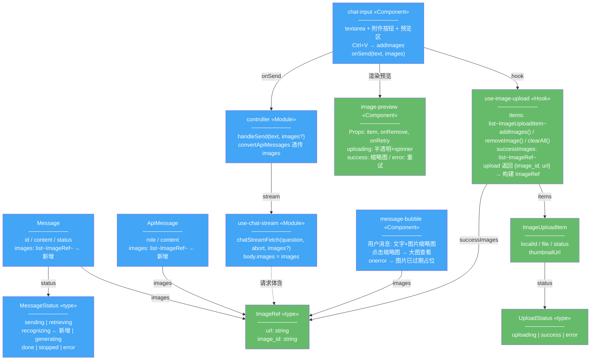
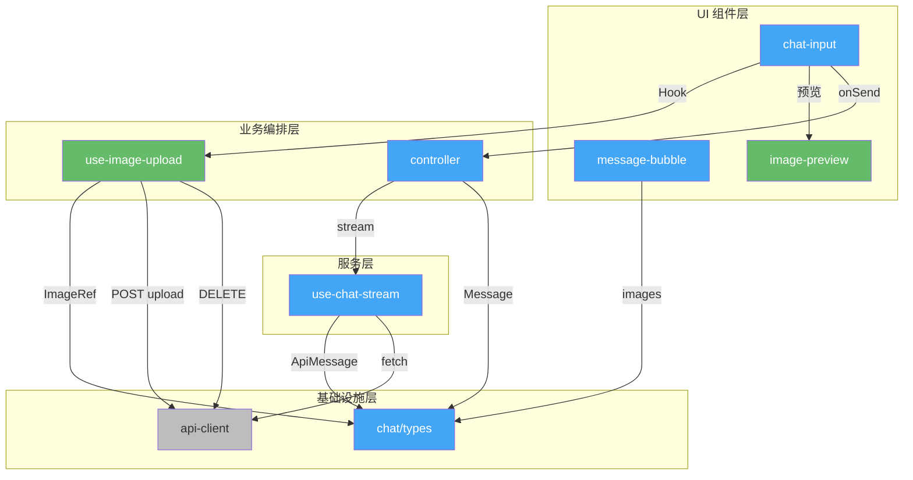
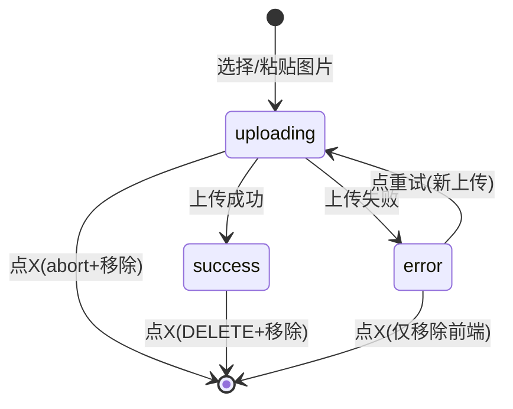
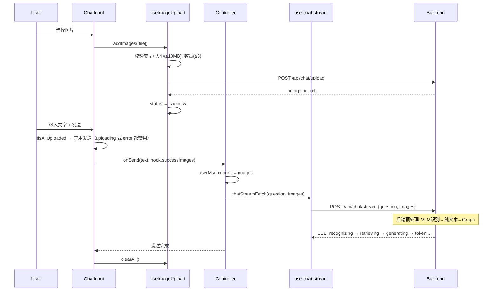
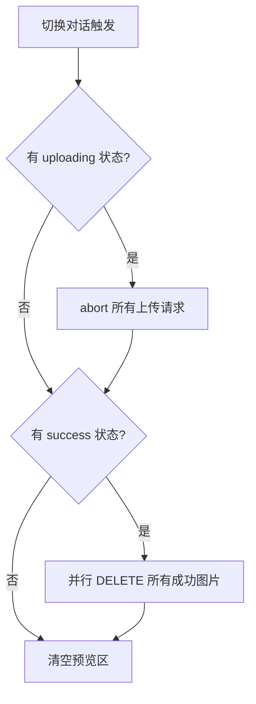

# 多模态图片识别 — 前端设计报告

> 关联设计：[多模态图片识别 3.0 后端](./2026-06-05--multimodal-image-backend.md)

## 1. 目标

- ChatInput 扩展：文件选择器 + Ctrl+V 粘贴 + 预览区状态机（FB001）
- 图片上传状态管理：uploading → success/error + 取消/重试/删除
- 消息图片渲染：用户消息缩略图 + 大图查看（FF001/FB002）
- 发送按钮在上传未完成时禁用
- API 层支持 multipart 上传 + stream 请求携带 images

## 2. 现状分析

### 已有能力

| 能力 | 来源 | 复用方式 |
|------|------|---------|
| Tailwind CSS v4 样式体系 | 全局 | 新组件统一使用 |
| shadcn/ui Button | components/ui/button.tsx | 上传按钮复用 |
| fetchWithAuth + Bearer token | lib/api-client.ts | 删除请求复用 |
| SSE 流式回调（SSECallbacks） | chat/types.ts | 新增 recognizing 状态 |
| ChatInput 受控组件模式 | chat-input.tsx | 扩展而非重写 |
| MessageBubble memo 优化 | message-bubble.tsx | 图片渲染不破坏 memo |
| sonner toast | 全局 | 上传/删除失败提示 |
| lucide-react 图标 | package.json | Paperclip / X / RotateCw |
| URL.createObjectURL | 浏览器原生 | 本地图片预览 |

### 需要改造的卡点

| 卡点 | 文件 | 问题 |
|------|------|------|
| Message/ApiMessage 无 images 字段 | chat/types.ts | 需新增 |
| ChatInput 无文件上传 | chat-input.tsx | 需加附件按钮 + 粘贴 + 预览区 |
| handleSend 只取纯文本 | controller.ts | 需收集 images；**onStatus 回调需增加 `recognizing` stage 处理**（含 resumeStream） |
| chatStreamFetch body 无 images | use-chat-stream.ts | 需扩展请求体 |
| MessageBubble 用户消息纯文本 | message-bubble.tsx | 需渲染图片缩略图；**statusLabels 需增加 `recognizing: '识别中...'`；loading 动画条件需扩展包含 `recognizing`** |

### 不需要改的文件

| 文件 | 原因 |
|------|------|
| api-client.ts | 上传用 fetch + token 直接调（绕开自动 JSON Content-Type），删除用 fetchWithAuth 即可 |

## 3. 方案总览

### 项目结构

> 🟢 新增　🔵 改造　⚪ 不变

```
frontend/src/
├── chat/
│   ├── types.ts              🔵 +ImageRef, Message.images, ApiMessage.images
│   ├── controller.ts         🔵 handleSend 接收 images, convertApiMessages 透传 images
│   └── use-chat-stream.ts    🔵 chatStreamFetch 参数 + body 增加 images
├── components/
│   ├── chat-input.tsx        🔵 +附件按钮 + Ctrl+V + 预览区
│   ├── message-bubble.tsx    🔵 用户消息渲染图片缩略图 + 大图查看
│   └── image-preview.tsx     🟢 单张图片预览项（缩略图+状态+操作按钮）
├── hooks/
│   └── use-image-upload.ts   🟢 上传状态管理 Hook
└── lib/
    └── api-client.ts         ⚪ 上传直接用 fetch + token
```

### 职责划分

```
use-image-upload (Hook)
  ├── 管理上传状态列表 ImageUploadItem[]
  ├── 校验：类型 jpg/png/webp + 大小 ≤10MB + 数量 ≤3
  ├── 发起上传（fetch + FormData + AbortController）
  ├── 调用 DELETE 删除成功图片
  └── 暴露: addImages / removeImage / retryUpload / clearAll / successImages

image-preview (Component)
  ├── Props: item, onRemove, onRetry
  ├── uploading: 半透明缩略图 + loading spinner + X 按钮
  ├── success: 正常缩略图 + X 按钮
  └── error: 红色遮罩 + "上传失败" + 重试按钮 + X 按钮

chat-input (Component)
  ├── 隐藏 <input type="file" accept="image/*" multiple>
  ├── 渲染 textarea + 附件按钮（Paperclip 图标）+ 预览区
  ├── Ctrl+V: clipboardData → image/* → addImages
  ├── 发送按钮: isAnyUploading 时 disabled
  └── onSend(text, images) 回调

message-bubble (Component)
  ├── 用户消息: 文字 + images?.map →  缩略图
  ├── 点击缩略图 → CSS overlay 大图查看
  └──  → "图片已过期" 灰色占位符

controller.ts
  ├── handleSend(text, images?) → userMsg.images = images
  └── convertApiMessages → 透传 images 字段

use-chat-stream.ts
  └── chatStreamFetch(question, callbacks, abort, images?) → body.images = images
```

### 类图



> **类图颜色图例**：绿色 `#66BB6A` = 新增类/组件，蓝色 `#42A5F5` = 需改造的现有类/组件。

### 模块依赖关系



图例：绿色=新增模块，蓝色=需改造模块，灰色=不变模块。箭头方向为调用方 -> 被调用方，从上到下体现调用层次。四层结构：UI 组件层 -> 业务编排层（React Hook 编排业务流程） -> 服务层（封装通信协议） -> 基础设施层。

注：`successImages` 的数据回传和 `onRemove / onRetry` 回调属于运行时数据流，不在依赖图中体现。

## 4. 数据模型与接口

### 核心类型扩展

```typescript
// chat/types.ts 新增
interface ImageRef {
  url: string;       // /api/uploads/{user_id}/{uuid}.{ext}
  image_id: string;  // 服务端 UUID
}

// ApiMessage 扩展
interface ApiMessage {
  // ... 现有字段不变 ...
  images: ImageRef[];  // NEW
}

// Message 扩展
interface Message {
  // ... 现有字段不变 ...
  images?: ImageRef[];  // NEW
}

// MessageStatus 扩展
type MessageStatus = 'sending' | 'retrieving' | 'recognizing' | 'generating' | 'done' | 'stopped' | 'error';  // NEW: 'recognizing'（recognizing/retrieving/generating 来自 SSE status stage，sending/done/stopped/error 为前端状态）

// convertApiMessages 转换时透传 images
```

### 上传状态类型

```typescript
// hooks/use-image-upload.ts（新文件）
type UploadStatus = 'uploading' | 'success' | 'error';

interface ImageUploadItem {
  localId: string;            // 前端本地 ID（crypto.randomUUID()）
  file: File;                 // 原始文件引用（重试时复用）
  status: UploadStatus;
  thumbnailUrl: string;       // URL.createObjectURL 预览用
  imageId?: string;           // 服务端 image_id（上传成功后）
  url?: string;               // 服务端 URL（上传成功后）
  abortController: AbortController;
}

// Hook 返回值
interface UseImageUploadReturn {
  items: ImageUploadItem[];
  addImages: (files: File[]) => void;     // 校验类型+大小+数量 → 发起上传
  removeImage: (localId: string) => void; // uploading→abort, success→DELETE, error→移除
  retryUpload: (localId: string) => void; // 重新上传（新 image_id）
  clearAll: () => void;                   // abort所有 + DELETE成功的 + 清空列表
  successImages: ImageRef[];              // 已成功的图片列表（发送时用）
  isAllUploaded: boolean;                 // 全部成功（控制发送按钮）
  isAnyUploading: boolean;                // 有上传中（控制发送按钮禁用）
}
```

### 接口调用方式

**上传**：直接使用 `fetch` + `Bearer token`（不用 fetchWithAuth，避免自动 JSON Content-Type）

```typescript
async function uploadImage(file: File, signal: AbortSignal): Promise<{image_id: string, url: string}> {
  const token = authHandlers.getToken();
  const formData = new FormData();
  formData.append('file', file);
  const res = await fetch('/api/chat/upload', {
    method: 'POST',
    headers: { Authorization: `Bearer ${token}` },
    body: formData,           // 不设 Content-Type，浏览器自动设 multipart boundary
    signal,
  });
  return res.json();
}
```

**删除**：使用 fetchWithAuth

```typescript
async function deleteImage(imageId: string): Promise<void> {
  const res = await fetchWithAuth(`/api/chat/upload/${imageId}`, { method: 'DELETE' });
  if (!res.ok) {
    throw new Error('删除失败');
  }
}
// 成功(200): 从预览区移除该图片
// 失败(404): toast 提示"图片不存在或已删除"，同时移除预览区
// 网络错误: toast 提示"删除失败，请重试"
```

**发送**：chatStreamFetch body 扩展 images 字段

## 5. 核心流程

### 上传状态机



| 状态 | 预览区显示 | 可操作 |
|------|-----------|--------|
| uploading | 半透明缩略图 + loading 旋转动画 | X → abort + 移除 |
| success | 正常缩略图 | X → DELETE + 移除 |
| error | 红色遮罩 + "上传失败" | 重试 → 重新上传 / X → 移除 |

### 发送消息流程



### 切换对话时清理



## 6. 技术决策

| 决策 | 方案 | 理由 |
|------|------|------|
| 上传状态管理 | 自定义 Hook | 与现有 useState + 自定义 Hook 模式一致 |
| 本地预览 | URL.createObjectURL | 浏览器原生，组件卸载时 revokeObjectURL |
| 上传请求 | 直接 fetch + token | 避免 fetchWithAuth 的自动 JSON Content-Type 干扰 FormData |
| 大图查看 | CSS overlay + z-index | 无需引入 lightbox 库 |
| 重试 = 新上传 | 重新调 upload API | 与后端设计一致，避免脏数据 |
| 取消上传 | AbortController.abort() | 浏览器标准 API |
| 预览区位置 | textarea 上方 | ChatGPT/Claude 模式 |

### 第三方依赖

| 依赖 | 用途 | 已有/新增 |
|------|------|----------|
| lucide-react | Paperclip / X / RotateCw 图标 | ✅ 已有 |
| sonner | toast 提示 | ✅ 已有 |
| URL.createObjectURL | 本地图片预览 | ✅ 浏览器原生 |

**无需新增任何 npm 依赖。**

### 关键 UI 布局

```
┌─────────────────────────────────┐
│ [预览区]                         │
│ ┌──────┐ ┌──────┐ ┌──────┐      │
│ │ img  │ │ img  │ │ img  │      │
│ │  ✓   │ │ ↻    │ │ ░░░  │      │
│ │  [X] │ │ [X]  │ │ [X]  │      │
│ └──────┘ └──────┘ └──────┘      │
├─────────────────────────────────┤
│ [📎] [        textarea        ] [➤] │
└─────────────────────────────────┘
  ↑        ↑                       ↑
  附件    输入框                  发送按钮
  按钮    (Ctrl+V粘贴)         (上传中时disabled)
```

## 7. 验收标准

| 验收条件 | 验收方式 |
|----------|----------|
| 附件按钮可见 | 截图确认输入框旁有 Paperclip 图标 |
| 文件选择器弹出 | 点击附件 → 系统文件选择器（accept=image/*） |
| Ctrl+V 粘贴图片 | 截图后 Ctrl+V → 预览区显示缩略图 |
| 非图片拒绝 | 选择 .pdf → toast "仅支持 JPG/PNG/WebP" |
| 超大文件拒绝 | 选择 >10MB → toast "图片不能超过 10MB" |
| 超量拒绝 | 已有 3 张再选 → toast "最多上传 3 张图片" |
| uploading 显示 loading | 选择后预览区半透明 + 旋转动画 |
| success 显示缩略图 | 上传完成显示正常缩略图 |
| error 显示失败提示 | 模拟 500 → 红色遮罩 + "上传失败" |
| 取消上传 | uploading 时点 X → 预览移除 |
| 删除已上传 | success 时点 X → 预览移除 + 后端删除 |
| 重试上传 | error 时点重试 → 重新上传 → success |
| 发送按钮禁用 | uploading/error 时发送按钮灰色不可点 |
| 发送携带图片 | 网络面板确认 stream body 含 images 数组 |
| 用户消息显示图片 | 聊天区用户消息含缩略图 |
| 点击缩略图放大 | 点击 → 全屏 overlay 大图 |
| 历史对话图片 | 切换对话 → 加载消息含图片缩略图 |
| 图片过期占位 | 图片 404 → 灰色"图片已过期"占位符 |
| 切换对话清理 | 上传中切换 → abort + 清空预览区 |
| SSE recognizing 状态 | 发送含图片消息 → **立即**显示"识别中..."（不等 VLM 完成） |
| 识别中点停止 | 点停止 → abort SSE + POST /chat/stop → VLM 自然结束，结果丢弃 |

## 8. 暂不实现

| 功能 | 理由 | 扩展预留 |
|------|------|---------|
| 拖拽上传 | 改动小后续可加 onDrop | chat-input 预留拖拽区域 |
| 图片压缩 | 前端不做压缩，原图直传 | 后续可加 canvas 压缩 |
| 上传进度百分比 | loading 动画够用 | 后续可用 XMLHttpRequest |
| 图片编辑/裁剪 | 非核心需求 | — |
| shadcn Dialog 大图 | CSS overlay 够用 | 后续可换 Dialog 组件 |
| 签名 URL（Pre-signed URL） | UUID 路径已提供足够隐蔽性 | 后续可加 URL 签名校验 |
