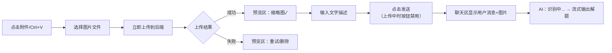
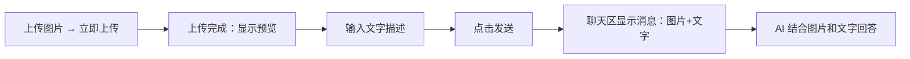
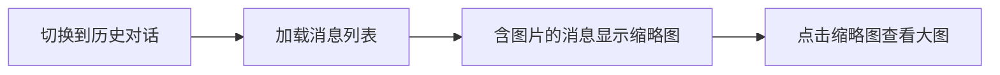
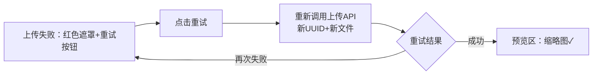
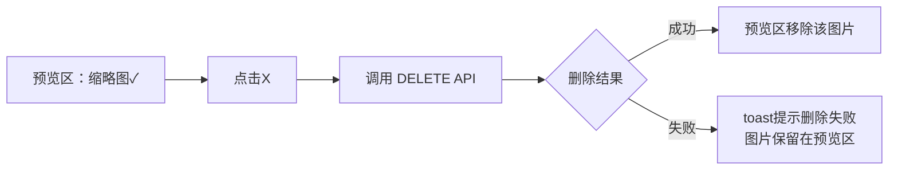
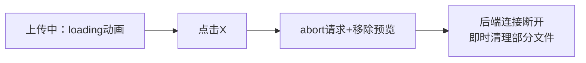
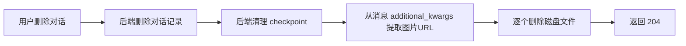

# 多模态图片识别 — 功能分析

## 概述

为 OctoTutor 智能辅导系统增加图片识别能力，用户可以上传数学题目图片（文件选择器 + Ctrl+V 粘贴），系统识别图片内容后接入解题/检索链路。采用 Vision LLM 直出作为主路径（通过 NewAPI 代理调用 qwen3-vl-flash / glm-4v-plus），架构上抽象识别层以支持后续 OCR 方案切换。

### 关键设计决策

- **识别在 stream_router 预处理**：收到含图片的 stream 请求后，先调 Vision LLM 识别图片内容，再构造纯文本 HumanMessage 传入 Graph。**Graph 拓扑不变，AgentState 不变**
- **HumanMessage 存 URL 引用在 additional_kwargs**：content 为纯文本（recognized_text + question），图片 URL 引用存于 additional_kwargs["images"]，复用 LangChain 标准字段，PostgresSaver 透明序列化
- **图片管理模块统一管控**：新增图片管理模块，对外提供上传/删除/清理能力。图片访问走 StaticFiles，中间件在每次访问时更新文件 mtime 实现 LRU 清理。不引入数据库表，生命周期通过文件系统管理
- **必须配文字**：不允许纯图片发送（ChatRequest.question 保持 min_length=1，图片是辅助上下文）
- **每条消息最多 3 张图片**：前端预览区上限 + 后端 images max_length=3

## 技术调研结论

### 识别方案选型

| 方案 | 成本/题 | 精度 | 部署方式 | OpenAI兼容 |
|------|---------|------|---------|-----------|
| **qwen3-vl-flash 直出** | ~0.003元 | 高 | NewAPI云端 | 是 |
| glm-4v-plus 直出 | ~0.01元 | 最高(OCRBench 833) | NewAPI云端 | 是 |
| PaddleOCR-VL本地 + qwen-flash | ~0.001元(不含服务器) | 高 | 本地GPU | 否 |

**推荐**：默认用 qwen3-vl-flash（性价比最高），配置化切换到 glm-4v-plus 或其他模型。架构抽象识别层，后续可插入 PaddleOCR 本地方案。

### 关键事实

- GLM-4V、Qwen-VL、GPT-4o 均支持 OpenAI vision 格式 `content: [{"type":"image_url",...}, {"type":"text",...}]`
- LangChain `HumanMessage(content=[...])` 原生支持多模态 content（str | list[dict]）
- 项目 ingestion 管线已有 base64 + DashScope 多模态 API 调用代码（`pdf_reader.py`），可参考
- PostgresSaver 的 `JsonPlusSerializer` 能透明序列化多模态 HumanMessage

## 一、交互链

### 场景 1：拍题/截图问解题

**用户故事**：作为学生，我想上传一道数学题的截图，以便 AI 识别题目并给出解题步骤。

用户在输入框旁点击附件按钮（或 Ctrl+V 粘贴截图），**图片立即开始上传**到后端，预览区显示缩略图 + 上传进度。上传完成后缩略图显示成功状态（上传失败则显示重试/删除按钮）。用户在等待上传期间可输入文字（如"重点讲第二步"）。**发送按钮在上传未完成时禁用**。全部图片上传成功后，用户点击发送，消息发出，聊天区显示用户消息（含图片缩略图），AI 回复区域先显示"识别中..."，然后流式输出解题过程。



### 场景 2：图片+文字混合提问

**用户故事**：作为学生，我想上传图片并配文字说明，以便针对图片内容提出具体问题。

用户上传图片（上传完成后预览区显示缩略图），在输入框输入文字描述（如"这个解法对不对"或"第二步为什么等于第三步"），发送后 AI 结合图片内容和文字描述进行回答。**与场景 1 流程完全一致**，区别仅在于用户文字内容的具体性（场景 1 偏开放提问，场景 2 偏针对性追问），后端处理链路相同。



### 场景 3：查看历史对话中的图片

**用户故事**：作为学生，我想在历史对话中看到之前的图片，以便回顾之前问过的题目。

用户切换到之前的对话，消息列表正确加载，含图片的用户消息显示图片缩略图，点击缩略图可查看大图。



### 场景 4：上传失败后重试

**用户故事**：作为学生，我上传图片失败了，我想重试上传，以便成功发送带图片的问题。

用户选择图片后上传失败，预览区该图片显示红色遮罩 + "上传失败"文字 + 重试按钮。用户点击重试按钮，前端用之前保留的 File 引用重新调用上传 API，后端生成新 UUID + 新文件。重试期间显示 loading 状态。重试成功后恢复正常缩略图；再次失败则仍显示重试按钮，可多次重试。



### 场景 5：删除已上传的图片

**用户故事**：作为学生，我上传了一张图片但不想发了，我想删除它，以便只发文字或换一张图片。

图片上传成功后，预览区显示正常缩略图 + X 按钮。用户点击 X 按钮，前端调用 `DELETE /api/chat/upload/{image_id}`，后端遍历 `data/uploads/{user_id}/` 目录查找匹配 `{image_id}.*` 的文件，校验归属后删除磁盘文件，前端移除预览区该图片。删除失败时 toast 提示"删除失败，请重试"，图片保留在预览区。



### 场景 6：取消正在上传的图片

**用户故事**：作为学生，我上传图片时发现选错了，我想取消上传，以便重新选择。

图片上传中（显示 loading 动画），用户点击 X 按钮，前端调用 `abortController.abort()` 中断上传请求，同时移除预览区该图片。后端连接断开触发异常，即时删除已写入的部分文件。一步完成，无需确认。



### 场景 7：删除对话时清理关联图片

**用户故事**：作为学生，我想删除一个包含图片的对话，以便清理不再需要的内容。

用户在侧边栏点击删除对话，确认删除后，后端删除对话记录和 checkpoint，同时从对话消息的 additional_kwargs 提取图片 URL，逐个删除磁盘文件。用户无感知，清理失败不阻断对话删除。



### 上传失败处理

| 失败场景 | 用户体验 |
|---------|---------|
| 网络中断 | 预览区显示红色边框 + "上传失败" + 重试按钮 |
| 文件过大（>10MB） | 即时提示"图片不能超过 10MB"，不发起上传 |
| 非图片格式 | 即时提示"仅支持 JPG/PNG/WebP"，不发起上传 |
| 后端 500 | 预览区显示重试按钮，可重试或删除 |
| 超时（30s） | 视为上传失败，显示重试按钮 |

**关键约束**：发送按钮在任意图片处于"上传中"或"上传失败"状态时禁用。用户必须确保所有图片上传成功后才能发送。

### 上传状态机

预览区每张图片独立管理状态：

| 状态 | 显示 | 可操作 |
|------|------|--------|
| `uploading` | 旋转 loading 动画 + 半透明缩略图 | 点击 X → 取消上传 + 移除预览（一步完成） |
| `success` | 缩略图正常显示 | 点击 X 移除图片 |
| `error` | 缩略图 + 红色遮罩 + "上传失败"文字 | 点击重试 或 点击 X 删除 |

取消上传：点击 X → `abortController.abort()` → 移除预览和状态（一步完成，与 ChatGPT/Claude/Kimi 行为一致）。后端连接断开触发异常，try/except 即时删除已写入的部分文件。

重试上传：前端保留 File 引用（不释放），点"重试"→ 重新调用 `POST /api/chat/upload` → 后端生成新 UUID + 新文件。不复用旧的 image_id，避免残留脏数据。

## 二、逻辑树

### 事件流：图片上传与发送

| 时刻 | 事件 | 处理 | 产生的新事件 |
|------|------|------|-------------|
| T1 | 用户选择/粘贴图片 | 前端读取为 File 对象，即时校验（类型 jpg/png/webp，大小 ≤ 10MB，数量 ≤ 3），不合格直接提示不发起上传 | — |
| T2 | 前端发起上传 | 调用 `POST /api/chat/upload`（multipart/form-data），发送按钮变为禁用状态。多张图片并行上传（各自独立的 AbortController） | 预览区显示 loading |
| T3 | 后端存储图片 | 生成 image_id（UUID），存储到 `data/uploads/{user_id}/{image_id}.{ext}`，归属校验依赖路径中的 user_id | 返回 `{image_id, url}` |
| T4 | 前端收到上传响应 | 预览区显示缩略图 + 成功标记，解除发送禁用（仅当全部图片已上传成功时） | — |
| T4' | 上传失败 | 前端显示错误状态 + 重试按钮，发送按钮保持禁用 | — |
| T5 | 用户点击发送 | 构造消息体 `{question, images: [{url, image_id}], conversation_id}`，调用 `POST /api/chat/stream` | SSE 连接**立即**建立 |
| T5.5 | 后端返回 SSE 流 | 校验 images → 启动后台任务（识别+Graph）→ **立即返回 StreamingResponse**，前端立即收到 SSE 连接 | 前端收到 SSE 连接 |
| T6 | 后台任务：发送 recognizing 状态 | queue.put(status: recognizing) | SSE `status` 事件（前端显示"识别中..."） |
| T6.5 | 后台任务：调 Vision LLM | 读磁盘图片文件转 base64 → 一次调用 VLM 传入所有图片（30s 超时）→ 得到 recognized_text | — |
| T7 | 构造纯文本 HumanMessage | content = recognized_text + "\n\n" + question（纯字符串）；additional_kwargs["images"] = [{url: "/api/uploads/{user_id}/{uuid}.{ext}"}] | — |
| T7' | VLM 调用失败或超时 | 降级：content = question（丢弃图片），additional_kwargs 不存 images，图片文件保留在磁盘（后续随对话删除或 LRU 清理） | — |
| T8 | Graph 启动（summarize） | 与现有一致，HumanMessage content 为纯文本，无需任何适配 | SSE `thinking` 事件 |
| T9-T11 | summarize → rewrite → retrieve → respond | 与现有流程完全一致，Graph 不感知图片 | — |

### 事件流：纯文字消息（无图片，兼容路径）

| 时刻 | 事件 | 处理 | 产生的新事件 |
|------|------|------|-------------|
| T1 | 用户输入文字点击发送 | 直接构造 `{question, conversation_id}` 调用 stream | SSE 连接建立 |
| T2 | stream_router 预处理 | 无 images → 跳过识别，构造 HumanMessage(content=question)，与现有一致 | — |
| T3-T6 | 与现有流程完全一致 | summarize → rewrite → retrieve → respond | — |

### 事件流：用户重试上传（error 状态点重试）

| 时刻 | 事件 | 处理 | 产生的新事件 |
|------|------|------|-------------|
| T1 | 用户点击重试按钮（error 状态） | 前端使用保留的 File 引用，状态切回 uploading | 预览区显示 loading |
| T2 | 前端发起新上传 | 调用 `POST /api/chat/upload`（新请求，新 AbortController） | — |
| T3 | 后端存储图片 | 生成新 image_id（UUID），存储新文件（旧的 error 状态图片上传失败，后端无残留文件） | 返回 `{image_id, url}` |
| T4 | 重试成功 | 预览区显示正常缩略图，更新 imageId/url | — |
| T4' | 再次失败 | 预览区回到 error 状态，仍可重试 | — |

注：error 状态的旧图片没有成功上传过，后端无残留文件，前端只需替换状态即可。

### 事件流：用户取消上传（uploading 状态点 X）

| 时刻 | 事件 | 处理 | 产生的新事件 |
|------|------|------|-------------|
| T1 | 用户点击 X（uploading 状态） | 前端调用 `abortController.abort()` + 立即移除预览区该图片 | — |
| T2 | 后端连接断开 | FastAPI 检测到连接断开 → `file.read()` 抛出异常 → catch 删除部分写入的文件 | — |

注：取消是前端 abort + 移除一步完成，无需等后端响应。后端通过异常处理即时清理。

### 事件流：用户删除已上传图片（success 状态点 X）

| 时刻 | 事件 | 处理 | 产生的新事件 |
|------|------|------|-------------|
| T1 | 用户点击 X（success 状态） | 前端调用 `DELETE /api/chat/upload/{image_id}` | — |
| T2 | 后端处理删除 | 从路径解析 user_id 校验归属 + 删除磁盘文件 | 返回 200 |
| T3 | 前端收到响应 | 移除预览区该图片的状态和缩略图 | — |
| T3' | DELETE 请求失败 | 前端 toast 提示"删除失败，请重试"，保留预览区该图片 | — |

### 事件流：Ctrl+V 粘贴图片

| 时刻 | 事件 | 处理 | 产生的新事件 |
|------|------|------|-------------|
| T1 | 用户在输入框按 Ctrl+V | 监听 `onPaste` 事件，从 `clipboardData.items` 中找 `image/*` 类型 | — |
| T2 | 找到图片数据 | `item.getAsFile()` 获取 File 对象 | 显示预览（同场景1 T1） |
| T3 | 无图片数据 | 正常粘贴文本到输入框 | — |

### 事件流：查看历史对话中的图片（场景 3）

| 时刻 | 事件 | 处理 | 产生的新事件 |
|------|------|------|-------------|
| T1 | 用户切换到历史对话 | 前端调用 `GET /api/conversations/current?conversation_id=xxx` | — |
| T2 | 后端加载消息 | PostgresSaver 加载 checkpoint → 遍历 messages → to_api_message 从 additional_kwargs 提取 images → 返回 ApiMessage[] | — |
| T3 | 前端渲染消息列表 | convertApiMessages 透传 images → Message.images | 含图片的用户消息渲染缩略图 |
| T4 | 用户点击缩略图 | 前端设置 lightboxUrl 状态 → CSS overlay 显示大图 | — |
| T5 | 用户点击 overlay 背景 | 关闭大图 | — |

注：图片文件可能因清理而 404 → `` 显示"图片已过期"占位符。

### 事件流：删除对话时清理关联图片（场景 7）

| 时刻 | 事件 | 处理 | 产生的新事件 |
|------|------|------|-------------|
| T1 | 用户在侧边栏点击删除对话 | 前端弹出确认对话框 | — |
| T2 | 用户确认删除 | 前端调用 `DELETE /api/conversations/{id}` | — |
| T3 | 后端删除对话记录 | DELETE conversations WHERE id=? AND user_id=? | — |
| T4 | 后端清理 checkpoint | 与现有一致，删除 PostgresSaver 中的 checkpoint 数据 | — |
| T5 | 后端清理关联图片 | 从消息 additional_kwargs 提取图片 URL → 解析文件路径 → 逐个 os.remove(filepath) | — |
| T5' | 磁盘文件删除失败 | logger.warning，不阻断对话删除（与 checkpoint 清理策略一致） | — |
| T6 | 返回 204 | 前端从侧边栏移除该对话 | — |

注：T5 在 T4 之后执行，即使 T5 全部失败也返回 204。残留文件由 LRU 清理兜底。

### 状态流转

本功能涉及两条独立的状态机，分别在前端和后端运行，通过 API 调用衔接。

#### 前端：图片上传状态（ImageUploadItem）

```
选择/粘贴图片 → uploading ──→ success ──→ 发送（从预览区消失）
                  │              │
                  │              └──→ 点X → DELETE 后端 → 从预览区消失
                  │
                  └──→ error ──→ 点重试 → uploading（新上传）
                       │
                       └──→ 点X → 从预览区消失
```

#### 后端：图片文件生命周期（图片管理模块管理）

```
上传成功 → 文件存在于 data/uploads/{user_id}/{uuid}.{ext}
  ↓ 访问
StaticFiles 返回图片 → 中间件更新 mtime（LRU 时间戳）
  ↓ 终结路径
  ├─ 用户点X删除 → 删除文件
  ├─ 对话删除 → 从消息提取 URL → 删除文件
  └─ LRU 清理 → 总量超限时按 mtime 从旧到新删文件
```

#### 前后端衔接

| 用户动作 | 前端状态变化 | 触发的后端操作 |
|---------|------------|--------------|
| 选择图片 | uploading | POST /api/chat/upload → 写入文件 |
| 上传成功 | success | — |
| 点X（success） | 从预览区消失 | DELETE → 删除文件 |
| 点重试（error） | uploading | POST /api/chat/upload → 写入新文件 |
| 点发送 | 预览区清空 | stream → VLM 识别 |
| 查看历史消息图片 | — | StaticFiles 返回图片 → 中间件更新 mtime |
| 上传失败/取消 | error / 从预览区消失 | 后端 catch 即时清理临时文件 |

**异常流**：

| 异常 | 处理 | 状态回退 |
|------|------|---------|
| 图片 > 10MB | 前端即时拦截，不发起上传 | 无状态变化 |
| 非图片格式 | 前端即时拦截，不发起上传 | 无状态变化 |
| 上传中断/失败 | 后端 catch 异常 → 即时删除部分文件 | 无残留 |
| Vision LLM 调用失败或超时（30s） | stream_router 捕获异常，跳过识别 | 降级为纯文字消息（丢弃图片，用已有 question 继续 Graph） |
| Vision LLM 返回空/无效结果 | stream_router 检测到空识别结果 | 同上降级处理 |
| Vision LLM 返回内容过长 | 不截断，由现有 Token 预算管理（DEC-rag-010）自然处理 | summarize 节点自动压缩过长上下文 |
| stream 请求引用不存在的 image_id | 后端校验文件不存在 | 返回 400 错误，前端 toast 提示"图片不存在，请重新上传" |
| 磁盘空间不足 | 文件写入失败 → catch 异常 → 清理部分文件 | 上传失败，前端显示重试按钮 |
| 上传中切换对话 | 前端 abort 所有 uploading 状态的请求 + 清除预览区 | 后端 catch 异常即时清理部分文件 |
| 图片文件被 LRU 清理 | StaticFiles 返回 404 | 前端 `` 显示"图片已过期"占位符 |
| 用户识别中点停止 | 前端 `POST /chat/stop` + `abort()` 并行 | VLM 调用不会被强杀（30s 超时自然结束），结果丢弃。与现有 LLM `ainvoke()` 行为一致 |
| 识别中网络异常 | SSE 连接断开 | 后端 `is_disconnected()` 轮询检测（5s 间隔），同设 `cancel_event` |

## 三、功能编号与网络定位

### 本次新增节点

| 编号 | 功能节点 | 前缀含义 | 简介 |
|------|---------|---------|------|
| BF001 | ImageManager | 后端基础 | 图片管理模块：统一管控图片上传/删除/清理。文件存储在 `data/uploads/{user_id}/{uuid}.{ext}`，归属校验通过路径中的 user_id。StaticFiles 提供图片访问，中间件在每次访问时更新文件 mtime 作为 LRU 时间戳。启动时执行 LRU 清理（总量超限按 mtime 从旧到新删） |
| BF002 | RecognitionProvider | 后端基础 | 可插拔识别层抽象：定义 `recognize(image_urls, question) → str` 接口（从磁盘读文件转 base64 传给 Vision LLM），VLM 直出作为默认实现 |
| BB001 | Upload API | 后端业务 | `POST /api/chat/upload` 端点（含 user_id）+ `DELETE /api/chat/upload/{image_id}` 端点（含 user_id 鉴权） |
| BB002 | Multimodal Stream | 后端业务 | 修改 `POST /api/chat/stream`：ChatRequest 扩展 images 字段 → 校验 image_id → 确认图片文件存在 → **调 Vision LLM 识别** → 构造纯文本 HumanMessage（content=recognized_text+question, additional_kwargs 存图片引用）→ Graph 拓扑不变 |
| BB003 | Multimodal Serialization | 后端业务 | 修改 to_api_message：从 HumanMessage.additional_kwargs 提取 images → ApiMessage 新增 images 字段；处理图片文件被 LRU 清理后返回 404 的场景；覆盖 resume 断线重连场景 |
| FF001 | ImagePreview | 前端基础 | 图片预览组件：缩略图显示 + 删除按钮 + 大图弹窗查看 |
| FB001 | ImageUpload UX | 前端业务 | ChatInput 扩展：文件选择器 + Ctrl+V 粘贴 + 选择后立即上传 + 预览区状态机（uploading:loading动画+可取消 / success:缩略图 / error:重试） + 发送按钮上传中禁用 + **MessageStatus 新增 `'recognizing'` 状态** |
| FB002 | Multimodal MessageDisplay | 前端业务 | MessageBubble 扩展：用户消息渲染图片缩略图 + 大图查看 + **convertApiMessages 透传 images 字段** |

### 前置依赖

| 依赖节点 | 依赖方式 | 是否已有 |
|----------|---------|---------|
| ChatRequest schema | BB002 扩展其字段 | ✅ `schemas.py:10` |
| stream_router.stream_chat | BB002 修改为含图片预处理 | ✅ `stream_router.py:132` |
| to_api_message | BB003 修改 additional_kwargs 处理 | ✅ `conversation_utils.py:73` |
| ChatInput | FB001 扩展输入组件 | ✅ `chat-input.tsx` |
| MessageBubble | FB002 扩展消息渲染 | ✅ `message-bubble.tsx` |
| controller.ts | FB001 修改发送流程（先 upload 再 stream） | ✅ `controller.ts` |
| use-chat-stream | FB001 修改请求体格式 | ✅ `use-chat-stream.ts` |
| Message type | FB002 扩展消息类型（+images, +MessageStatus recognizing） | ✅ `types.ts:94` |
| ApiMessage type | FB002 扩展后端消息类型 | ✅ `types.ts:16` |
| NewAPI 代理 | BF002 通过代理调用 Vision LLM | ✅ 已部署 |
| config.py | BF002 添加 vision_model 配置 | ⚠️ `config.py` 需新增 vision_model / image_max_size_mb / image_max_storage_mb |
| BF001 (ImageManager) | BB001 Upload API 依赖其存储能力 | ⚠️ 同 RC 内新建 |
| BF002 (RecognitionProvider) | BB002 Stream 依赖其识别能力 | ⚠️ 同 RC 内新建 |
| FF001 (ImagePreview) | FB001 预览区使用该组件 | ⚠️ 同 RC 内新建 |

### 边界接口

| 接口/协议 | 定义方 | 消费方 | 敏感度 |
|-----------|--------|--------|--------|
| `POST /api/chat/upload` → `{image_id, url}` | BB001 | FB001 | 低（需 JWT，user_id 编入文件路径） |
| `DELETE /api/chat/upload/{image_id}` → 200 | BB001 | FB001 | 低（需 JWT，遍历 user_id 目录校验归属 + 删文件） |
| `DELETE /api/conversations/{id}`（变更：新增图片清理） | BB002 | conversation_router | 低（需 JWT，从消息提取图片 URL → 删文件） |
| `GET /api/uploads/{path}`（StaticFiles + 中间件更新 mtime） | FastAPI mount | 前端 `` | 低（UUID 路径隐蔽，走 /api/ 路由） |
| `ChatRequest.images: list[ImageRef]` | BB002 | stream_router | 低 |
| `RecognitionProvider.recognize(image_urls, question) → str` | BF002 | BB002（stream_router 调用） | 低（内部读文件转 base64） |
| `ApiMessage.images: list[ImageRef]` | BB003 | FB002 | 低 |
| `Message.images: list<ImageRef>` | FF001/FB002 | MessageBubble | 低 |
| Vision LLM API（OpenAI 格式） | 外部 | BF002 | 高（API Key） |

### Graph 拓扑（不变）

```
现有（不变）：START → summarize → rewrite → retrieve → respond → END

识别在 stream_router 预处理：
  - 有图片：读磁盘文件转 base64 → 调用 Vision LLM → 纯文本 HumanMessage 传入 Graph
  - 无图片：直接构造纯文本 HumanMessage（与现有一致）
  - Graph 完全不感知图片，所有节点无需任何改动
```

### 图片管理模块（BF001）

**无数据库表，纯文件系统管理**：

```
上传：
  POST /api/chat/upload
  → 写文件到 data/uploads/{user_id}/{uuid}.{ext}
  → 返回 {image_id: uuid, url: "/api/uploads/{user_id}/{uuid}.{ext}"}

访问：
  StaticFiles("/api/uploads") 直接服务
  + 中间件拦截 /api/uploads/ 请求 → os.utime(filepath) 更新 mtime（LRU 时间戳）
  对前端透明：

删除：
  DELETE /api/chat/upload/{image_id}
  → 从路径解析 user_id 校验归属
  → 删除文件

清理（启动时 + 上传后异步触发）：
  内存计数器 _total_size：启动时从磁盘计算一次，之后 save/delete 时加减维护
  双水位线：
    高水位 1000MB → 触发清理
    低水位 800MB → 清理目标（留 20% 缓冲，避免每次上传都触发）
  asyncio.Lock 保证并发安全：
    上传写文件不需要锁 → 写完后持锁更新 _total_size → 超高水位则清理 → 释放锁
    清理期间新上传等锁 → 拿到锁后重新检查 → 已低于高水位则跳过

对话删除时清理：
  → 从消息 additional_kwargs 提取图片 URL
  → 解析文件路径，逐个删除

config.py 新增配置：
  image_max_size_mb: int = 10           # 单张图片大小上限
  image_max_storage_mb: int = 1000      # uploads 目录高水位（MB），低水位 = 80%
  # 清理策略：双水位线，高水位触发，低水位停止，内存计数器 + asyncio.Lock
```

**为什么不需要数据库表**：

| 能力 | 不用表的实现方式 |
|------|----------------|
| DELETE 校验归属 | user_id 编入文件路径，从路径解析校验 |
| 发送时校验 image_id 合法 | 检查文件是否存在 |
| 对话删除时清理图片 | 从消息 additional_kwargs 提取 URL → 删文件 |
| LRU 清理 | 内存计数器 _total_size 追踪总量，双水位线策略，asyncio.Lock 并发安全 |
| 文件大小追踪 | 内存计数器（启动时磁盘计算一次，之后 save/delete 加减维护） |

**目录结构**：

```
data/
└── uploads/
    ├── user_9527/
    │   ├── a1b2c3d4-xxxx.jpg
    │   └── e5f6g7h8-xxxx.png
    └── user_1234/
        └── i9j0k1l2-xxxx.jpg

FastAPI StaticFiles + 中间件：
  app.mount("/api/uploads", StaticFiles(directory="data/uploads"), name="uploads")
  + @app.middleware("http") 拦截 /api/uploads/ 请求 → os.utime() 更新 mtime
```

**图片完整生命周期**：

```
上传成功 → 文件存在于磁盘
  ↓ 三种终结路径：
  ├─ 用户点X删除 → 删除文件
  ├─ 对话删除 → 从消息提取 URL → 删除文件
  ├─ LRU 清理 → 总量超限按 mtime 从旧到新删（前端显示"图片已过期"占位）
  └─ 仍在使用 → mtime 持续更新，不会被 LRU 淘汰

异常路径（无残留）：
  ├─ 上传失败 → catch 异常 → 立即删除部分写入的文件
  ├─ 用户取消（abort） → 连接断开 → catch 异常 → 立即删除
  └─ 重试 → 新 UUID + 新上传（旧文件已在异常时清理）
```

**上传端点的异常处理**（关键代码模式）：

```python
try:
    contents = await file.read()
    with open(filepath, "wb") as f:
        f.write(contents)
    return {"image_id": image_id, "url": f"/api/uploads/{user_id}/{image_id}.{ext}"}
except Exception:
    if os.path.exists(filepath):
        os.remove(filepath)  # 立即清理残留
    raise
```

**LRU 清理后图片的前端处理**：消息中的图片 URL 返回 404 → 前端显示"图片已过期"灰色占位符（MessageBubble 中的 `` 处理）

## 四、结论

### 开发顺序建议

```
BF001 (存储) → BF002 (识别层) → BB001 (上传API) → BB002 (Stream预处理) → BB003 (序列化)
                                                          ↕
FF001 (预览组件) → FB001 (输入UX) ──────────────→ FB002 (消息渲染)
```

后端基础设施（BF001/BF002）先行，然后后端业务（BB001-BB003）和前端基础（FF001）可并行，最后前端业务（FB001/FB002）依赖前后端接口就绪。

### 复杂度集中点

1. **BB002 Multimodal Stream** — 图片预处理链路最长：校验 image_id → VLM 识别 → 构造 HumanMessage → SSE 事件发射。需处理降级（VLM 失败时纯文字继续）
2. **FB001 ImageUpload UX** — 选择/粘贴后立即上传，预览区需管理 loading/成功/失败/重试四种状态，发送按钮在上传中禁用，状态管理较复杂

### BB002 关联改造点

识别在 stream_router 预处理，以下函数需要适配：

| 函数 | 文件 | 改造内容 |
|------|------|---------|
| `stream_chat` | `stream_router.py:132` | 增加：校验 image_id → VLM 识别 → 纯文本 HumanMessage 构造 + additional_kwargs |
| `StatusPayload.stage` | `schemas.py:41` | 新增 `"recognizing"` 阶段 |
| `delete_conversation` | `conversation_router.py:209` | 增加：从消息提取图片 URL → 删除关联磁盘文件 |
| `to_api_message` | `conversation_utils.py:73` | 从 additional_kwargs 提取 images |
| `Settings` | `config.py` | 新增 vision_model / image_max_size_mb / image_max_storage_mb 配置 |

### 切换对话时未发送的已上传图片处理

用户切换对话时，前端主动调用 DELETE 清除所有前端预览区 success 状态的图片文件（避免磁盘残留）。

### 孤儿文件（LRU 兜底，不主动清理）

没有数据库表意味着没有"状态不一致"问题——文件要么存在于磁盘上，要么不存在。但以下场景会产生孤儿文件（后端有文件，前端已不持有对应引用）：

| 孤儿场景 | 原因 | 后果 |
|-----------|------|------|
| 上传成功但响应丢失 | 网络中断 | 后端多一个文件，前端以为失败 |
| 用户上传后关闭页面 | 前端无法触发 DELETE | 文件残留在磁盘 |
| DELETE 请求失败 | 网络问题 | 前端移除了预览，后端文件残留 |

**选择"不主动处理孤儿"的理由**：

1. **孤儿文件后果轻**：只是浪费少量磁盘空间（单张 ≤10MB），不涉及数据正确性
2. **LRU 兜底**：启动时 LRU 清理会按 mtime 从旧到新清理，孤儿文件 mtime 不会更新（没人访问），自然会被优先清理
3. **正常路径已覆盖**：前端切换对话时主动 DELETE、删除对话时后端清理关联文件，大部分路径已被兜住
4. **不引入复杂度**：不需要定时任务、不需要 DB 追踪，LRU 清理顺带解决了孤儿问题

### 暂不实现

- **拖拽上传**：brainstorm 未选择，后续可加（改动量小，只加 onDrop 监听）
- **OCR + RAG 独立路径**：当前用 Vision LLM 直出同时覆盖识别和推理，OCR 作为 BF002 的可插拔实现留给后续
- **图片压缩/缩略图生成**：MVP 直接存储原图，后续可加 PIL/Pillow 缩略图
- **对象存储（S3/OSS）**：MVP 用本地文件系统，接口抽象在 BF001 中，后续可切换
- **签名 URL（Pre-signed URL）**：当前用 StaticFiles + UUID 路径提供服务，UUID 本身已提供足够的访问隐蔽性。后续如需防外链或控制访问时效，可在 StaticFiles 前加中间件校验签名和过期时间
