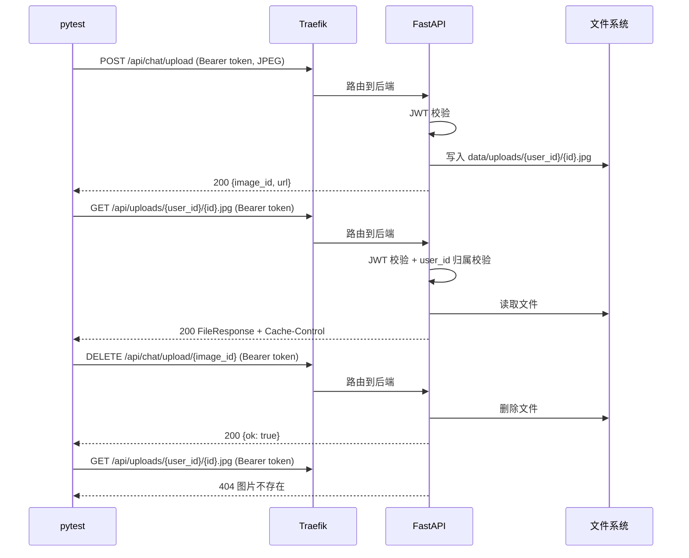
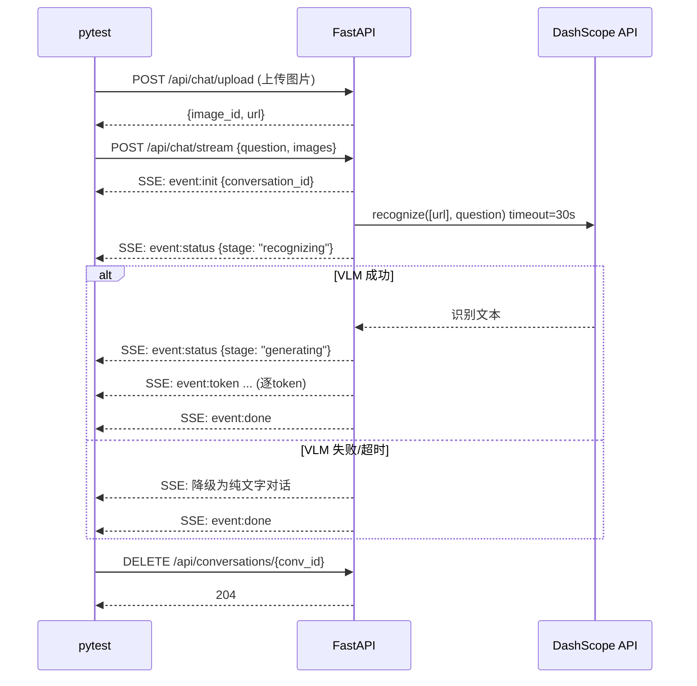
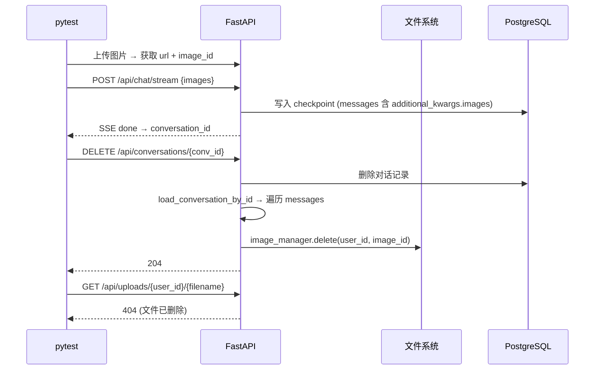

# R019 集成测试补全 — 后端设计报告

## 1. 目标

为 R019 多模态图片识别功能补全 Docker 集成测试，对真实服务（Traefik → FastAPI → PostgreSQL → 文件系统 → VLM API）发送 HTTP 请求，验证完整链路。

- 图片上传/访问/删除的 HTTP 层全链路（上传 → 磁盘写入 → 鉴权访问 → 删除 → 404）
- SSE 流 + VLM 识别端到端（上传 → stream 含 images → recognizing 状态 → done 事件）
- 对话删除 + 图片清理端到端（创建含图片对话 → 删除对话 → 图片文件从磁盘消失）
- 鉴权/归属校验在真实 JWT 中间件下的行为

## 2. 现状分析

### 已有能力

- **Mock 测试**：58 个 mock 测试覆盖所有端点，全部通过
- **Shell 冒烟测试**：`deploy/frontend/tests/e2e_auth_smoke.sh` 覆盖鉴权 7 场景
- **Docker 部署**：`bash deploy/deploy.sh local` 可一键启动本地全栈
- **JWT 签发**：冒烟测试已有通过 `JWT_SECRET_KEY` 本地签发 token 的模式

### 缺失

- 没有任何对真实 Docker 服务的 Python 集成测试
- 没有验证真实 PostgreSQL 写入后的数据一致性
- 没有验证真实文件系统上的图片存储/清理
- 没有验证 VLM 调用在真实 DashScope API 下的行为

### 基础设施

| 组件 | 状态 |
|------|------|
| Docker 本地部署 | 可用，`deploy/deploy.sh local` |
| Traefik 反代 | 可用，`octotutor.localhost` |
| 后端 API | `http://octotutor.localhost/api/` |
| 健康检查 | `GET /api/health` 无需鉴权 |
| JWT_SECRET_KEY | `deploy/.env` 中有值 |
| httpx | 已安装（backend 依赖） |
| pytest-asyncio | 已安装 |

## 3. 数据模型与接口

无新增数据模型。测试复用现有 API 端点：

| 端点 | 用途 |
|------|------|
| `POST /api/chat/upload` | 上传图片 |
| `GET /api/uploads/{user_id}/{filename}` | 鉴权访问图片 |
| `DELETE /api/chat/upload/{image_id}` | 删除图片 |
| `POST /api/chat/stream` | SSE 流式对话（含图片识别） |
| `DELETE /api/conversations/{conv_id}` | 删除对话（含图片清理） |
| `GET /api/health` | 服务健康检查 |

## 4. 核心流程

### 场景 A：图片上传 → 访问 → 删除 完整链路



### 场景 B：SSE + VLM 识别端到端



### 场景 C：删除对话 → 图片清理



## 5. 项目结构与技术决策

### 项目结构

```
backend/tests/integration/
├── __init__.py                           # 空文件
├── conftest.py                           # 集成测试 fixture
├── test_image_upload_integration.py      # 上传/访问/删除 (13 tests)
├── test_image_stream_integration.py      # SSE + VLM (4 tests)
└── test_conversation_cleanup_integration.py  # 对话删除+图片清理 (3 tests)
```

### 职责划分

- `conftest.py` — 服务可用性检测、JWT 签发、httpx 客户端、自动清理 fixture
- `test_image_upload_integration.py` — 纯 HTTP 层测试，不需要 LLM/VLM
- `test_image_stream_integration.py` — SSE 流测试，需要 LLM，部分需要 VLM
- `test_conversation_cleanup_integration.py` — 对话+图片联动测试，需要 LLM

### conftest.py 关键 fixture 签名

```python
# session 级 — 整个测试会话只初始化一次

@pytest.fixture(scope="session")
def docker_services_ready() -> bool
    """GET /api/health，不可达则 pytest.skip"""

@pytest.fixture(scope="session")
def base_url() -> str
    """默认 http://octotutor.localhost，可被 OCTOTUTOR_BASE_URL 覆盖"""

@pytest.fixture(scope="session")
def auth_token(docker_services_ready) -> str
    """从 JWT_SECRET_KEY 环境变量本地签发 access token (sub=9527)，无 key 则 skip"""

@pytest.fixture(scope="session")
def auth_headers(auth_token) -> dict
    """{"Authorization": f"Bearer {auth_token}"}"""

@pytest.fixture(scope="session")
def other_token(docker_services_ready) -> str
    """另一套 token (sub=other-user)，用于归属校验测试"""

@pytest.fixture(scope="session")
def other_headers(other_token) -> dict

@pytest.fixture(scope="session")
def user_id() -> str
    """固定 "9527" """

# function 级 — 每个测试独立

@pytest_asyncio.fixture
async def async_client(base_url) -> httpx.AsyncClient
    """base_url=base_url, timeout=60.0"""

@pytest_asyncio.fixture
async def uploaded_image(async_client, auth_headers, user_id) -> dict
    """上传一张 PNG，yield {image_id, url}，teardown 时 DELETE 清理"""
```

清理策略：每个测试通过 `uploaded_image` fixture 自动清理，或手动在 `try/finally` 中调用 `DELETE /api/chat/upload/{id}` 和 `DELETE /api/conversations/{id}`。清理失败不阻塞测试结果（`pass` 静默忽略 404）。

### 技术决策

| 决策 | 方案 | 理由 |
|------|------|------|
| HTTP 客户端 | httpx.AsyncClient | 异步原生，支持 SSE 流式读取，已安装 |
| Token 获取 | 本地签发 JWT（不调 auth-center） | 避免 auth-center 5 次失败锁定风险，与冒烟测试一致 |
| 测试隔离 | 每个测试独立上传+清理，不共享状态 | 避免测试间隐式依赖 |
| SSE 读取 | `client.stream("POST", ...)` + 逐行解析 | 真实 SSE 体验，收到 done 即断开 |
| VLM 不确定性 | 不 assert 识别内容，只验证流程 | VLM 返回不可预测，降级也算通过 |
| 默认跳过 | `@pytest.mark.integration`，需显式指定才运行 | 避免干扰日常 mock 测试 |

### 第三方依赖

| 依赖 | 用途 | 状态 |
|------|------|------|
| httpx | HTTP 客户端 | 已有 |
| pytest-asyncio | 异步测试支持 | 已有 |
| python-jose | JWT 签发 | 已有 |
| pytest | 测试框架 | 已有 |

无新增依赖。

## 6. 验收标准

| 验收条件 | 验收方式 |
|----------|----------|
| 20 个集成测试全部通过 | `JWT_SECRET_KEY=xxx pytest tests/integration/ -m integration -v` |
| 无 VLM 环境可运行 17 个测试 | `pytest tests/integration/ -m "integration and not vlm" -v` |
| 服务不可达时全部 skip | 停掉 Docker 后运行，全部 skip 而非 error |
| 测试数据不残留 | 每个测试后图片/对话已清理 |
| 不影响现有 mock 测试 | `pytest tests/ -v --ignore=tests/integration/` 全部通过 |

### 测试清单

| # | 文件 | 测试名 | 端点 | 标记 |
|---|------|--------|------|------|
| 1 | upload | test_upload_jpg_success | POST /api/chat/upload | integration |
| 2 | upload | test_upload_png_success | POST /api/chat/upload | integration |
| 3 | upload | test_upload_webp_success | POST /api/chat/upload | integration |
| 4 | upload | test_upload_unsupported_type_400 | POST /api/chat/upload | integration |
| 5 | upload | test_upload_oversized_400 | POST /api/chat/upload | integration |
| 6 | upload | test_upload_no_auth_401 | POST /api/chat/upload | integration |
| 7 | upload | test_serve_image_with_auth | GET /api/uploads/{uid}/{file} | integration |
| 8 | upload | test_serve_image_no_auth_401 | GET /api/uploads/{uid}/{file} | integration |
| 9 | upload | test_serve_image_wrong_user_404 | GET /api/uploads/{uid}/{file} | integration |
| 10 | upload | test_delete_image_success | DELETE /api/chat/upload/{id} | integration |
| 11 | upload | test_delete_nonexistent_image_404 | DELETE /api/chat/upload/{id} | integration |
| 12 | upload | test_delete_other_users_image_404 | DELETE /api/chat/upload/{id} | integration |
| 13 | upload | test_stream_exceeds_max_images_422 | POST /api/chat/stream | integration |
| 14 | stream | test_stream_with_nonexistent_image_400 | POST /api/chat/stream | integration |
| 15 | stream | test_stream_without_images_zero_impact | POST /api/chat/stream | integration |
| 16 | stream | test_stream_with_uploaded_image_vlm_path | POST /api/chat/stream | integration,vlm |
| 17 | stream | test_stream_image_reference_integrity | POST /api/chat/stream | integration |
| 18 | cleanup | test_delete_conversation_cleans_up_images | DELETE /api/conversations/{id} | integration |
| 19 | cleanup | test_delete_conversation_no_images | DELETE /api/conversations/{id} | integration |
| 20 | cleanup | test_delete_other_users_conversation_404 | DELETE /api/conversations/{id} | integration |

## 7. 暂不实现

| 功能 | 理由 |
|------|------|
| Playwright 前端 E2E 图片测试 | 当前只补后端 API 集成测试 |
| 故障注入测试（LLM 不可达、Embedding 失败） | 已有 `docker-compose.test-*.yml` 覆盖 |
| 并发上传压力测试 | 非功能测试范畴 |
| 数据库直接断言（checkpoint 内容验证） | 通过 API 行为间接验证即可 |
| 上传中断/abort 场景 | 需模拟 TCP 连接断开，集成测试实现成本高；mock 测试已覆盖写入异常路径（`test_upload_save_failure_500`） |
