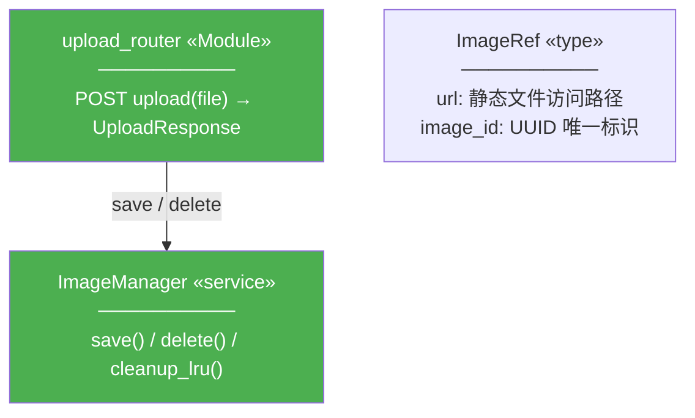

# 类图 — 设计指南

> 本文档是对 xlfoundry-design skill 中"类图"绘制规范的经验总结，用于后续更新 skill 的指导规则。

## 一、读者视角：开发者想从类图获取什么

### 1. 有哪些核心类型/类 — 数据长什么样？

- 类型定义（ImageRef、Message、UploadStatus）
- 接口/协议（RecognitionProvider）
- 核心服务类（ImageManager）
- 组件和 Hook（chat-input、use-image-upload）
- 业务入口模块（upload_router、stream_router、controller）

### 2. 各自有什么字段 — 关键属性是什么？

- 只列 3-5 个关键业务字段，不列全部
- 用 `← 新增` 标注本次新增的字段
- 类图是概览，不是 API 文档

### 3. 类之间的关系 — 谁包含谁？谁实现谁？

- 组合关系：Message --> ImageRef
- 实现关系：VLMRecognitionProvider -.-> RecognitionProvider
- 依赖关系：ImageManager -.-> ImageRef

### 4. 角色区分 — 这是什么东西？

- 用 `«stereotype»` 标注：`«interface»`、`«service»`、`«type»`、`«Component»`、`«Hook»`、`«Module»`
- 数据模型不加 stereotype（默认就是数据模型）

### 5. 改造范围 — 哪些是新增？哪些是改造？

- 颜色区分：绿色=新增、蓝色=改造
- 和模块依赖图、目录树保持一致

## 二、使用 graph TD 而非 classDiagram

### 为什么用 graph TD

Mermaid 的 `classDiagram` 类型渲染节点过小，内容密度高但可读性差。`graph TD` 与模块依赖图使用同一渲染引擎，节点大、间距宽、可读性强。

### 节点格式

每个类用一个节点表示，内部用 `<br/>` 分隔标题、字段、方法：

```
IM["ImageManager «service»<br/>──────────<br/>save() → 写入磁盘<br/>delete() → 查找并删除<br/>cleanup_lru() → 双水位线策略"]
```

结构：
1. **第一行**：类名 + `«stereotype»`（如有）
2. **第二行**：`──────────` 分隔线
3. **后续行**：字段或方法，3-5 个关键项

### 关系线

| 关系 | 语法 | 含义 |
|------|------|------|
| 调用/依赖 | `A -->|"标签"| B` | A 依赖 B |
| 弱依赖/数据产出 | `A -.->|"标签"| B` | A 间接依赖 B |

注：graph TD 不支持 UML 的 `*--`（组合）和 `..|>`（实现），统一用 `-->` 和 `-.->` 替代，通过标签说明关系语义。

## 三、哪些该画，哪些不该画

### 应该画入类图的

| 类型 | 说明 | stereotype 示例 |
|------|------|----------------|
| 数据模型 / Schema | 核心业务数据结构 | 无（默认） |
| 接口 / Protocol | 可插拔的抽象层 | `«interface»` |
| 实现类 | 接口的具体实现 | 无 |
| 服务类 | 封装外部资源的类 | `«service»` |
| 联合类型 | TypeScript type / Python Literal | `«type>>` |
| React 组件 | 有 Props 接口的 UI 组件 | `«Component»` |
| React Hook | 自定义 Hook 的公开接口 | `«Hook»` |
| 业务入口模块 | router、controller、stream fetcher | `«Module»` |

### 业务入口模块必须画

路由（upload_router、stream_router）虽然是函数式模块不是类，但它是**业务入口**。不画入口，类图就像有建筑没路的地图——看不出请求从哪进来、谁调了谁。

### 不该画入类图的

| 类型 | 原因 | 替代方案 |
|------|------|---------|
| utils / 辅助函数 | 是调用方的内部实现细节 | 不出现 |
| 配置项 | config 不是类 | 不出现 |
| 入口文件 | main.py / App.tsx 是初始化代码 | 不出现 |
| 常量 | prompts、枚举值等不是类 | 不出现 |

## 四、字段粒度原则

### 核心规则：每个类只列 3-5 个关键业务字段

**要列的**：
- 标识字段（id、url、image_id）
- 业务关键字段（images、status、question）
- 关系字段（组合/引用其他类的字段）
- 新增字段用 `← 新增` 标注

**不要列的**：
- 私有实现字段（_lock、_total_size、_api_key）
- 辅助方法（resolve_filepath、mtime_middleware）
- 框架注入的字段（AbortController、asyncio.Lock）
- 所有非核心的配置字段（top_k、conversation_id）

## 五、分组规范

### 用 `%%` 注释分组



### 分组标准

**后端典型分组**：
1. 业务入口（routers）— upload_router、stream_router、conversation_router
2. 数据模型（schemas）— ImageRef、ChatRequest、ApiMessage、StatusPayload、UploadResponse
3. 基础设施服务（infra）— ImageManager、RecognitionProvider、VLMRecognitionProvider

**前端典型分组**：
1. 数据类型 — ImageRef、MessageStatus、UploadStatus、Message、ApiMessage
2. Hook — use-image-upload
3. 组件 — image-preview、message-bubble、chat-input
4. 模块 — controller、use-chat-stream

## 六、颜色方案

### 与模块依赖图、目录树保持一致

| 颜色 | 含义 | 色值 |
|------|------|------|
| 绿色 | 新增类/组件 | `#4CAF50` 或 `#66BB6A` |
| 蓝色 | 改造类/组件 | `#2196F3` 或 `#42A5F5` |
| 灰色 | 不变类 | `#9E9E9E` 或 `#BDBDBD` |

### 样式写法

在 graph TD 末尾，用 `style` 指令逐个标注：

```
style ImageRef fill:#4CAF50,color:#fff
style ChatRequest fill:#2196F3,color:#fff
```

### 图例说明

类图下方必须有引用块（`>`）说明颜色含义。示例：

```
> **类图图例**：绿色 = 新增类，蓝色 = 改造类。改造类中标注 `← 新增` 的字段为本版本新增。
>
> **目录文件省略说明**：conversation_utils 是辅助函数集合，prompts.py 是常量，config.py 是配置项，main.py 是启动代码——均不是类，不在类图中出现。
```

## 七、与目录树的一致性检查

### 原则：目录树中 [新|绿色] 或 [改|蓝色] 的文件，必须在类图中有对应表示

| 目录文件 | 类图对应 | 检查规则 |
|----------|---------|---------|
| schemas.py [改] | ImageRef、ChatRequest、ApiMessage、StatusPayload | 必须全部出现 |
| image_manager.py [新] | ImageManager | 必须出现 |
| recognition.py [新] | RecognitionProvider、VLMRecognitionProvider | 必须出现 |
| upload_router.py [新] | upload_router «Module» | 必须出现（作为业务入口） |
| stream_router.py [改] | stream_router «Module» | 必须出现（作为业务入口） |
| types.ts [改] | ImageRef、Message、ApiMessage、MessageStatus | 必须全部出现 |
| controller.ts [改] | controller «Module» | 必须出现 |
| chat-input.tsx [改] | chat-input «Component» | 必须出现 |
| image-preview.tsx [新] | image-preview «Component» | 必须出现 |

### 省略说明规则

如果目录树中的文件在类图中省略，必须在图例中说明原因：
- 辅助函数（conversation_utils）：是调用方的内部实现细节
- 配置文件（config.py）：配置不是类
- 常量文件（prompts.py）：常量不是类
- 入口文件（main.py）：启动代码不是类

## 八、mermaid graph TD 语法注意

| 问题 | 解决方案 |
|------|---------|
| 节点内容用 `<br/>` 换行 | `["类名<br/>──────────<br/>字段1<br/>字段2"]` |
| 泛型用 `<>` 会解析错误 | `list<ImageRef>` → `list~ImageRef~` |
| stereotype 用 `«»` | `«interface»`、`«service»` 放在节点标题行 |
| 关系线标签中文 | 可以，用 `A -->|"中文标签"| B` |
| 不支持 `/`、`{}`、`[]` | 避免在标签中使用这些字符 |
| 虚线表示弱依赖 | `A -.->|"标签"| B` |

## 九、质量自检清单

- [ ] 使用 graph TD 而非 classDiagram
- [ ] 每个节点 3-5 个关键字段，没有列出全部字段
- [ ] 每个节点都有 `«stereotype»` 标注（或数据模型默认无标注）
- [ ] 业务入口模块（router、controller）用 `«Module»` 标注并出现在图中
- [ ] 每个节点至少参与一条关系线，没有孤立节点
- [ ] 关系线都有标签
- [ ] 新增字段用 `← 新增` 标注
- [ ] 颜色标注与模块依赖图、目录树一致
- [ ] 图例说明完整（颜色含义 + 省略说明）
- [ ] 目录树中 [新]/[改] 文件在类图中都有对应（或图例说明省略原因）
- [ ] utils、config、prompts、main 不在类图中
- [ ] 分组注释清晰（入口 vs 数据模型 vs 服务 vs 组件）
