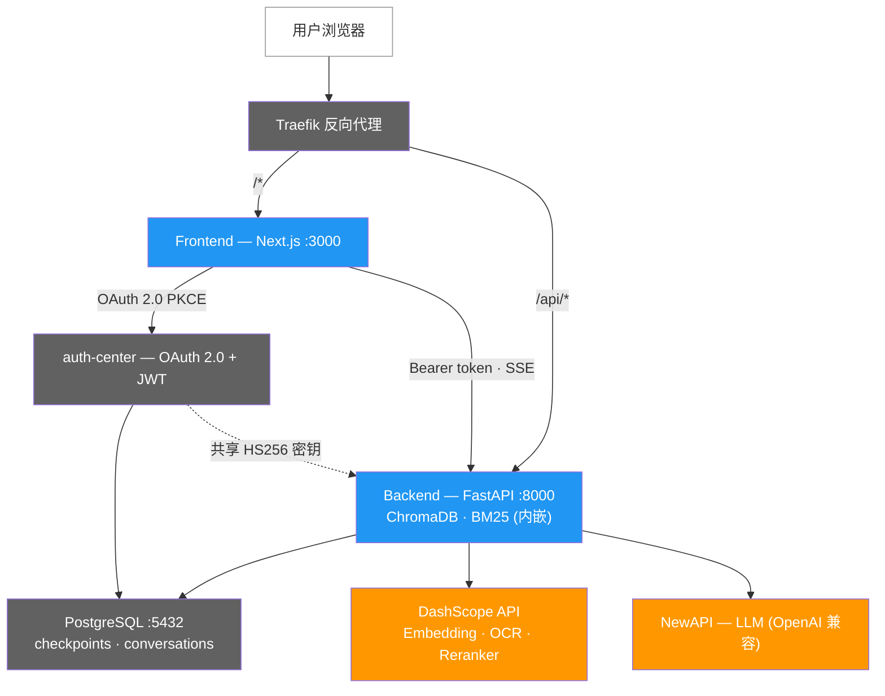
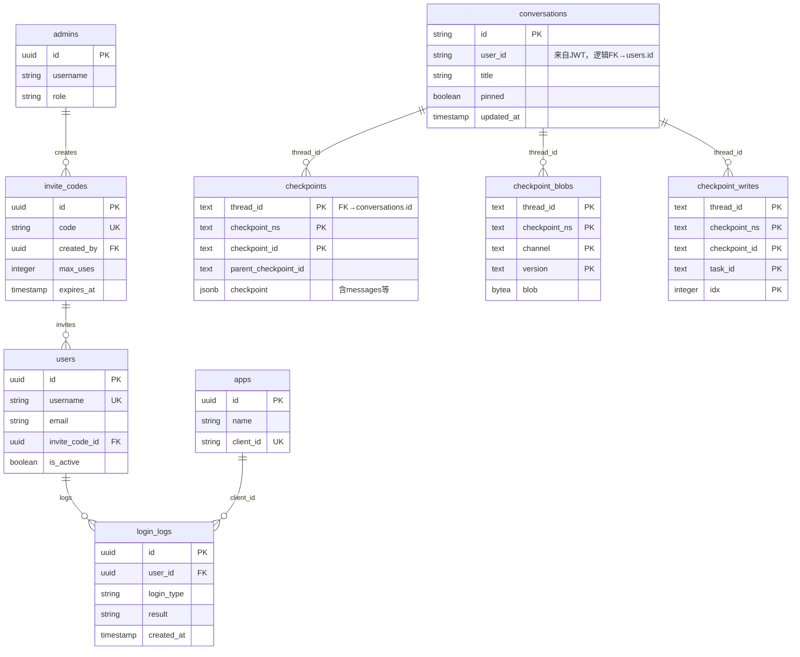

# OctoTutor 架构宪法

> version: 6.2 | updated: 2026-05-28 | R010 grounding-faithfulness

## 系统拓扑

> **图例**：蓝色 = OctoTutor 容器，深灰色 = xlfoundryTest 基础设施，橙色 = 外部 API。
> ChromaDB（向量存储）和 BM25（稀疏检索）内嵌于 Backend 进程，非独立容器。
> auth-center 和 PostgreSQL 由 xlfoundryTest 项目管理，OctoTutor 通过同一 Docker 网络访问。

### 部署差异

| 环境 | 网络 | NewAPI 访问方式 |
|------|------|----------------|
| 本地 | `auth-network-local` 单网络 | `host.docker.internal:13000`（宿主机） |
| 远程 | `gateway` + `auth-network` + `new-api-net` 三网络 | `new-api:3000`（容器直连） |

## 数据模型

PostgreSQL 共 10 张表，分属 2 个独立数据库。OctoTutor 通过 JWT 中的 `user_id` 与 auth-center 逻辑关联，无物理外键。

> **说明**：`conversations.user_id` 与 `users.id` 为跨库逻辑关联（通过 JWT 传递），无物理外键。
> `conversations.id` 等于 LangGraph 的 `thread_id`，对话元数据在 `conversations`，消息历史在 `checkpoints.checkpoint` JSONB 字段。
> RAG 数据使用 ChromaDB（向量数据库），不在 PostgreSQL 中。

## 关键决策与理由

- **前后端分离**: Next.js SPA + FastAPI 独立后端，各自容器化部署
- **Python 后端**: RAG 生态（ChromaDB/jieba/LlamaIndex）是 Python 原生，Node.js 重写无必要
- **ChromaDB 嵌入式**: 4GB 服务器约束下，嵌入式方案优于独立向量服务
- **DashScope Embedding**: tongyi-embedding-vision-flash 768 维，中文数学效果好
- **全量 OCR**: 数学教材图文混排多，PyMuPDF 无法识别图表公式图片，每页都 OCR
- **Monorepo**: 1 人团队，前后端在同一仓库（frontend/ + backend/）
- **PostgreSQL + SQLAlchemy async**: 对话管理 CRUD 使用 SQLAlchemy 2.0 async ORM，复用 psycopg 3 驱动，与 PostgresSaver 连接池共存（R009）。SQLite 阶段已完成。
- **SQLAlchemy 2.0 async ORM**: 性能好、功能全、类型安全，后续扩展方便（R009）
- **DashScope gte-rerank**: 中文 Reranker 效果好，TextReRank API 稳定（DEC-rag-001）
- **BM25+RRF 混合检索**: rank_bm25 + jieba 分词，RRF(k=60) 融合向量与关键词结果（DEC-rag-013）
- **OpenAI 兼容 LLM 对话**: 通过 OpenAI 协议接入 glm-5.1，解耦模型供应商（DEC-rag-003）
- **domain/infra/chat/api 分层**: Protocol 定义在 domain/，实现在 infra/，业务在 chat/，HTTP 在 api/（DEC-rag-012）
- **SSE over WebSocket**: SSE 基于标准 HTTP，无需额外协议升级，天然支持断线检测，适合单向流式推送（DEC-rag-006-rev1）
- **AsyncOpenAI 双客户端**: 非流式用 OpenAI()，流式用 AsyncOpenAI()，按场景选择同步/异步调用方式
- **MMPPN 错误码体系**: 五位数字编码 MM=模块 PP=阶段 N=序号，结构化错误码替代字符串匹配
- **JWT 共享密钥鉴权**: auth-center 签发 HS256 JWT，后端本地解码验证，不查 Redis 黑名单（DEC-auth-001）
- **apiClient 统一网络层**: 前端所有 API 请求经 apiClient，自动附加 Bearer token + 刷新锁 + 401 重试（DEC-auth-003）
- **Token 预算管理 + LLM 摘要压缩**: 字符估算 × 1.5 保守系数 + 65% 阈值触发摘要 + RemoveMessage 清理旧消息（DEC-rag-010）
- **Query Rewriting**: 多轮时 LLM 改写追问为独立问题 + 首轮透传 + 失败 fallback 原始 question（DEC-rag-011）
- **动态 System Prompt**: respond 节点动态注入 RAG context 到 SystemMessage，对话历史原样透传（DEC-rag-014 分级注入）
- **线性 StateGraph 拓扑（无分类器）**: START → summarize → rewrite → retrieve → respond → END，所有问题统一走完整路径，由 LLM + 系统提示词自然处理路由（DEC-rag-012-rev1，移除分类器）
- **Context 分级注入策略**: respond 节点按检索结果相关性分级注入系统指令（相关→强约束/不相关→弱参考/降级→弱参考/空→不注入），避免 LLM 基于不相关内容产生幻觉（DEC-rag-014）
- **忠实性约束最高优先级**: TEACHING_SYSTEM_PROMPT 新增"忠实性约束"章节标记为最高优先级，要求 LLM 只说教材中明确存在的内容（DEC-rag-015）

## 权威边界

- Frontend 不直接访问 ChromaDB，必须通过 Backend API
- Backend API 是检索和对话的唯一入口（/api/retrieve + /api/chat + /api/chat/stream）
- Backend API 是对话管理的唯一入口（/api/conversations 列表/更新/删除）
- SSE 端点 /api/chat/stream 是唯一的流式对话入口，前端不缓存 LLM 回答用于复用
- Agent StateGraph 拓扑固定为线性 4 节点：summarize → rewrite → retrieve → respond，无分支/条件路由
- DashScope API 调用统一在 Backend 内（Embedding + OCR + Reranker），Frontend 不持有 DashScope Key
- LLM 调用统一在 Backend 内（infra/llm.py），Frontend 不持有 LLM Key
- respond 节点使用分级 context 注入：高相关性（degraded=False, score>=threshold）强约束；低相关性和降级（degraded=True）弱参考；无结果不注入
- OCR 缓存是唯一权威数据源（parsed/ 目录），入库脚本按缓存状态决定是否调 OCR
- /api/chat/stream 使用已有 conversation_id 前必须通过 conversations 表按 id + user_id 校验归属；校验失败不得进入 LangGraph thread_id

## 不变量

- Monorepo 结构不变：frontend/ + backend/ + deploy/
- ChromaDB 嵌入式运行（不独立部署为服务）
- 入库管线幂等：先删旧数据再入库
- OCR 缓存优先：有缓存跳过，无缓存才调 DashScope
- Reranker 失败降级：ChatService 返回 degraded=true + degradation_reason，不阻断回答生成
- BM25 静态索引：启动时从 ChromaDB 全量加载构建，运行期间不更新
- API 兼容：/api/retrieve 接口不变（R003 契约），/api/chat 非流式不变，新功能走 /api/chat/stream
- SSE 事件格式固定：每帧为 `event: {type}\ndata: {json}\n\n`，type 为 init/thinking/status/sources/token/done/title/error
- 检索不流式（一次返回全部 chunks），LLM 生成逐 token 流式
- API 鉴权：/api/retrieve、/api/chat、/api/chat/stream 需要 Bearer token，/api/health 不需要鉴权

## 禁止模式

- Frontend 不直接调 DashScope API
- 不在主分支直接开发功能（使用 feat/ 分支）
- R004 不做前端 Chat UI（留给 R005）
- 不做 WebSocket：SSE 已满足单向流式推送需求，WebSocket 的双向能力不需要
- 不做前端 LLM 回答缓存：每次对话都是独立请求，避免缓存一致性难题（R007-PATCH01 已移除 localStorage 消息缓存）
