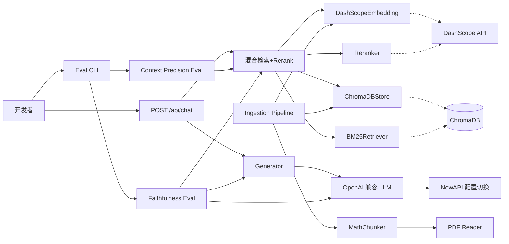

# 项目功能图

## 模块依赖图

```mermaid
graph LR
    Dev[开发者] --> ChatAPI[POST /api/chat]
    Dev --> EvalCLI[Eval CLI]

    ChatAPI --> Retrieve[混合检索+Rerank]
    Retrieve --> Embedding[DashScopeEmbedding]
    Retrieve --> VectorStore[ChromaDBStore]
    Retrieve --> BM25[BM25Retriever]
    Retrieve --> Reranker[Reranker]
    ChatAPI --> Generator[Generator]
    Generator --> LLM[OpenAI 兼容 LLM]

    EvalCLI --> CPEval[Context Precision Eval]
    EvalCLI --> FaithEval[Faithfulness Eval]
    CPEval --> Retrieve
    FaithEval --> Retrieve
    FaithEval --> Generator
    FaithEval --> LLM

    Embedding -.-> DashScope[DashScope API]
    Reranker -.-> DashScope
    VectorStore -.-> ChromaDB[(ChromaDB)]
    BM25 -.-> ChromaDB
    LLM -.-> NewAPI[NewAPI 配置切换]

    Ingestion[Ingestion Pipeline] --> Embedding
    Ingestion --> VectorStore
    Ingestion --> Chunker[MathChunker]
    Chunker --> PDFReader[PDF Reader]
```
