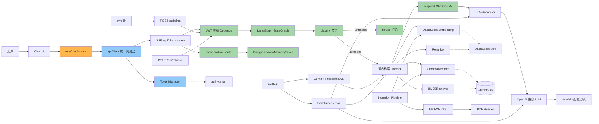

# 项目功能图

## 模块依赖图

## 颜色分级

| 颜色 | 前缀 | 含义 |
|------|------|------|
| 🔵 蓝色 | FF | 前端基础（apiClient, TokenManager） |
| 🟢 绿色 | BF/BB | 后端基础+业务（StateGraph, Auth, Checkpointer, ConvRouter） |
| 🟡 黄色 | BB | 后端业务（Router Depends 注入） |
| 🟠 橙色 | FB | 前端业务（useChatStream, useConversation） |
